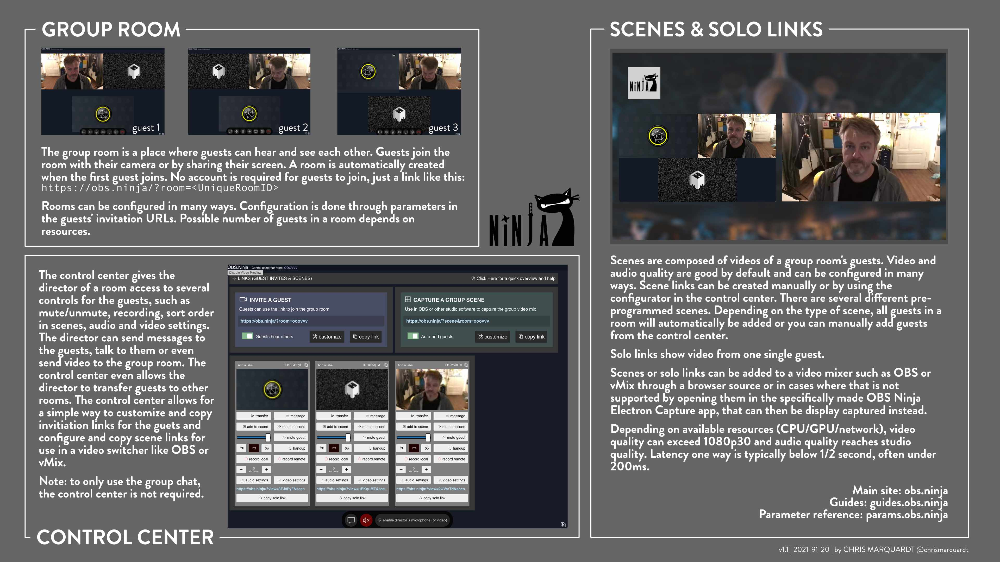
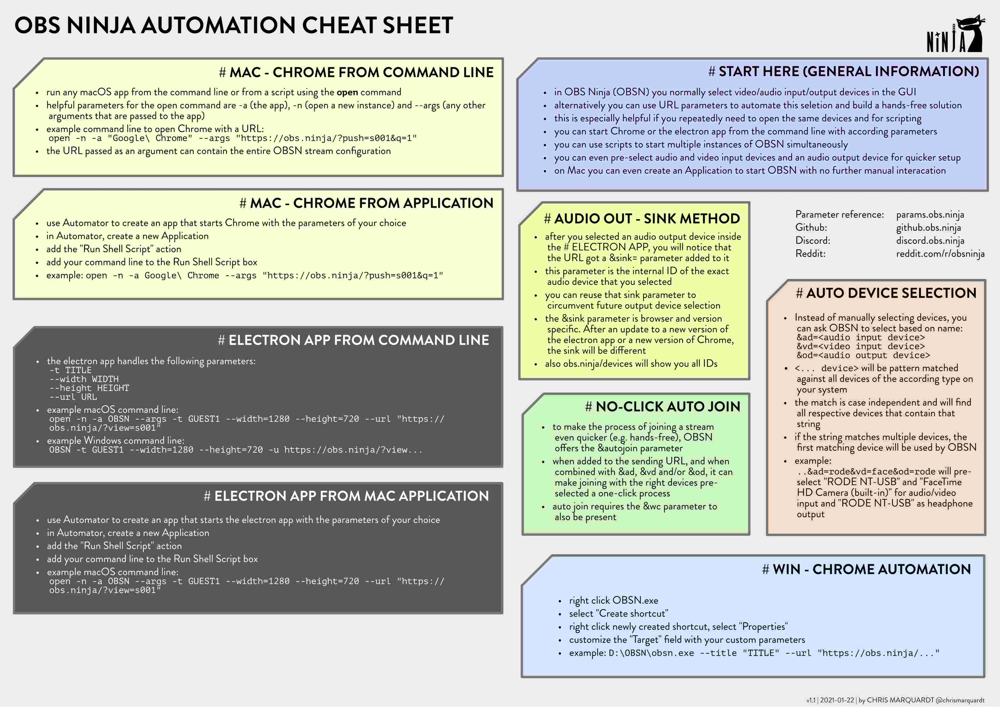
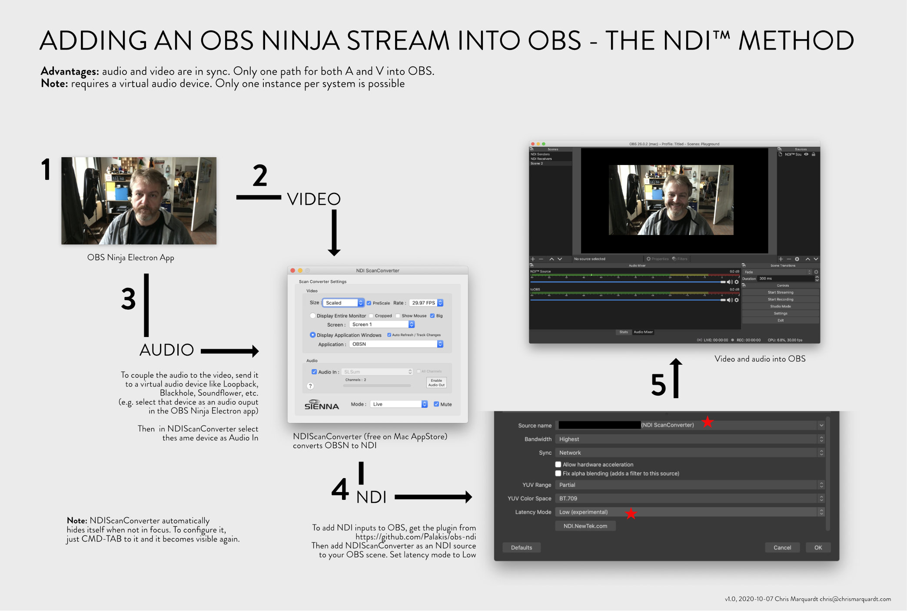

# OBS Ninja Cheat Sheets
OBS Ninja lets you bring remote video feeds into OBS at low latency and with excellent quality

  Jump to:

* [OBS Ninja Main Components](#maincomponents)
* [Getting Started with OBS Ninja](#gettingstarted)
* [Automating OBSN start-up](#automation)
* [The Mac NDI Method](#macndimethod)

## MAIN COMPONENTS

   
(v1.1, 2021-01-20)

* [download PDF](maincomponents/OBSN_main_components.pdf) (best for printing)
* [download PNG](maincomponents/OBSN_main_components.png)
* [download JPG](maincomponents/OBSN_main_components.jpg)

## GETTING STARTED

   
(v0.4, 2020-09-25)

* [download PDF](cheatsheet/OBSN_cheat-sheet.pdf) (best for printing)
* [download PNG](cheatsheet/OBSN_cheat-sheet.png)
* [download JPG](cheatsheet/OBSN_cheat-sheet.jpg)

## AUTOMATING OBSN START-UP (currently in beta only)

   
(v0.5, 2020-11-22)

* [download PDF](automation/OBSN_automation_cheat-sheet.pdf) (best for printing)
* [download PNG](automation/OBSN_automation_cheat-sheet.png)
* [download JPG](automation/OBSN_automation_cheat-sheet.jpg)

## THE MAC NDI METHOD

   
(v1.0, 2020-10-07)

* [download PDF](macndimethod/OBSN2OBS_Mac-NDI-Method.pdf) (best for printing)
* [download PNG](macndimethod/OBSN2OBS_Mac-NDI-Method.png)
* [download JPG](macndimethod/OBSN2OBS_Mac-NDI-Method.jpg)
