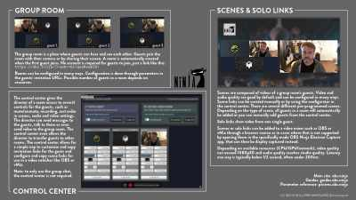
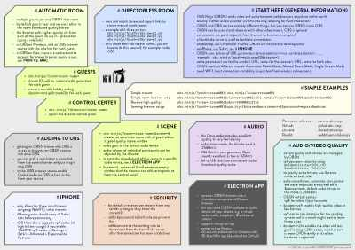
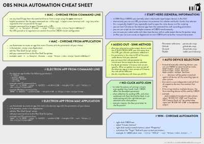
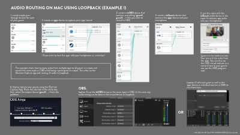

# VDO Ninja Cheat Sheets

VDO Ninja lets you bring remote video feeds into OBS at low latency and with excellent quality

Here are some cheatsheets to help you get started:

### [VDO Ninja Basic Concepts Cheatsheet](basicconcepts/cheatsheet_obsn_basic_concepts.md)
Learn the basic concepts of VDO Ninja: Rooms, Control Center and Scenes   

### [VDO Ninja Parameters Cheatsheet](cheatsheet/cheatsheet_obsn_parameters.md)
Learn how to use parameters to customize VDO Ninja's behavior   

### [VDO Ninja Automation Cheatsheet](automation/cheatsheet_obsn_automation.md)
Learn how to automate starting up VDO Ninja, automatically join rooms and scenes with camera and audio devices already selected   

### [VDO Ninja Mac Audio Routing w Loopback Cheatsheet (example 1)](loopbackrouting1/cheatsheet_obsn_loopback_routing1.md)
Learn how to route guest and application audio on the Mac using Loopback.   

