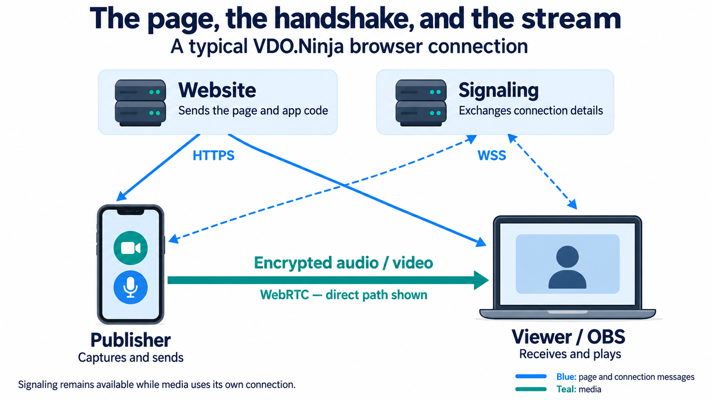
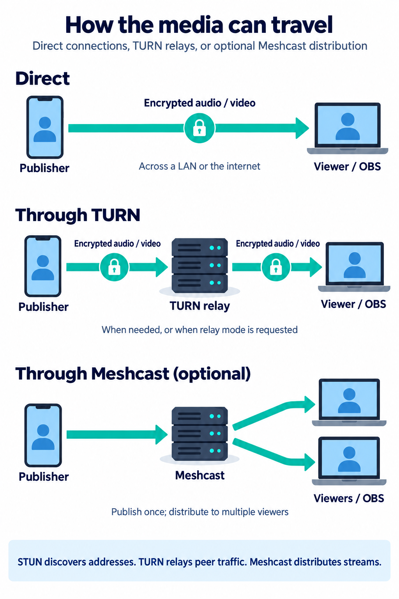

[](https://github.com/steveseguin/vdo.ninja)
[](https://github.com/steveseguin/vdo.ninja/fork)
[](https://github.com/steveseguin/vdo.ninja/releases)
[](https://discord.vdo.ninja)
[](https://twitter.com/intent/tweet?text=Check%20out%20VDO.Ninja%20-%20Peer-to-peer%20video%20streaming%20for%20OBS%20and%20more!&url=https%3A%2F%2Fgithub.com%2Fsteveseguin%2Fvdo.ninja)
[](https://scorecard.dev/viewer/?uri=github.com/steveseguin/vdo.ninja)

#### ⚠ Notice! We've rebranded from OBS.Ninja to VDO.Ninja - all else is staying the same ✨


## What is VDO.Ninja? 🚀

VDO.Ninja brings peer-to-peer technology to OBS and other studio software, enabling remote camera integration with:

* 🔒 Direct peer-to-peer video transfer in most cases
* ⚡ High-quality video with super low latency
* 💪 Director control room with group chat
* 📱 Smartphone wireless webcam capabilities
* 🌐 Supports WHIP/WHEP and self-hosted SFUs
* 🆓 Free software. Free managed services. Free support.


## Quick Links 🔗

* 💬 [Live Support Discord](https://discord.vdo.ninja)
* 📚 [Documentation](https://docs.vdo.ninja)
* 🎯 [Subreddit](https://reddit.com/r/vdoninja)
* 🧯 [Backup Deployment](https://backup.vdo.ninja)

## How to Use 📝

You can get started by just opening [VDO.Ninja](https://vdo.ninja/) in your browser and selecting *Add your Camera to OBS*.

* 🎥 [Basic Intro Video](https://www.youtube.com/watch?v=QaA_6aOP9z8&list=PLWodc2tCfAH1l_LDvEyxEqFf42hOBKqQM&index=1)
* 📺 [YouTube Video Tutorials](https://www.youtube.com/watch?v=mQ1Jdhf5aYg&list=PL8VJWj2-XLFpFu3G35Hdm1nKZ2xn9_0_8)
* 📖 [Getting Started Documentation](https://docs.vdo.ninja/getting-started)

Join the [Discord](https://discord.vdo.ninja) for community exhibitions, discussions, support, and feature updates.

## Alternative versions of VDO.Ninja

* 📱 [Native iOS app — Apple App Store](https://apps.apple.com/us/app/vdo-ninja/id1607609685)
* 📱 [Native Android app — Google Play](https://play.google.com/store/apps/details?id=flutter.vdo.ninja)
* 🪟 [Mixer App with custom layouts](https://vdo.ninja/mixer)
* 🏹 [WHIP/WHEP client](https://vdo.ninja/whip)
* 📈 [Sharable Whiteboard](https://vdo.ninja/whiteboard)
* 🕹️ [ESports Feed Manager](https://versus.cam)
* 🌃 [Alpha-version updated nightly](https://vdo.ninja/alpha)

## Issues? problems? Not working?

Join me and the community on Discord for support and more: https://discord.vdo.ninja. You can email me at steve@seguin.email for more urgent support or with other other inquiries if required.

The sub-Reddit is available at, https://reddit.com/r/vdoninja. I will often offer a single-message response to support questions posted there, but for deeper discussion, join the Discord.

Also check out the FAQ for common answers: https://docs.vdo.ninja or view recent product updates at: https://updates.vdo.ninja

I maintain a Youtube playlist with VDO.Ninja related content I create at https://www.youtube.com/watch?v=vLpRzMjUDaE&list=PLWodc2tCfAH1WHjl4WAOOoRSscJ8CHACe, however Youtube is full of community-created guides that are worth checking out.

## Related Projects

Steve maintains these apps and services for use with VDO.Ninja and live production. See the [full helper-app catalog](https://docs.vdo.ninja/steves-helper-apps) for setup guides, more utilities, and community tools.

### Capture and native integrations

| Project | What it adds |
| --- | --- |
| [Game Capture](https://vdo.ninja/gamecapture) | A native Windows app for publishing games, app windows, and Spout2 sources to VDO.Ninja, with hardware encoding and window audio. Useful for esports feeds and VTuber workflows. |
| [Ninja OBS Plugin](https://steveseguin.github.io/ninja-obs-plugin/) | Publish directly from OBS to VDO.Ninja, receive streams, and automatically add room participants as OBS sources. Supports OBS 32 on Windows, macOS, and Linux; the native receiver and transparent Game Capture workflow are experimental. |
| [Custom OBS builds with improved WHIP support](https://github.com/steveseguin/obs-studio/releases) | Steve's OBS fork adds WHIP trickle ICE and improved TURN connectivity for VDO.Ninja. Releases include OBS 32.2.2 and OBS 33 beta builds for Windows, macOS, and Linux. Check each release's platform requirements and known limitations. |
| [Electron Capture](https://github.com/steveseguin/electroncapture) | A desktop app for frameless playback and window capture of VDO.Ninja feeds and other web content, useful when an OBS Browser Source does not suit your setup. |
| [VDO.Ninja Video Capture Extension](https://github.com/steveseguin/video_capture_extension) | Publish individual web videos or a browser tab with audio into VDO.Ninja. Requires Chrome or a compatible Chromium browser version 116 or newer; DRM-protected video cannot be captured. |
| [Ninja VST3 Plugin](https://steveseguin.github.io/Ninja-VST3-Plugin/) | Send and receive VDO.Ninja audio inside supported DAWs. Currently Windows-only and tested with Reaper; this is an audio-only plugin. |
| [Raspberry.Ninja](https://github.com/steveseguin/raspberry_ninja) | Publish or receive streams using Python and GStreamer without a browser, on Raspberry Pi, Linux, Jetson, macOS, or Windows via WSL. Supports hardware encoding, camera/capture inputs, WHIP output, and computer-vision workflows. |

### Production services and overlays

| Project | What it adds |
| --- | --- |
| [Meshcast](https://meshcast.io) / [Meshcast app](https://app.meshcast.io) | Server-assisted distribution for larger VDO.Ninja rooms and one-to-many streams, reducing the publisher's upload load. The newer app supports WHIP, RTMP, and SRT workflows; RTMP/SRT use requires an account. |
| [Comms](https://comms.cam/) | Browser-based production intercom and talkback built on VDO.Ninja, with separate audio groups for hosts, crew, and backstage coordination. |
| [app.invite.cam](https://app.invite.cam) | A managed lobby with reusable invitations, waiting lists, and host/helper controls for admitting guests into VDO.Ninja. Hosts sign in with Discord. |
| [Social Stream Ninja](https://socialstream.ninja) | Combine live chat from YouTube, Twitch, and other platforms into OBS or vMix overlays. Available as a browser extension or standalone app, with featured comments, text-to-speech, bots, and message-saving tools. |
| [Caption.Ninja](https://caption.ninja/) | Browser-based live captions and translation overlays for OBS and vMix. [Caption Local](https://github.com/steveseguin/caption-local) adds speech recognition on your own computer, with optional human review through Caption.Ninja. |
| [Ninja Backer](https://ninjabacker.com) | Creator tipping pages and OBS alerts, integrated with VDO.Ninja's built-in tipping options. |

### Controls and browser utilities

| Project | What it adds |
| --- | --- |
| [VDO.Ninja Stream Deck Plugin](https://github.com/steveseguin/vdo-streamdeck) | Control microphones, cameras, guests, scenes, mixer layouts, and PTZ using Stream Deck keys and dials. Currently beta; not yet released in the Stream Deck marketplace. |
| [Companion-Ninja](https://github.com/steveseguin/Companion-Ninja) | Remote-control tools and HTTP/WebSocket API examples for VDO.Ninja, including Bitfocus Companion workflows. |
| [Screen Recorder](https://vdo.ninja/screenrecorder/) | Record tutorials and demos in a desktop browser using screen capture, webcam, microphone, and supported system audio, with local recording downloads. |
| [Chat Lite](https://vdo.ninja/chat-lite/) | A lightweight Social Stream Ninja chat/activity view inside VDO.Ninja or a local browser pop-out. Use the full Social Stream Ninja overlays for a separate OBS Browser Source. |
| [Icecast / AzuraCast helper](https://vdo.ninja/icecast) | Set up browser publishing of local audio or a received VDO.Ninja stream to an Icecast-compatible radio server. |
| [Teleprompter Tool](https://vdo.ninja/teleprompter) | Flip, mirror, or rotate embeddable websites, chat overlays, and VDO.Ninja feeds for teleprompter displays. |

## What's in this repo
This repository contains the VDO.Ninja web frontend and sample apps using its IFRAME API. Production backend implementations and operational scripts belong in separate repositories. Optional TURN configuration and `.sample` files are included as self-hosting examples; the website does not execute them. TURN setup guidance is provided in [turnserver.md](turnserver.md). The user documentation for VDO.Ninja itself is found at docs.vdo.ninja.

## Hosting and local development

The public service is available at [vdo.ninja](https://vdo.ninja/). To host the frontend yourself, serve this repository from an HTTPS-enabled static web server. There is no frontend build step or package installation required.

Choose the guide that matches your setup:

| What you want to host | Guide | What it provides |
| --- | --- | --- |
| The website on your own web server | [Manual hosting](install.md) | Static website files; public VDO.Ninja connection services remain enabled by default. |
| The website using Docker on a VPS, home server, or Raspberry Pi | [docker-vdon](https://github.com/steveseguin/docker-vdon) | An HTTPS website container; public VDO.Ninja connection services remain enabled by default. |
| A local setup intended to work without internet | [offline_deployment](https://github.com/steveseguin/offline_deployment) | The website, a local secure handshake server, and certificate setup instructions. Start with the ordinary installation; Docker is optional. |

For a local preview, run this from the repository root:

```sh
python -m http.server 8080 --bind 127.0.0.1
```

Open `http://localhost:8080/`. Use HTTPS when accessing the site from other devices. Local preview serves the frontend only; normal rooms still connect to the configured signaling and relay services.

See [install.md](install.md) for deployment guidance and [turnserver.md](turnserver.md) for TURN setup examples. Hosting the frontend does not deploy the production authentication, signaling, relay, or call-in backends. Optional features may require separately configured services and credentials.

Before publishing changes, run the repository's translation checks:

```sh
node .github/ci-validateTranslations.js
node .github/ci-checkTranslationKeys.js
```

These checks require Node.js and do not cover browser behavior. Test the affected publishing, viewing, recording, or device-selection flows separately.

### Develop vs Release versions

The develop branch of this repo is a bit like the preview or nightly version of VDO.Ninja. It's intended to be functional, but it may not be that well tested, or there could be incomplete features. The develop version aligns closely with what is normally on vdo.ninja/alpha/, which is well suited for those wishing to submit code changes or to gain access to experimental new features. You can access a hosted version of the GitHub develop branch on Github pages here as well: https://steveseguin.github.io/vdo.ninja/

Release versions of VDO.Ninja have their own branches though. These latest release branch will be updated to fix bugs or critical issues as needed, but are otherwise unchanged. https://github.com/steveseguin/vdo.ninja/branches

Due to the nature of live video production, where unexpected changes to the app are not welcomed usually, I don't update https://vdo.ninja/ all that often. As well, constant updates to the primary hosted app makes supporting users challenging, as its hard to tell if an issue is with the code or with the user. For this reason, VDO.Ninja does infrequent updates to the primary hosted production version.  Users wanting newer features, or who have greater risk tolerance, should use alpha version at https://vdo.ninja/alpha/

## Backend services and self-hosting

The browser client uses signaling to establish ordinary rooms and peer connections. STUN helps discover network addresses; TURN relays traffic when a direct connection cannot be established. These services are separate from the static frontend.

- **Signaling:** [websocket_server](https://github.com/steveseguin/websocket_server) provides standalone handshake servers. Its advanced routing server (`vdoninja_advanced.js`) uses the browser URL option **`wss2=`**; the older fanout servers use **`wss=`**. Use the matching option on both publisher and viewer links.
- **TURN:** [turnserver.md](turnserver.md), `turnserver_basic.conf`, and the `.sample` files provide optional self-hosting examples. Replace placeholder settings before use. The website does not execute these samples.
- **Twilio call-in:** requires an explicitly configured backend URL. The Twilio backend implementation and a hosted default are not included. SIP call-in instead uses the provider settings entered by the user.
- **Live translation:** accepts a user-supplied API key or a separately configured token broker. An optional [token broker example](examples/realtime-translation-broker/README.md) is included for separate deployment.
- **Offline deployments:** [offline_deployment](https://github.com/steveseguin/offline_deployment) combines the website with a local advanced routing server and disables automatic public STUN/TURN configuration in its prepared website. Its guide covers setup, connection checks, and optional internet-assisted connections.

HTTPS is still required for phones and other remote clients on a private LAN. When using a private CA, install and trust its public root certificate on each client device; see the [certificate guide for browsers, OBS, and native apps](https://github.com/steveseguin/offline_deployment/blob/main/docs/certificates.md). Native apps can handle certificate trust differently from browsers, so follow the app-specific notes there.

Self-hosting the frontend does not automatically make a deployment independent of hosted services. Review the features you enable and their configured endpoints. See [LICENCE.md](LICENCE.md) for the distinction between the software license and access to hosted services.

## How VDO.Ninja works

In a typical browser session, the **publisher** shares a camera, microphone, or screen. A **viewer** receives it in another browser or an OBS Browser Source. The website supplies the app; the devices capture, encode, send, and play the media using WebRTC.

<picture>
  <source media="(prefers-color-scheme: dark)" srcset="images/how-vdoninja-connects-dark.png" />
  <source media="(prefers-color-scheme: light)" srcset="images/how-vdoninja-connects.png" />
  
</picture>

| Part | What it does |
| --- | --- |
| **Website (HTTPS)** | Loads the interface and JavaScript that run on your device. Serving these files does not itself relay the stream. |
| **Signaling / handshake (WSS)** | Helps peers find each other and exchange connection details. Normally stays connected for room activity, new viewers, and reconnection; it does not carry the audio/video stream. |
| **WebRTC** | Handles real-time audio, video, and data between connected peers. |
| **STUN** | Helps discover a device's address as seen from outside its local network. A STUN server does not forward the media. |
| **TURN** | Relays encrypted media when needed, or when relay mode is requested. It forwards packets without decoding the audio/video. |
| **Meshcast (optional)** | Receives a published stream and distributes it to multiple viewers, reducing the publisher's upload load. |

<picture>
  <source media="(prefers-color-scheme: dark)" srcset="images/how-vdoninja-media-travels-dark.png" />
  <source media="(prefers-color-scheme: light)" srcset="images/how-vdoninja-media-travels.png" />
  
</picture>

WebRTC's **ICE** connection checks select a working route from the available addresses and relays. Discovery and checks can overlap; they are not a fixed sequence of separate LAN, STUN, and TURN attempts. See the [ICE protocol overview](https://www.rfc-editor.org/rfc/rfc8445.html#section-2) for the technical details.

Ordinary rooms use peer connections: a publisher may send a separate copy to each receiving peer, so more viewers can require more upload bandwidth and device resources. A director's room coordinates participants; it does not automatically mix everyone's video on a server.

With optional [Meshcast](https://meshcast.io), the publisher sends a stream to Meshcast, which distributes it to viewers. This reduces the publisher's upload load when serving multiple viewers. Meshcast is enabled separately; ICE does not automatically switch a peer-to-peer session to Meshcast. Other SFU and WHIP/WHEP setups can also use server-based media paths.

For your own website or a fully local setup, see the [hosting guides](#hosting-and-local-development).

## Privacy
I try to avoid data collection whenever possible and video streams are generally designed to be private, but use at your own risk. It is best to not share links created with VDO.Ninja with those you do not trust. I've provided instructions on how to deploy a TURN server if IP-address privacy is an issue for you. See: [turnserver.md](turnserver.md)

https://vdo.ninja may unavoidably use cookies that are exempt from EU laws of requiring notice of their use; they are exempt as they are required and necessary for the technical functioning of the web service. Our webserver is cached by Cloudflare and it provides denial of server protection for the users of VDO.Ninja.

Additional security features are being added weekly on request. Please ask about these options if added security and privacy are requirements for you.

Please see: [Terms of Service](https://docs.vdo.ninja/help/privacy-and-security-details/vdo.ninja-terms-of-service) | [Privacy Policy](https://docs.vdo.ninja/help/privacy-and-security-details).

## Feedback
Ideas, feedback, bugs, etc -- all welcomed.  I'm dumping many of my ideas as issues into Github. Feedback is typically most welcomed via Email or Discord.

## Licence
See [LICENCE.md](LICENCE.md) for licensing and ownership details, [LICENSE](LICENSE) for the full core license, and [examples/LICENSE](examples/LICENSE) for the example-code license.

## Credit
Thank you to everyone who has helped support this project so far. From the moderators, volunteers helping with support, those contributing media assets, the project sponsors, those reporting issues, those offering feedback, and any code submissions.

## Contributors of this repo
<a href="https://github.com/steveseguin/vdo.ninja/graphs/contributors">
  
</a>
