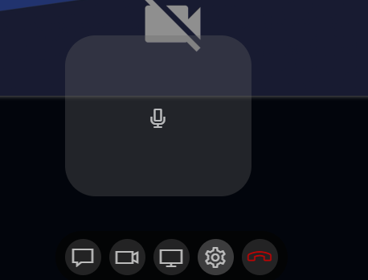

# \&bigbutton

Sender-Side Option! ([`&push`](../../source-settings/push.md))

## Details

The microphone mute button will be above the control bar and much bigger. You could use this for guests so they can find the button easier.

## Related


[nomicbutton.md](nomicbutton.md)

