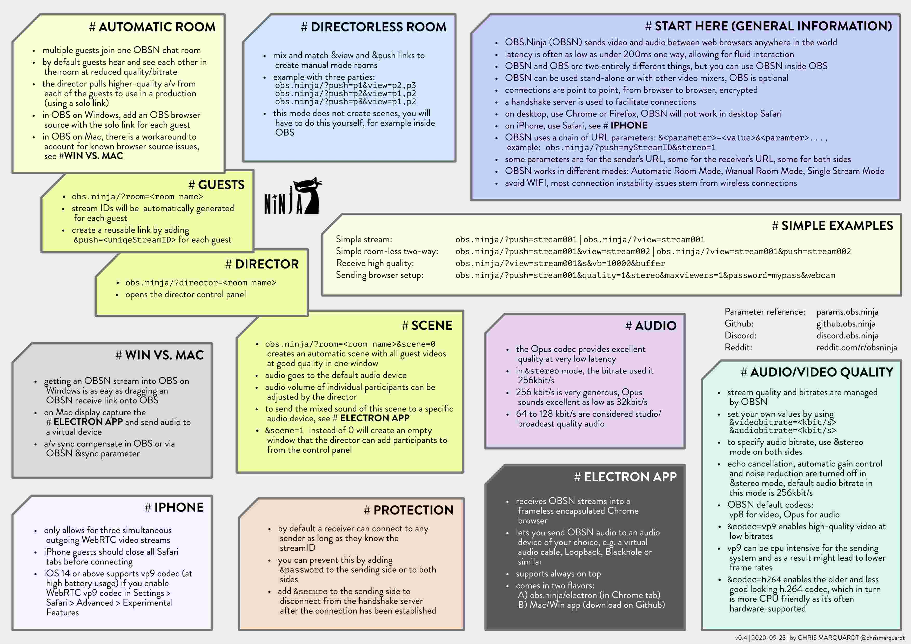

# VDO.Ninja Cheat Sheets

[⬅ back](../README.md)

## USING PARAMETERS

Many of the VDO.Ninja behaviour is managed through URL parameters in the form of &parameter=value.  
This includes things like

* audio and video bit rates
* video resolution
* choice of video codec
* audio behaviour like echo cancellation, noise reduction or mono/stereo
* passwords
* buffering behaviour

   
(v1.1, 2021-01-23)

[download JPG](OBSN_cheat-sheet.jpg) |
[download PNG](OBSN_cheat-sheet.png) |
[download PDF](OBSN_cheat-sheet.pdf) (best for printing)

