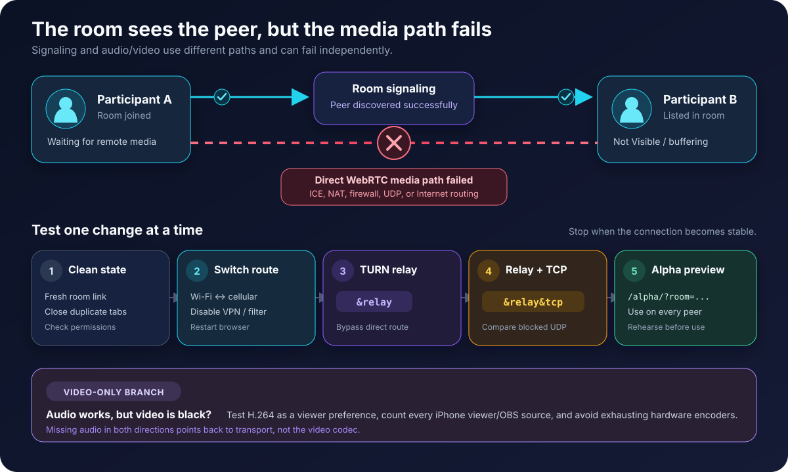

# Guest appears but no video or audio connects

A participant may appear to join the correct room while nobody can see or hear them. They might be listed under **Not Visible** as an **Unknown User**, show only a loading or buffering tile, briefly appear and disappear, or be unable to receive anyone else.

These symptoms usually mean that room signaling worked, but one or more WebRTC media connections did not establish or remain usable.

<figure><figcaption><p>The room can know that a participant exists even when the direct audio and video path has failed.</p></figcaption></figure>


**Not Visible** is not necessarily a lobby or approval state. It means VDO.Ninja knows about the peer but is not currently displaying their media. **Unknown User** can also mean that no display name was received.


## Why this can affect only one person

Normal VDO.Ninja rooms are peer-to-peer. Each pair of participants has a separate connection, so one guest can fail with one person while working with another. If the same guest fails with everyone, the shared cause is often that guest's browser, device, router, mobile carrier, VPN, firewall, or Internet route.

Common causes include:

* A direct Internet route that cannot carry WebRTC traffic reliably
* Blocked or throttled UDP traffic
* Strict NAT, double NAT, a corporate firewall, VPN, proxy, or security filter
* Unstable Wi-Fi or a mobile network transition
* A stale browser media session, denied camera or microphone permission, or an old browser/OS version
* Reusing another participant's `&push=` value or using room links with different advanced options
* A video codec or hardware-encoder problem, if audio works but video does not

## Try these fixes in order

Change one thing at a time. This makes the successful workaround useful as a diagnosis instead of hiding the cause.

### 1. Start with a clean room test

1. Fully close other VDO.Ninja tabs and the native app, then reopen the browser.
2. Confirm that camera and microphone permission is allowed.
3. Use a current browser and operating-system version.
4. Test with a fresh link containing only the room name:

   ```text
   https://vdo.ninja/?room=ROOMNAME
   ```

Do not copy and share an address-bar URL after someone has already joined. VDO.Ninja may have added a `&push=` stream ID; two simultaneous publishers must not reuse the same ID. If unique stream IDs are assigned intentionally, confirm that each participant has a different one.

For the baseline test, also remove options such as `&view`, `&broadcast`, `&hideguest`, `&queue`, or `&hold` unless they are intentional. These options can change who is supposed to receive or display media.

On iPhone or iPad, retest a full browser-based room in a current version of Safari. Other iOS browser apps may use the same underlying browser engine. The native VDO.Ninja app is focused on mobile capture and publishing workflows and is not an exact replacement for the full browser-room experience.

### 2. Change the network path

* Switch the affected phone between Wi-Fi and cellular data.
* Restart the browser and, if practical, the device and router.
* Temporarily disable a VPN, proxy, privacy filter, content blocker, or security software that may restrict WebRTC.
* On desktop or Android, compare another browser such as Chrome and Firefox.
* If the connection is behind a workplace, school, hotel, or managed network, test from an unrestricted network.

If changing networks fixes the room immediately, the original network or its route is the likely cause.

### 3. Force a TURN relay

Add [`&relay`](../general-settings/and-relay.md) to the affected participant's link:

```text
https://vdo.ninja/?room=ROOMNAME&relay
```

This sends that participant's encrypted WebRTC traffic through a TURN server instead of requiring a direct peer-to-peer route. It can solve restrictive NAT, firewall, or ISP-routing problems, but may add latency and relies on shared relay capacity.

Start by adding it only to the affected participant's link. If the result is unclear, repeat the test with it on both affected endpoints or all room links.

### 4. If relay alone fails, test relay over TCP

```text
https://vdo.ninja/?room=ROOMNAME&relay&tcp
```

This is a useful comparison when UDP is blocked or heavily throttled. TCP can add latency and may perform worse on a lossy connection, so use it only when it is more stable than regular relay mode.

### 5. Compare the alpha preview

Use the same simple room link on the current preview build for **all participants** during a rehearsal:

```text
https://vdo.ninja/alpha/?room=ROOMNAME&autorecover=1
```

The alpha preview may contain connection-recovery changes ahead of the main site. Test it before relying on it for a production session. If alpha works while the main site repeatedly fails on the same devices and network, record that comparison when reporting the issue.

See [Handling Guest Disconnects and Connection Recovery](../guides/handling-guest-disconnects-and-connection-recovery.md) for the current recovery controls.

## If audio works but video remains black

A video-only failure has a different set of likely causes. Test H.264 as a preference on the **viewer-side** link:

```text
https://vdo.ninja/?room=ROOMNAME&codec=h264
```

[`&codec=h264`](../advanced-settings/view-parameters/codec.md) asks each remote sender viewed by that page to encode H.264 when supported. If every participant uses the same room link, everyone requests H.264 from everyone else.

To test an iPhone's outbound video, add this option to the director, participant, or view links receiving that iPhone. Adding it only to the iPhone's own room link changes what the iPhone requests from the other participants.

H.264 is often a good choice for iPhone and iPad, but iOS devices commonly have only about three simultaneous H.264 hardware encoders available. Count every viewer of the phone's video, including participants, directors, OBS browser sources, scene links, and duplicate tabs. Forcing H.264 after those encoders are exhausted can produce frozen or black video.

In a three-person room, the phone normally sends to only two other room participants, so the encoder limit is unlikely unless additional viewers or production sources are open. If forced H.264 makes video worse, remove it or test `&codec=vp8` on selected viewer links. VP8 can use more CPU, battery, and heat on an iPhone.


A video codec does not explain missing audio in both directions. If nobody can hear anything either, prioritize the network, relay, and recovery tests first.


## Control room and larger-room options

Opening a control room does not by itself make media connections more reliable; the underlying room remains peer-to-peer. It can, however, make guest management and diagnostics easier.

For a larger production, reducing how many viewers request each mobile guest can avoid encoder and bandwidth limits. Broadcast-oriented links or a server-assisted option such as [Meshcast](../steves-helper-apps/meshcast.io.md) can reduce video fan-out, but they change who can see whom and should be rehearsed before use.

## Record the result of each test

| Test result | What it suggests |
| --- | --- |
| Wi-Fi fails but cellular works | Local Wi-Fi, router, ISP, or routing problem |
| `&relay` works | The direct peer-to-peer route or NAT traversal was failing |
| Only `&relay&tcp` works | UDP is likely blocked or heavily impaired |
| Alpha works while the main site fails | A newer recovery change may be helping |
| Audio works and only `&codec=h264` changes video | Video negotiation, decoding, or encoding problem |
| H.264 fails only after several viewers connect | Possible hardware-encoder exhaustion |

If the problem continues, collect:

* The exact links and URL options used, with passwords or private tokens removed
* Device model, OS version, browser or app version, and whether Wi-Fi or cellular was used
* The number of participants, OBS sources, scene/view links, and duplicate tabs
* Results from [VDO.Ninja Pre-check](https://vdo.ninja/check) and [VDO.Ninja Speed Test](https://vdo.ninja/speedtest)
* Whether direct, `&relay`, `&relay&tcp`, and alpha produced different results
* The approximate time and time zone of the failed test

If a video tile appears, `Ctrl + left-click` it on Windows or `Command + click` it on macOS to open connection statistics. Record the ICE state, candidate type, packet loss, and available bitrate. On supported builds, [Mesh Network Debug](../guides/mesh-network-debug.md) can inspect and restart an individual participant-to-participant path.

## Related guides

* [Packet Loss](packet-loss.md)
* [Video freezes mid-stream](video-freezes-mid-stream.md)
* [iOS-specific guidance](../platform-specific-issues/ios.md)
* [`&relay`](../general-settings/and-relay.md)
* [Handling Guest Disconnects and Connection Recovery](../guides/handling-guest-disconnects-and-connection-recovery.md)
* [Mesh Network Debug](../guides/mesh-network-debug.md)
