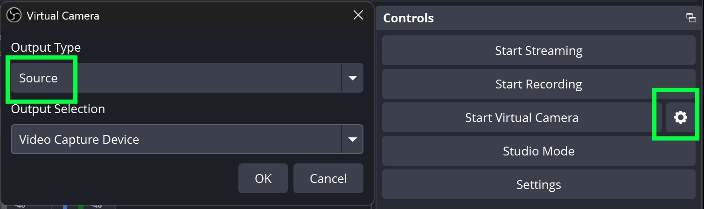

# Camera already in use by OBS or VDO.Ninja

Most physical webcams can only be opened by one desktop application at a time. If OBS is already capturing the real webcam, VDO.Ninja may not be able to select that same webcam directly. Likewise, if VDO.Ninja already has the webcam open, OBS may fail to claim it as a Video Capture Device.

OBS can also keep a webcam active if that webcam exists as a Video Capture Device in any scene, even if that scene is not currently live. This can make the issue appear suddenly after adding a scene, changing a source, updating OBS, or reopening a saved OBS profile.

## Recommended setup: use OBS Virtual Camera

Use OBS as the app that owns the physical webcam, then send that camera to VDO.Ninja through OBS Virtual Camera.

1. In OBS, add the real webcam as a **Video Capture Device** source.
2. In the OBS **Controls** panel, click the gear button beside **Start Virtual Camera**.
3. Set **Output Type** to **Source**.
4. Set **Output Selection** to the webcam source that OBS is already capturing.
5. Click **OK**, then click **Start Virtual Camera**.
6. In VDO.Ninja, Chrome, or another browser, select **OBS Virtual Camera** instead of the physical webcam.

<figure><figcaption>
Set OBS Virtual Camera to output the webcam source, then select OBS Virtual Camera in VDO.Ninja.
</figcaption></figure>

This keeps the real webcam opened only once by OBS, while VDO.Ninja receives the OBS Virtual Camera feed.

## If it still says the camera is busy

Close any other app that may be using the camera, including other browser tabs, Discord, Teams, Zoom, Camera, or another OBS instance. Then fully restart the browser and OBS.

If OBS still seems to hold the camera, remove or disable duplicate Video Capture Device sources that point at the same webcam, or check other OBS scenes and scene collections for hidden webcam sources.

On Windows, you can also check **Settings > Privacy & security > Camera** and confirm that desktop apps are allowed to access the camera.

## Alternative approach

If VDO.Ninja should own the webcam instead, do the reverse: select the physical webcam in VDO.Ninja, then bring the VDO.Ninja view link into OBS as a Browser Source. This uses a little more CPU than direct camera capture, but avoids two desktop apps fighting over the same physical camera.
