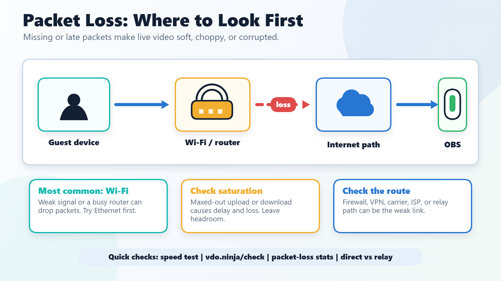

# Packet Loss

Packet loss is one of the main reasons VDO.Ninja streams look blocky, freeze, click, distort, or fall back to lower quality. If your video is choppy, your audio is robotic, or guests only fail on certain networks, this page is the main troubleshooting reference.

Packet loss can cause low quality video, audio distortion, clicking, and is the cause for numerous other video problems.

<figure><figcaption>
Packet loss is usually caused by Wi-Fi, saturation, routing, relay, or firewall issues somewhere between the guest and the viewer.
</figcaption></figure>

Wi-Fi is often the main contributor to packet loss, but it's not the only cause. Still, eliminate Wi-Fi as a possible culprit by removing it from your setup and from the guest's setup.

An Ethernet connection is highly recommended over Wi-Fi.

#### That said, there are things to try still if Wi-Fi is needed:

* Make sure the guest is plugged in and powered; battery mode with some laptops can cause issues.
* Try to sit closer to the Wi-Fi router and try to limit the traffic on the network; the more that's going through the air, the more packet loss.
* If the guest can use 4G LTE instead of Wi-Fi, that will often be much better than Wi-Fi.
* The guest can also tether their 4G LTE with Wi-Fi using bonding apps like Speedify or with hardware from Peplink; these services can give you more control over network settings.
* If using a smartphone, consider using a USB to Ethernet adapter instead. I have a video demonstrating how to do this here: [https://www.youtube.com/watch?v=abCuANblE5w](https://www.youtube.com/watch?v=abCuANblE5w)
* Some users have mentioned that reducing their network's MTU size, or the size of their packets, has helped reduce packet loss over bad Wi-Fi. You'll need to experiment with this, but 800 to 1000 might be in the range you can try in this case.
* Improving the Wi-Fi network, such as switching network bands (5 GHz / 2.4 GHz), buying a mesh-based multi-node access point setup for larger homes, changing network channels to account for frequency interference, updating to Wi-Fi 6 or newer technologies, and moving closer to the access point.

### If the issue isn't Wi-Fi related

* Try to have the guest use a different browser. For example, if using Firefox, use Chrome, and vice versa. Some browsers are optimized for privacy over performance, and that may hinder video quality, and even Chrome can sometimes be configured in a way that hinders VDO.Ninja from working well.
* Disable any anti-virus software or any security software that may disable WebRTC IP leaking.
* Advanced network firewalls, like _pfSense_, may block UDP packets or force traffic through a TURN relay server. VDO.Ninja uses mainly UDP packets in the high port range.
* If your connection with a guest is going through a TURN relay server, such as due to a security or privacy setting, resolving that may fix issues. VDO.Ninja offers publicly accessible and free TURN servers as part of its service, but these may introduce packet loss. You can always host your own TURN servers instead, but avoiding them if not needed is usually the best option.
* Restart your internet router; sometimes a router or network equipment just needs a good reset or update.
* If your router is double-NATed, such as if you have a router plugged into another router at home, it can cause VDO.Ninja to send video via relay servers instead of the preferred direct peer-to-peer path. Commonly, to address this, either set the second router as an access point instead, or configure the first router to be in bridge mode.

#### Routing issues

Sometimes two peers just can't get a good connection, while with other peers they can. This is often largely dependent on your ISPs, and it can be challenging to fix.

* Host your OBS Studio on a premium cloud server, like Amazon AWS Workspaces or Google GCP. These providers have good networks optimized for most users to access, and hosting a VPN, TURN server, or the entire OBS Studio can help you control for network routing issues.
* Forcing TURN relay servers into use may help at times; adding [`&relay`](../general-settings/and-relay.md) to the links can enable this mode. It may add some latency though, as the video traffic will take a longer, but different, network routing path that may be more reliable. Hosting your own TURN server on a local premium server, and specifying VDO.Ninja to use it, has been a good solution for some.
* As mentioned above, you can also use a VPN, perhaps one with the server hosted on a local Google Cloud server or use a VPN service that offers local edge network access onto a premium network. If all guests connect via the VPN, you'll have more control over the routing quality.
* Change your ISP (internet provider) to another provider; this may be needed on either your end or the remote guest's end. Some network providers, especially consumer-grade residential providers, can have really bad packet loss issues, especially during the evening hours.
* Use cellular connections instead, especially if the issue is intermittent and perhaps only during peak internet usage hours. Cellular connections are optimized for audio and live streaming, and so while they may have limited bandwidth or be expensive, they can also be the last refuge of hope sometimes. This is especially true of 5G connections.
* If your router or connection supports IPv6, but you don't have it enabled, try enabling it. Sometimes if limiting yourself to IPv4 or IPv6, your ISP may send your traffic through an IPv4-to-IPv6 translation server, which could introduce delays, throttling, and packet loss.
* Some cellular providers limit and throttle UDP packets, which are used by VDO.Ninja. Using a service such as Speedify in TCP mode can bypass this limitation by wrapping the UDP packets as TCP and relaying them through servers. Check with the cellular provider before purchasing a SIM card to ensure they do not throttle UDP packets as well if intending to travel.
* As mentioned before, sometimes TURN relay servers get used, and this might be the case with cellular connections or corporate firewalls; hosting your own TURN server or finding a way to bypass them can sometimes help improve the quality of connections.

#### More generic options to try

* Using [`&chunked`](../newly-added-parameters/and-chunked.md) mode on the sender side can enable an alternative way of sending video data, but this option is only supported by Chrome and other Chromium-based browsers. It is also fairly CPU intensive and may require some tweaking of bitrates and buffers to work well for your situation.
* For a structured recovery workflow including retry controls, auto-relay, mesh fallback, and director-side mitigations, see [Handling Guest Disconnects and Connection Recovery](../guides/handling-guest-disconnects-and-connection-recovery.md).
* Try using [`&codec=av1`](../advanced-settings/view-parameters/codec.md#av1) on the viewer side. This will not solve packet loss issues, but the AV1 codec is more efficient than the default codecs, and so it may offer better video quality despite the packet loss.
* For short random video packet loss, you can test [`&codec=vp8&vred`](../advanced-settings/view-parameters/vred.md) on the viewer side. This asks WebRTC negotiation to prefer video RED, but it does not force a fixed FEC percentage and the browser still decides whether repair packets are sent.
* Try adding [`&buffer=500`](../advanced-settings/view-parameters/buffer.md) to the viewer link, as this might allow more time for lost packets to arrive.
* Reduce the bitrate of your video streams. If your connection can only handle 30 Mbps in and 10 Mbps out, trying to push it to do more will cause network thrashing and packet loss. In this case, try to ensure that your connection's upload and download links are not saturated by more than 80% of their tested max capacity. Leaving some headroom will reduce latency and packet loss, ultimately leading to better quality.
* Consider using Meshcast or a WHIP/WHEP server-based SFU provider, and use that with VDO.Ninja instead of a direct peer-to-peer connection. I have a [guide for setting up Cloudflare](https://cloudflare.vdo.ninja/) to be used in this regard, but any WHIP+WHEP SFU can work. This can provide more advanced buffering and SVC options not available with direct browser-to-browser options.
* Use [Raspberry.Ninja](../steves-helper-apps/raspberry.ninja/) or OBS Studio's WHIP output as a video source instead of the browser. Raspberry.Ninja in particular supports double redundant video streams for added error correction, and while it uses more bandwidth, it can tolerate heavy packet loss and force a specified video quality. While packet loss will still exist, you might find the outcome is more to your liking.
* If screen sharing, you can use [`&contenthint=detail`](../advanced-settings/video-parameters/and-contenthint.md), which can tell the system to prioritize frame resolution rather than frame rate. While this isn't suitable for gaming, it might be a good option for screen shares where packet loss might otherwise make text unreadable.

### Audio issues due to packet loss

* Turning down the audio bitrate ([`&audiobitrate=128`](../advanced-settings/view-parameters/audiobitrate.md)) will be less prone to clicking issues versus something high, like 256 kbps. The default is 32 kbps.
* You can add [`&enhance`](../advanced-settings/view-parameters/enhance.md) on the viewer side to try to prioritize the audio over the video. This might help with audio clicking issues.
* Using [`&audiocodec=red`](../advanced-settings/audio-parameters/minptime-1.md#red) on the viewer side can increase the amount of error correction data being sent, reducing packet loss. This will double the audio bandwidth, but that should not be an issue for most modern connections.


[vred.md](../advanced-settings/view-parameters/vred.md)


### YouTube video guide on packet loss + VDO.Ninja

I have a video talking about packet loss, with details on how to set up Speedify as well: [https://www.youtube.com/watch?v=je2ljlvLzlY](https://www.youtube.com/watch?v=je2ljlvLzlY)

## Connection testing tools and statistics

There is a speedtest that the local user can try out to give them feedback on their packet loss. This is a special speedtest, different than normal tests, as it does not test for available bandwidth, but network quality and packet loss: [https://vdo.ninja/speedtest](https://vdo.ninja/speedtest)

If you'd like to remotely test a guest's connection, you can also have them perform the VDO.Ninja pre-check test. This is a comprehensive system and network test, which allows you to review the results of the guest remotely: [https://vdo.ninja/check](https://vdo.ninja/check)

You can also do a peer-to-peer test by just making a VDO.Ninja connection with the guest. If you hold down CTRL (cmd) and click on their video, you'll see the stats. Packet loss is a listed stat, as well as the candidate type. If a guest is connecting to you via RELAY candidate type, that implies there is a firewall or security setting blocking a direct peer-to-peer connection. Addressing this will likely resolve your issues.

When doing a pre-check or speed test, make sure to test during the hours of the day you intend to go live. Mornings will often have less packet loss than evenings, with around 7 pm to 10 pm being especially bad.

### Asking ChatGPT about it..

_So I asked ChatGPT about improving the network quality between two peers, and its response is below._

Understanding the root causes of UDP packet loss across different network paths can be quite complex, particularly because the internet is a mesh of countless routes, and performance can be affected by a multitude of factors that are often beyond the control of end users. Here are some points to consider when trying to diagnose these issues:

1. **Path Specifics**: Even if all users have good connections to a common server like Google's, the path packets take to reach your specific service might be vastly different. This can be due to the routing policies of ISPs, peering agreements, or simply the geographic distance the packets need to travel.
2. **Network Congestion**: One of the most common causes of packet loss and latency is network congestion. This can occur at any point along the path and can be temporary (like peak usage times) or could indicate a more chronic issue with a particular segment of the network.
3. **Quality of Service (QoS)**: ISPs may implement QoS policies that prioritize certain types of traffic over others. For instance, UDP traffic may be deprioritized in favor of TCP traffic, which could negatively impact applications that rely on UDP.
4. **NAT and Firewall Configuration**: Users behind strict NATs or firewalls might experience connection issues if certain ports are blocked or if the NAT type is restrictive (Symmetric NAT), which can cause problems for UDP traffic in particular.
5. **Hardware Issues**: Problems with user hardware (like routers or modems) or even the quality of the local network (like Wi-Fi interference) can cause increased packet loss.
6. **ISP Issues**: Issues within an ISP's network, such as faulty routing, misconfigured equipment, or even under-provisioned transit links, can lead to increased latency and packet loss.
7. **Server Performance**: On your end, the server's performance and its connection to the internet could also affect the user experience. Overloaded servers or servers with a poor connection to the backbone can be a bottleneck.
8. **Packet Inspection**: Some ISPs may perform deep packet inspection which can introduce latency and potentially drop packets if they are deemed to be non-essential or if they match certain patterns.
9. **Transit Providers**: Different users may have different transit providers between them and your server, which can result in different latency and packet loss characteristics.

To diagnose these issues, you could:

* Implement more detailed logging and monitoring on your server to see if there are patterns in the connectivity issues.
* Ask users to run traceroutes and path analysis tools from their location to your server and back to determine where delays or losses are occurring.
* Use network diagnostic tools that can simulate UDP traffic and measure performance across different network paths.
* If feasible, provide alternative connection points or relay servers in different geographical locations to see if routing through these points improves performance.

Ultimately, diagnosing network performance issues often requires cooperation from ISPs and a deep dive into network performance metrics. Tools like MTR (My Traceroute) can be more informative than a simple traceroute as they provide information on packet loss at each hop and over time, which can help in pinpointing where issues are occurring.

#### Summary
