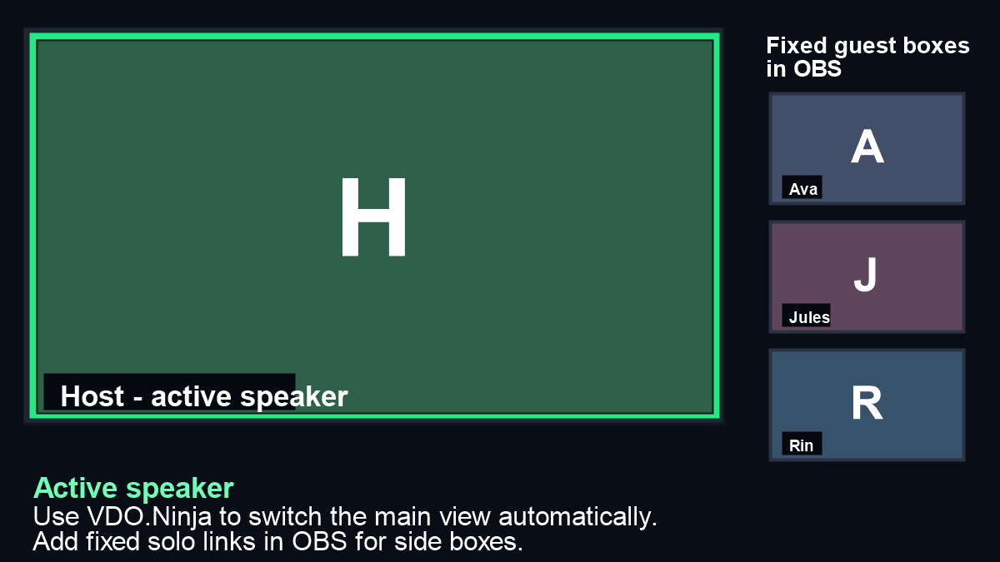
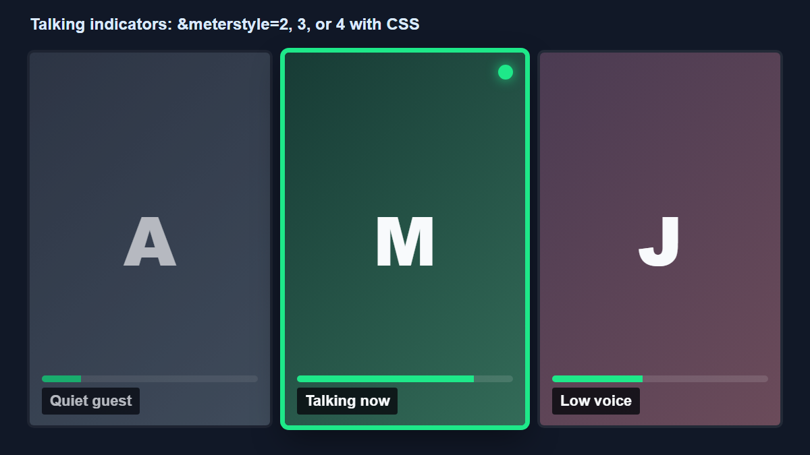

# Active speaker, Highlight, and talking indicators

This guide explains the common ways to feature the current speaker, manually highlight a guest, keep other guests visible in OBS, and show a green talking indicator around people who are speaking.

## Quick choice

| Goal | Best option |
| --- | --- |
| Automatically show only the current speaker | Use `&activespeaker=1` or `&activespeaker=3` on a scene/view link |
| Automatically show all current speakers | Use `&activespeaker=2` or `&activespeaker=4` |
| Automatically make the current speaker larger while others remain visible | Use `&activehighlight=2` or `&activespeakerfeatured` |
| Manually feature one guest from the director room | Use the director Highlight / Featured control |
| Build a fully custom OBS layout with fixed guest boxes | Use a large `&activespeaker` browser source plus separate `&solo` sources in OBS |
| Add a green border or dot when guests talk | Use `&meterstyle=2`, `&meterstyle=3`, or `&meterstyle=4` with CSS |
| Feature social chat messages | Use Social Stream Ninja; this is separate from VDO.Ninja guest video highlighting |

## Automatic active speaker

Add `&activespeaker`, `&speakerview`, or `&sas` to a viewer, room, or scene link.

```text
https://vdo.ninja/?room=ROOMNAME&scene=0&activespeaker=3&cleanoutput
```

Modes:

| Mode | Behavior |
| --- | --- |
| `&activespeaker=1` | Shows one speaker at a time, including audio-only sources |
| `&activespeaker=2` | Shows everyone currently talking, including audio-only sources |
| `&activespeaker=3` | Shows one speaker at a time, but only video sources |
| `&activespeaker=4` | Shows everyone currently talking, but only video sources |

Use `3` or `4` for most OBS scene layouts, since audio-only guests will not replace the video layout.

You can slow down one-speaker switching with `&activespeakerdelay`, `&speakerviewdelay`, or `&sasdelay`. This applies to modes `1` and `3`.

```text
https://vdo.ninja/?room=ROOMNAME&scene=0&activespeaker=3&activespeakerdelay=1200
```

The delay is in milliseconds. This helps prevent rapid switching when people briefly interrupt or laugh.


[activespeaker.md](../advanced-settings/view-parameters/activespeaker.md)



[and-activespeakerdelay.md](../advanced-settings/mixer-scene-parameters/and-activespeakerdelay.md)


## Automatic active speaker Highlight

Use `&activehighlight=2` when you want VDO.Ninja to keep everyone in the scene, but automatically make the current speaker larger using the secondary Highlight / Featured layout.

```text
https://vdo.ninja/?room=ROOMNAME&scene=0&activehighlight=2&cleanoutput
```

`&activespeakerfeatured` is an alias for the same mode.

```text
https://vdo.ninja/?room=ROOMNAME&scene=0&activespeakerfeatured&cleanoutput
```

Options:

| Mode | Behavior |
| --- | --- |
| `&activehighlight=2` | Uses the secondary Highlight / Featured mode, so the active speaker becomes larger while other guests remain visible |
| `&activespeakerfeatured` | Alias for `&activehighlight=2` |
| `&activehighlight=1` | Uses normal Highlight, which is closer to a full speaker focus mode |

By itself, `&activehighlight=2` does not enable `&activespeaker`, so it does not hide non-speaking guests. If you combine it with `&activespeaker`, the normal active-speaker hide/show behavior still applies.

You can also add `&activespeakerdelay` if speaker changes are happening too quickly.

This link still needs to receive and process guest audio, so do not add `&noaudio` or `&noap` to the same scene/view link. By default, it follows video-capable speakers, similar to `&activespeaker=3`, so audio-only sources do not take over the Featured layout.


[activehighlight.md](../advanced-settings/view-parameters/activehighlight.md)


## Large speaker plus smaller guests in OBS

If you need exact positioning, crops, borders, or per-guest filters in OBS, use a hybrid OBS layout:

1. Add one large OBS Browser Source for the automatic speaker view.
2. Add each guest as a separate smaller OBS Browser Source using their solo link.
3. Add `&noaudio` to the smaller solo sources so audio is not duplicated.

Large automatic speaker source:

```text
https://vdo.ninja/?room=ROOMNAME&scene=0&activespeaker=3&cleanoutput
```

Fixed side guest source:

```text
https://vdo.ninja/?view=GUESTID&room=ROOMNAME&solo&cleanoutput&noaudio
```

Replace `GUESTID` with the guest's stream ID. Permanent guest IDs make this easier to maintain between shows.

Do not add `&noaudio` to the active-speaker source, since the automatic switching needs incoming audio levels. If the active-speaker source should not be heard in your final mix, mute that OBS source or route audio elsewhere in OBS instead.

<figure><figcaption><p>Mocked example: a large active-speaker source with fixed solo sources in OBS.</p></figcaption></figure>


[active-speaker-layouts-in-obs.md](active-speaker-layouts-in-obs.md)



[and-solo.md](../advanced-settings/mixer-scene-parameters/and-solo.md)


## Manual Highlight / Featured guest

From the director room, use the Highlight / Featured control on a guest to make that guest the featured video in scene outputs and connected room views that follow Highlight.

This is useful when the producer knows who should be on screen, such as a host, presenter, guest answer, or screen reader.

Tips:

* Use a normal scene link for the OBS program source:

```text
https://vdo.ninja/?room=ROOMNAME&scene=0&cleanoutput
```

* Click Highlight / Featured in the director control room to feature a guest.
* Hold `Ctrl` on Windows/Linux or `Cmd` on macOS while using Highlight for the partial featured mode in supported layouts, where the guest becomes larger instead of fully replacing the layout.
* Add `&ignorehighlight` to a viewer or scene link if that link should not follow director Highlight changes.

## Mute follows Highlight

If you want the highlighted guest to be the only unmuted guest, add `&highlightmute` to the director link.

```text
https://vdo.ninja/?director=ROOMNAME&highlightmute
```

Aliases:

* `&hmute`
* `&mutefollowhighlight`
* `&mfh`

This is intended for producer-controlled panels where the highlighted person should be the only active on-air microphone. Manual mute changes are still possible, but the rule applies again the next time Highlight changes.


[and-highlightmute.md](../advanced-settings/director-parameters/and-highlightmute.md)


## Green border or talking dot

Use `&meterstyle` when you want visible feedback that someone is talking.

```text
https://vdo.ninja/?room=ROOMNAME&scene=0&meterstyle=2&cleanoutput
```

Common modes:

| Mode | Behavior |
| --- | --- |
| `&meterstyle=1` | Shows a VU-style meter |
| `&meterstyle=2` | Shows a green border around a talking guest |
| `&meterstyle=3` | Shows a small green dot when a guest is talking |
| `&meterstyle=4` | Hides the built-in meter and adds `data-loudness` / `data-speaking` attributes for CSS |
| `&meterstyle=5` | Pulses an audio-only avatar/background image while speaking |

<figure><figcaption><p>Mocked example: a green talking border, dot, and meter-style loudness feedback.</p></figcaption></figure>

For custom CSS, `data-speaking` is usually easier than raw `data-loudness`.

```css
video[data-speaking="2"] {
	outline: 6px solid #00ff66;
	outline-offset: -6px;
}

video[data-speaking="1"] {
	outline: 3px solid #99ffbb;
	outline-offset: -3px;
}
```

`data-speaking="0"` means quiet, `1` means low-level speaking, and `2` means loud speaking.


[meterstyle.md](../advanced-settings/design-parameters/meterstyle.md)


## API-driven switching

For most active-speaker Featured layouts, use `&activehighlight=2`. Use the API/loudness path only when you need custom rules, custom layout objects, or external production controls.

Available building blocks:

* `getLoudness` or `&pushloudness` can report guest loudness to a parent page.
* The `layout` API can apply a custom layout object or switch predefined layouts.
* The `soloVideo` / `highlight` API command can toggle Highlight for a guest.

This is flexible, but it is more work than the built-in `&activehighlight=2` mode. It usually requires a parent page, Stream Deck / Companion workflow, or custom script to decide who is loudest and then update the layout.


[iframe-api-basics.md](iframe-api-documentation/iframe-api-basics.md)



[and-layouts.md](../advanced-settings/director-parameters/and-layouts.md)


## Featured chat messages are separate

Featured social chat messages are handled by Social Stream Ninja, not by `&activespeaker` or the director Highlight video controls.

Use Social Stream Ninja when you want to select YouTube, Twitch, or other social chat messages and show them as an OBS overlay.


[README.md](../steves-helper-apps/social-stream-ninja/README.md)


## Common issues

If active speaker never switches:

* Make sure the scene/view link is receiving audio.
* Do not add `&noap`; audio processing is needed for loudness-based features.
* Try `&meterstyle=2` first to confirm VDO.Ninja can detect who is talking.
* Use `&activespeaker=3` if audio-only sources are unexpectedly taking over the scene.

If the layout is switching too quickly:

* Add `&activespeakerdelay=1000` to `&activespeakerdelay=2000`.
* Use manual Highlight when the producer needs deterministic control.

If you need the exact "current speaker large, everyone else still visible, all inside one VDO.Ninja scene link" behavior:

* Use `&activehighlight=2` or `&activespeakerfeatured`.
* Use the OBS hybrid method only when you need custom per-source positioning or filters.
