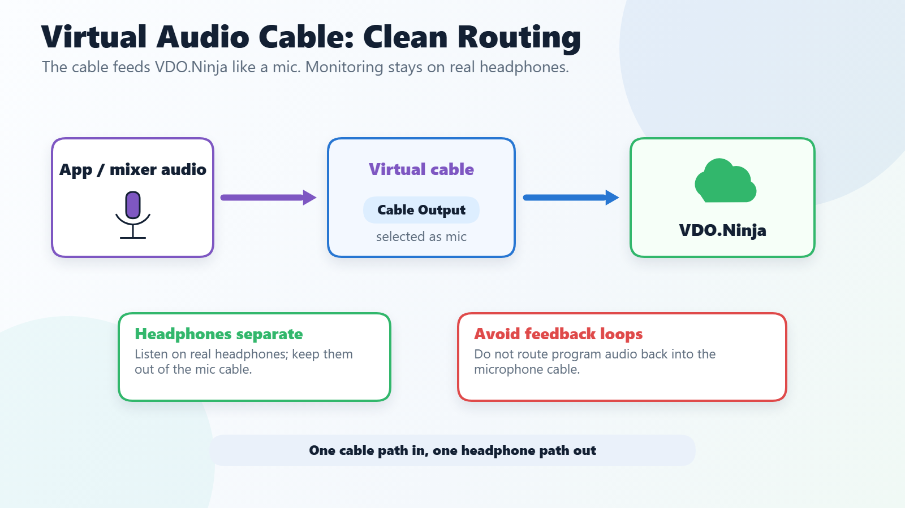

# How to capture an application's audio

This page contains the standard guide for capturing application-specific audio into VDO.Ninja, especially on Windows where app-specific audio routing is common. If you need to send game audio, music app audio, browser audio, or another desktop app into VDO.Ninja, this is the main guide. Less complex methods are being developed, with some current [alternative options listed here](#other-options).

<figure><figcaption>
A virtual audio cable should feed VDO.Ninja like a microphone input. Keep headphones and program audio out of that same cable unless you intentionally want to send them.
</figcaption></figure>

#### Guide: Routing a Windows application's audio to [VDO.Ninja](https://vdo.ninja/)

(For macOS users, you can use [Loopback](https://rogueamoeba.com/loopback/) instead, or check out this list of free options: [https://docs.vdo.ninja/platform-specific-issues/macos#capturing-audio](https://docs.vdo.ninja/platform-specific-issues/macos#capturing-audio))

* 1\) Install the VB-Cable Virtual Audio device. ([Voicemeeter](https://vb-audio.com/Voicemeeter/) can be used instead)\
  [https://www.vb-audio.com/Cable/](https://www.vb-audio.com/Cable/)

Tip: If you want to configure the VB Audio driver with custom settings, the recommended sample rate is 48000-hz, as that is the sample used by VDO.Ninja.

* 2\) Load up Windows Mixer by typing in Mixer to the Windows search bar:

* 3\) For the application you want, select the Output dropdown and select CABLE Input.

* 4\) We can now head over to [https://vdo.ninja](https://vdo.ninja), but we will want to add the advanced URL parameter [`&proaudio`](../advanced-settings/audio-parameters/and-proaudio.md) to the web URL, which disables echo cancellation and other digital effects. It will make the audio sound better and echo cancellation is likely not needed if capturing from a game or application window.\
  \
  For example, [`https://vdo.ninja/?push=myStreamID&proaudio`](https://vdo.ninja/?push=myStreamID\&proaudio)\
  \
  You can also add this to the view link, which increases the audio quality even more. For example, [`https://vdo.ninja/?view=myStreamID&proaudio`](https://vdo.ninja/?view=myStreamID\&proaudio)\

* 5\) In VDO.Ninja, select the Cable Output device.\
  \
  Tip: If you hold down `CTRL` (`Command`) while selecting inputs, you can select more than one at a time.\
  \

* 6\) A simple way to hear the audio as an output is to just unmute the video. Right-click and show the controls, if not visible, then unmute.\
  

* 7\) Alternatively, you can also use the Sound properties for the VB cable to "listen to this device" in Windows, so you can hear the audio even if not in VDO.Ninja. This method might have lower latency than the method in step 6.\
  \
  

## Other options

#### Using OBS to capture audio

While this option still requires a virtual audio cable, as seen above, you can use OBS to capture the application's audio and output the audio from OBS to the virtual cable via the Monitor output in OBS.

<figure><figcaption>
Another way of selecting application audio for the Virtual Audio Cable
</figcaption></figure>

***

#### Capturing application and system audio on Linux

If you're on **Linux**, Chrome and Chromium browsers may not yet support full system or application audio capture when screen sharing.\
\
To route and capture app-specific or system-wide audio, you can use **PipeWire** or tools built on top of it like [**Sonusmix**](https://codeberg.org/sonusmix/sonusmix).

**Option 1: Using PipeWire (manual)**

1. Ensure your system uses **PipeWire** (most modern distros do).
2. Use `pavucontrol` or `helvum` to route application audio to a **virtual sink**.
3. In your app (for example VDO.Ninja, OBS, or your browser), select that virtual sink as your **input/microphone**.
4. For window capture, use the built-in **screen/window picker** in Chromium or your compositor (for example GNOME or KDE).

**Option 2: Using Sonusmix (easy UI)**

1. Download the **Sonusmix AppImage** from Codeberg.
2. Launch it to create or manage **virtual devices** and route audio between apps visually.
3. Select the routed virtual output in your streaming or capture app (OBS, VDO.Ninja, and so on).

> With Sonusmix or PipeWire routing, you can isolate a single game, window, or app's audio, which is ideal for high-quality, low-latency sharing.

***

#### Publishing directly from OBS to VDO.Ninja

An alternative to using a virtual audio cable is to use OBS to capture the audio, and then publish the audio to VDO.Ninja directly using the WHIP-publishing mode.

[WHIP](../advanced-settings/whip-parameters/and-whip.md) is an experimental feature currently in OBS and may require a special version of OBS at the moment to access, but it might be included in OBS by default with the release of OBS v30 or v31.

Check out a demo YouTube video of how to accomplish this:\
[Publishing from OBS directly to VDO.Ninja](https://www.youtube.com/watch?v=ynSOE2d4Z9Y)\
\
More details will be provided as the feature develops.


Using WHIP to publish to VDO.Ninja directly from OBS

