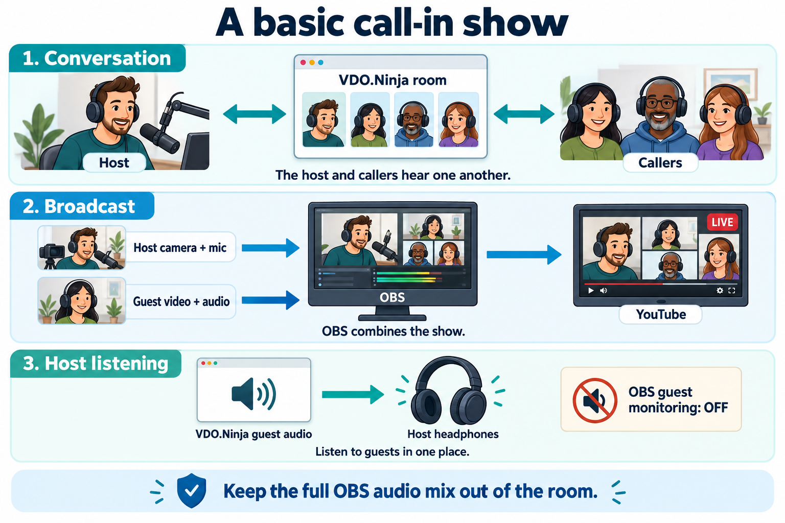

# Run a call-in show with OBS and VDO.Ninja

VDO.Ninja can carry the conversation while OBS builds the finished show for YouTube or another streaming service. These are common options for a host with roughly one to four callers on air, with links to setup details.

Start by [creating a room](../getting-started/rooms/README.md). The **Director's Room** is the host's control page. Callers receive a guest invitation; OBS receives a viewing link added as a **Browser Source**, which displays a webpage inside your OBS composition. Keep director and OBS viewing links private.

Use the sections that match what you need:

* [Manage waiting callers and admission](#manage-waiting-callers-and-admission).
* [Keep OBS ready as callers change](#keep-obs-ready-as-callers-change).
* [Let everyone talk without doubled audio](#let-everyone-talk-without-doubled-audio).
* [Choose what callers see](#choose-what-callers-see).
* [Handle reconnects and prepare for the show](#handle-reconnects-and-prepare-for-the-show).
* [Accept telephone calls](#accept-telephone-calls).

## Manage waiting callers and admission

A public call-in invitation needs somewhere for people to wait. Joining the conversation and appearing on the broadcast are separate decisions: removing a caller from an OBS picture does not stop other people in the room hearing them.

| Need | Common approach | Details |
| --- | --- | --- |
| A public waiting list with host/helper controls | **app.invite.cam** provides a lobby, invitations, admission, and return-to-lobby actions | [app.invite.cam guide](../steves-helper-apps/app-invite-cam.md) |
| A lobby using regular VDO.Ninja rooms | Share a separate waiting-room link, then transfer selected callers into the live room | [Transfer rooms](../getting-started/rooms/transfer-rooms.md) |
| Approval before entering a room | Add `&requireapproval` to the director link; approve or deny pending requests | [Director approval](../advanced-settings/director-parameters/and-requireapproval.md) |
| Access based on identity | Use signed-in room access and configure an allowlist or manage pending access requests | [SSO and access controls](sso-and-signed-in-access.md) |

**app.invite.cam** gives callers somewhere to wait instead of repeatedly trying to enter the show. It supports anonymous guests or named Discord users. For a panel whose callers hear one another, configure group conversation rather than director-only guest isolation.

**Transfer rooms** send callers back to the lobby when they rejoin through their original invitation. Share that lobby link, keep both director pages open, and use matching room passwords. Transfers manage ordinary arrivals; they are not an account-based ban.

**Approval and sign-in:** `&requireapproval` does not block new joins when the director is absent. Sign-in alone permits signed-in accounts; configure access rules to restrict admission. [Green rooms and waiting options](green-room-and-guest-approval-options.md) also covers queue/hold modes.

### Screen callers without putting private talk on air

A lobby operator or helper can check a caller's microphone before admission. If the on-air host does the screening, keep their microphone out of the broadcast too.

VDO.Ninja's local listening controls and **Solo Talk** do not mute a separate microphone source in OBS. Keep screening audio out of OBS's guest selection and desktop capture, and control the host's OBS mic separately. See [Private conversations and Solo Talk](room-audio-obs-meshcast-and-private-talk.md#7-keep-private-conversations-off-air).

## Keep OBS ready as callers change

A **VDO.Ninja scene link** is a webpage showing the feeds selected for that VDO.Ninja scene. It can show several callers together or just one caller. It is different from an **OBS scene**, which combines your host camera, graphics, and Browser Sources into the broadcast picture.

### Arrange the callers together in VDO.Ninja

With this approach, one OBS Browser Source displays the whole caller layout. OBS gets one audio fader for that source; VDO.Ninja provides the individual guest controls.

* **Automatic layout:** Use **Capture a Group Scene** in the director page. With **Auto-add guests** on (`&scene=0`), room guests appear automatically. This fits a live room containing only intended broadcast participants.
* **Manual selection:** Turn **Auto-add guests** off and add chosen callers to a numbered VDO.Ninja scene, such as Scene 1. The OBS source stays fixed while you add or remove people. [Scene controls](../advanced-settings/view-parameters/scene.md) explain the options.
* **Custom layout and numbered seats:** Open [vdo.ninja/mixer](https://vdo.ninja/mixer). The Mixer lets you assign callers to slots and place those slots in layouts, including crops for phone video. Copy its clean scene/output link into OBS, rather than the Mixer control-page URL. See the [Mixer guide](../steves-helper-apps/mixer-app.md).

A **slot** is a numbered seat: changing who occupies slot 1 changes the caller shown in that seat without rebuilding the layout. In the Mixer, turn off **Assign a slot to new guests automatically** if arrivals should wait for manual assignment. Save/export the Mixer settings for reuse.

### Arrange individual caller boxes in OBS

Separate Browser Sources let OBS position, crop, filter, and adjust the volume of each caller independently. Those sources can follow a seat, a selected scene, or a particular person:

| What the OBS source follows | How to reuse it |
| --- | --- |
| **A numbered slot** | Assign callers with the Mixer or the director's `&slotmode` controls. An OBS link using `&viewslot=1` follows whoever occupies slot 1. Prepare one source per seat. |
| **A dedicated VDO.Ninja scene** | Give each OBS caller box its own scene link. Keep one caller in each scene; remove the previous caller and add the next. No fixed caller identity is needed. |
| **A particular guest** | Use that guest's solo link. A unique, fixed `&push` ID in their invitation keeps the source reusable for their later appearances. |

Example OBS link for slot 1:

```text
https://vdo.ninja/?room=YOUR_ROOM&scene&viewslot=1
```

Use it with the Mixer or a director using `&slotmode`, and preserve your room's access parameters. Change the slot number for other OBS boxes. A guest's `&slot=1` requests a seat; it does not reserve it.

[Slot viewing](../advanced-settings/mixer-scene-parameters/and-viewslot.md) and [Permanent links, scenes, and slots](how-to-get-permanent-links.md) provide the complete link sets. Use generated viewing links for authenticated rooms so OBS can connect without interactive sign-in.

## Let everyone talk without doubled audio

One common arrangement uses VDO.Ninja for conversation and OBS for broadcast audio. The host selects the same physical microphone in both applications, while hearing callers through VDO.Ninja on headphones.

<figure><figcaption><p>One basic arrangement. OBS guest monitoring is off because the host listens through VDO.Ninja; guest audio remains enabled for the broadcast.</p></figcaption></figure>

1. In the Director's Room, choose **Enable director's microphone or video** and select the host microphone. Sending a camera to callers is optional. In the Mixer, use **Director View** for these controls.
2. Send the director's listening output to headphones and enable local guest playback if muted. Callers use headphones too and keep YouTube playback muted.
3. Keep the host camera and microphone sources in OBS. Add the caller viewing links chosen above, enable **Control audio via OBS**, and check their output meters and broadcast track.
4. Leave OBS monitoring off for those caller sources when listening through VDO.Ninja. Avoid also capturing the director's browser/headphone output through Desktop Audio or application capture.
5. Keep the director's microphone out of the caller output sent to OBS, since OBS already captures it. Check the Mixer's director visibility setting or `&showdirector` if enabled; these can include the director in scene outputs.

Guests hear the host and each other through the room; no OBS audio return is needed. Listening through OBS instead is another option, but then disable duplicate local playback in VDO.Ninja. See [Echo and duplicate monitoring](../common-errors-and-known-issues/echo-or-feedback-issues.md#control-room-plus-obs-monitoring).

### Keep voices audible when switching pictures

Switching to a fullscreen caller, a screen share, or a host-only OBS scene can remove the source carrying other voices. Two common approaches are:

* Reuse the existing caller sources in each OBS scene that needs their audio, keeping them active.
* Create a shared **Room Audio** scene in OBS with an audio-only VDO.Ninja source, and use video-only links for the pictures. This makes the on-air audio selection independent of the picture layout.

Capture each voice once and include only on-air callers in a shared audio source. [Keep voices active while switching pictures](room-audio-obs-meshcast-and-private-talk.md#3-keep-voices-active-when-switching-to-a-screenshare) covers source settings and screen-share audio.

### Let callers hear clips or music

A separate return can send OBS playback to the conversation. In the normal room arrangement, that return contains clips/music only: leave out all host and caller microphones already carried by VDO.Ninja. Otherwise callers hear themselves or the other speakers twice.

A virtual audio device or hardware mixer can supply this route. [Return OBS clips and music](room-audio-obs-meshcast-and-private-talk.md#4-return-obs-clips-and-music-to-the-main-room) covers the setup. Custom per-caller mixes are another option for more involved productions; see [Individual guest mixes](room-audio-obs-meshcast-and-private-talk.md#6-option-use-the-directormixer-custom-guest-mixes).

## Choose what callers see

The callers' view can differ from the audience's OBS picture.

| Caller experience | Setup |
| --- | --- |
| See the other participants | Use normal room invitations. Each guest receives the other participants' video. |
| See the host or a single show view | Add [`&broadcast`](../advanced-settings/view-parameters/broadcast.md) to guest invitations. Callers receive the main director's video while normal guest-to-guest audio remains available. |
| See the finished OBS picture | Use `&broadcast` invites and select **OBS Virtual Camera** as the director's camera. It can show Program or a dedicated guest-return scene. |

`&broadcast` controls what callers watch; it does not start the YouTube broadcast or belong on OBS viewing links. Keep a returned OBS picture out of the VDO.Ninja output OBS captures to prevent a repeating image. Virtual Camera carries video only. See [Let guests see the finished OBS scene](let-guests-see-your-obs-scene.md).

### Direct video or Meshcast distribution

Broadcast mode can work **without Meshcast**: the director sends their video to the callers directly. This reduces guests' video-sharing work but gives the director more return-video uploads.

With **Meshcast**, a publishing guest or director uploads a feed to a server for distribution. For an OBS picture returned by the director, enable `&meshcast` on the director link and retain `&broadcast` on guest invitations. The [return guide](let-guests-see-your-obs-scene.md#4-optional-send-the-return-through-meshcast-v2) also documents `&meshcast2` for the newer service.

Meshcast also works for individual guest publications in ordinary rooms. It reduces repeated uploads but adds a server dependency and some delay. Enabling it for the director does not move the guests' outgoing feeds to Meshcast. See [Meshcast options](../newly-added-parameters/and-meshcast.md).

Neither mode makes the full OBS audio mix suitable for active callers. People only watching in a greenroom can receive that full mix. See [Show feeds and room returns](room-audio-obs-meshcast-and-private-talk.md).

## Handle reconnects and prepare for the show

A reusable OBS source saves editing links, but someone may still need to restore the caller's seat or scene selection.

* **Recurring guest:** Give them a unique fixed stream ID, or use `&permaid` to remember one in the same browser. Two simultaneous callers must not share an ID.
* **Brief disconnection:** The director's [`&scenerestore`](../advanced-settings/mixer-scene-parameters/and-scenerestore.md) can restore manual scene membership for a returning guest with a valid temporary restore identity. It does not bypass admission or save every layout permanently.
* **Caller returns to the lobby:** Re-admit or transfer them, then check their seat and on-air audio. Keep a host-only OBS scene ready while sorting out a missing feed.

Before the show, make an OBS recording with two callers. Check conversation audio, broadcast audio, a new admission, a caller replacement, a reconnect, and every OBS scene you will switch to. Test private talk separately from ordinary on-air conversation. If using an OBS return or Meshcast, include those paths in the rehearsal.

## Accept telephone calls

A caller opening the guest link in a phone browser uses the workflows above. Dialing a telephone number requires a phone provider or a phone/softphone bridge.

| Approach | What changes | Setup guide |
| --- | --- | --- |
| External phone or softphone with an audio mixer/router | Create return mixes that let browser and telephone callers hear each other without hearing themselves | [Phone calls with virtual audio cables or hardware](phone-call-ins-with-vdo-ninja-and-virtual-audio-cables.md) |
| Experimental integrated SIP/SignalWire or Twilio support | Configure the provider-backed call-in path; telephone callers currently join the director's audio mix, rather than ordinary guest tiles | [Phone call-in provider options](phone-call-in-provider-options.md) |

For the integrated path, a guest-only OBS viewing source will not capture the phone caller by itself. Plan how the director's mixed audio reaches OBS and avoid capturing the host microphone twice. The linked phone guides cover this additional routing.
