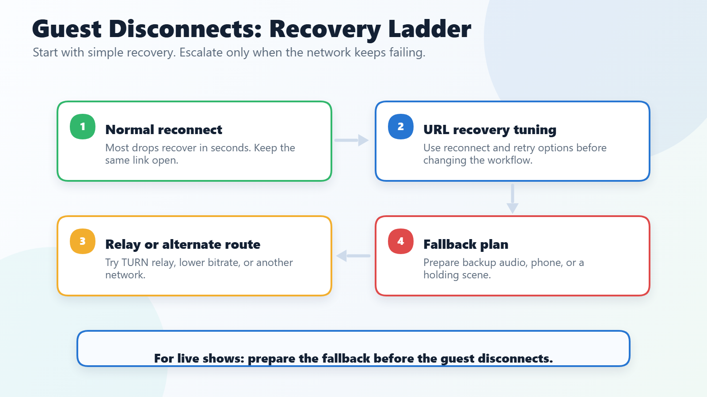

# Handling Guest Disconnects and Connection Recovery

When guests randomly disconnect, freeze, or reconnect in loops, there is rarely one single fix. This guide gives a layered approach so you can choose the least disruptive option first, then escalate only when needed.

<figure><figcaption>
Start with URL-only recovery controls, then escalate toward relay, Meshcast, WHIP/WHEP, or live-show operational fallbacks only when needed.
</figcaption></figure>

## Fast checklist before going live

1. Have guests use wired Ethernet where possible.
2. Ask guests on unstable links to test Chrome and Firefox ahead of time.
3. Keep a fallback path ready:
   - P2P first
   - Meshcast/WHIP+WHEP fallback
   - Mix-minus patching for critical audio continuity

## Option 1: URL-only recovery tuning (quickest)

Use these on room/director/push/view links as needed:

- `&autorecover=1` enables adaptive disconnect timing, TURN escalation, and eligible WHEP fallback signaling.
- `&autorelay=1` enables only TURN escalation during recovery. It is already included by `&autorecover=1`, so do not combine them.
- `&p2pfailtimeout=<ms>` sets recovery timing window (default `12000`, clamp `3000-45000`).
- `&peerrecoversteps=<n>` sets retry depth (default `3`, clamp `1-6`).
- `&pendingicettl=<ms>` controls queued ICE candidate retention (default `15000`, clamp `3000-60000`).

Suggested presets:

- Balanced:
  - `&autorecover=1&p2pfailtimeout=12000&peerrecoversteps=3&pendingicettl=15000`
- Aggressive recovery:
  - `&autorecover=1&p2pfailtimeout=7000&peerrecoversteps=5&pendingicettl=20000`
- High-latency environments:
  - `&autorecover=1&p2pfailtimeout=18000&peerrecoversteps=4&pendingicettl=30000`

## Option 2: Browser and network remediations

- Switch guest browser (Chrome <-> Firefox) for problematic links.
- Disable VPN/proxy/security middleboxes where possible.
- Prefer Ethernet over Wi-Fi; avoid double-NAT and overloaded consumer routers.
- If direct P2P is consistently failing, test TURN path reliability using [`&relay`](../general-settings/and-relay.md).

## Option 3: Meshcast or WHIP/WHEP fallback

If room topology is large or network quality is inconsistent:

- Publish through Meshcast / WHIP and distribute WHEP playback where appropriate.
- Use `&whepshare=` (+ optional `&whepsharetoken=`) for external WHEP sources.
- Keep P2P for low-latency workflows, but use WHIP/WHEP paths when consistency is more important than absolute lowest latency.

## Option 4: Director operational fallback

When a specific guest-to-guest P2P edge fails during a live show:

- Ask the publisher to speak, click **Refresh** in **Mesh Network Debug**, and inspect the separate publisher -> listener arrow. Orange can identify a one-way RTP stall even while ICE remains connected.
- Select the affected arrow and use **Restart This ICE Path** before using guest-wide recovery actions.
- For one-way audio, prefer the listener's per-guest **Mix** control over the bidirectional **Patch via Mix-Minus** edge action. Both require an existing director outbound audio sender and can duplicate audio if the direct path recovers.
- Use **Restart All ICE Paths**, **Refresh Video**, **Refresh Mic**, or **Refresh Guest Media + ICE** when broader per-guest recovery is needed.
- If a guest is publishing via WHIP output, use **Restart WHIP** from director controls.

See [Guest Audio Recovery and Mesh Debug](mesh-network-debug.md) for the directional health indicators, targeted ICE restart, mix-minus fallback, and safe operating sequence.

## Broadcast-mode resiliency pattern

For larger productions:

- Use broadcast-oriented workflows so not every guest must maintain every P2P edge.
- Keep a dedicated fallback scene/source path in OBS for temporary degraded guests.
- Combine with retry/reload controls for unattended overlays:
  - `&retry`
  - `&retrytimeout=5000`
  - `&autoreload` / `&autoreload24`

## Example link templates

- Director:
  - `https://vdo.ninja/?director=ROOM&autorecover=1&peerrecoversteps=4&p2pfailtimeout=9000`
- Guest:
  - `https://vdo.ninja/?room=ROOM&push=GUESTID&autorecover=1`
- Viewer/Scene:
  - `https://vdo.ninja/?scene&room=ROOM&retry&retrytimeout=5000`

## Related

- [Primary and Backup Guests with `&scene` and `&slots=1`](primary-and-backup-guests-with-scene-and-slots.md)
- [Mesh Network Debug](mesh-network-debug.md)
- [`&autorecover`](../advanced-settings/settings-parameters/and-autorecover.md)
- [`&autorelay`](../advanced-settings/turn-and-stun-parameters/and-autorelay.md)
- [`&p2pfailtimeout`](../advanced-settings/settings-parameters/and-p2pfailtimeout.md)
- [`&peerrecoversteps`](../advanced-settings/settings-parameters/and-peerrecoversteps.md)
- [`&pendingicettl`](../advanced-settings/turn-and-stun-parameters/and-pendingicettl.md)
- [Packet Loss](../common-errors-and-known-issues/packet-loss.md)
