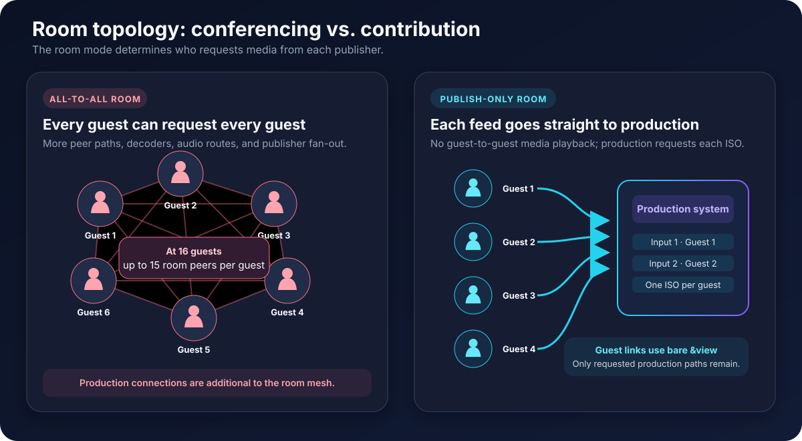
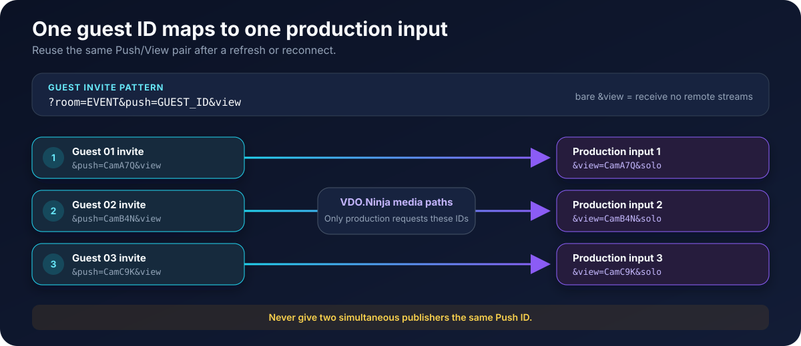

# Large production rooms with isolated guest feeds

When remote participants are primarily **contributors to a production**, do not make every guest behave like a full video-conference participant. Give each guest a unique Push ID and add a bare [`&view`](../advanced-settings/view-parameters/view.md) parameter to the invite.

```text
https://vdo.ninja/?room=EVENT_ROOM&push=GUEST_01&label=Guest%2001&view
```

The guest still publishes camera and microphone media, but does not request remote room streams. The production system requests that guest with the matching View ID:

```text
https://vdo.ninja/?view=GUEST_01&solo&room=EVENT_ROOM
```

This is the recommended starting point when each participant needs to arrive as a separate browser or web input in vMix, OBS, or similar software.


The `&view` at the end of the guest invite intentionally has **no value**. `&view=GUEST_01` would request a stream instead of enabling publish-only behavior.


## Why a normal room becomes demanding

A normal VDO.Ninja room is peer to peer. If all participants can see and hear one another, their browsers establish guest-to-guest media paths in addition to the connections requested by the director and production inputs.

With 16 guests, each guest can have up to 15 other room peers. VDO.Ninja limits the combined room-viewing video bitrate in production-style rooms by default, but a larger mesh still creates more connections, audio routes, video decoders, rendering work, and outbound publisher fan-out. A weak device or saturated connection may respond with dropped frames, latency, packet loss, or reduced production-feed quality.

The local self-preview is different: it displays the guest's own camera locally and does not download another network stream. Hiding it with [`&nopreview`](../source-settings/and-nopreview.md) may save a little display work, but it is not a meaningful bandwidth optimization.

<figure><figcaption><p>Contribution mode removes unnecessary guest-to-guest playback while keeping independently addressable production feeds.</p></figcaption></figure>

## Build stable guest and production links

### 1. Choose a room and unique stream IDs

Create one Push ID per expected position or participant. Use IDs that are difficult to guess when links may be exposed publicly.

```text
CamA7Q
CamB4N
CamC9K
```

Stream IDs are case sensitive. Do not open the same Push ID on two publishing devices at once. Use [`&label`](../general-settings/label.md) for the friendly name shown in the interface rather than relying on the ID as a display name.

### 2. Give each guest a publish-only invite

```text
https://vdo.ninja/?room=EVENT_ROOM&push=CamA7Q&label=Guest%2001&view
https://vdo.ninja/?room=EVENT_ROOM&push=CamB4N&label=Guest%2002&view
https://vdo.ninja/?room=EVENT_ROOM&push=CamC9K&label=Guest%2003&view
```

Keep any shared room access parameters consistent across the guest, director, and production links. See [How to selectively allow access](how-to-selectively-allow-access.md) before distributing links publicly.

### 3. Add matching inputs to the production system

Create one browser or web input per guest:

```text
https://vdo.ninja/?view=CamA7Q&solo&room=EVENT_ROOM
https://vdo.ninja/?view=CamB4N&solo&room=EVENT_ROOM
https://vdo.ninja/?view=CamC9K&solo&room=EVENT_ROOM
```

The important mapping is `push=CamA7Q` to `view=CamA7Q`. Reusing the same pair lets the production input recover the same guest after a refresh or reconnect without being reassigned manually.

<figure><figcaption><p>Each unique Push ID has one matching production View link.</p></figcaption></figure>

For more permanent-link, scene, and slot options, see [Permanent links, reusable invites, and stream IDs](how-to-get-permanent-links.md).

## Choose what guests should receive

Publish-only is the lightest option, but some productions need talkback or a confidence return. Choose the smallest return path that meets the event's needs.

<figure><figcaption><p>The guest invite determines whether the participant receives nothing, the directors, or director video plus room audio.</p></figcaption></figure>

| Guest requirement | Add to each guest invite | Result |
| --- | --- | --- |
| Send an isolated feed and receive nothing remote | [`&view`](../advanced-settings/view-parameters/view.md) with no value | The guest publishes only; lowest guest-side load |
| See and hear the production director, but not other guests | [`&directoronly`](../advanced-settings/video-parameters/and-directoronly.md) | Directors provide private talkback or confidence media |
| See director video while continuing group conversation audio | [`&broadcast`](../advanced-settings/view-parameters/broadcast.md) | Other guest video is blocked, but guest-to-guest audio remains active |

`&broadcast` reduces guest video load, but it is not publish-only mode. Guest-to-guest audio connections remain, and a direct director return still fans out separately to each guest.

## Recommended configurations

### Isolated contribution only

Use this when guests only need to feed the production system:

```text
https://vdo.ninja/?room=EVENT_ROOM&push=GUEST_ID&view
```

This provides the cleanest topology for a large number of independent vMix or OBS inputs.

### Contribution with private production talkback

Use this when the director must speak to guests or send a confidence video:

```text
https://vdo.ninja/?room=EVENT_ROOM&push=GUEST_ID&directoronly
```

Guests connect to directors and co-directors, but not to one another. The director's outbound media load still grows with the number of guests receiving it. See [Send an OBS return feed to guests](send-an-obs-return-feed-to-guests.md) if the return comes from the production mix.

### Panel audio with reduced video load

Use this when guests must hear the panel conversation but should not decode every panelist's video:

```text
https://vdo.ninja/?room=EVENT_ROOM&push=GUEST_ID&broadcast
```

Guests receive director video, while room audio between guests remains available. Use headphones and test echo cancellation or mix-minus routing before the event.

## What not to use as the primary fix

[`&roombitrate=0`](../advanced-settings/video-bitrate-parameters/roombitrate.md) prevents other room guests from pulling that publisher's video while leaving director and scene video available. It can help individual weak contributors, but it does not stop that guest from requesting other room feeds and does not remove guest-to-guest audio paths. Applying bare `&view` to every contribution invite is cleaner when nobody needs the room conversation.

Raising [`&totalroombitrate`](../advanced-settings/video-bitrate-parameters/totalroombitrate.md) makes the room previews look better, but increases network and decoding demand. It does not solve an unnecessary all-to-all topology. See [Video bitrate in rooms](video-bitrate-in-rooms.md) when the room genuinely needs conferencing-style video.

## Pre-event checklist

1. Confirm every guest has a different `&push` value.
2. Confirm publish-only guest links end in bare `&view`, not `&view=SOMETHING`.
3. Open each matching production View link and label the corresponding input.
4. Test reconnecting one guest and verify that the same input recovers automatically.
5. Confirm guests receive only the return path intended for their mode.
6. Test the expected number of simultaneous guests while watching guest upload, production download, and CPU/GPU load.
7. Leave network headroom; do not plan around the maximum result from a single speed test.

## Troubleshooting

### A guest sees or hears other guests

Check the invite actually contains bare `&view`. If it uses `&broadcast`, other guest video is blocked but their audio remains. Use `&directoronly` for director-only talkback or bare `&view` for no remote media.

### The production input does not find the guest

Compare the exact Push and View IDs, including capitalization. Confirm the guest completed device selection and started publishing. Do not use the same Push ID on another active device.

### Production quality falls as more inputs open

The guest mesh may be gone, but the production machine still receives and decodes every requested ISO feed. Check its inbound bandwidth, browser-input limits, hardware decoding, and CPU/GPU load. Reduce unused inputs, lower requested production bitrate, or split ingest across production machines when necessary.

### Guests need to see the final program

Use `&directoronly` or `&broadcast` with a deliberate return feed. A direct return creates one outbound path per guest; larger productions may need a relay. See [Send an OBS return feed to guests](send-an-obs-return-feed-to-guests.md).

## Related guides

* [Permanent links, reusable invites, and stream IDs](how-to-get-permanent-links.md)
* [Video bitrate in rooms](video-bitrate-in-rooms.md)
* [Send an OBS return feed to guests](send-an-obs-return-feed-to-guests.md)
* [`&view`](../advanced-settings/view-parameters/view.md)
* [`&directoronly`](../advanced-settings/video-parameters/and-directoronly.md)
* [`&broadcast`](../advanced-settings/view-parameters/broadcast.md)

## Search words

Large room, many guests, isolated guest feeds, contribution mode, publish only, publish-only guest, vMix guest inputs, OBS guest inputs, one input per guest, bandwidth, guest mesh, guests see each other, disable guest video, remote production, permanent guest links, unique Push ID.
