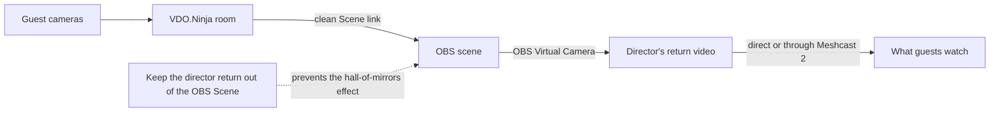
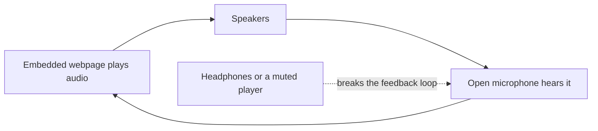

# Let guests see your finished OBS scene

This guide is for a director who brings guests into OBS with VDO.Ninja, builds a finished scene in OBS, and wants the guests to see that finished scene in their VDO.Ninja room.


**The simple version:** Put the clean VDO.Ninja Scene link in OBS, send the OBS picture back through the director's camera, and give guests a link containing `&broadcast`.




## What you need

* A VDO.Ninja room and its Director's Room
* OBS with the guest layout already added as a Browser Source
* OBS Virtual Camera
* Headphones for everyone who will speak

## 1. Use the clean Scene link in OBS

The Browser Source in OBS should use the room's clean **Scene** link, not a guest link or the Director's Room itself.

For a room named `YOUR_ROOM`, a basic Scene link is:

```text
https://vdo.ninja/?scene&room=YOUR_ROOM
```

The director is normally left out of this Scene. Keep it that way. Do not add `&showdirector`, and do not manually add the director's return video to the Mixer scene being captured by OBS.

This is what prevents the OBS picture from capturing itself over and over.

## 2. Choose what the guests should see

In OBS, open the settings beside **Start Virtual Camera**. Depending on the OBS version, the Virtual Camera can show:

* The current Program output
* The Preview output
* One chosen scene
* One chosen source

A dedicated scene named something like **Guest Return** is often the easiest choice. It can contain the guest layout, graphics, timers, or instructions without showing private producer notes.

Start OBS Virtual Camera before selecting it in VDO.Ninja.

## 3. Use the director as the return video

Open the Director's Room:

```text
https://vdo.ninja/?director=YOUR_ROOM
```

In the Director's Room:

1. Click the option to enable the director's microphone or video.
2. Select **OBS Virtual Camera** as the camera.
3. Select the director's normal microphone, or choose no microphone if the return should be video-only.

Give guests a room link containing `&broadcast`:

```text
https://vdo.ninja/?room=YOUR_ROOM&broadcast
```

With this link, guests see the main director's video instead of receiving every guest's video. Their normal room conversation audio can remain active.


Do not send the complete OBS audio mix back to the guests. They may hear themselves with a delay. The safest starting point is to let VDO.Ninja handle the microphones and use OBS Virtual Camera for the finished picture.


## 4. Optional: send the return through Meshcast 2

For a small room, the direct setup above is usually the simplest and has the least delay. As more guests join, the director must send more copies of the return video.

Meshcast can take one return feed from the director and distribute it to the guests. To use the newer Meshcast service, add `&meshcast2` to the director link:

```text
https://vdo.ninja/?director=YOUR_ROOM&meshcast2
```

The guest and OBS links stay the same:

```text
Guest: https://vdo.ninja/?room=YOUR_ROOM&broadcast
OBS:   https://vdo.ninja/?scene&room=YOUR_ROOM
```

VDO.Ninja handles the connection to Meshcast automatically. The director still selects OBS Virtual Camera in VDO.Ninja, and guests still use their normal broadcast-mode invites.


`&meshcast2` is a temporary name for selecting the newer Meshcast 2 service while Meshcast 1 is still available. When Meshcast 1 is retired, this distinction may be simplified or renamed.


Meshcast usually adds a little more delay, but it reduces the number of return-video copies the director must upload.

## Complete sample link sets

### Small room: direct return

```text
Director: https://vdo.ninja/?director=YOUR_ROOM
Guest:    https://vdo.ninja/?room=YOUR_ROOM&broadcast
OBS:      https://vdo.ninja/?scene&room=YOUR_ROOM
```

### Larger room: return through Meshcast 2

```text
Director: https://vdo.ninja/?director=YOUR_ROOM&meshcast2
Guest:    https://vdo.ninja/?room=YOUR_ROOM&broadcast
OBS:      https://vdo.ninja/?scene&room=YOUR_ROOM
```

If the room uses a password or other room options, keep those settings consistent across the director, guest, and Scene links.

## Other ways to share the return

### Use a separate return source

The main director method is easiest for guests who already use `&broadcast`. A separate return source is useful when the director wants to keep a normal camera separate from the OBS picture.

Give that source a memorable name such as `RETURN`, then point the guest links at it:

```text
Return source: https://vdo.ninja/?room=YOUR_ROOM&push=RETURN&novideo&noaudio&meshcast2
Guest:         https://vdo.ninja/?room=YOUR_ROOM&broadcast=RETURN
```

The `novideo` and `noaudio` options keep this return-source tab from also showing or playing the room.

Select OBS Virtual Camera on the return-source page. Keep the `RETURN` source out of the OBS Scene to prevent the repeating-picture effect.

This method requires the special `&broadcast=RETURN` guest link. Existing guest links containing only `&broadcast` will continue looking for the main director instead.

### Bring back an existing Meshcast stream

The newer Meshcast Studio provides a **WHEP URL** under **Watch Links**. That address can be used to bring an existing Meshcast stream into VDO.Ninja without using a webpage player.

This is useful for a show that is already publishing through Meshcast, but it is a more advanced setup. For a director starting from OBS Virtual Camera, the integrated `&meshcast2` method above is simpler and works naturally with normal `&broadcast` guest links.

### Share a webpage player

The director can select **Share Website** and paste an embeddable Meshcast, YouTube, Twitch, or other player link. This can be convenient, but it places a webpage player inside the guest's room instead of using the normal VDO.Ninja media path.



Audio from an embedded webpage may not be handled reliably by the room's echo cancellation. It can also duplicate the audio guests already hear through VDO.Ninja.

If using a shared webpage:

* Ask everyone to wear headphones.
* Mute the embedded player when VDO.Ninja already carries the audio.
* Avoid playing the same audio through both the webpage and VDO.Ninja.
* Test with two separate devices before going live.

Website sharing is generally safer for video-only material or for content where extra delay is acceptable.

### Share an OBS projector window

Another option is to open an OBS projector and share that window with VDO.Ninja's screen-share feature. It can work, but OBS Virtual Camera usually requires less window management and is easier to keep consistent.

## Prevent echo and feedback

The safest audio arrangement is:

* Every speaker wears headphones.
* VDO.Ninja carries the conversation microphones.
* OBS Virtual Camera returns the finished video.
* Only one path carries any music, clips, or other program sound.

If guests must hear sound from OBS, use a carefully prepared audio return that leaves out their microphones. This is often called a **mix-minus**. Make a private test recording and ask every guest to confirm that they do not hear a delayed copy of themselves.

## Quick fixes

| Problem | What to check |
| --- | --- |
| The picture repeats inside itself | Remove the director or `RETURN` feed from the Mixer scene captured by OBS. Make sure the OBS Browser Source uses a `?scene&room=` link without `&showdirector`. |
| Guests still see individual cameras | Make sure their invite contains `&broadcast`, or `&broadcast=RETURN` when using a separate return source. |
| Guests see no OBS return | Start OBS Virtual Camera, enable the director's video, and select OBS Virtual Camera in VDO.Ninja. |
| Guests hear themselves delayed | Stop sending the full OBS audio mix. Use headphones and keep only one audio return path. |
| A shared webpage causes echo | Mute the webpage player or use headphones. Prefer the director or Meshcast 2 return method. |
| The return has too much delay | For a small room, remove `&meshcast2` and test the direct return. |

## Related guides

* [Send an OBS return feed to guests](send-an-obs-return-feed-to-guests.md) - detailed routing and server options
* [Publish from OBS into VDO.Ninja](publish-from-obs-into-vdo.ninja.md)
* [`&broadcast`](../advanced-settings/view-parameters/broadcast.md)
* [`&meshcast`](../newly-added-parameters/and-meshcast.md)
* [How to capture an application's audio](audio.md)
