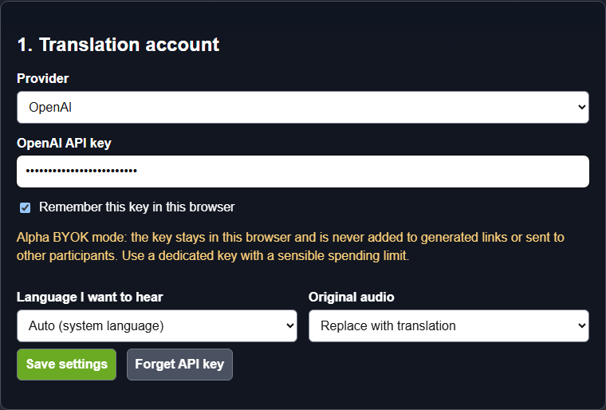
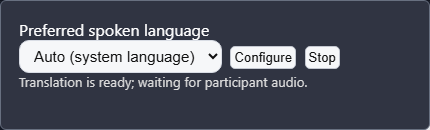

# Live audio translation

VDO.Ninja can translate live speech into another spoken language. One person supplies the translation account and API key. Everyone else joins with a normal VDO.Ninja link and can choose the language they want to hear.

This is an early alpha feature. It currently uses OpenAI's `gpt-realtime-translate` service, although the VDO.Ninja translation layer is designed so another provider can be added later.

Last reviewed: July 14, 2026.


Tell everyone in the call before enabling translation. Audio selected for translation is sent to OpenAI by the account holder's browser. Review OpenAI's privacy, retention, and billing terms before using it with private, medical, legal, financial, or confidential conversations.


## What this version does

The simplest way to think about it is that the person with the OpenAI account becomes the translation hub:

1. Each participant tells the account holder which language they want to hear.
2. The account holder's outgoing voice is translated for those participants.
3. Each participant's incoming voice is translated for the account holder.
4. Participants with the same requested language share one translated version of the account holder's voice.

It is two-way between the account holder and each participant. It does not yet translate one guest directly for another guest. In a group room, guests still receive the other guests' normal VDO.Ninja audio.

If two people select the same language, their audio is left alone. OpenAI automatically detects the language being spoken for the translation sessions that are needed.

## What you need

The account holder needs:

* A normal VDO.Ninja room, director, guest, or push link.
* An [OpenAI API account](https://platform.openai.com/) with billing enabled and access to `gpt-realtime-translate`. A ChatGPT subscription by itself is not the same as API billing.
* An OpenAI API key from the [API keys page](https://platform.openai.com/api-keys).
* A current browser with WebRTC and Web Audio support. Chrome or Edge is the safest starting point for this alpha.

Other participants do not need an OpenAI account, API key, extension, application, virtual audio cable, or translation worker.

## Set it up

### 1. Open the setup page

Go to [vdo.ninja/translate.html](https://vdo.ninja/translate.html).

If you are already in VDO.Ninja with translation enabled, open **Settings**, choose **User**, and click **Configure** beside the translation language. The setup page will remember the VDO.Ninja link you came from without placing that link in a server request.

### 2. Enter the account details

Choose **OpenAI**, paste the API key, and select the language the account holder wants to hear.

Leave **Remember this key in this browser** checked on a private computer. Turn it off on a shared computer; the key will then last only for the current browser tab session.

Choose how the original voice should sound:

* **Replace with translation** plays only the translated voice.
* **Keep quietly underneath** plays the original voice quietly beneath the translation.
* **Play both** plays the original and translated voices together.

Click **Save settings**.

<figure><figcaption>
The key field is masked. The generated links never contain the key.
</figcaption></figure>

### 3. Make the account-holder link

Paste the account holder's normal VDO.Ninja link into **Normal account-holder link**. This can be a director link, a reusable room link, or another link that person normally uses.

Copy the generated **Translation-enabled account-holder link**, or click **Save and open**.

The generated link adds translation settings but not the API key. The key stays in that browser.

### 4. Make the participant link

Choose the participant's starting language, then paste the normal guest or participant invite into **Normal participant link**. Leave it on **Auto** when you want each participant's browser or operating-system language to be used.

Copy the generated **Translation-ready participant link** and send it to the participants. It contains a preferred-language setting but no API key and no OpenAI account information.

The same reusable participant link can be sent again later.

### 5. Join and test

Open the account-holder link in the browser where the API key was saved. Ask the participant to open their participant link.

Use headphones for the first test. Have each person say a short sentence, then pause. Translation is streamed while they speak, but it is not instantaneous.

For a real event, test names, numbers, dates, technical terms, accents, overlapping speech, and every language pair you plan to use.

## Choosing a language inside VDO.Ninja

The default is **Auto**, which uses the browser or operating system language. A participant can change it without visiting the setup page:

1. Open **Settings**.
2. Choose **User**.
3. Change **Preferred spoken language**.

<figure><figcaption>
The small User setting is the only in-room translation interface.
</figcaption></figure>

The supported output choices in this alpha are English, Spanish, Portuguese, French, Japanese, Russian, Chinese, German, Korean, Hindi, Indonesian, Vietnamese, and Italian.

## URL options

Everything needed during a call can be configured by URL. The setup page is only a link generator.

| Option | Purpose | Example |
| --- | --- | --- |
| `&translate=1` | Makes this browser the translation account holder | `&translate=1` |
| `&translatelang=` | Language this person wants to hear | `&translatelang=es` |
| `&translationprovider=` | Translation provider | `&translationprovider=openai` |
| `&translateaudio=` | Original-audio mode: `replace`, `duck`, or `mix` | `&translateaudio=duck` |

Account-holder example:

`https://vdo.ninja/?director=ROOMNAME&translate=1&translatelang=en&translationprovider=openai&translateaudio=replace`

Participant example:

`https://vdo.ninja/?room=ROOMNAME&translatelang=es`

Do not add an API key to a URL. VDO.Ninja does not support an API-key URL option.

## Privacy and API-key security

Normal VDO.Ninja media continues to use VDO.Ninja's usual media paths. The account holder's browser creates additional direct WebRTC connections to OpenAI for only the audio tracks that need translation.

For incoming participant speech, the participant first sends audio to the account holder through VDO.Ninja. The account holder's browser then sends a copy of that audio to OpenAI. This is why participant notice and consent matter.

The API key:

* Is entered only in the account holder's browser.
* Is sent directly to OpenAI to create short-lived translation credentials.
* Is not sent to VDO.Ninja's server or to other room participants.
* Is not placed in generated links.
* Is stored in browser local storage when **Remember** is checked, or tab session storage when it is not.


OpenAI's production guidance recommends creating short-lived browser credentials on a trusted server instead of keeping a standard API key in browser storage. This alpha deliberately offers direct bring-your-own-key mode so VDO.Ninja remains serverless and easy to try. Use a dedicated API project/key, set sensible spending limits, do not use an administrator key, and click **Forget API key** when using a computer you do not control.


## Cost and session count

OpenAI charges the account that owns the key. Check the current [model and pricing information](https://developers.openai.com/api/docs/models/gpt-realtime-translate) before a long event.

VDO.Ninja avoids translating the same account-holder stream repeatedly when several participants request the same language. It reuses one output translation per requested language.

Incoming participant tracks stay separate. If five participants need translation into the account holder's language, that can require five incoming translation sessions. More participants and more distinct languages therefore cost more.

## Audio controls and recording

Translated audio stays inside the existing VDO.Ninja media elements and audio path:

* Per-participant volume and speaker mute continue to apply.
* Muting the account holder's microphone also mutes the translated outgoing tracks.
* Active-speaker and Web Audio processing continue to use the selected playback audio.
* A local recording of a remote participant records the audio currently being played for that participant. Wait for translation to become active before starting the recording if the recording should contain translated audio.
* VDO.Ninja delays a translation track swap until an already-running local recording stops. It also refuses a language change while a remote local recording is active, preventing the browser's `MediaRecorder` from being broken by a track-set change.

## Latency and lip sync

Speech translation necessarily arrives after the original speaker starts talking. In **Replace** mode, the translated voice can therefore trail the video. **Duck** and **Mix** modes can sound like an echo because the original voice arrives first.

This alpha does not automatically delay video to match translated audio. Automatic audio/video synchronization may be explored later, but it would add latency and needs real-world testing before becoming a default.

## Stopping or recovering

Click **Stop** in **Settings** → **User** to close translation sessions and restore original audio. **Configure** reopens the setup page. **Forget API key** removes the saved key from the browser.

If OpenAI ends or loses a live session, VDO.Ninja temporarily restores original audio and tries to reconnect the affected translation. A failed API key, unavailable model, exhausted account, or unsupported language cannot be repaired automatically; correct the account or language setting and reload the link.

## Troubleshooting

### It says an API key is needed

The account-holder link was opened in a browser that does not have the key. Open **Configure**, enter the key, save it, and reopen the account-holder link.

### The guest hears the original voice

Check that:

* The account holder used the link containing `&translate=1`.
* The participant used a link containing `&translatelang=`.
* The two people did not select the same language.
* The API account has billing and access to `gpt-realtime-translate`.

### Guests cannot understand one another

That is a current design limit. This first version translates between the account holder and each participant, not every guest-to-guest path in a mesh room.

### The translated voice is behind the video

Some delay is expected. Try short phrases and avoid people talking over one another. There is not yet automatic video delay for lip synchronization.

## Technical reference

OpenAI describes the model, WebRTC browser flow, one-session-per-output-language pattern, and separate-track approach for conversational calls in its [Realtime translation guide](https://developers.openai.com/api/docs/guides/realtime-translation).
