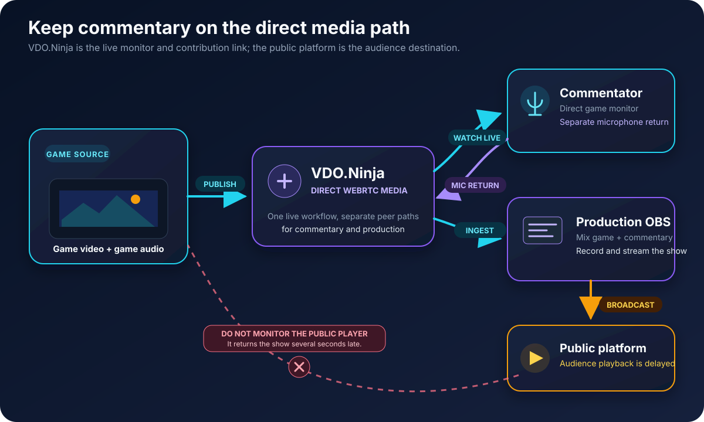
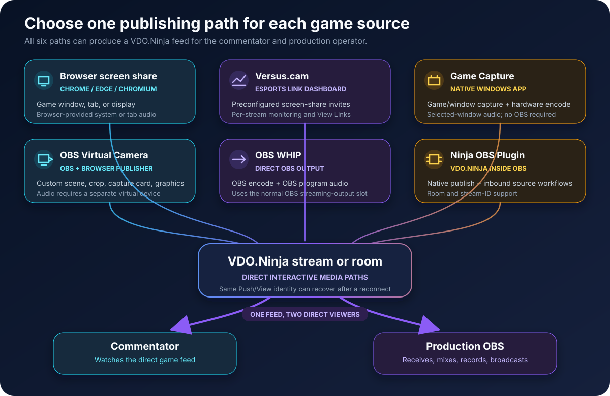

# Low-latency game streaming for esports commentary

VDO.Ninja can send gameplay directly to a remote commentator and a production computer with much less delay than a public Twitch or YouTube player. The commentator watches the direct VDO.Ninja feed, while OBS combines the game and commentary for the audience.


No Internet video path has literally zero latency. Capture, encoding, network transit, decoding, and the display each add some delay. The practical goal is a direct interactive feed: do not ask the commentator to monitor the delayed public broadcast.


<figure><figcaption><p>The commentator follows the direct feed. Only the audience watches the public platform output.</p></figcaption></figure>

## The basic signal flow

There are three separate jobs:

1. A game computer, observer computer, or console capture computer publishes the gameplay and game audio.
2. The commentator watches that direct feed in VDO.Ninja and publishes their microphone back as a separate source.
3. The production computer receives the game and commentator sources in OBS, builds the show, and streams the finished program to the public platform.

Keeping the game and commentator microphone as separate sources gives the OBS operator independent level, mute, recording, and sync control.

## A simple room setup

This browser-only workflow is enough for one gameplay feed and one or more commentators:

1. On [VDO.Ninja](https://vdo.ninja/), create a private room and open its Director Control Center.
2. Send the room's guest invite to the game sender. They select **Share your Screen**, choose the game window or display, and enable shared audio when the browser offers it.
3. Send a guest invite to the commentator. They select their microphone and use headphones, then watch the gameplay inside the room.
4. In the director room, add the gameplay screen share and commentator to a scene, or copy their individual solo links.
5. Add the scene or solo links to OBS as Browser Sources. Enable **Control audio via OBS** for sources whose audio OBS must mix.

Chrome or another Chromium-based desktop browser exposes the broadest screen-share and system-audio choices. Browser security requires the game sender to confirm what is shared; a prepared link cannot silently capture a screen.

## The Versus.cam setup

[Versus.cam](https://versus.cam/) is a VDO.Ninja interface focused on esports contribution. It creates Chrome screen-share invites with gameplay-oriented settings and gives the operator a simple dashboard with a View Link for each incoming stream.

1. Enter a private room name and password at [Versus.cam](https://versus.cam/).
2. Select **Copy Invite Link** and send it to each game sender.
3. Each sender opens the link in Chrome or Edge, selects the game window or display, and shares its audio.
4. Copy each stream's **View Link** into OBS and give the required direct View Link to the commentator.
5. Carry the commentator microphone and private producer talkback in a normal VDO.Ninja room or [Comms](https://comms.cam/).

Versus.cam contribution links are designed for one-way game ingest; they do not turn the game senders into an open conference. This keeps the game workflow simple, while the commentary/intercom path remains separate.

## Choose a publishing method

Each row below is a complete way to get a game source into VDO.Ninja. They are options, not steps that must be combined.

| Publishing method | What the sender does | Game audio | Main constraints |
| --- | --- | --- | --- |
| Normal browser screen share | Opens a VDO.Ninja invite and shares a game window, browser tab, or display | Uses the browser's available tab/system-audio option | No install; capture and audio choices vary by browser, operating system, and game |
| [Versus.cam](https://versus.cam/) | Opens an esports-oriented invite and shares through Chrome/Chromium | Uses the browser's screen-share audio | Adds an operator dashboard and preconfigured game-stream links; commentary/talkback stays separate |
| [Game Capture](https://vdo.ninja/gamecapture) | Selects a Windows game, app window, camera, or Spout2 source and goes live | Can capture the selected window's audio without a virtual cable | Windows only; download from the [latest release](https://github.com/steveseguin/game-capture/releases/latest) |
| OBS Virtual Camera | Captures the game or capture card in OBS, starts Virtual Camera, then selects it in a VDO.Ninja publisher | Virtual Camera is video-only; route audio with an OBS monitor and virtual audio device | Uses OBS plus a browser, but does not consume OBS's normal streaming-output slot |
| OBS WHIP output | Captures and mixes in OBS, then publishes to VDO.Ninja from OBS's WHIP service | Carries the OBS program audio | Uses OBS's streaming output; network/NAT and multi-viewer behavior require testing |
| [Ninja OBS Plugin](https://steveseguin.github.io/ninja-obs-plugin/) | Publishes an OBS output through the VDO.Ninja service, or receives a VDO.Ninja source in OBS | Carries the OBS mix when publishing | Install the release matching the installed OBS version; publishing uses OBS's active streaming-output slot |
| HDMI capture card | Connects a console or observer output to a computer, then selects the card in VDO.Ninja, Game Capture, or OBS | Depends on the card and selected publishing path | Use the card's passthrough for local play rather than playing from a delayed capture preview |

<figure><figcaption><p>Choose one publishing path for each game source. The resulting VDO.Ninja feed can serve both commentary and production.</p></figcaption></figure>

### Normal Chrome screen share

This path needs no software beyond the browser. Sharing **Entire Screen** can produce a steadier high frame rate on some systems, while sharing a window exposes less of the desktop. Test the exact game: anti-cheat systems, exclusive fullscreen modes, GPU selection, and browser capture behavior can cause a black frame or a lower frame rate.

If the game audio checkbox is unavailable, use [application-audio routing](audio.md), Game Capture, or an OBS-based path. The [1080p screen-share guide](how-to-screen-share-in-1080p.md) covers high-frame-rate links and quality controls.

### Game Capture on Windows

[Game Capture](using-game-capture-with-vdo.ninja.md) is a native Windows publisher. A player can select the game or app window, its audio, a hardware encoder, and VDO.Ninja stream/room details without running OBS. It also supports cameras and Spout2 sources.

The app can reuse one HD encode for multiple viewers, but direct VDO.Ninja viewers still create separate network paths. A commentator plus a production receiver therefore requires more sender upload than one receiver alone.

### OBS Virtual Camera

This path works when OBS must crop a game, combine a capture card and graphics, or build a dedicated contribution scene. Start OBS Virtual Camera, select it as the VDO.Ninja camera, and select a virtual audio device as the microphone if the OBS mix must travel with it.

Virtual Camera carries video only. Keep the detailed [OBS-to-VDO.Ninja Virtual Camera guide](publish-from-obs-into-vdo.ninja.md) open while setting up audio, and prevent the contribution scene from capturing its own VDO.Ninja return.

### OBS WHIP

OBS can publish its encoded video and program audio directly to VDO.Ninja:

1. In OBS, open **Settings -> Stream** and select **WHIP**.
2. Set the server to `https://whip.vdo.ninja`.
3. Use a private, unique stream token as the Stream Key.
4. Open `https://vdo.ninja/?whip=YOUR_STREAM_TOKEN` on the receiving side.
5. Start streaming in OBS.

WHIP removes the browser publisher and Virtual Camera from this path. It uses OBS's normal streaming output, so a computer that must also stream the finished show needs a deliberately tested second-output arrangement or a separate contribution OBS. See [From OBS to VDO.Ninja using WHIP](from-obs-to-vdo.ninja-using-whip.md) and [OBS WHIP output settings](obs-whip-output-settings.md) for the current compatibility and network caveats.

### Ninja OBS Plugin

The [Ninja OBS Plugin](using-ninja-obs-plugin-with-vdo.ninja.md) adds a VDO.Ninja streaming service and VDO.Ninja sources directly to OBS. It can publish an OBS composition with VDO.Ninja room/stream semantics, and it can receive feeds without manually managing a separate browser window.

This is distinct from WHIP. The plugin speaks the VDO.Ninja workflow directly, including room and multi-viewer behavior. Its publishing mode uses the active OBS stream-output slot; its native receive mode is still marked experimental, while its browser-backed receiver follows the normal VDO.Ninja viewing path.

## Reusable standalone links

For a small setup that does not need a room, make one private game stream ID and one private commentator stream ID. Replace every example value before use.

Game sender using browser screen share:

```text
https://vdo.ninja/?push=GAME01&screenshare&quality=0&screensharestereo#p=STRONGPASSWORD
```

Direct game monitor for the commentator and the production Browser Source:

```text
https://vdo.ninja/?view=GAME01&videobitrate=10000&scale=100#p=STRONGPASSWORD
```

Commentator microphone publisher:

```text
https://vdo.ninja/?push=CASTER01&miconly#p=STRONGPASSWORD
```

Commentator audio input for OBS:

```text
https://vdo.ninja/?view=CASTER01&solo#p=STRONGPASSWORD
```

Use unique, hard-to-guess IDs and a strong password. Do not run two simultaneous publishers with the same Push ID. If the producer must speak privately to the commentator, use a room or [Comms](../steves-helper-apps/comms.md) rather than adding producer talkback to the public program mix.

## Prevent echo and doubled audio

Audio routing is usually the part that needs the most rehearsal:

* The game source should carry game audio, not Discord, Comms, or the commentator's returned voice.
* The commentator should wear headphones and publish their microphone once.
* OBS should capture each game and voice source once. Mute duplicate room, desktop, or public-player audio.
* Private producer talkback should stay out of the show mix unless it is intentionally placed on air.
* The commentator should mute the Twitch/YouTube player or avoid opening it on the commentary computer.

If the game sender and commentator must talk to each other, a normal VDO.Ninja room provides the simplest two-way path. For a larger crew with private channels, use [Comms](../steves-helper-apps/comms.md).

## Keep delay low without destroying quality

* Use the direct VDO.Ninja view for commentary; a public platform player is normally many seconds later.
* Use wired Ethernet where practical and leave upload headroom above the configured video bitrate.
* Give the game and capture/encoder enough GPU headroom; limiting the game's frame rate can help an overloaded system.
* Do not add `&buffer` to a commentator's view unless smoother playback is more important than added delay.
* Normal WebRTC mode is the low-delay starting point. Buffered or chunked modes intentionally trade more delay for resilience.
* A direct publisher sends media separately to each active viewer. Count the commentator, production OBS, confidence monitors, and backups when checking upload capacity.
* For detailed 1080p60 gameplay, plan around the [12-20 Mbps upload range described in the screen-share guide](how-to-screen-share-in-1080p.md#bandwidth-requirements), then verify the real route with [VDO.Ninja's speed test](https://vdo.ninja/speedtest). This is a test target, not a guarantee.

The commentator's viewing bitrate and the production bitrate do not need to match. Production may request the full-quality feed while the commentator uses a lighter direct monitor if their connection is weaker.

## Show-day checklist

1. Test the exact game and capture mode; menus or test videos do not expose every fullscreen or anti-cheat issue.
2. Confirm the game sender sees the correct source and that game audio reaches OBS.
3. Confirm the commentator watches only the direct VDO.Ninja feed and hears no delayed duplicate.
4. Confirm the commentator microphone reaches OBS as a separate source.
5. Record a local OBS sample and check sync, frame rate, clarity, and audio levels.
6. Disconnect and reconnect each sender once; permanent Push/View IDs should recover into the same OBS inputs.
7. Test with every planned viewer open at the same time so publisher upload fan-out is realistic.
8. Keep a second capture option ready, such as browser screen share, Game Capture, or OBS, if the primary method cannot capture that game.

## Related guides

* [How to screen share in 1080p](how-to-screen-share-in-1080p.md)
* [Using Game Capture and Spout2 with VDO.Ninja](using-game-capture-with-vdo.ninja.md)
* [Using the Ninja OBS Plugin with VDO.Ninja](using-ninja-obs-plugin-with-vdo.ninja.md)
* [Publish from OBS into VDO.Ninja](publish-from-obs-into-vdo.ninja.md)
* [From OBS to VDO.Ninja using WHIP](from-obs-to-vdo.ninja-using-whip.md)
* [PlayStation or Xbox to VDO.Ninja](playstation-or-xbox-to-vdo.ninja.md)
* [How to capture application audio](audio.md)
* [Send an OBS return feed to guests](send-an-obs-return-feed-to-guests.md)

