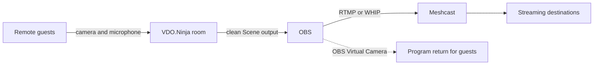

# Host a guest panel on a Mac with OBS and Meshcast

This guide is for a host who wants to bring remote guests into OBS, arrange them into a panel, let them see the finished program, and stream the show to one or more platforms.


**The simple version:** VDO.Ninja brings in the guests. OBS builds the show. Meshcast or your usual streaming service sends the finished show to the audience.





Keep the OBS Program return out of the VDO.Ninja Scene captured by OBS. Otherwise, the program captures itself and creates an endless hall-of-mirrors effect.


## Before you start

You need:

* A Mac running current OBS Studio. For the most compatible Virtual Camera on Mac, use **OBS 30 or newer on macOS 13 or newer**.
* A [VDO.Ninja room](../getting-started/rooms/README.md) for the guests.
* A Meshcast account if you want RTMP ingest or multi-destination restreaming.
* Headphones for every person who will speak.
* At least one private or unlisted destination for the rehearsal.

### Choose sensible Mac settings

| Mac | Recommended starting point |
| --- | --- |
| Apple silicon (M1, M2, M3, M4, or newer) | Apple VT H.264 hardware encoder, 1080p30 or 720p30 |
| Intel Mac | x264 at 720p30, 2,500–3,500 Kbps, preset `veryfast` |

If an Intel Mac reports encoding lag, try `superfast` or `ultrafast`. These presets use less CPU but reduce picture quality at the same bitrate. RTMP is usually the simplest workflow on an Intel Mac, but it does not turn x264 into hardware encoding.

For WHIP, OBS may switch the **audio** encoder from AAC to FFmpeg Opus. That message does not necessarily mean the H.264 video encoder changed. See [OBS WHIP output settings](obs-whip-output-settings.md) and [hardware-accelerated video encoding](hardware-accelerated-video-encoding.md).

## 1. Create the room and guest links

Open VDO.Ninja, choose **Create a Room**, and open the Director's Room. Send each guest a separate invite link and ask them to wear headphones.

Give regular guests stable seats by adding a unique preferred slot to each invite:

```text
Guest 1: https://vdo.ninja/?room=YOUR_ROOM&slot=1
Guest 2: https://vdo.ninja/?room=YOUR_ROOM&slot=2
Guest 3: https://vdo.ninja/?room=YOUR_ROOM&slot=3
```

Add `&slotmode` to the director link, or keep **Assign a slot to new guests automatically** enabled in the Mixer. Do not give two guests the same slot link. A preferred slot cannot be occupied by two people at once.

Read more about [`&slot`](../advanced-settings/settings-parameters/and-slot.md) and the [VDO.Ninja Mixer](../steves-helper-apps/mixer-app.md).

## 2. Build the panel layout

Open the Mixer from the director room and create the layout you want. Use the numbered slots as permanent seats for recurring guests.

For a mix of landscape cameras and vertical phone video:

* Make the portrait slot taller or slightly wider.
* Use **Cover** when filling the frame matters more than showing every edge.
* Use the per-slot crop controls to remove empty space.
* Test with a real phone before the show.


The automatic group layout is convenient, but a custom Mixer layout gives you predictable sizing for portrait guests.


## 3. Add the clean Scene output to OBS

In the Mixer, copy the clean **Scene/output link intended for OBS**. Do not copy the Mixer control-page URL.

In OBS:

1. Add a **Browser Source**.
2. Paste the clean Scene/output link.
3. Match its width and height to the OBS canvas, normally 1920 × 1080 or 1280 × 720.
4. Enable **Control audio via OBS** if that option is shown.
5. Confirm the source moves an OBS audio meter, then make and listen to a short recording.

One mixed Scene source is simpler than loading every guest separately. Avoid loading the same guest in multiple browser sources because every duplicate creates another connection.

See [How to get permanent links](how-to-get-permanent-links.md) for reusable Scene URLs.

## 4. Return the finished program to guests

In OBS Virtual Camera settings, choose **Program**, then start **OBS Virtual Camera**.

<figure><figcaption><p>OBS Virtual Camera can return Program, Preview, a scene, or a source.</p></figcaption></figure>

Use the director as a performer and select **OBS Virtual Camera** as the director camera. Keep that return publisher **Unset** in the Mixer so it is not included in the Scene captured by OBS.

Add `&broadcast` to each **guest invite**, not to the director or Scene link:

```text
https://vdo.ninja/?room=YOUR_ROOM&slot=1&broadcast
```

Guests still publish their camera and microphone to the director, but receive the director's Program video instead of every guest video.

<figure><figcaption><p>Broadcast mode returns the director's video while guest conversation audio can remain active.</p></figcaption></figure>

OBS Virtual Camera carries video, not the OBS audio mix. The safest starting setup is:

* VDO.Ninja handles conversation audio.
* OBS Virtual Camera returns Program video only.
* Every speaker wears headphones.

If guests must hear clips or music from OBS, create a separate media-only return bus using a virtual audio device. Exclude **all host and guest microphones** from that return. Never send the full Program audio mix back into the room.

For more routing options, see [Send an OBS return feed to guests](send-an-obs-return-feed-to-guests.md) and [`&broadcast`](../advanced-settings/view-parameters/broadcast.md).

## 5. Send OBS to Meshcast

For the least-fussy Mac workflow, start with RTMP.

1. In the Meshcast dashboard, copy the complete RTMP URL. It resembles `rtmp://host:1935/live/pk_example`.
2. In OBS, open **Settings → Stream** and choose **Custom**.
3. Put the URL only through `/live` in **Server**, such as `rtmp://host:1935/live`.
4. Put the private `pk_...` Publishing Key in **Stream Key**.
5. Use H.264 video, AAC audio, CBR rate control, and a two-second keyframe interval.
6. Start streaming.


Never share a private `pk_...` Publishing Key. Public watch links use the public `st_...` Stream ID instead.


To send the show to several platforms, configure the destinations in Meshcast **before** starting OBS. For Restream.io or another provider, choose a custom destination and enter the RTMP or RTMPS URL and key supplied by that provider. Destination availability depends on the Meshcast account tier.

You can also keep your existing streaming provider as the OBS destination. VDO.Ninja and the OBS guest-panel workflow do not require Meshcast.

## Rehearsal checklist

* [ ] Every speaker is wearing headphones.
* [ ] Each guest enters the expected slot.
* [ ] Portrait guests are large enough and not awkwardly cropped.
* [ ] Guests can see the OBS Program return.
* [ ] The Program return is not visible as a tile in the OBS Scene.
* [ ] Nobody hears a delayed copy of their own voice.
* [ ] **View → Stats** in OBS shows no encoding lag or dropped network frames.
* [ ] A private destination receives both picture and sound.

## Quick fixes

| Problem | Fix |
| --- | --- |
| The picture repeats inside itself | Remove the Program-return publisher from the VDO.Ninja Scene captured by OBS. |
| A guest enters the wrong frame | Give every seat a unique `&slot=N` invite and make sure the requested slot is free. |
| A phone guest looks tiny | Use a custom Mixer layout with a taller portrait slot and adjust Cover or crop. |
| A guest hears an echo | Use headphones and do not return the full OBS audio mix to the room. |
| The Mac gets hot or OBS reports encoding lag | Close unused browser sources, use 720p30, lower bitrate, and use Apple VT H.264 on Apple silicon or a faster x264 preset on Intel. |
| OBS rejects the Meshcast WHIP URL | Confirm OBS **Service** is WHIP, not Custom RTMP, and use the private Publishing Key as the Bearer Token. |

