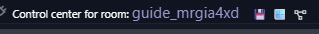
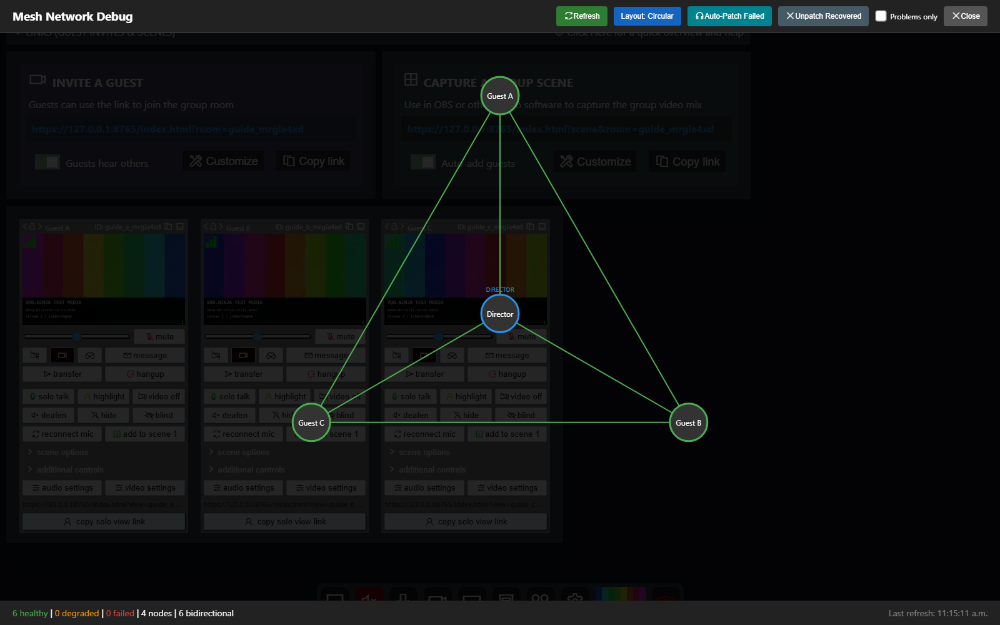
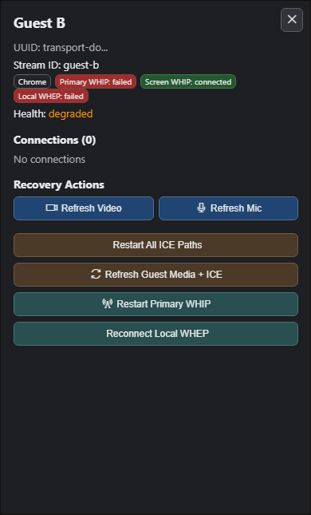
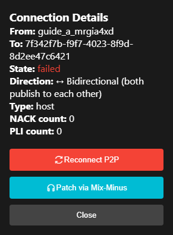
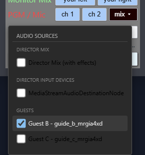

# Recover Missing Guest-to-Guest Audio

VDO.Ninja rooms normally use separate peer-to-peer paths between participants. One direction can fail while every other direction keeps working. This guide shows directors how to identify that case, restore audio with a custom mix, inspect the Mesh Network Debug view, and rebuild the affected connection.

## Quick diagnosis: A cannot hear B, but C can

Suppose:

* C can hear B.
* A can hear C.
* A cannot hear B.

B's microphone is working because C receives it. A's speaker output is working because A hears C. The fault is therefore specific to the **B to A path** or to playback of B's track at A. Refreshing B's microphone is unlikely to be the first useful action.

If moving A from the shared Wi-Fi to a hotspot fixes the problem, suspect the local network path: an unusable LAN ICE candidate, access-point isolation, a guest Wi-Fi/VLAN rule, a local firewall, or a browser/network-interface interaction. A VPN is not a conclusive test because WebRTC may still select a direct LAN candidate or the VPN may not carry WebRTC UDP traffic.

## Live-show recovery order

Use the least disruptive action first:

1. Open **Mesh Network Debug** and refresh its data.
2. For a B to A failure, select **B** and use **ICE Restart**. Wait 5 to 10 seconds, then refresh the diagram.
3. If it is still broken, use **ICE Restart** on **A**.
4. If the show must continue, send B to A through A's **Mix** control.
5. After the show, reload B and then A one at a time. If the problem returns, test both guest links with `&relay`.

Use **Refresh Mic** on B only when nobody can hear B or B's local microphone meter has stopped. Use **Refresh All** only when restarting B's microphone, camera, and peer connections together is acceptable.

## Open Mesh Network Debug

In the director control center, select the mesh/network icon beside the room name. The full-screen Mesh Network Debug view opens and requests a connection map from each guest. Select **Refresh** after guests have finished joining or after any recovery action.

<figure><figcaption>
Select the connected-nodes icon beside the room name to open Mesh Network Debug.
</figcaption></figure>

<figure><figcaption>
A reviewed four-node test room. The six green lines mean that every merged peer connection reported connected; they do not prove that every audio direction is flowing.
</figcaption></figure>

### Read the diagram

| Display | Meaning |
| --- | --- |
| Blue-outlined circle | Director |
| Green-outlined circle | Guest whose reported peer connections are connected |
| Orange-outlined circle | Guest with a new, connecting, disconnected, or closed connection |
| Red-outlined circle | Guest with a failed connection |
| Gray-outlined circle | Guest that reported no connections |
| Purple square | Scene or view-only connection |
| Solid green line | Reported `RTCPeerConnection.connectionState` is connected |
| Dashed orange line | Connecting, disconnected, new, or closed |
| Dashed red line | Failed |
| Cyan double-dashed line | Marked as patched through the director's mix-minus path |
| Arrow | The tool saw only one publishing direction |

Select a guest node to see its browser, TURN badge, reported connections, and recovery controls. Select a line to see the merged connection details and any edge actions.


A green line proves only that the peer connection reports `connected`. It does not prove that audio is present, increasing, or audible. The current diagram merges A to B and B to A reports into one edge, so it can also hide which direction is bad.


### Node recovery controls

| Action | What it currently does | When to use it |
| --- | --- | --- |
| **Refresh Mic** | Re-captures the selected guest's microphone | Nobody can hear that guest, or their mic capture stopped |
| **Refresh Video** | Re-captures the selected guest's camera | Camera is frozen or missing |
| **ICE Restart** | Requests ICE restarts for all of that guest's P2P connections | A path is failed, disconnected, or stalled |
| **Refresh All** | Refreshes mic, video, and ICE | Less targeted actions failed and a broad interruption is acceptable |
| **Restart WHIP** | Restarts that guest's WHIP output | Only for a guest publishing through WHIP/MediaMTX/Meshcast-compatible output |

**ICE Restart is guest-wide, not edge-specific.** For a B to A failure, start with B because B is the publisher for the missing direction. It may briefly disturb B's other connections.

<figure><figcaption>
Select a guest node to inspect its reported connections and open the guest-wide recovery actions.
</figcaption></figure>

## Reconnect peers safely

The current **Reconnect P2P** edge button is not a complete reconnect. It tells one endpoint to close the matching peer connection, but it does not create a replacement connection afterward. Avoid that button in a live room until it is fixed.

<figure><figcaption>
A staged failed-edge example. Use the panel to identify the endpoints, but avoid Reconnect P2P until its replacement-connection path is fixed.
</figcaption></figure>

Use this sequence instead:

1. Select the sender node and click **ICE Restart**.
2. Wait 5 to 10 seconds and click **Refresh** in the toolbar.
3. Select the receiver node and click **ICE Restart** if needed.
4. If media capture itself is broken, use **Refresh Mic** or **Refresh All** on the sender.
5. If the path still does not return, have the sender reload their page. Reload the receiver next if required.
6. Rejoin both affected guests with a TURN recovery or forced-relay option if the same pair fails again.

Do not use **Hangup** as a reconnect button. It intentionally removes the guest and requires them to join again.

## Emergency audio patch: send B to A with Mix

The per-guest **Mix** control is the most targeted current fallback for a one-way failure because you can relay only the missing source to the listener. It is still an emergency workaround, not a transparent replacement for the direct path.

The director must already have an outbound P2P connection with an audio sender to the listener. The Mix control can be visible even when no replaceable outbound audio sender exists; in that case it cannot inject the relay. Test this workflow before relying on it live.

1. In the director control center, find **A's** guest card. A is the listener who is missing audio.
2. Expand **Additional Controls**.
3. Scroll to **PGM / Mic** and select **Mix**.
4. Under **Guests**, enable **B**.
5. Disable **Director Mix** and leave other guests disabled unless A also needs those sources relayed.
6. Ask A to confirm that B is audible.

<figure><figcaption>
Example B-to-A emergency route: open Guest A's Mix, disable Director Mix, select Guest B, and leave Guest C disabled.
</figcaption></figure>

The target guest is automatically excluded from their own return mix, which prevents A from hearing A through the director.


The normal direct guest-to-guest track is not removed. Include only the missing source. If the B to A direct path recovers while B is still selected in A's custom mix, A may hear B twice. Uncheck B to stop relaying that source, then verify A's audio because the current control does not reliably restore the director's original outbound track.


Opening the Mix menu enables the custom mix and may immediately replace the director's outbound audio track with the currently selected sources. Closing the menu only hides it; it does not disable the custom mix. There is currently no reliable one-click reset to the original director track. If the routing state becomes unclear, reload the affected guest connection or the director after the production.

### Whole-room `&mixminus`

For a planned director-hosted N-1 workflow, add `&mixminus` (or `&mm`) to the **director URL before joining**:

`https://vdo.ninja/?director=ROOM&mixminus`

The director then attempts to build a custom return for every guest containing the director and the other guests, excluding the recipient. This still requires an active director audio context and outbound audio sender for each recipient. Do not add this flag only to guest links.

This flag does not remove the normal guest-to-guest P2P audio paths. Test the complete routing before a production so direct and relayed copies do not create doubled audio.

## Patch via Mix-Minus in the mesh view

When a guest-to-guest line reports `failed` or `disconnected`, selecting it exposes **Patch via Mix-Minus**. The toolbar's **Auto-Patch Failed** action applies the same operation to every failed or disconnected guest-to-guest edge.

Use an edge patch only when both directions are unusable or when a short-lived emergency bridge is more important than possible doubled audio. The current patch:

* relays both directions through the director, even if only one direction failed;
* leaves the original direct tracks in place;
* marks the line cyan immediately without confirming that replacement audio reached either guest; and
* does not reliably restore the director's original outbound audio track when **Remove Patch** is selected.

For a one-way B to A failure, prefer A's per-guest **Mix** panel and select only B.

## Bypass a bad local path

Apply connection flags to the **affected guest links**, not only to the director link.

### Automatic recovery with TURN escalation

For the complete opt-in recovery bundle, use this on both A and B:

`&autorecover=1`

This enables adaptive disconnect timing, automatic TURN escalation, and WHEP fallback signaling when WHIP/WHEP settings exist. It keeps direct P2P as the first choice; TURN is used only after recovery escalates and only when usable TURN servers are configured.

If you want only automatic TURN escalation without the rest of that bundle, use `&autorelay=1`. Do not combine it with `&autorecover=1`; `autorecover` already enables the same relay behavior.

### Force TURN relay

If the same pair continues to fail, test both guest links with:

`&relay`

Example:

`https://vdo.ninja/?room=ROOM&relay`

TURN usually adds latency and consumes relay bandwidth, but it bypasses the direct A to B LAN route. For an audio-only room, the bandwidth cost is comparatively small.

If UDP itself appears blocked or unstable, test:

`&relay&tcp`

TCP can add more latency and should be a fallback, not the first test.

### Other targeted checks

* Test `&ipv6=0` on A and B if the router has unreliable IPv6. Current VDO.Ninja builds already prefer IPv4 by default, so treat this as a diagnostic test.
* Disable guest-network or AP/client isolation on the Wi-Fi access point.
* Confirm A and B are not separated by a mesh-node VLAN, extender guest mode, or a second router.
* Mark the local network as trusted/private in the operating-system firewall, or temporarily test with the local firewall/security product disabled.
* Try current Chrome/Edge and Firefox without extensions.
* Test one device over Ethernet to the same main router.

## What to record for a useful bug report

Capture the direction, not just "audio failed":

| Test | Result |
| --- | --- |
| A hears B | yes/no |
| B hears A | yes/no |
| A hears C | yes/no |
| C hears A | yes/no |
| B hears C | yes/no |
| C hears B | yes/no |

Also record:

* the browser and operating system for each guest;
* whether the affected guests share a router, access point, extender, or VLAN;
* whether the mesh node or edge shows host, server-reflexive, or TURN relay candidates;
* whether **ICE Restart**, a page reload, `&relay`, or `&relay&tcp` changes the result; and
* a `chrome://webrtc-internals` dump from the listener when possible.

If inbound audio bytes for B increase at A while B remains inaudible, investigate A's playback element, output device, mute state, and Web Audio path. If the bytes do not increase, investigate the B to A transport, sender track, and ICE route.

## Related


[audio-over-vdo.ninja-isnt-working.md](../common-errors-and-known-issues/audio-over-vdo.ninja-isnt-working.md)



[and-relay.md](../general-settings/and-relay.md)



[handling-guest-disconnects-and-connection-recovery.md](handling-guest-disconnects-and-connection-recovery.md)

