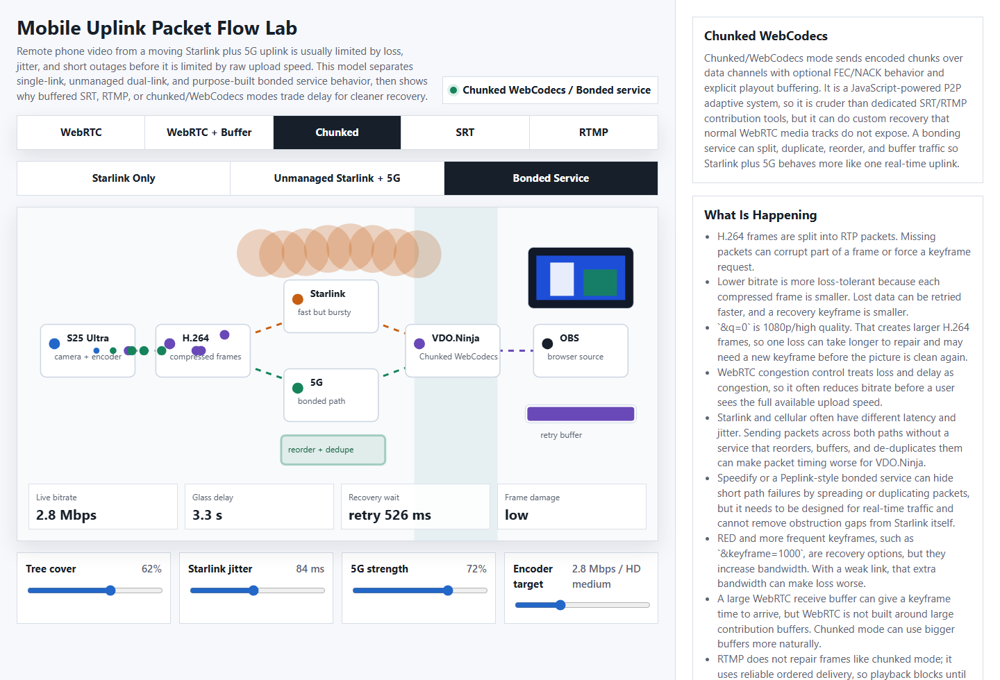

# Mobile uplinks with Starlink, cellular, and bonded networks

This guide is for remote mobile video feeds, such as a phone camera on a moving Starlink Roam plus 5G uplink, received in OBS with a VDO.Ninja browser source.

The short version:

> For mobile Starlink, the problem is often packet timing, packet loss, and short outages before it is raw upload bandwidth.

VDO.Ninja's normal media path is WebRTC. WebRTC is built for low latency, so it reacts quickly when packets arrive late or disappear. That is good for conversation, but it can make video quality collapse on a moving uplink with tree cover, Starlink jitter, or cellular handoffs.

Use the [Mobile Uplink Packet Flow Lab](https://vdo.ninja/misc/mobile-uplink-packet-flow.html) to visualize the tradeoffs between plain WebRTC, buffered WebRTC, chunked/WebCodecs, SRT, RTMP, and different bonded-network paths.

Use the [Unstable Connection Builder](https://vdo.ninja/misc/unstable-connection-builder.html) to generate matching push/view URLs for normal WebRTC, chunked/WebCodecs, audio recovery, Meshcast, relay tests, and local iframe simulation.



## Why a high bitrate can still look bad

`&outboundvideobitrate=7000` sets a sender-side target/default bitrate. It does not force the browser to keep sending 7000-kbps through loss, jitter, or congestion.

If the browser sees network trouble, WebRTC congestion control can reduce bitrate sharply. In bad cases, the viewer may see a low-bitrate image even though a speed test shows enough average upload.

`&q=0` or `&quality=0` targets 1080p/high quality. That creates larger compressed video frames. Larger H.264 frames need more packets, so one burst of packet loss can damage more of the picture and take longer to recover.

Lower bitrate and smaller frames can survive lossy links better because:

* each frame contains less data;
* missing packets can be retried faster;
* recovery keyframes are smaller;
* the congestion controller has more headroom before it hits the real link limit.

This is why a 720p30 feed at 2500 to 4000-kbps can sometimes look better than a 1080p feed targeting 7000-kbps over a moving Starlink path.

## Why H.264 damage can linger

H.264 video depends on keyframes and predicted frames. If a predicted frame is damaged, later frames can also look wrong until the decoder receives a clean reference again.

WebRTC already requests a fresh keyframe automatically whenever it detects loss or corruption, so it recovers on its own much of the time. That recovery is time-limited, though: if a packet arrives too late for low-latency playback, the frame may still be dropped or shown damaged.

If damage lingers for several seconds after a dropout instead of clearing quickly, you can force a periodic keyframe. `&keyframe` is a **viewer-side** option: you put it on the OBS/view link, and it asks the remote phone to send keyframes at that interval.

```text
&keyframe=2000
```

Do not treat this as a default quality setting. A keyframe is the largest frame type, so forcing them often spends bandwidth and sends big bursts that are themselves vulnerable to loss. On a weak uplink, too-frequent keyframes can make congestion and loss worse, not better.

Use it only as a targeted fix for lingering damage, and start at `&keyframe=2000`. Drop to `&keyframe=1000` only if 2000 still does not clear damage fast enough and you have confirmed the bond has bandwidth headroom to spare. Values under about 1000 ms cause a steep quality drop and may not work at all.

## Bonding is not one single thing

Do not treat every "bonded" connection as equivalent.

There is a major difference between:

* **load balancing:** each connection/session is assigned to one path;
* **failover:** one path is active and another takes over after failure;
* **throughput bonding:** packets are split across multiple links and reassembled by a tunnel/server;
* **redundant bonding:** packets are duplicated over multiple links and the first good copy is used;
* **real-time smoothing/FEC:** extra bandwidth is spent to reduce loss, jitter, or short gaps.

RTMP, SRT, and WebRTC do not all benefit from those modes in the same way.

### RTMP/TCP-style traffic

RTMP commonly runs over a reliable ordered transport such as TCP. When data is lost, delivery blocks until the missing data is recovered. That often protects the encoded video from corruption, but it can create stalls and latency.

For RTMP, raw throughput bonding and TCP-friendly recovery can work well if the bonded tunnel is stable. A few seconds of delay is often acceptable for program contribution.

### WebRTC/real-time UDP traffic

WebRTC is timing-sensitive. A packet that arrives late can be nearly as useless as a packet that never arrives.

For WebRTC, the bonding layer must preserve real-time behavior. It needs to manage packet timing, reordering, duplication, loss, and jitter without adding too much queueing delay.

This matters because Starlink and cellular often have different latency and jitter. Sending different packets over Starlink and 5G without a service that reorders, buffers, and de-duplicates them can make timing worse.

For WebRTC, a "good" bonded setup is not just the one with the highest speed-test number. It is the one with the lowest useful packet loss, stable jitter, and a tunnel endpoint close enough to avoid adding avoidable round-trip time.

## Peplink, Speedify, and other bonding options

### Peplink / SpeedFusion-style hardware

Peplink SpeedFusion has separate features for bandwidth bonding, smoothing, and hot failover. Peplink describes bandwidth bonding as packet-level aggregation, smoothing as using redundant packets to reduce packet loss and jitter, and hot failover as maintaining sessions when a link drops.

For live WebRTC-style traffic, the relevant features are usually the real-time ones: smoothing, loss handling, failover behavior, traffic rules, and where the SpeedFusion endpoint is located.

For RTMP/SRT contribution, aggregate throughput and stable failover can also matter, since those workflows can usually tolerate more buffering.

Peplink-style hardware can be a strong option when you need router-level control, external antennas, multiple WANs, traffic steering, and the ability to use your own SpeedFusion endpoint or a provider endpoint. The configuration matters. A generic failover setup is not the same as a real-time bonded tunnel.

### Speedify-style software bonding

Speedify is software-based bonding. Its modes are not interchangeable:

* Speed Mode focuses on aggregate throughput.
* Redundant Mode sends packets over multiple connections and uses the first copy that arrives, trading data use and battery for reliability.
* Streaming/Enhanced Streaming mode prioritizes real-time streams and can switch behavior based on network conditions.
* Transport mode also matters; UDP transport is generally the better fit for latency-sensitive use than forcing everything through TCP.

Speedify can be useful on a phone or laptop because it is easy to deploy, but the selected mode, server location, per-link priority, and per-link quality still matter. If the selected Speedify server is far away, or if Starlink and 5G have very different latency, the tunnel can add delay or reassembly overhead.

### Server and endpoint location

Bonding normally requires a reassembly point. With Speedify, that is a Speedify server. With Peplink, it might be SpeedFusion Connect, SpeedFusion Cloud, or your own FusionHub/SpeedFusion endpoint. With a managed broadcast system, it may be the provider's cloud receiver.

That endpoint location matters.

For WebRTC, the media path is timing-sensitive. If the bonded tunnel exits far from the receiver, TURN server, relay, office, or media ingest point, the added path can increase round-trip time and make keyframe requests, retransmits, and congestion control slower.

For RTMP and SRT, a few extra milliseconds are often less important than clean recovery, but the endpoint still affects latency, throughput, and how quickly retransmits complete.

When comparing bonding providers or modes, compare the whole path:

* phone to each uplink;
* each uplink to the bonding endpoint;
* bonding endpoint to the office, relay, Meshcast/SRT/RTMP ingest, or OBS receiver;
* packet loss, jitter, and latency during movement.

### Broadcast bonding systems

Dedicated broadcast systems, such as hardware or cloud workflows built around bonded contribution, are often designed around a known latency budget and a managed receiving endpoint. These can be better suited to remote production than a generic VPN-style bond, especially when the goal is a clean program feed rather than direct two-way interaction.

The tradeoff is cost, complexity, and usually more latency.

## Options to test in VDO.Ninja

Use unique stream IDs and room names in the examples below.

### Option 1: Stable low-latency WebRTC

Use this when interaction matters and the uplink is imperfect.

Phone/push link:

```text
https://vdo.ninja/?push=STREAMID&q=1&fps=30&codec=h264&outboundvideobitrate=2500
```

OBS/view link:

```text
https://vdo.ninja/?view=STREAMID&bitrate=2500&buffer=500
```

This gives up some sharpness so the stream has more room to survive loss and jitter. If you find that damage lingers for seconds after a dropout, add `&keyframe=2000` to this view link (see [Why H.264 damage can linger](#why-h-264-damage-can-linger)).

### Option 2: Higher-quality WebRTC when the bond is clean

Use this only when packet loss is low and the bonded service is stable.

Phone/push link:

```text
https://vdo.ninja/?push=STREAMID&q=0&fps=30&codec=h264&outboundvideobitrate=4000
```

OBS/view link:

```text
https://vdo.ninja/?view=STREAMID&bitrate=4000&buffer=1000
```

If this is stable, you can test higher bitrates. If the stream starts smearing, freezing, or dropping to very low bitrate, reduce the target before raising it again. As above, only add `&keyframe=2000` to the view link if post-dropout damage is slow to clear.

### Option 3: More receive-side buffer for OBS

Use this when a little extra delay is acceptable.

```text
&buffer=1000
```

or:

```text
&buffer=3000
```

This is added to the OBS/view link. It can give WebRTC more time to smooth jitter and receive a recovery keyframe. It is still browser-managed WebRTC buffering, so it is not the same as a dedicated contribution buffer. Very large WebRTC buffers are not a good fit for most browser-source workflows.

### Option 4: Advanced normal-WebRTC reliability knobs

Use this when you need to stay on the normal low-latency WebRTC media path, but the link has short random packet loss or jitter. These settings do not turn WebRTC into SRT, and they cannot hide multi-second outages, but they can make a marginal mobile uplink more stable.

Phone/push link:

```text
https://vdo.ninja/?push=STREAMID&q=1&fps=24&width=1280&height=720&outboundvideobitrate=2500&maxvideobitrate=2500&maxbandwidth=70&contenthint=motion
```

OBS/view link:

```text
https://vdo.ninja/?view=STREAMID&codec=vp8&vred&videobitrate=2500&buffer=500&audiobuffer=120&degrade=maintain-framerate&keyframe=3000
```

What to test:

* `&buffer=500` or `&buffer=1000` is usually the first WebRTC knob for jitter. It gives late packets and keyframe recovery a little more time before playback needs the frame.
* `&codec=vp8&vred` asks WebRTC negotiation to prefer VP8 with RED support. RED is useful to test for short random loss, but the browser still decides whether to send redundancy or FEC packets. It is not a fixed FEC percentage that VDO.Ninja can force from JavaScript.
* Test VP8 first when experimenting with RED/FEC. Chromium's WebRTC stack has code paths that disable RED+ULPFEC combinations in some cases, including payloads such as H.264 when NACK is enabled. H.264 may still be the better practical choice on phones when hardware encoding, battery, heat, or compatibility matter more than experimenting with RED.
* Keep NACK, PLI, and congestion control enabled. Do not add `&nonack`, `&nopli`, or `&noremb` when the goal is reliability.
* `&maxbandwidth=70` leaves about 30% headroom against the estimated available sender bandwidth. On unstable mobile links, leaving headroom can look better than chasing the highest possible bitrate.
* `&degrade=maintain-framerate` asks the sender to preserve frame rate and reduce resolution first when constrained. This is often better for motion. For screen sharing or text, `&degrade=maintain-resolution` may be better, but it can make motion less smooth.
* `&keyframe=3000` is still only a recovery aid for lingering damage. If keyframes make the link bursty, remove it or raise the interval.

Browser support and limits:

* WebRTC capabilities are browser-specific. The WebRTC specification includes RTX, RED, and FEC entries in RTP codec capabilities when a browser supports them, but pages need to work from the browser's advertised capabilities rather than assume every engine exposes the same set.
* Modern browsers support codec preference APIs, but older OBS Browser Source / CEF builds, old mobile browsers, and some embedded browsers can lag behind current Chrome or Firefox.
* `jitterBufferTarget`, the newer receiver-side buffer API, is marked by MDN as limited availability and is capped at 4000 ms. VDO.Ninja only applies it when the browser exposes it; otherwise it falls back to older browser delay hints where available.
* If you need several seconds of repair time, use chunked/WebCodecs, SRT, RTMP, or a proper bonded/smoothing path instead of trying to make normal WebRTC buffer indefinitely.

Best fit:

* short random packet loss: try VP8 + RED, keep NACK/PLI on, and leave bitrate headroom;
* high jitter or packet reordering: increase `&buffer` first;
* burst loss or handoffs: use a bonded path with smoothing/redundancy, or move to chunked/SRT/RTMP with more latency;
* phone heat or hardware encoder stability: H.264 at a lower bitrate may beat VP8 even if VP8 is better for RED testing.


[vred.md](../advanced-settings/view-parameters/vred.md)


### Option 5: Chunked/WebCodecs mode

Use this when OBS can tolerate more delay and you want a more buffered, recovery-oriented VDO.Ninja path.

Phone/push link:

```text
https://vdo.ninja/?push=STREAMID&chunked=2500&chunkprofile=balanced&chunkedbuffer=6000
```

OBS/view link:

```text
https://vdo.ninja/?view=STREAMID&chunkbuffer=1500&chunkbufferfloor=1000&chunkbufferceil=4000&chunkjitterslack=500&chunkadapt=hybrid
```

Chunked mode is JavaScript-powered and uses encoded chunks over data channels. It is cruder than dedicated SRT/RTMP contribution systems, but it gives VDO.Ninja control over buffering and recovery behavior that normal WebRTC media tracks do not expose.

Use Chromium-based browsers for this path.

### Option 6: SRT or RTMP through a relay

Use this when the cleanest program feed matters more than sub-second latency.

SRT is built for unreliable networks with configurable latency and packet recovery. It uses a recovery window, so more latency can mean more time to repair missing packets.

RTMP is widely supported and commonly uses reliable ordered delivery. It usually avoids partially corrupted video frames by waiting for missing data, but that can create blocking and delay.

For VDO.Ninja-adjacent workflows, [Meshcast](https://app.meshcast.io) can be tested as a relay/contribution path when SRT or RTMP is a better fit than browser-to-browser WebRTC.

## Phone and encoder notes

On a Samsung S25 Ultra or similar phone, watch for heat, battery, and background app behavior. A high bitrate target does not help if the phone thermal-throttles or the encoder becomes unstable.

`&h264profile` can change H.264 encoder/profile behavior, but it is not a bonding or packet-loss fix by itself. Test it separately from network changes so you know whether it helped compatibility or made the phone work harder.

`&nomobilebitratecap` can remove VDO.Ninja's mobile sender bitrate safety cap. Only use it when you have already proven the phone, encoder, and uplink are stable enough for the higher target.

## Field test checklist

Test each path while moving, not just while parked.

For each test, write down:

* Starlink-only result;
* cellular-only result;
* bonded result;
* bonding mode;
* bonding server or endpoint region;
* VDO.Ninja push URL parameters;
* VDO.Ninja OBS/view URL parameters;
* OBS browser-source latency;
* visible artifacts: bitrate collapse, smearing, freezes, audio drops, or long delay.

Do not judge by speed test alone. Watch packet loss, jitter, recovery time, and the actual OBS recording.

## Related VDO.Ninja settings


[video-bitrate-for-push-view-links.md](video-bitrate-for-push-view-links.md)



[how-do-i-control-bitrate-quality.md](how-do-i-control-bitrate-quality.md)



[and-outboundvideobitrate.md](../advanced-settings/video-bitrate-parameters/and-outboundvideobitrate.md)



[and-maxvideobitrate.md](../advanced-settings/video-bitrate-parameters/and-maxvideobitrate.md)



[and-maxbandwidth.md](../advanced-settings/video-bitrate-parameters/and-maxbandwidth.md)



[codec.md](../advanced-settings/view-parameters/codec.md)



[buffer.md](../advanced-settings/view-parameters/buffer.md)



[keyframerate.md](../advanced-settings/view-parameters/keyframerate.md)



[and-chunked.md](../newly-added-parameters/and-chunked.md)



[and-chunkedbuffer.md](../advanced-settings/newly-added-parameters/and-chunkedbuffer.md)



[packet-loss.md](../common-errors-and-known-issues/packet-loss.md)



[handling-guest-disconnects-and-connection-recovery.md](handling-guest-disconnects-and-connection-recovery.md)


## External references

* [Speedify Bonding Mode Overview](https://support.speedify.com/article/870-bonding-mode)
* [Speedify Transport Mode Overview](https://support.speedify.com/article/882-transport-mode)
* [Speedify Streaming Prioritization Overview](https://support.speedify.com/article/1010-speedify-streaming-prioritization-overview)
* [Peplink SpeedFusion Bonding & Failover Technology](https://www.peplink.com/technology/speedfusion-bonding-technology/)
* [Haivision SRT introduction](https://doc.haivision.com/SRT/1.5.3/Haivision/introduction-to-srt)
* [Adobe RTMP Chunk Stream specification](https://ossrs.net/lts/en-us/assets/files/rtmp_specification_1.0-25a467618b92a3115bc97d4b0038b0ff.pdf)
* [W3C WebRTC RTP parameters and capabilities](https://www.w3.org/TR/webrtc/#rtcrtpparameters)
* [MDN RTCRtpTransceiver.setCodecPreferences](https://developer.mozilla.org/en-US/docs/Web/API/RTCRtpTransceiver/setCodecPreferences)
* [MDN RTCRtpReceiver.jitterBufferTarget](https://developer.mozilla.org/en-US/docs/Web/API/RTCRtpReceiver/jitterBufferTarget)
* [WebRTC RFC 8854: Forward Error Correction Requirements](https://www.rfc-editor.org/info/rfc8854/)
* [Chromium WebRTC RED/ULPFEC sender logic](https://chromium.googlesource.com/external/webrtc/+/master/call/rtp_video_sender.cc)
