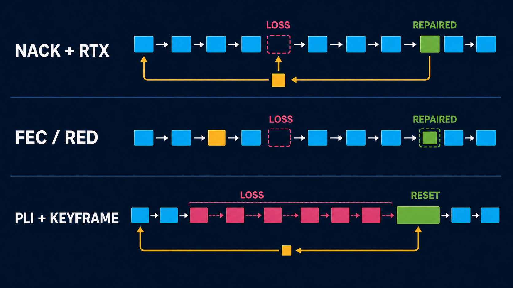
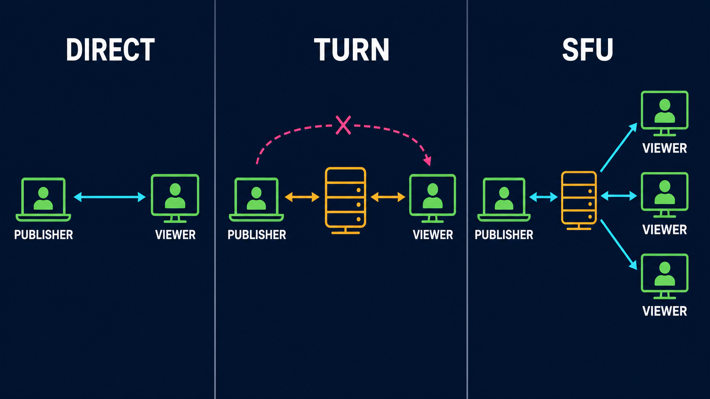
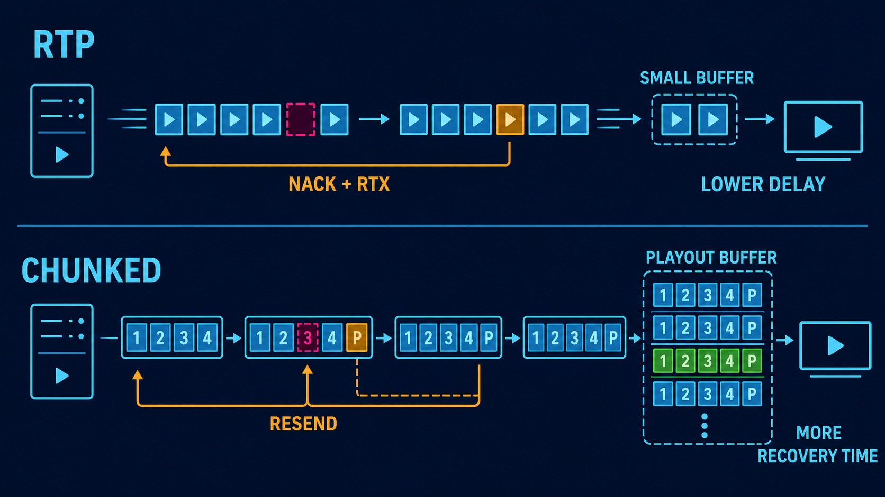

# Packet-loss recovery and resilient media

Packet loss can produce several different failures: a brief soft frame, a frozen picture, persistent green or rainbow-coloured corruption, missing audio, or a complete disconnect. No single switch fixes all of them.

The useful question is which layer failed:

* **Capacity:** the encoder is producing more data than the path can carry.
* **Delivery:** individual RTP packets are missing, late, or reordered.
* **Decode state:** a lost reference frame has damaged later predicted frames.
* **Route:** the direct path or NAT traversal is failing.
* **Fan-out:** one publisher is encoding or uploading separately to too many viewers.
* **Application:** the capture, encoder, decoder, audio clock, or CPU is overloaded.

This guide explains the normal VDO.Ninja browser path first, then compares it with OBS Studio's native WHIP output, Game Capture, and the Ninja OBS Plugin.

## Fast recommendations

For fast-moving gameplay where player names must remain readable, start with:

* 1280x720 at 30 fps;
* H.264 for the broadest native-tool compatibility;
* a bitrate that stays below the **sustained** upload rate, not the speed-test peak;
* a one-to-two-second keyframe interval;
* no B-frames;
* NACK and PLI left enabled;
* at least 25-40% uplink headroom for audio, retransmissions, keyframes, and normal rate variation.

For a browser publisher:

```text
https://vdo.ninja/?push=STREAMID&quality=1&fps=30&prefervideocodec=h264&outboundvideobitrate=2500&maxvideobitrate=3000
```

For its viewer or OBS Browser Source:

```text
https://vdo.ninja/?view=STREAMID&codec=h264&videobitrate=2500&buffer=500&keyframe=1000
```

Treat these as starting values. If the clean path is sharp but the image becomes rainbow-coloured only during loss, the main problem is damaged decoder references. If it is always soft, the problem is more likely bitrate, resolution, capture scaling, or encoder quality.

For text-heavy 1080p gameplay, lower 60 fps to 30 fps before forcing the bitrate too low. A 1080p30 stream can preserve small names better than 720p60 at the same rate, but it still needs a path that can sustain it. No recovery mode can preserve detail that the encoder removed before transmission.

An encoder's **profile** or CPU preset is not packet-loss protection. A slower preset can improve compression when the CPU has headroom. If it causes encoder overload, dropped frames, or an unstable frame cadence, use a faster preset. H.264 High profile can improve compression, but every receiver must support it; it does not repair missing packets.

## What each approach actually does

| Approach | Layer | Default in normal VDO.Ninja RTP | Main benefit | Main cost or limitation |
| --- | --- | --- | --- | --- |
| Congestion control | Capacity | Yes, browser controlled | Reduces rate before queues collapse | Quality or frame rate can fall sharply |
| Jitter buffer and concealment | Playback | Yes, browser controlled | Hides small timing variation and isolated audio loss | Adds delay and cannot rebuild arbitrary missing video |
| NACK | Feedback | Yes when negotiated | Requests specific missing RTP sequence numbers | Recovery takes at least one feedback round trip |
| RTX | Retransmission | Normally negotiated by browsers for video | Resends only what was requested on a separate RTP repair stream | Uses burst bandwidth and can arrive too late |
| PLI and keyframes | Decoder reset | Yes | Clears persistent reference-frame corruption | Does not restore the missing interval; keyframes are large |
| Opus in-band FEC | Audio repair | Normally enabled when supported | Repairs an earlier audio frame without another network round trip | Adds audio overhead and only covers limited loss patterns |
| RTP RED | Proactive redundancy container | Not forced | Can carry earlier payload data with a current packet | Extra bandwidth; support and actual use are browser controlled |
| Video ULPFEC | Proactive parity | Not forced | Can reconstruct some missing video packets without waiting for a resend | Extra bandwidth and limited control from JavaScript |
| Forced TURN | Route | No; direct-first automatic escalation is enabled | Replaces a blocked or poor direct route | Adds a server hop; does not itself repair packets |
| SFU / Meshcast | Topology | No | Publisher uploads once while the server distributes | Adds a server dependency and another media hop |
| Chunked mode | Buffered alternate media path | No | Adds explicit playout buffering, indexed frames, parity, selective resend, pacing, and adaptation | More latency and a narrower compatibility range |

<figure><figcaption><p>Reactive retransmission waits for feedback. Proactive redundancy spends bandwidth before loss. A PLI and keyframe reset the decoder, but do not restore the damaged interval.</p></figcaption></figure>

### RED is not simply "send the whole video twice"

RED is an RTP payload container. It can place a current payload and one or more earlier payloads into a later packet. The sender decides what redundant data to include.

Audio RED commonly carries the previous Opus generation and can approach twice the normal audio bitrate. Video RED is more complicated: browsers may pair the RED container with parity data, may use little redundancy, or may decline to send repair data after it was negotiated. VDO.Ninja's normal video RED flags change negotiation preference; they do not force a duplicate stream or a fixed repair percentage.

By comparison:

* **RTX** sends a missing packet only after a NACK.
* **FEC** sends parity or repair information before the receiver asks.
* **TURN** forwards the same connection through a relay.
* **An SFU** receives one upstream and distributes it to downstream viewers.
* **Chunked parity** adds one XOR parity payload for each configured group of data payloads.

## Normal VDO.Ninja RTP mode

Normal browser-managed RTP is the default. It has the widest browser, room, OBS Browser Source, TURN, and native-peer interoperability.

The normal defaults are:

* browser congestion control and bitrate estimation;
* browser jitter buffering;
* video NACK, RTX, and PLI where both peers negotiate them;
* Opus packet-loss concealment and normally Opus in-band FEC;
* direct ICE first, with bounded automatic TURN escalation after a hard direct-path failure;
* no forced video RED rate;
* no forced TURN;
* no SFU;
* no chunked media path.

The browser owns most of this behavior. VDO.Ninja can preserve, remove, or reorder SDP feedback and payload preferences, but it cannot force every browser to use a particular repair percentage.

### NACK and RTX

A NACK identifies missing RTP sequence numbers. With normal browser peers, video RTX usually carries the requested media again using an associated repair payload type and repair stream. The receiver maps it back to the original packet before decoding.

**Advantages**

* Little steady-state overhead on a clean path.
* Repairs only packets that the receiver noticed were missing.
* Well supported between current browsers.

**Disadvantages**

* A useful resend must return before the playout deadline.
* At high RTT, the resend may arrive after the frame has already been skipped.
* Loss caused by congestion can make the resend burst worsen the same congestion.
* A long outage can exceed the sender's retransmission history.

There is no normal `&rtx=1` switch. Leave NACK enabled and compatible browsers negotiate RTX themselves. `&nonack` and `&nonacks` remove NACK feedback and are primarily diagnostic options:

```text
https://vdo.ninja/?view=STREAMID&nonack
```

Do not add them when the goal is better reliability.

A viewer buffer gives late original packets and retransmissions more time:

```text
https://vdo.ninja/?view=STREAMID&buffer=1000
```

The tradeoff is about one second of additional playout latency. A buffer does not add bandwidth or guarantee that a retransmission cache is long enough.

### PLI, keyframes, and rainbow corruption

Most video codecs predict later frames from earlier decoded frames. If a lost packet damages an important reference, later packets can arrive perfectly and still decode as green blocks, rainbow smears, duplicated regions, or a frozen image.

A Picture Loss Indication asks the sender for a new keyframe. NACK tries to restore the missing packet; PLI gives up on the damaged prediction chain and starts a clean one.

PLI is normally enabled. `&nopli` disables it for diagnostics and generally makes loss recovery worse.

The viewer can request periodic keyframes:

```text
https://vdo.ninja/?view=STREAMID&keyframe=1000
```

`&keyframe`, `&keyframerate`, `&keyframeinterval`, and `&fki` are aliases, in milliseconds.

**Advantages of a shorter interval**

* Bounds how long unrepairable corruption can remain visible.
* Helps late viewers and decoders that missed their initial keyframe.

**Disadvantages**

* Keyframes are much larger than predicted frames.
* A keyframe burst can cause fresh loss on a nearly full uplink.
* More frequent keyframes spend bitrate on repeated full images, leaving less for motion detail.

One second is a useful gameplay and WHIP test. Two seconds is a more conservative general setting. Avoid making every frame a keyframe unless the encoder and network budget were designed for that tradeoff.

### Opus concealment and in-band FEC

Opus can conceal a missing audio packet from nearby decoded audio. With in-band FEC, a later Opus packet can also contain lower-rate information for an earlier frame.

VDO.Ninja normally negotiates Opus in-band FEC where supported. `&nofec` disables that SDP setting:

```text
https://vdo.ninja/?view=STREAMID&nofec
```

That is useful for a controlled comparison, not as the normal reliability choice.

In-band FEC works best for isolated loss and suitable packet sizes. It cannot cover a long burst, and the encoder may only produce useful FEC after the receiver reports loss. Packet-loss concealment can hide a short gap but may sound muffled or synthetic.

VDO.Ninja also has experimental audio payload-ordering flags: `&redaudio` and `&fecaudio` on a viewer, with `&predaudio` and `&pfecaudio` as publisher-side companions. They only influence how advertised RED or ULPFEC payloads are ordered beside the selected audio codec. They do not create repair data when the runtime does not support or send it. Explicitly selecting audio RED is easier to verify.

### Audio RED

Audio RED is the most direct VDO.Ninja RED experiment. Use the publisher-side preference and viewer-side selection together:

```text
https://vdo.ninja/?push=STREAMID&preferaudiocodec=red
https://vdo.ninja/?view=STREAMID&audiocodec=red
```

Both endpoints must advertise compatible RED and Opus payloads. Confirm the negotiated codec and actual audio bitrate in stats.

**Advantages**

* The redundant earlier audio can be available immediately when the current packet arrives.
* It is less RTT-dependent than NACK.
* Speech can remain intelligible through isolated packet loss.

**Disadvantages**

* Audio bandwidth can approach double.
* Extra traffic can make a saturated uplink worse.
* Browser and embedded-runtime support varies.
* High-bitrate stereo and pro-audio combinations need testing; VDO.Ninja limits some RED combinations to keep them stable.

For an unreliable network, compressed Opus with FEC or RED is usually safer than uncompressed PCM. PCM has no codec concealment and consumes much more bandwidth.

### Video RED and ULPFEC

Use `&vred` on the viewer and `&pvred` as its publisher-side companion:

```text
https://vdo.ninja/?push=STREAMID&prefervideocodec=vp8&pvred
https://vdo.ninja/?view=STREAMID&codec=vp8&vred&buffer=500
```

VP8 is the best first comparison for this experiment. The flags prefer video RED in SDP when the runtime advertises it. The browser still decides whether it will send RED or ULPFEC repair traffic and how much.

**Advantages**

* Repair data can arrive without waiting for a NACK round trip.
* Can help short random loss when the uplink has spare capacity.

**Disadvantages**

* The URL flags do not force a protection rate.
* H.264 and some browser combinations may not use the negotiated repair payloads.
* Repair overhead competes with encoded picture quality.
* Native senders and receivers in the comparison later in this guide do not provide equivalent video RED recovery.

Run an A/B test with the same codec, resolution, bitrate, route, RTT, and loss pattern. Negotiating RED is not proof that useful repair packets were sent.

### Codec choice

Changing codec can improve compression efficiency, hardware use, or decoder behavior, but it is not a replacement for loss recovery.

* **H.264** is the safest common choice for OBS WHIP, the Ninja publisher, Game Capture, and browser viewers.
* **VP8** is a useful browser baseline and the first choice for a video RED experiment.
* **VP9 or AV1** may preserve more detail at the same bitrate, but encoder load and native receiver support are narrower.
* A more efficient inter-frame codec can still propagate damage after a lost reference.

If names are unreadable on a clean link, try a more efficient supported codec, reduce frame rate, or raise bitrate within measured headroom. If only damaged frames are unreadable, focus on loss, retransmission, and keyframe recovery.

## TURN: change the route, not the repair method

TURN relays encrypted peer traffic when direct connectivity is blocked or the relay route is better. The endpoints still perform NACK, RTX, PLI, FEC, congestion control, and decoding across that connection.

VDO.Ninja is direct-first by default. `autoRelay` is enabled, so a hard-failed direct connection receives an initial recovery attempt followed by bounded TURN escalation. This is connection recovery, not continuous route optimization for modest packet loss.

Force TURN with:

```text
https://vdo.ninja/?push=STREAMID&relay
https://vdo.ninja/?view=STREAMID&relay
```

`&relay`, `&private`, and `&privacy` are aliases. Forced relay mode caps normal video targets at 4000 kbps, or 6000 kbps in speed-test mode.

Force a non-UDP TURN candidate set with:

```text
https://vdo.ninja/?push=STREAMID&relay&tcp
https://vdo.ninja/?view=STREAMID&relay&tcp
```

`&tcp` filters the TURN choices but does not itself force TURN. Pair it with `&relay`.

Disable automatic escalation only for a controlled test:

```text
&autorelay=0
```

**TURN can help when**

* restrictive NAT or firewall policy blocks a direct connection;
* the direct Internet route has a persistent problem and the relay takes a cleaner route;
* privacy policy requires hiding peer addresses from one another.

**TURN cannot**

* repair local Wi-Fi loss before packets reach the relay;
* create upload capacity;
* combine two Internet connections;
* distribute one upload to many independent peers;
* transcode an over-complex stream.

TURN adds server bandwidth cost and usually adds RTT. TURN/TCP or TURN/TLS can cross restrictive networks, but loss on a reliable byte stream may become head-of-line delay instead of a visibly missing packet.

## SFU and Meshcast: change the topology

An SFU receives one encoded upstream and forwards it to multiple viewers. Unlike a TURN relay, it is aware of RTP streams and normally terminates feedback independently on each leg.

In VDO.Ninja, add `&meshcast` to the publishing guest or director link:

```text
https://vdo.ninja/?push=STREAMID&meshcast
```

For a room:

```text
https://vdo.ninja/?room=ROOM&push=STREAMID&meshcast
```

The current app also has a `&meshcast2` path. Treat it as a separate implementation to test, not as an error-correction flag.

**Advantages**

* One publisher upload can serve many viewers.
* One publisher encode avoids per-viewer encoder pressure.
* A server can maintain separate loss recovery and pacing toward each viewer.
* A single slow viewer is less likely to pressure every other direct peer.

**Disadvantages**

* The publisher-to-SFU uplink is still a single point of media loss.
* Adds a server hop, operating cost, and dependency.
* Server location affects RTT and loss.
* End-to-end behavior depends on the SFU's packet cache, feedback, and forwarding implementation.
* It does not make an excessive source bitrate sustainable on the publisher's uplink.

Use an SFU when fan-out is the problem. Use TURN when connectivity or routing is the problem. Those can overlap, but they are not interchangeable.

<figure><figcaption><p>Direct media stays between peers. TURN changes the route for the same one-to-one connection. An SFU accepts one publisher upload and distributes it to multiple viewers.</p></figcaption></figure>

### WHIP is session setup, not packet repair

WHIP establishes a send-only media session with an HTTP endpoint. WHEP does the corresponding job for receiving from a server. The media is still RTP, so loss behavior depends on what the publisher, server, and receiver negotiate and implement.

A WHIP endpoint may terminate media in an SFU and provide TURN servers, but WHIP by itself does not promise RTX, RED, FEC, transcoding, a packet-cache duration, or downstream viewer repair. Check the actual server and client implementation.

## Chunked mode: explicit buffering and frame-aware recovery

Chunked mode replaces RTP video publishing with encoded video payloads sent over an ordered, reliable data channel. It is opt-in and keeps the normal RTP default unchanged.

<figure><figcaption><p>Normal RTP favors lower delay and has less time to repair a packet before playback. Chunked mode deliberately holds more media so parity and selective resend have a larger recovery window.</p></figcaption></figure>

Basic use:

```text
https://vdo.ninja/?push=STREAMID&chunked=2500&chunkbitrate=2500
https://vdo.ninja/?view=STREAMID&chunkbuffer=1500
```

`&chunked=2500` is the legacy enable-and-video-bitrate value in kbps. It is **not** a 2500 ms buffer. `&chunkbitrate=2500` is the clearer explicit bitrate setting.

The two main buffers are different:

* `&chunkedbuffer=<ms>` is the publisher's sender backlog and pacing window.
* `&chunkbuffer=<ms>` is the viewer's playout target.

Without a profile or override, the receiver's fallback target is about 3000 ms and the base sender window is about 500 ms. Supplying `&chunkedbuffer` without a number selects a larger fallback of about 5000 ms. Supplying `&chunked` without a number selects about 2500 kbps.

Use `&chunkcodec=h264`, `vp8`, `vp9`, or `av1` to request a chunked video codec. The normal `&codec` flag controls RTP negotiation and does not select this encoder.

Plain chunked mode uses compatibility framing and does not automatically enable parity or selective application-level resend. A robust manual profile is:

```text
https://vdo.ninja/?push=STREAMID&quality=1&fps=30&chunked=2500&chunkbitrate=2500&chunkindex=1&chunkfec=4&chunknack=1&chunkedbuffer=1500&chunkadapt=hybrid&chunkadaptfloor=700&chunkadaptceil=2500
```

```text
https://vdo.ninja/?view=STREAMID&chunkbuffer=1500&chunkbufferfloor=1000&chunkbufferceil=3000&chunkjitterslack=300
```

The shorter preset form is:

```text
&chunked=2500&chunkprofile=balanced
```

The `mobile`, `balanced`, and `desktop` profiles opt into different parity, NACK, buffer, and adaptation defaults. Explicit URL values remain the best choice when a production requires a known latency budget.

| Chunked selection | Indexed reliability | Parity | Selective NACK | Initial playout target | Adaptation |
| --- | --- | --- | --- | --- | --- |
| Plain `&chunked` | Off unless needed by another flag | Off | Off | About 3000 ms | Adaptive buffer; no rate mode |
| `chunkprofile=mobile` | On | `chunkfec=3` | On | 900 ms | Frame-rate |
| `chunkprofile=balanced` | On | `chunkfec=4` | On | 750 ms | Hybrid |
| `chunkprofile=desktop` | On | `chunkfec=5` | On | 620 ms | Bitrate |

Chunked audio can also be used where supported. Add `&nochunkaudio` when video should use chunked mode while audio remains on the normal low-latency path. Keeping conversational audio on normal Opus RTP often avoids making talkback wait for the larger video playout budget.

### Indexed framing, parity, and selective resend

`&chunkindex=1` adds explicit frame and chunk indices. It becomes mandatory automatically when NACK or parity reliability is enabled.

`&chunkfec=4` produces one XOR parity payload per four data payloads. A parity group can repair one missing data payload:

```text
&chunkfec=4
```

Approximate parity overhead is `1 / N`, before metadata and transport overhead:

| Setting | Approximate parity overhead | Single-loss repair scope |
| --- | --- | --- |
| `chunkfec=2` | 50% | One missing payload in each two-data group |
| `chunkfec=3` | 33% | One missing payload in each three-data group |
| `chunkfec=4` | 25% | One missing payload in each four-data group |
| `chunkfec=6` | 17% | One missing payload in each six-data group |

Smaller groups repair more loss but consume more bandwidth.

`&chunknack=1` lets a viewer request a missing indexed payload from the publisher's short resend cache:

```text
&chunknack=1&chunknackattempts=8&chunknackdelay=250&chunkcache=30000
```

The retry spacing and cache budget are adjusted against buffer and RTT information, with URL controls for advanced testing.

The underlying data channel is already ordered and reliable. On an ordinary direct path, UDP loss therefore often appears as retransmission delay and head-of-line blocking rather than an exposed missing message. Indexed parity and selective resend add frame awareness for incomplete, trimmed, relayed, or otherwise missing application payloads; they do not remove the underlying channel's ordering delay.

### Pacing, trimming, watchdogs, and adaptation

Chunked mode also includes:

* per-viewer backpressure using data-channel buffered amount;
* a sender queue that trims on decodable boundaries instead of keeping arbitrary partial GOP data;
* header and keyframe reset after relief or trimming;
* a stale-frame watchdog so one incomplete frame does not deadlock all later frames;
* bitrate, frame-rate, or hybrid adaptation before the playout buffer empties;
* optional resolution tiers;
* buffer occupancy, NACK, parity-repair, and rebuffer counters.

Useful adaptation examples:

```text
&chunkadapt=bitrate&chunkadaptfloor=600&chunkadaptceil=2500
&chunkadapt=framerate&chunkadaptmaxdrop=10
&chunkadapt=hybrid&chunkadaptresolution=1
```

**Advantages**

* Explicit latency budget rather than relying only on an RTP jitter buffer.
* Frame-aware parity and resend controls.
* More time to recover high-RTT loss.
* GOP-aware relief avoids sending an undecodable tail after queue overflow.
* Strong observability through `buffer_level`, `buffer_delta`, `fec_repairs`, and `nacks_sent`.

**Disadvantages**

* More latency.
* Reliable ordered delivery can stall later data behind an earlier loss.
* Parity consumes steady bandwidth; resend consumes burst bandwidth.
* Encoding and decoding support is runtime dependent.
* Current native WHIP, native Game Capture, Ninja native publisher, and Ninja native receiver paths do not implement this media format.
* Current SFU and native WHIP routes do not carry this format as normal RTP video.

Use `&nochunked` on a browser viewer that must stay on the normal RTP path.

## Symptom-based troubleshooting

### Rainbow, green, or smeared video

This is usually a damaged inter-frame prediction chain.

1. Check whether packet loss or PLI rises at the same time.
2. Leave NACK and PLI enabled.
3. Test a one-to-two-second keyframe interval.
4. Lower bitrate enough to leave repair and keyframe headroom.
5. Compare direct and forced TURN routes.
6. If fan-out overloads the source, move distribution to an SFU.
7. If extra delay is acceptable, test chunked buffering and frame-aware repair.
8. If it happens only in one decoder, compare H.264, VP8, or VP9 on that receiver.

Do not first raise the bitrate, add redundancy, and shorten keyframes at the same time. All three can increase traffic and make congestion worse.

### Frozen video while audio continues

Likely causes include:

* the decoder is waiting for a keyframe;
* a video retransmission arrived too late;
* a sender queue is blocked;
* the video encoder or GPU failed while audio remained healthy;
* the viewer requested a codec/profile it cannot decode reliably.

Check the publisher's local preview, encoder-overload counter, outbound FPS, keyframe cadence, viewer decoded FPS, PLI count, and selected candidate path.

### Soft video with no corruption

This is usually rate adaptation or insufficient encoder budget, not packet repair.

* Reduce frame rate before sacrificing the resolution needed for names.
* Use `&degrade=maintain-resolution` for text or UI, accepting lower motion cadence.
* Use `&degrade=maintain-framerate` for motion, accepting reduced resolution.
* Keep the target below sustained capacity.
* Try a more efficient codec only when every endpoint supports it and the encoder can run it without overload.

### Audio pops, gaps, or robotic speech

1. Check audio packet loss, jitter, RTT, and CPU at the same moment.
2. Use Opus rather than PCM on a constrained or lossy network.
3. Leave Opus in-band FEC enabled.
4. Test audio RED if both endpoints support it and bandwidth remains.
5. Add a modest viewer buffer for late packets.
6. Check audio clock/timestamp warnings in native tools.
7. Confirm the capture device is not clipping, resampling badly, or changing format.

Audio RED or FEC cannot fix clipping that already exists in the local recording.

### Both audio and video freeze

This points more strongly to route failure, a large queue, CPU starvation, or application pause. Check ICE state, candidate type, data-channel or RTP queue growth, signaling reconnect logs, system load, and whether the local capture stopped.

### Encoder overload

Network flags cannot repair frames that were never encoded.

* Use a faster CPU preset.
* Reduce FPS or resolution.
* Use hardware encoding when it is stable.
* Avoid an unsupported high H.264 profile.
* Confirm the game's GPU use leaves capacity for capture and encoding.
* For multiple viewers, use one shared encode and an SFU rather than separate encodes.

## Native implementation comparison

These details describe the current source implementations reviewed for this guide. They are narrower than the browser application and can change as the projects evolve.

### Feature overview

| Feature | VDO.Ninja browser RTP | OBS native WHIP output | Game Capture | Ninja OBS Plugin publisher | Ninja native receiver |
| --- | --- | --- | --- | --- | --- |
| Role | Publish and receive | WHIP publish only | VDO publish | VDO publish | VDO receive |
| Default video | Browser negotiated | Configured OBS H.264 or AV1; optional HEVC build | H.264, 1080p60, 12 Mbps | H.264, 4 Mbps | H.264 or VP9 |
| Audio | Opus and optional alternatives | Opus | Opus | Opus | Opus |
| Video NACK | Yes | Yes | H.264/H.265/AV1 paths | Yes | Does not generate NACK |
| Actual RFC RTX stream | Normally yes | No | No | No | Can normalize offered incoming RTX |
| PLI recovery | Yes | Advertised, but no encoder callback in this output | Wired for H.264/H.265/AV1 | Wired to a keyframe gate; waits for live encoder IDR | Sends PLI on connect and decoder errors |
| Video RED/FEC recovery | Browser dependent | No | No | No | RED primary extraction only; no redundant-block repair |
| Opus FEC | Normally browser controlled | Negotiated; plugin does not configure the OBS encoder's loss controls | Advertised, but current encoder does not enable it | Depends on OBS Opus encoder; plugin does not configure it | Decodes Opus; no extra repair layer |
| TURN | Automatic list and escalation; force by URL | WHIP endpoint can provide ICE servers | UI modes, fetched VDO TURN list | Custom TURN must be supplied | Same custom ICE settings |
| SFU | `&meshcast` | WHIP endpoint may be an SFU | No native SFU mode | No native SFU mode | Not applicable |
| Chunked media | Opt-in | No | No | No | No |
| Network rate adaptation | Browser controlled | Fixed OBS rate; no browser congestion controller | Mostly configured rate; app warnings and refresh controls | Fixed OBS rate plus per-peer pacer | Requests REMB target |

### Retransmission form matters

The three native publishers use libdatachannel's `RtcpNackResponder`. It caches sent RTP packets and resends the original packet, with its original payload type and sequence number, after a NACK. They do **not** add an associated RTX codec or separate RTX SSRC.

That original-packet retransmission is valid for receivers that accept a late duplicate, but it is not the same negotiated repair stream used by browser-to-browser RTX.

## OBS Studio native WHIP output

OBS Studio's `obs-webrtc` WHIP output sends one OBS program feed to a WHIP endpoint. The endpoint may then expose it to VDO.Ninja viewers or distribute it through an SFU.

### What it implements

* H.264 and AV1 video, with optional HEVC in compatible builds.
* Opus audio.
* Video payload fragmentation around 1200 bytes.
* A 4000-packet video NACK cache, documented in the source as roughly three seconds at 8.5 Mbps.
* Original-RTP retransmission after video NACK.
* An RTP pacing handler configured at roughly ten times the selected OBS bitrate, intended to smooth packet batches rather than enforce the media rate.
* B-frames disabled and repeated headers enabled by the WHIP service.
* STUN/TURN discovery from WHIP endpoint `Link` headers.
* WHIP trickle ICE, including the implementation's negotiated reverse-candidate extension.

### What it does not implement

* A separate RTX payload/SSRC.
* Video RED, ULPFEC, or FlexFEC.
* Chunked mode.
* Browser-style congestion control that dynamically lowers the OBS encoder rate.
* A PLI callback that forces the OBS encoder to emit an immediate keyframe.
* Receive-side playback, jitter buffering, or decode recovery.

The video SDP advertises NACK and PLI feedback, but the current output chain wires a NACK responder and no PLI-to-encoder handler. Unrepairable video therefore waits for OBS's next scheduled keyframe.

The audio chain includes a packet cache, but the Opus SDP does not advertise audio NACK. It normally relies on Opus concealment/FEC behavior instead. The plugin requests the standard Opus FEC format parameter, but it does not configure the OBS Opus encoder's packet-loss controls itself.

### How to use it safely

1. Select **WHIP** in OBS **Settings > Stream**.
2. Enter the VDO.Ninja WHIP endpoint and stream token required by that service.
3. Use H.264 unless the entire server and viewer path was verified with AV1 or HEVC.
4. Set the OBS keyframe interval to one or two seconds.
5. Keep B-frames at zero; the WHIP service also enforces this.
6. Start below the measured sustained upload rate.
7. Enable OBS automatic reconnect so a stopped output can establish a fresh WHIP session.

For complex 1080p gameplay, 4.5-6 Mbps at 30 fps is a reasonable test only when the uplink can continuously sustain substantially more. On a weaker link, test 720p30 around 2.5-4 Mbps. Lowering bitrate is more useful than selecting a slower CPU preset that overloads the machine.

TURN behavior is controlled by the WHIP endpoint's ICE-server response. The OBS UI for this output does not provide the same VDO.Ninja URL-level `&relay` and `&tcp` controls.

### Pros

* Large video resend history compared with the other native publishers here.
* Direct use of the OBS encoder and program output.
* Modern WHIP ICE discovery and trickle behavior.
* No browser capture tab.

### Cons

* Publish-only.
* Fixed encoder rate can keep overdriving a congested path.
* No proactive video repair.
* No immediate encoder keyframe on PLI in the reviewed output.
* Recovery after a hard failure is a new WHIP session, not an in-place media ICE restart.

## Game Capture

Game Capture is a native Windows capture and VDO.Ninja publisher. It uses VDO.Ninja signaling and creates direct libdatachannel peer connections rather than publishing through WHIP.

### Defaults and controls

The current UI defaults to:

* 1920x1080 at 60 fps;
* H.264;
* 12000 kbps;
* Direct STUN;
* ten viewers;
* a 640x360 lower-quality room tier enabled.

The ICE menu offers:

* **Direct STUN (Recommended)**
* **Auto with TURN fallback**
* **Relay Only**
* **Host Only (LAN)**

The bitrate presets are 20000, 12000, 6000, and 3000 kbps, plus custom.

Those defaults target a strong local machine and network. They are aggressive for Wi-Fi, cellular, or an older CPU. For remote Fortnite capture, 720p30 at 3000-6000 kbps is the first native-app A/B test; increase only after the full route stays clean.

### Video recovery

H.264, H.265, and AV1 paths provide:

* a 512-packet original-RTP NACK cache;
* PLI handling that asks the encoder for a keyframe;
* a normal encoder GOP default of 60;
* no B-frames and low-latency encoding;
* a global keyframe request about every 2500 ms;
* warnings after repeated PLI bursts.

At a high bitrate, a 512-packet cache covers a short time interval. It is much smaller than the 4000-packet OBS WHIP cache.

The VP9 path is different:

* custom RTP packetization does not attach the H.264/H.265/AV1 NACK and PLI handler chain;
* the default external VP9 command uses all keyframes;
* all-keyframe VP9 recovers immediately at the next frame but costs much more bitrate and CPU;
* custom `-g 30 -keyint_min 30` reduces that cost but increases recovery time.

### Audio recovery

Game Capture sends 10 ms Opus frames. Short packets reduce the duration of one lost packet, at the cost of more packets and headers.

The SDP advertises Opus in-band FEC, but the current Opus encoder setup configures bitrate and constant rate without enabling the libopus in-band-FEC or expected-loss controls. As a result, the advertised FEC should not be counted as active encoder protection in the current implementation.

There is no audio RED and no normally negotiated audio NACK.

### Connection recovery

* Signaling reconnects indefinitely with delays increasing from one second to a ten-second cap.
* A director refresh or ICE-restart request rebuilds the peer connection with fresh ICE credentials.
* The app keeps a disconnected peer briefly for ICE recovery.
* A hard-failed peer is removed.
* If a default Direct STUN peer fails, the app fetches TURN servers and changes later/rebuilt connections to Auto. It does not guarantee that the already failed peer recovered in place.

### Pros

* Direct window, game, audio, and Spout2 capture.
* Hardware codec choices and a shared encode for multiple peers.
* PLI-to-encoder recovery on the main codec paths.
* Explicit STUN, Auto, Relay, and LAN modes.
* Lower-quality room tier reduces routine monitor traffic.

### Cons

* The 1080p60/12 Mbps default needs a strong path.
* Per-viewer direct upload still grows with viewer count.
* No RTX stream, video RED, or video parity.
* Current Opus FEC advertisement does not match encoder activation.
* VP9's all-keyframe default trades very high repairability for bitrate and CPU.
* Current telemetry does not report real NACK and RTT values as completely as browser stats.

## Ninja OBS Plugin

The Ninja OBS Plugin has two distinct roles:

* a native VDO.Ninja publisher output;
* a VDO.Ninja source whose default receive mode is an internal browser source, with an experimental native receiver option.

Do not treat the browser-backed and native receive paths as the same implementation.

### Native publisher defaults

The current publisher defaults are:

* H.264 video;
* Opus audio;
* 4000 kbps;
* ten viewers;
* data channel enabled;
* automatic signaling reconnect enabled;
* built-in Google and Cloudflare STUN;
* no TURN unless custom ICE settings supply it;
* Force TURN off.

The OBS service disables B-frames, repeats headers, and clamps the keyframe interval to no more than two seconds while preserving a tighter user setting.

### Native publisher recovery

The publisher uses:

* a 512-packet original-RTP NACK cache;
* a PLI handler and per-viewer keyframe gate;
* an RTP pacer configured around ten times the encoder rate, with bounded per-viewer queues;
* whole-frame queue drops under pressure;
* a gate that refuses later delta frames until a live keyframe arrives;
* a cached latest keyframe for a newly connected decoder only;
* a rebuilt peer connection for requested ICE restart;
* exponential signaling reconnect from one to 30 seconds.

Dropping a whole frame and gating deltas avoids feeding an obviously partial GOP to the decoder. The visible tradeoff is a freeze until the next live keyframe.

OBS does not expose a reliable on-demand encoder keyframe API to this output. A PLI marks the viewer as waiting, but an already synchronized viewer is not repaired with a stale cached keyframe because rewinding its prediction timeline can make recovery worse. The two-second keyframe clamp therefore bounds the normal worst-case wait.

The publisher does not emit an RTX stream, RED, or video FEC. Its audio path does not normally negotiate audio NACK. Actual Opus FEC depends on the OBS encoder because the plugin does not configure it directly.

### TURN and fan-out

Enter custom STUN/TURN servers in the plugin's advanced ICE field. Enable **Force TURN** only when that list contains a working TURN server. Custom ICE settings replace the built-in STUN defaults.

The publisher creates direct peers. Its output bitrate is therefore approximately multiplied by the number of full-quality viewers. Use an SFU-capable browser or WHIP workflow when direct fan-out is the limiting factor.

### Browser-backed receiver

The normal VDO.Ninja Source mode is the browser-backed receiver. It inherits the browser application's normal codec, jitter-buffer, NACK/RTX, PLI, and chunked receive behavior. This is the compatibility default.

### Experimental native receiver

The native receiver supports:

* H.264 or VP9 video;
* Opus audio;
* optional dual-track VP9 alpha;
* receiver reports and REMB target requests;
* PLI at connection, track replacement, and video decoder failure;
* RTX payload normalization when an associated RTX codec was offered;
* hardware decode with software fallback;
* five-second peer recovery requests;
* 15-second, 45-second, then 180-second view-request backoff;
* one-to-30-second signaling reconnect.

Important limitations in the reviewed native receive path:

* Its `RtcpReceivingSession` records loss for receiver reports but does not generate NACK.
* RTX normalization allows an RTX packet to be decoded if one arrives, but this receiver does not itself request the missing packet by NACK.
* It recognizes video RED packets only to extract the primary payload; it does not use the redundant blocks for repair.
* It has no explicit RTP reorder/jitter buffer in the plugin receive path.
* It assembles and submits received frames, then requests a keyframe when the decoder reports damage.

This means the native receiver's main response to unrepaired video loss is PLI and decoder reset, not packet-level recovery. On a lossy route, the browser-backed source is the stronger default unless native alpha or another native-only feature is required.

### Pros

* Integrated OBS publisher and receiver workflow.
* Publisher pacing, whole-frame relief, and decoder-safe keyframe gating.
* Automatic signaling reconnect and peer rebuild support.
* Native receiver supports H.264, VP9, Opus, and dual-track alpha.
* Browser-backed receive mode preserves the broad VDO.Ninja feature set.

### Cons

* Direct native publisher fan-out multiplies upload.
* No publisher RTX stream, RED, or video parity.
* PLI cannot force the OBS encoder immediately.
* Native receiver does not generate NACK or recover RED redundant blocks.
* Native receiver is experimental and has less jitter/loss handling than the browser path.

## Interoperability recipes

### OBS WHIP to VDO.Ninja

Use:

* H.264;
* one-to-two-second keyframes;
* no B-frames;
* repeated headers;
* a bitrate with substantial route headroom;
* OBS auto reconnect;
* a WHIP endpoint that returns suitable STUN/TURN servers.

Do not expect VDO.Ninja's browser URL flags for video RED, chunked reliability, automatic relay selection, or Meshcast to reconfigure the native OBS publisher. They apply to VDO.Ninja pages, not to OBS's native output.

### Game Capture to browser viewers

Start with:

* H.264;
* 1280x720 at 30 fps on a questionable link;
* 3000 or 6000 kbps rather than 12000;
* Direct STUN for the lowest latency;
* Auto with TURN fallback when restrictive networks cause connection failure;
* the 640x360 room tier for non-program monitoring.

Use the app or director refresh after a failed direct peer has switched later connections to TURN-capable Auto mode.

### Ninja publisher to browser viewers

The 4000 kbps H.264 and two-second keyframe defaults are a reasonable starting point. Add a custom TURN server and **Force TURN** only for an actual routing or NAT problem. Watch the plugin's 30-second publish summaries for:

* pacer queue size and delay;
* whole-frame drops;
* send errors;
* keyframe request rate and cadence;
* audio timestamp anomalies.

Repeated PLI plus pacer drops suggests lowering the OBS output rate or viewer count.

### Browser publisher to Ninja native receiver

Use H.264 for the safest native path. Keep NACK and PLI enabled on the browser publisher, but remember that the current native receiver sends PLI rather than NACK. A one-to-two-second publisher keyframe cadence limits visible damage.

Do not rely on video RED redundancy or chunked mode with the native receiver. Use the plugin's browser-backed source for those browser features.

## How to test recovery rather than guess

Change one layer at a time:

1. Establish a clean RTP baseline.
2. Add random loss without changing bitrate.
3. Test a lower bitrate.
4. Test a shorter keyframe interval.
5. Test RED/FEC separately.
6. Test forced TURN on the same route.
7. Test SFU fan-out separately from direct peers.
8. Test chunked mode at an explicitly recorded playout delay.

On Linux, a simple reproducible egress test is:

```bash
sudo tc qdisc replace dev IFACE root netem delay 50ms loss random 10%
```

Remove it after the run:

```bash
sudo tc qdisc del dev IFACE root
```

Replace `IFACE` with the exact test interface. This command adds 50 ms on that interface's egress; applying shaping in both directions changes the resulting RTT. Use a disposable test host or namespace and verify the selected interface before applying it.

Run at least:

| Test | Loss | Added delay | Purpose |
| --- | --- | --- | --- |
| Clean | 0% | 0 ms | Encoder and baseline quality |
| Mild random | 2% | 50 ms | Normal NACK/RTX behavior |
| Severe random | 10% | 50 ms | Repair overhead and decoder stability |
| High RTT | 10% | 300 ms | Retransmission deadline and buffer behavior |
| Burst | 20-30% for 2-5 seconds | 250-400 ms RTT | Queue relief, watchdog, keyframe, and reconnect behavior |

Record:

* exact push and view URLs;
* codec, resolution, FPS, target and actual bitrate;
* packet loss, jitter, RTT, NACK, retransmission, PLI, and keyframe counters;
* selected candidate type and TURN server;
* encoder overload and dropped frames;
* time until a clean decoded frame returns;
* audio gaps, robotic artifacts, and recovery time;
* chunked buffer target/level/delta, parity repairs, NACKs, queue relief, and rebuffer events.

The selected candidate pair is the source of truth for whether the active connection is direct or relayed.

## Reading the result

| Observation | Likely conclusion |
| --- | --- |
| Lower bitrate fixes both loss and corruption | The path was congested; extra redundancy would probably have made it worse |
| Forced TURN fixes it | The direct route or NAT path was the problem |
| Forced TURN is worse | The relay added RTT, congestion, or a poorer route |
| NACK rises but retransmission arrives before decode | Reactive repair is working |
| NACK rises and PLI still rises | Resends are late, absent, outside cache, or insufficient |
| Audio RED helps and total traffic remains stable | Proactive audio redundancy fits the available headroom |
| RED negotiation changes but traffic and outcome do not | The runtime likely did not send useful repair data |
| Short keyframes clear corruption but cause new loss | The link lacks headroom for the keyframe bursts |
| SFU fixes multi-viewer instability | Publisher fan-out was the bottleneck |
| Chunked mode is smooth only with a larger buffer | The route needs more recovery time than low-latency RTP allows |
| Local recording is damaged too | Capture or encoder problem, not transport recovery |

## Practical decision order

For most productions:

1. Fix encoder overload.
2. Put the media bitrate below sustained capacity.
3. Leave NACK, RTX, PLI, and Opus FEC enabled.
4. Set a sensible keyframe interval.
5. Add modest viewer buffering if latency permits.
6. A/B test a different route with TURN.
7. Use an SFU when publisher fan-out is the constraint.
8. Test audio RED or video RED only with bandwidth headroom.
9. Use chunked mode when a larger latency budget and narrower compatibility are acceptable.
10. Keep a local recording for outages that no live transport can cross.

## Related guides

* [Video bitrate for push/view links](video-bitrate-for-push-view-links.md)
* [Diagnosing problems with the stats panel](stats-menu/troubleshooting.md)
* [Stable IRL streaming](irl-streaming-stability.md)
* [Recommended OBS WHIP settings](obs-whip-output-settings.md)
* [Using the Ninja OBS Plugin with VDO.Ninja](using-ninja-obs-plugin-with-vdo.ninja.md)
* [Using Game Capture and Spout2 with VDO.Ninja](using-game-capture-with-vdo.ninja.md)
* [Chunked-mode parameter guide](../newly-added-parameters/and-chunked.md)
* [Video RED parameter guide](../advanced-settings/view-parameters/vred.md)

## Protocol references

* [RFC 4585: RTP feedback, NACK, and PLI](https://www.rfc-editor.org/rfc/rfc4585)
* [RFC 4588: RTP retransmission payload format](https://www.rfc-editor.org/rfc/rfc4588)
* [RFC 2198: RTP redundant payloads](https://www.rfc-editor.org/rfc/rfc2198)
* [RFC 5109: Generic RTP forward error correction](https://www.rfc-editor.org/rfc/rfc5109)
* [RFC 6716: Opus](https://www.rfc-editor.org/rfc/rfc6716)
* [RFC 8656: TURN](https://www.rfc-editor.org/rfc/rfc8656)
* [RFC 9725: WHIP](https://www.rfc-editor.org/rfc/rfc9725)
