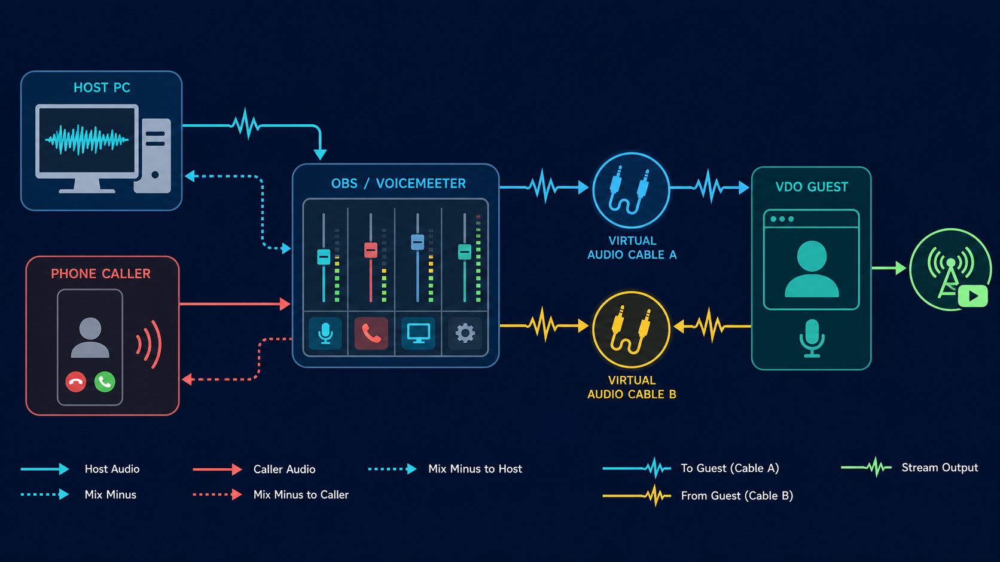

# Phone call-ins with VDO.Ninja and virtual audio cables

VDO.Ninja does not currently expose a polished native phone call-in feature for public use. There is experimental SIP/PSTN call-in work in the project, but it is not really exposed as a normal feature and should be treated as unsupported. A native version would likely need a bring-your-own SIP or telephone provider setup, since phone networks and SIP/PSTN gateways have ongoing per-minute and number-rental costs.

For now, the reliable way to run a call-in show is to create two separate **mix-minus** audio feeds with a hardware mixer, Voicemeeter, OBS audio monitoring, or virtual audio cables.

<figure><figcaption><p>Two return mixes are needed: one for the VDO.Ninja guest and one for the phone caller.</p></figcaption></figure>

## The goal

You usually have three live talkers:

* Host or producer
* Remote VDO.Ninja guest
* Phone caller

Each side needs to hear the other sides, but not a delayed copy of themselves.

| Destination | Should hear | Must not hear |
| --- | --- | --- |
| VDO.Ninja guest | Host + phone caller | VDO.Ninja guest |
| Phone caller | Host + VDO.Ninja guest | Phone caller |
| Livestream / recording | Host + VDO.Ninja guest + phone caller | Usually no exclusions |
| Host headphones | Whatever the host needs to monitor | Avoid delayed self-monitoring |

This is the same idea used in broadcast intercom and podcast systems. The "minus" part means the return feed excludes the person receiving it.

## What you need

At minimum:

* A way to receive the phone call, such as a phone connected to a mixer, a browser-based phone service, a SIP softphone, or a USB phone interface.
* A way to receive the VDO.Ninja guest audio on the host PC.
* A mixer that can create at least two different output buses.

Common options:

* **Voicemeeter Banana/Potato**: good for Windows software routing.
* **Rodecaster Duo/Pro or similar hardware mixer**: good if it supports custom USB routing and mix-minus.
* **OBS Studio plus monitoring/plugin routing**: useful if OBS is already your production hub, but stock OBS monitoring is usually only one monitor device, so two independent return mixes may need an audio monitoring plugin or an external software mixer.
* **VB-CABLE / Virtual Audio Cable / Loopback / BlackHole**: virtual patch cables between apps.

## The simple routing model

Create three source channels in your mixer:

1. **Host mic**
2. **VDO guest audio**
3. **Phone caller audio**

Then create three output mixes:

1. **Guest return mix**: Host mic + phone caller. Send this into VDO.Ninja as the host microphone.
2. **Caller return mix**: Host mic + VDO guest. Send this to the phone app, SIP softphone, phone USB return, or hardware phone channel.
3. **Program/stream mix**: Host mic + VDO guest + phone caller. Send this to OBS, MELD, YouTube, or your recorder.

The most common failure is accidentally using the program mix as a return feed. That sends people a delayed copy of themselves and creates echo.

## Voicemeeter example

This is a generic Windows example. The exact device names may differ.

1. Install Voicemeeter Banana or Potato and at least one virtual audio cable.
2. Put your **host microphone** on a Voicemeeter hardware input.
3. Route your **VDO.Ninja guest audio** into Voicemeeter. For example, use a VDO.Ninja view link in Chrome or Electron Capture and set its audio output to a virtual cable, then select that cable output as an input in Voicemeeter.
4. Route your **phone caller audio** into Voicemeeter. This might be a Rodecaster USB channel, a phone app, a SIP softphone output, or another virtual cable.
5. Create a **Guest return** bus containing host mic + phone caller, but not VDO guest. Select this bus or its virtual output as the microphone/input in the VDO.Ninja host/director page.
6. Create a **Caller return** bus containing host mic + VDO guest, but not phone caller. Select this bus or its virtual output as the microphone/input in the phone/SIP app, or send it to the phone interface.
7. Create a **Program** bus with all three sources and send that to OBS, MELD, or the livestream.

If the host is publishing a pre-mixed cable into VDO.Ninja, consider using [`&proaudio`](../advanced-settings/audio-parameters/and-proaudio.md) on the host's VDO.Ninja link. This disables browser audio processing that can damage music or mixed program audio. Only do this when you have proper mix-minus routing or headphones, since browser echo cancellation will not be there to save a bad loop.

## Rodecaster or hardware mixer example

For a Rodecaster Duo/Pro style setup:

1. Connect the host PC over USB.
2. Connect the phone over USB, Bluetooth, TRRS, or the phone input supported by the mixer.
3. Bring the VDO.Ninja guest audio from the PC into a separate mixer channel. This can be the browser source audio, a Chrome/Electron Capture output, or an OBS monitor output.
4. In the mixer's routing matrix, make the **phone send** contain host mic + VDO guest, excluding the phone caller.
5. Make the **VDO.Ninja send** contain host mic + phone caller, excluding the VDO guest.
6. Make the **stream send** contain all sources.

The important part is not the brand of mixer. The important part is that the phone return and the VDO.Ninja return are different mixes.

## OBS notes

OBS can be part of this workflow, but it is easy to hit a routing limit:

* OBS Browser Source can receive the VDO.Ninja guest for the stream.
* OBS Advanced Audio Properties can monitor audio to an output device.
* OBS's built-in monitor output is typically one shared monitor device.

If you need to send one mix to the phone caller and another mix to the VDO.Ninja guest, OBS alone may not be enough. Use Voicemeeter, a hardware mixer, or a per-source audio monitoring plugin so each destination can get its own return mix.

## Useful VDO.Ninja options

* [`&audiooutput`](../advanced-settings/setup-parameters/and-audiooutput.md) or `&od=` can route VDO.Ninja playback to a named output device in compatible browsers.
* [`&proaudio`](../advanced-settings/audio-parameters/and-proaudio.md) improves quality when sending a clean pre-mixed audio feed.
* [`&aec=0`](../source-settings/aec.md), [`&denoise=0`](../source-settings/and-denoise.md), and [`&autogain=0`](../source-settings/autogain.md) can be useful when the audio is already handled by a mixer, but avoid disabling echo cancellation if anyone is monitoring on speakers.
* [`&miconly`](../source-settings/miconly.md) can be useful for an audio-only host or utility connection.

Example host-side VDO.Ninja URL when publishing the guest return mix:

```
https://vdo.ninja/?room=YourRoomName&label=Host&proaudio
```

In that example, the selected microphone in VDO.Ninja should be the **Guest return mix** device, not the raw host microphone.

## Experimental SIP call-in panel

There is also an experimental browser-side SIP panel available with:

```
https://vdo.ninja/?room=YourRoomName&callin=sip
```

This is not a public polished phone bridge yet. It expects a bring-your-own SIP/PBX account that supports SIP over secure WebSockets (`wss://`) and WebRTC-compatible media. For example, an Asterisk/FreePBX setup would need WebRTC/PJSIP configured, a trusted TLS certificate, and a WSS endpoint reachable by the browser.

The panel can register for incoming calls or place an outbound SIP call. The same mix-minus rule still applies internally: VDO.Ninja sends the caller a return mix of the host plus VDO.Ninja guests, while adding the caller audio to the VDO.Ninja outbound mix. SIP passwords are entered manually in the panel; do not put SIP passwords in shared invite links.

Useful experimental parameters:

| Parameter | Purpose |
| --- | --- |
| `&callin=sip` | Shows the advanced SIP call-in panel. |
| `&sipwss=wss://pbx.example.com:8089/ws` | Pre-fills the SIP WebSocket server. |
| `&sipuri=sip:1001@example.com` | Pre-fills the SIP address/extension. |
| `&sipuser=1001` | Pre-fills the auth username if different from the SIP URI user. |
| `&siptarget=sip:1002@example.com` | Pre-fills the outbound dial target. |
| `&sipauto=1` | Starts the SIP registration automatically when the page loads. |
| `&sipautoanswer=1` | Answers incoming SIP calls automatically. |

Twilio, SignalWire, Telnyx, and similar providers can be supported later, but they need provider-specific token or backend handling. A free hosted default is difficult because phone numbers and PSTN minutes have ongoing costs and abuse risk.

## Testing checklist

Before going live, test with all three parties connected.

1. Host speaks: VDO guest and phone caller both hear the host.
2. VDO guest speaks: host and phone caller hear the guest, but the VDO guest does not hear a delayed copy of themselves.
3. Phone caller speaks: host and VDO guest hear the caller, but the phone caller does not hear a delayed copy of themselves.
4. The stream/recording hears all three voices.
5. Muting any single source only removes that source from the expected mixes.

## Troubleshooting

| Symptom | Likely cause |
| --- | --- |
| Guest hears the caller, but caller cannot hear the guest | The caller return mix is missing the VDO guest audio. |
| Caller hears the guest, but guest cannot hear the caller | The VDO.Ninja host mic/input is missing the phone caller audio. |
| Everyone hears an echo | A return mix includes the person receiving it, or a speaker is being picked up by a mic. |
| Audio is distorted or crackling | Virtual cable buffer size or sample rate mismatch. Use 48 kHz where possible and increase buffer size if needed. |
| Audio works in OBS but not in VDO.Ninja | The wrong side of the virtual cable was selected. On Windows, apps usually play to "CABLE Input" and record from "CABLE Output". |

Once the two return mixes are correct, the setup should behave like a normal call-in show: the VDO.Ninja guest and phone caller can talk to each other, while the host keeps control of the program mix.
