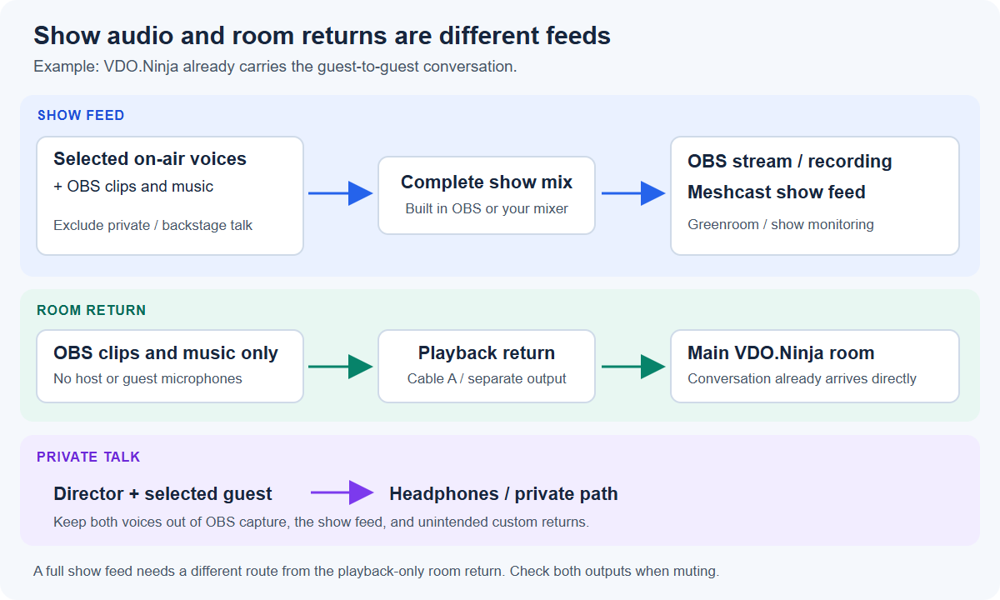

# Room audio, OBS, Meshcast, and private talk

You can keep guest voices audible while switching pictures in OBS, let guests hear clips or music, send the complete show to a greenroom, and talk privately to a guest. These jobs need different audio routes. This guide explains options using existing controls; the right combination depends on where you mix the show.

The room-side steps apply to both the **Director's Room** and the **Mixer app**. The OBS cable examples use Windows device names. A software audio router or hardware mixer with separate outputs can provide the same routes on other systems.

Use the sections that match your setup:

* [Keep voices active while switching pictures](#3-keep-voices-active-when-switching-to-a-screenshare).
* [Return OBS playback to a normal room](#4-return-obs-clips-and-music-to-the-main-room).
* [Send a complete show feed to Meshcast](#5-send-the-full-show-to-meshcast-and-the-greenroom).
* [Use individual Director/Mixer guest mixes](#6-option-use-the-directormixer-custom-guest-mixes).
* [Keep private talk off air](#7-keep-private-conversations-off-air).

## 1. Decide what each destination should hear

| Destination | Include | Leave out |
| --- | --- | --- |
| OBS stream or recording | On-air guest microphones, on-air host microphone, clips and music | Private conversations and backstage guests |
| Main-room guests using normal room audio | Other guests through VDO.Ninja, plus a separate OBS clips/music return | Their own voices returned through OBS; a second copy of other guests |
| Meshcast show feed for a greenroom or co-director | The complete on-air show | Private conversations |
| Director headphones | Room conversation and private talk | An unnecessary delayed copy from the show feed |

**Mix-minus** means leaving a source out of the mix sent back to that source. Two different arrangements are possible:

* **Room-wide OBS return:** VDO.Ninja already carries the conversation. Send only OBS clips/music back to the room, leaving all room microphones out of that return.
* **Individual guest returns:** A mixer sends each guest a different mix containing the other speakers, but excluding that guest. This requires controlling the direct room-audio paths too, or guests can hear duplicate copies.

A complete OBS Program mix is suitable for people who are only watching the show. It is not the same feed as the room-wide return above. Once voices and playback have been combined into one incoming track, VDO.Ninja cannot reliably separate them back into individual sources.

<figure><figcaption><p>Normal room-audio arrangement. The show feed and the room return contain different sounds. Private talk needs its own path.</p></figcaption></figure>

## 2. Keep the director's listening audio separate

1. In the Director's Room, select the microphone used for speaking to guests and set **Audio Output** to headphones.
2. In the Mixer, use its **Director View** for those room controls. Enable **Show the advanced director control options** if the required controls are hidden. The Mixer uses the room's director controls; it does not automatically configure OBS devices.
3. Bring guest audio into OBS through dedicated VDO.Ninja viewer/scene sources, as described below. Capturing the director's browser audio instead would also capture the private conversations heard there.
4. Check any **Desktop Audio**, browser application capture, microphone capture, and virtual-cable sources already in OBS. A separate capture of the director's mic or headphones can still put private talk on air.

The director's local speaker/monitor controls, a guest's return mix, and the OBS audience mix are separate controls. Changing one does not establish the state of the others.

## 3. Keep voices active when switching to a screenshare

An OBS scene change can remove the source carrying a guest's microphone. A screenshare link can also represent a separate stream from that guest's camera/microphone. Switching pictures does not necessarily preserve both audio sources.

One option is a shared OBS scene containing only the audio sources that must stay active:

1. Create an OBS scene named **Room Audio**.
2. Add a VDO.Ninja **Browser Source** using an audio-only room scene link. For example:

   ```text
   https://vdo.ninja/?room=YOUR_ROOM&scene=1&novideo&excludeaudio=OBS_RETURN_ID
   ```

3. In the director controls, add the intended on-air guests to **Scene 1**. Reserve this VDO.Ninja scene for audio selection if you want it to stay independent of video layout changes. If Scene 1 already has another purpose, use a different scene number consistently.
4. Enable **Control audio via OBS** on the Browser Source. Confirm its meter moves and its audio is assigned to the stream/recording track you use.
5. Add the existing **Room Audio** scene as a scene source in each OBS camera, panel, and fullscreen-screenshare scene that needs those voices. Reuse it rather than creating a new Browser Source for every scene. Keep that scene source enabled.
6. Add `&noaudio` to the separate VDO.Ninja camera/screenshare links used for pictures, so those links do not also play the same audio.
7. On the audio Browser Source, leave **Shutdown source when not visible** and **Refresh browser source when scene becomes active** unchecked. These settings avoid page unloads/reloads; they do not replace keeping the source active in each relevant OBS scene. See the [OBS Browser Source settings](https://obsproject.com/kb/browser-source).

Replace `YOUR_ROOM` and `OBS_RETURN_ID` with your actual room and return publisher's stream ID. Preserve your room's password and other required access parameters. `&excludeaudio=OBS_RETURN_ID` keeps the OBS playback publisher out of this incoming room mix, since OBS already has the original clips/music. Do not replace it with `&noaudio=OBS_RETURN_ID`: that parameter would allow only the listed stream's audio.

<figure><figcaption><p>Enable Control audio via OBS. This reference screenshot uses a single-viewer URL; use your room audio scene URL for the steps above.</p></figcaption></figure>

**Other audio-source choices:** Individual guest links with `&novideo` give each guest a separate OBS fader. `&scene=0&novideo` automatically includes the room, which can suit an all-participants feed, but it is not an on-air-only selection. A Mixer layout's output can be used too, but an audio source following that changing layout can lose voices when guests are removed from it. A dedicated audio scene or individual audio sources keeps that selection separate.

If the screenshare itself contains wanted sound, include that sound once in your audio plan before muting its picture source. A microphone feed alone may not contain shared application audio. Do not use a global **Mute Guest** action to remove an audio duplicate if that guest still needs to be heard through the dedicated audio source.

## 4. Return OBS clips and music to the main room

This arrangement keeps normal VDO.Ninja guest-to-guest conversation. The extra return contains **playback only**.

### Create the room return publisher

1. Choose a virtual audio device for the clips/music return. This guide calls it **Cable A**. It is a role, not a requirement to buy a particular named cable package.
2. Open a separate VDO.Ninja publishing tab, for example:

   ```text
   https://vdo.ninja/?room=YOUR_ROOM&push=OBS_RETURN_ID&webcam&vd=0&novideo&noaudio&label=OBS_Playback
   ```

3. Select **Cable A's recording/output end** as the only **Audio Source(s)**, then start publishing. On VB-Audio devices, OBS sends to **CABLE Input**, while the browser receives from **CABLE Output**. Do not also select the host's microphone here.
4. Keep this tab open. Its `&novideo&noaudio` options disable incoming playback in that tab; they do not prevent it from sending its cable audio to the room.
5. Keep this publisher out of the audio scene going into OBS, or exclude its audio by stream ID as in step 3 above. Label it so another operator can identify it.

For stereo/music processing choices, see [Share audio from OBS to VDO.Ninja](share-obs-audio-with-vdo-ninja.md). OBS Virtual Camera is optional here; it carries the picture, not the OBS audio mix.

### Choose how OBS sends audio to Cable A

**Using OBS's built-in monitoring output:**

1. Open **Settings → Audio → Advanced → Monitoring Device** and select Cable A's playback/input end.
2. In **Advanced Audio Properties**, enable monitoring for the clips/music sources you want guests to hear.
3. Keep monitoring off for room voices, the host's mic, private communications, and any source capturing the cable's return. Keep wanted playback sources assigned to OBS's broadcast output too.
4. Test with a guest: play a clip, then stop it and have the guest speak. The clip should reach them through the playback publisher; their voice should not return through it.

<figure><figcaption><p>This selector chooses one destination for OBS's built-in monitoring. Choose Cable A here for a playback-only return, or Cable B for the two-cable option below.</p></figcaption></figure>

OBS 32.2 uses independent output mute and monitoring controls; older versions show **Monitor and Output**. **Monitor Off** keeps a source out of the monitoring cable, not necessarily out of the stream. Verify both controls when muting. The [OBS 32.2 release notes](https://github.com/obsproject/obs-studio/releases/tag/32.2.0) explain the change.

**Using an additional output:** An audio-routing plugin, software router, or hardware mixer can send selected playback sources to Cable A while leaving OBS monitoring available for a different destination. The next section gives one concrete two-cable arrangement.

## 5. Send the full show to Meshcast and the greenroom

Choose one of these distribution options. Both need the same complete on-air mix; neither should use the director's private listening output.

### Option A: publish the OBS program directly

1. Prepare the complete show mix in OBS, with guest voices, any on-air host mic, and clips/music.
2. Configure an OBS output using the ingest details supplied by Meshcast, such as RTMP or WHIP where available. The [OBS return guide](send-an-obs-return-feed-to-guests.md) covers distribution options, and [OBS WHIP settings](obs-whip-output-settings.md) covers that output type.
3. Verify the selected output's audio track contains the complete show, then give greenroom viewers the watch link.

Direct publishing carries video and audio together, so this Meshcast route does not require a second audio cable. If OBS already streams to another destination, account for that: a second output needs an additional-output facility or a distribution service. Do not replace the existing destination unintentionally. Cable A can still carry the playback-only return to the main room.

### Option B: OBS Virtual Camera plus two audio cables

This fits a browser publisher that accepts **OBS Virtual Camera** and a separate microphone device. It also fits an existing setup using the **Audio Monitor** plugin for OBS.

| Route | Sources sent to it | Receiver |
| --- | --- | --- |
| Cable A: room return | Clips/music only | VDO.Ninja OBS Playback tab |
| Cable B: show feed | On-air guest voices, on-air host mic, clips/music | Meshcast publisher's audio input |
| Headphones | Director's room listening/private talk | Director only |

1. Make two independent audio routes available, Cable A and Cable B. Two cables alone do not select which sources enter each route.
2. Set OBS's **Monitoring Device** to Cable B's playback/input end. Enable built-in monitoring for each source that belongs in the full show feed. Also keep those sources enabled on OBS's broadcast track.
3. Use an additional routing facility to send clips/music to Cable A. With the [Audio Monitor plugin](https://github.com/exeldro/obs-audio-monitor), add an **Audio Monitor** filter to each wanted playback source and select Cable A as its device. Do not add this Cable A route to room microphones or private communications. Install a plugin version compatible with your OBS version if it is not already installed.
4. In the VDO.Ninja playback tab, keep the input on Cable A's recording/output end.
5. In the Meshcast browser publisher, select **OBS Virtual Camera** for video and Cable B's recording/output end for audio. Start the Virtual Camera in OBS and publish the feed.
6. Listen through the Meshcast watch link on headphones or another device. Check a guest voice, a clip, and the host separately.

OBS has one built-in monitoring destination. The plugin or external router supplies the additional route in this example. The [Audio Monitor plugin documentation](https://obsproject.com/forum/resources/audio-monitor.1186/) describes per-source device outputs. Check its mute/volume settings separately; a filter output is not automatically an exact copy of the streaming track. The same is true of OBS monitoring: new sources, changed levels, and mutes must be checked in both the broadcast and Cable B feeds.

Do not capture Cable B back into the OBS mix that sends to Cable B. Keep the director's private browser/headphones out of that mix.

### Who should listen to the Meshcast audio?

* **Greenroom viewers who are not hearing the main room:** Enable the complete show audio.
* **Main-room guests already hearing VDO.Ninja voices and the playback return:** Mute the show player, or use a video-only return, to avoid hearing the same voices twice.
* **Co-director:** Choose whether to monitor the complete show, the room, or a deliberate combination. Listening to both full feeds can produce delayed double voices. Private communication still needs a separate path.

When using **Share Website**, confirm that the embedded player's own mute setting works. An external player may not honor VDO.Ninja URL audio controls. Meshcast distributes the feed you give it; it does not create a different mix-minus for every viewer.

## 6. Option: use the Director/Mixer custom guest mixes

The Mixer can use the existing director **Mix** controls. These change what is sent **to a particular guest**. They do not automatically create an OBS program bus, select a Windows audio device, or copy OBS's clips into VDO.Ninja.

For a selected guest's return:

1. Keep the director connected with an enabled audio input and an outbound audio connection to that guest.
2. In the Director's Room, expand that guest's **Additional Controls** and find **PGM / Mic → Mix**. In the Mixer, enable advanced director controls and use **Director View** to reach the guest card.
3. Select only the sources that guest should receive. The list can include the **Director Mix**, individual director input devices, and other guests. An OBS playback publisher can be one of those sources.
4. Avoid selecting a raw microphone and the processed Director Mix containing the same microphone unless you intend to combine both. The target guest is excluded from their own guest-source list.
5. Listen at the receiving guest. Account for any audio they already receive directly through the room; adding that source through Mix can send a second copy.

<figure><figcaption><p>Existing custom Mix controls. This example sends Guest B to the selected listener; it is not an OBS output selector.</p></figcaption></figure>

For a planned director-hosted mix-minus arrangement, `&mixminus` on the director or Mixer URL enables per-guest returns. Guests can use [`&directoronly`](../advanced-settings/video-parameters/and-directoronly.md) to receive director audio/video instead of direct guest feeds. This changes their video selection too, and includes co-directors if present. In that arrangement the director must receive and mix all wanted sources; a separate playback publisher is heard through the director's selected mix. [`&broadcast`](../advanced-settings/view-parameters/broadcast.md) alone does **not** remove direct guest audio.

This is a different room topology from the playback-only return in step 4. It adds mixing/upload work and makes guest conversation depend on the director connection. The `&mixminus` flag by itself does not disable existing direct room paths. Rehearse with the actual devices and media transport before using it for a show.

Current limitations matter: opening the Mix menu enables the custom mix; closing it does not disable it. An outbound audio sender must already exist, and there is no reliable one-click restoration of the original director track. Per-guest mixes use the direct peer audio path; they are not different versions of a single shared Meshcast stream. See [Guest Audio Recovery and Mesh Debug](mesh-network-debug.md#emergency-audio-patch-send-b-to-a-with-mix) for the controls and limitations.

## 7. Keep private conversations off air

Mix-minus prevents unwanted returned audio. It does not, by itself, make a conversation private.

1. Keep the director's listening output on headphones outside the broadcast capture.
2. Before talking privately, take the guest out of the broadcast audio selection or mute their dedicated OBS audio source. Exclude the host's separate OBS microphone capture too if it would carry the private conversation. Keep their VDO.Ninja microphones enabled for the conversation.
3. On the main director's guest card, hold **Ctrl** on Windows/Linux or **Cmd** on macOS while selecting **Solo Talk** for two-way private talk. A plain click is one-way talk. If the Mixer does not expose that control in your version, use the main Director's Room controls.
4. Confirm neither voice reaches the actual broadcast output or the Meshcast show feed. Check both: a muted OBS output may still be audible through a monitor/filter route.
5. End Solo Talk, confirm normal room conversation has returned, then restore the intended on-air sources and routes.

Do not use the director's own listening experience as proof of privacy: hearing the guest there is expected. A custom guest mix can also contain locally received audio even when the guest is absent from a video layout. Check custom returns separately.

Solo Talk has transport/browser limitations, particularly with Meshcast and embedded sources. See [Solo Talk not working](../common-errors-and-known-issues/solo-talk-not-working.md). A separate communication room or intercom is another option when the production uses media paths that do not support the required isolation.

## 8. Check each route before the show

Make a short OBS recording and separately listen to the room return and Meshcast watch link. Use these checks with whichever options you selected:

| Test | Expected result |
| --- | --- |
| Guest speaks; no clip playing | The show hears them. The playback-only Cable A stays silent. The guest hears no delayed self-return. |
| Play an OBS clip | The room and the show hear it once. |
| Switch panel → fullscreen screenshare → panel | Intended microphone audio continues. Shared application audio appears only if included in your audio plan. |
| Start private two-way talk | The selected guest and director hear each other; neither private voice reaches the OBS recording or Meshcast feed. |
| End private talk and restore the guest | Normal room and on-air audio return as intended. |
| Guest leaves and rejoins | Audio-scene selection and any custom mixes are checked again. |
| Add or mute an OBS source | The room return, broadcast track, and Meshcast route each reflect the intended change. |

If audio stops during a screenshare, identify which meter stops first: guest microphone, VDO.Ninja audio viewer, OBS source, cable publisher, or Meshcast player. Record the affected link type and the scene change. A missing source or muted route and a media-connection fault need different fixes.

## Related guides

* [Share audio from OBS to VDO.Ninja](share-obs-audio-with-vdo-ninja.md)
* [Share OBS Virtual Camera and audio](share-obs-virtual-camera-and-audio.md)
* [Send an OBS return feed to guests](send-an-obs-return-feed-to-guests.md)
* [Mixer app](../steves-helper-apps/mixer-app.md)
* [Green rooms and guest waiting options](green-room-and-guest-approval-options.md)
