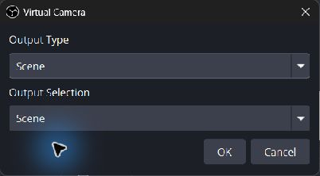
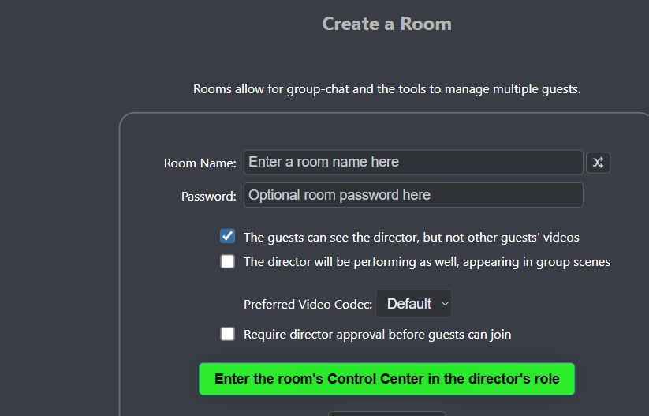
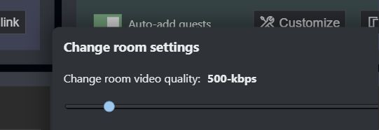
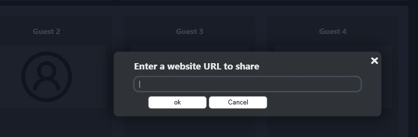

# Send an OBS return feed to guests

A **return feed**, sometimes called a program return or confidence feed, is the video and audio sent back to remote participants so they can follow the production. It can be the public program output, but it does not have to be. OBS can return its Program output, Preview output, a dedicated scene, or even one source.

There are three separate choices in this workflow:

1. **Content:** What should OBS send back?
2. **Routing:** Which VDO.Ninja participants should receive it?
3. **Distribution:** Should the feed go directly to every guest, through Meshcast, through your own WHIP/WHEP server, or through an external video platform?

Options such as [`&broadcast`](../advanced-settings/view-parameters/broadcast.md), [`&directoronly`](../advanced-settings/video-parameters/and-directoronly.md), and [`&meshcast`](../newly-added-parameters/and-meshcast.md) solve different parts of this problem and can be used together.

## Recommended starting point

For a small interactive room:

1. Create a dedicated **Guest Return** scene in OBS.
2. Select that scene as the OBS Virtual Camera output.
3. Publish the Virtual Camera as the director's VDO.Ninja video.
4. Add `&broadcast` to the guest invite link.
5. Start around 2500-kbps for a 720p30 return and adjust after testing.

This gives guests a low-latency production return without forcing their devices to display every other guest's video. If the producer's upload bandwidth or CPU becomes the limit as the audience grows, keep the same guest routing but relay the return through Meshcast or a WHIP/WHEP server.

## Choose a distribution method

| Method | Latency | Producer load as viewers join | Best fit |
| --- | --- | --- | --- |
| Direct VDO.Ninja with `&broadcast` | Lowest | Upload and encoding load grow per viewer | Small interactive rooms where guests should still hear one another |
| Direct VDO.Ninja with `&directoronly` | Lowest | Upload and encoding load grow per viewer | Small rooms where guests should receive only directors' audio and video |
| Meshcast | Slightly higher | The sender normally publishes one server feed | Larger low-latency rooms with minimal server setup |
| MediaMTX or another WHIP/WHEP service | Depends on the server and region | The sender normally publishes one server feed | Self-hosting, dedicated capacity, or custom routing |
| YouTube, Twitch, or another website embed | Usually much higher | The external platform handles viewer delivery | Large audiences that do not need a conversational return |


TURN can help peers connect through restrictive networks, but it is not a one-to-many fan-out solution. A direct return still has a separate media path for each guest.


## Build the return in OBS

Create the exact output the guests need. A dedicated return scene can include instructions, timers, confidence graphics, scores, remote speakers, or a clean version of the show while excluding private producer notes and other material intended only for the public program.

In OBS, select the gear beside **Start Virtual Camera**. Depending on the OBS version, the Virtual Camera can output:

* Program output
* Preview output
* A specific scene
* A specific source

Selecting a scene or source is useful when the guest return should remain independent of scene changes on the main Program output.

<figure><figcaption>
OBS Virtual Camera can return a selected scene instead of the main Program output.
</figcaption></figure>

Start the Virtual Camera before selecting **OBS Virtual Camera** in VDO.Ninja. Keep the OBS canvas, Virtual Camera output, and VDO.Ninja capture settings at compatible resolutions and frame rates.

### Route the audio separately

OBS Virtual Camera carries video, not an OBS audio mix. Use either:

* The director's microphone directly in VDO.Ninja; or
* A virtual audio cable carrying a carefully built OBS mix-minus.

A mix-minus excludes a participant's own delayed voice from the return sent to that participant. Use headphones, avoid sending the same audio through both VDO.Ninja and an embedded player, and make sure the return scene does not capture itself recursively. See [How to capture an application's audio](audio.md) for audio-routing options.

## Publish and route the return

### Option A: Use the director's output

Open a director link that also publishes a stable return stream ID:

`https://vdo.ninja/?director=ROOM&push=RETURN_ID&trb=2500`

In the director's device settings, select **OBS Virtual Camera** and the intended microphone or virtual audio cable. Give participants a guest link with broadcast mode enabled:

`https://vdo.ninja/?room=ROOM&broadcast`

The `&broadcast` option belongs on the **guest invite**, not the director or OBS scene link. Guests receive the main director's video while their audio connections to other guests remain active.

Replace `ROOM` and `RETURN_ID` with your own values, and keep any room password or encryption settings consistent across the links.

The room-creation page exposes the same behavior as **Guests see only the director's video**.

<figure><figcaption>
Broadcast mode limits the guest-facing video to the director's return while preserving guest-to-guest audio.
</figcaption></figure>

#### Video walkthrough: broadcast mode and the OBS return


Configure a broadcast-mode room, bring guests into OBS, and return OBS to those guests


This walkthrough uses an older version of the interface, but its overall room, OBS, Virtual Camera, and mix-minus workflow still applies. Useful sections include:

* [Creating the room and enabling broadcast mode](https://www.youtube.com/watch?v=QcFKI9q0yFs&t=58s)
* [Adding the room or individual guests to OBS](https://www.youtube.com/watch?v=QcFKI9q0yFs&t=312s)
* [Returning OBS through Virtual Camera](https://www.youtube.com/watch?v=QcFKI9q0yFs&t=600s)
* [Routing an OBS mix-minus through a virtual audio cable](https://www.youtube.com/watch?v=QcFKI9q0yFs&t=840s)
* [Using Meshcast when direct fan-out becomes too demanding](https://www.youtube.com/watch?v=QcFKI9q0yFs&t=1162s)

### Option B: Use a dedicated return publisher

A separate publisher keeps the return feed independent of the director's camera and control-center preview:

`https://vdo.ninja/?room=ROOM&push=RETURN_ID&novideo&noaudio`

Select OBS Virtual Camera in that publisher, then explicitly identify it in each guest invite:

`https://vdo.ninja/?room=ROOM&broadcast=RETURN_ID`

Here, `&novideo&noaudio` prevents the return publisher tab from also receiving room media. The production browser or OBS browser sources can handle the guest inputs separately. Running the return publisher on another machine can isolate its CPU and network load further.

### Option C: Isolate every guest from other guests

If the return is published by the main director or a co-director, use:

`https://vdo.ninja/?room=ROOM&directoronly`

This gives the guest audio and video from directors, including co-directors, while blocking guest-to-guest audio and video. Unlike `&broadcast=RETURN_ID`, `&directoronly` does not select an arbitrary guest publisher by stream ID.

| Guest link mode | Video received by the guest | Audio received by the guest |
| --- | --- | --- |
| Normal room | Other room participants | Other room participants |
| `&broadcast` | Main director only | Director and other guests |
| `&broadcast=RETURN_ID` | The selected return stream only | Director and other guests |
| `&directoronly` | Directors and co-directors only | Directors and co-directors only |

## Set return quality without hiding the bottleneck

The room video-quality control sets a **combined receive budget**, not a guaranteed bitrate for every feed. Its URL equivalent is [`&totalroombitrate`](../advanced-settings/video-bitrate-parameters/totalroombitrate.md), or `&trb`.

<figure><figcaption>
The director can change the room's combined video budget live.
</figcaption></figure>

With one visible broadcast return, `&trb=2500` can assign roughly that full target to the return. In a normal room, the same total is divided among the visible feeds. The setting cannot create upload capacity or CPU that the producer does not have.

Reasonable starting targets are:

| Return format | Starting video target |
| --- | --- |
| 720p30 | 2500–4000 kbps |
| 1080p30 | 4000–6000 kbps |

Fast motion, detailed graphics, noisy images, or 60-fps output may need more. Test the actual producer and guest networks rather than treating these as guarantees.


An OBS Virtual Camera is a camera source to the browser. [`&screensharebitrate`](../newly-added-parameters/and-screensharebitrate.md) does not control it; use the room bitrate controls. `&screensharebitrate` applies only when VDO.Ninja is publishing a real browser screen share.


### Understand direct P2P scaling

With direct VDO.Ninja delivery, the return publisher sends a separate stream to each viewer. A 2.5-Mbps return sent to eight guests can require roughly 20 Mbps of producer upload, plus protocol overhead. The producer may also be receiving and decoding every active guest feed.

This explains why a return can become choppy as more people join even after its requested bitrate is raised. Disabling unneeded incoming guest videos is a valid way to reduce the producer's inbound bandwidth and decoding load, but it does not remove the outbound return connection to each viewer.

For a stable direct setup:

* Keep only the guest feeds currently needed by production active.
* Stage inactive participants in a [green room or approval queue](green-room-and-guest-approval-options.md) instead of ingesting every waiting source in the production room.
* Leave substantial upload headroom instead of planning around the speed test maximum.
* Monitor CPU/GPU encoding load as well as network bitrate.
* Use [`&limittotalbitrate`](../advanced-settings/video-bitrate-parameters/limittotalbitrate.md) as an outbound safety cap, understanding that quality must fall when the cap is below aggregate demand.
* Move the return to a relay when direct fan-out becomes the limiting factor.

## Relay the return with Meshcast

Meshcast keeps VDO.Ninja's room signaling and guest routing while moving return-media distribution to a hosted server. Add it to the return publisher or publishing director:

`https://vdo.ninja/?director=ROOM&push=RETURN_ID&meshcast&meshcastbitrate=2500`

Guests can continue using `&broadcast` or `&directoronly`. Those parameters decide **what** the guest receives; Meshcast changes **how** the media reaches them.

[`&meshcastbitrate`](../meshcast-settings/and-meshcastbitrate.md) controls the server-published camera bitrate. The room's `&trb` value does not change a Meshcast stream's bitrate. If the source is an actual VDO.Ninja screen share, use [`&mcscreensharebitrate`](../meshcast-settings/and-mcscreensharebitrate.md).

Meshcast adds some latency and moves media through a third-party service, but it avoids multiplying the publisher's media upload for every viewer.


Understand P2P rooms, broadcast mode, and Meshcast server distribution


This 2021 overview remains useful for understanding the network topology, although its interface, server locations, limits, and standalone Meshcast.io examples may no longer match the current service. The most relevant sections are [broadcast-mode fan-out](https://www.youtube.com/watch?v=YxduINMXw1M&t=193s), [the server-relayed return concept](https://www.youtube.com/watch?v=YxduINMXw1M&t=360s), [integrated `&meshcast` publishing](https://www.youtube.com/watch?v=YxduINMXw1M&t=840s), and [the recommended director-to-guests layout](https://www.youtube.com/watch?v=YxduINMXw1M&t=1620s).

## Use a self-hosted or managed WHIP/WHEP service

WHIP ingests one WebRTC stream into a server; WHEP lets viewers play the server-distributed stream. This provides the same broad scaling shape as Meshcast while giving you a choice of hosting provider, region, capacity, and access controls.

### MediaMTX

With a configured MediaMTX server, add its address to the return publisher:

`https://vdo.ninja/?room=ROOM&push=RETURN_ID&mediamtx=media.example.com`

VDO.Ninja publishes the return by WHIP and advertises the corresponding WHEP playback path to room peers. Use HTTPS and authentication in production. The full server setup is covered in [Deploy your own Meshcast-like service](deploy-your-own-meshcast-like-service.md).

### Cloudflare Stream or another WHIP/WHEP provider

For a generic service, the publisher can use an encoded WHIP endpoint and advertise or derive its WHEP endpoint:

`https://vdo.ninja/?room=ROOM&push=RETURN_ID&whipout=ENCODED_WHIP_URL&autowhep`

Use [`&whepshare`](../advanced-settings/whip-parameters/and-whepshare.md) when the WHEP playback URL must be supplied explicitly. [`&autowhep`](../advanced-settings/whip-parameters/and-autowhep.md) recognizes several common URL patterns, including Cloudflare Stream's publish/play pattern, but an explicit WHEP URL takes priority.

Keep publishing URLs, API tokens, and bearer tokens only in the protected publisher link. Never put a publishing credential into the guest invite. The [`&cftoken`](../advanced-settings/whip-parameters/and-cftoken-alpha.md) shortcut remains an alpha option and should be tested before production use.

See [WHIP and WHEP tooling](../steves-helper-apps/whip-and-whep-tooling.md) for the available VDO.Ninja helpers.

### Publish directly from OBS with WHIP

OBS can also publish directly to a compatible WHIP endpoint. This removes OBS Virtual Camera and the browser publisher from the sending path, but it is a more advanced workflow and can expose different codec, NAT, firewall, and server-compatibility constraints.

Start with [From OBS to VDO.Ninja using WHIP](from-obs-to-vdo.ninja-using-whip.md) and [Recommended OBS WHIP settings](obs-whip-output-settings.md). Use the Virtual Camera method when you want the return to behave like a normal VDO.Ninja room source with the broadest compatibility.

## Share YouTube, Twitch, or another website instead

The director control center can share an embeddable website to the room. Select **Share Website**, paste the player URL, and send it to the guests.

<figure><figcaption>
The director can distribute an embeddable player without making every guest open a separate tab.
</figcaption></figure>

This approach moves large-scale video delivery to the external platform, but it is normally a poor confidence monitor for live interaction because:

* The player may be several seconds behind the room.
* Autoplay, cookies, ads, or the provider's iframe policy may interfere.
* The embedded audio is not part of VDO.Ninja's normal echo-cancellation path.
* Sending both VDO.Ninja audio and player audio creates doubling or echo.

For a mixed workflow, keep low-latency conversation audio in VDO.Ninja and mute the embedded player. If the platform stream must provide the audio, intentionally mute the duplicate VDO.Ninja return path.

## Browser screen share as an alternative

OBS Virtual Camera is usually more predictable for moving video because it behaves like a camera and can target a dedicated OBS scene. If you instead share an OBS projector or program window with VDO.Ninja's screen-share feature, try:

* `&screensharequality=1` for a 720p capture target
* `&screensharefps=30` for a 30-fps target
* `&screensharecontenthint=motion` on the publisher when frame rate matters more than fine text
* `&screensharebitrate=2500` on receiving guest links

The content hint is a preference, not a guarantee. When bandwidth or CPU is insufficient, `motion` favors frame rate while `detail` favors resolution.

## Troubleshooting

### The return quality falls as more guests join

Check the producer's outbound bitrate, inbound guest bitrate, and encoder/decoder load. `&broadcast` reduces what guests receive, but the direct return publisher still serves each guest. Disable unused production inputs, separate the return publisher, or move the return to Meshcast or WHIP/WHEP.

### The return is smooth but too delayed

An external website player or a heavily buffered media server is probably outside the latency budget. Use direct VDO.Ninja, Meshcast, or a low-latency WHIP/WHEP service for an interactive return.

### Motion is choppy

Match the OBS and VDO.Ninja frame rates, start Virtual Camera before selecting it, and confirm there is enough bitrate and encoding capacity. For a real browser screen share, use `&screensharecontenthint=motion`.

### Guests hear an echo or themselves delayed

Use headphones and rebuild the OBS audio as a mix-minus. Keep only one audio return path active.

### The return contains itself

Remove the guest return page from the OBS scene being sent back, or capture only the intended OBS scene/source instead of the entire display.

## Related guides

* [Publish from OBS into VDO.Ninja](publish-from-obs-into-vdo.ninja.md)
* [`&broadcast`](../advanced-settings/view-parameters/broadcast.md)
* [`&directoronly`](../advanced-settings/video-parameters/and-directoronly.md)
* [Video bitrate in rooms](video-bitrate-in-rooms.md)
* [`&meshcast`](../newly-added-parameters/and-meshcast.md)
* [Deploy your own Meshcast-like service](deploy-your-own-meshcast-like-service.md)
* [WHIP and WHEP tooling](../steves-helper-apps/whip-and-whep-tooling.md)
* [`&website`](../source-settings/and-website.md)
