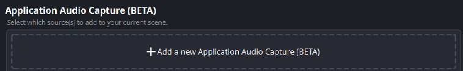
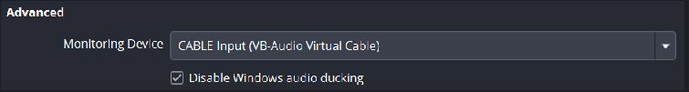
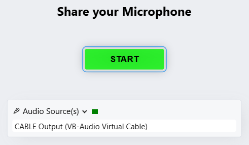

# Share audio from OBS to VDO.Ninja

Use OBS to choose the sounds you send, then use **VB-CABLE** to carry that mix into VDO.Ninja's audio input. This works for game audio, music, a media file, or another audio source already in OBS. You can send audio by itself or use the same audio setup alongside a camera.

For video as well, continue with [Share OBS Virtual Camera and audio](share-obs-virtual-camera-and-audio.md). That guide also covers changing scenes and switching between two players while keeping their voices audible.

For a live room that also needs guest audio in OBS, a complete Meshcast show feed, and private director talk, see [Room audio, OBS, Meshcast, and private talk](room-audio-obs-meshcast-and-private-talk.md). It covers the separate room-return and show-output mixes.

These steps are for **Windows 10/11 and OBS Studio**. Screenshots show OBS **32.2.2** and VDO.Ninja in Chrome. Older OBS versions use **Monitor and Output** where the screenshots show **Monitoring Enabled**. For other operating systems, see the [general application audio guide](audio.md).

## 1. Install the cable and keep your headphones as the normal output

1. Download [VB-CABLE from VB-Audio](https://vb-audio.com/Cable/).
2. Extract the download, run the installer as administrator, and restart Windows as instructed by the installer.
3. Keep the game and Discord playing through your normal headphones. Keep Discord's input set to your actual microphone.

You do not need VoiceMeeter for this method. OBS captures the application; only OBS's monitoring output goes into the cable. You do not also need to change the game's Windows output to the cable.

The device names describe the two ends of one cable:

| Where you choose the device | Device to choose | What it does |
| --- | --- | --- |
| OBS Monitoring Device | **CABLE Input (VB-Audio Virtual Cable)** | OBS sends sound into the cable |
| VDO.Ninja Audio Source(s) | **CABLE Output (VB-Audio Virtual Cable)** | VDO.Ninja receives sound from the cable |
| Discord and normal Windows playback | Your microphone and headphones | Your conversation and local listening stay separate |

## 2. Get the wanted audio into OBS

If the source already has a working meter in OBS, use that source and skip adding a duplicate.

For just a game's sound:

1. Open the game and make it play some audio.
2. In OBS's **Sources** dock, click **+** and select **Application Audio Capture (BETA)**. In OBS 32.2, click **Add a new Application Audio Capture (BETA)** in the source chooser.
3. Name the source **Game Audio** and select the game's window in its properties.
4. Confirm its meter moves in the **Audio Mixer** when the game makes sound.

<figure><figcaption><p>Choose application audio capture to isolate a game from Discord and other desktop sounds.</p></figcaption></figure>

Recent OBS versions can also capture audio through a **Game Capture** or **Window Capture** source using **Capture Audio (BETA)**. Use either that or a separate Application Audio Capture source for the same game, so it is captured once. See the [OBS application audio instructions](https://obsproject.com/kb/application-audio-capture-guide).

If you capture applications separately, disable **Desktop Audio** under **Settings → Audio → Global Audio Devices** to avoid a second copy in OBS's own stream or recording. Make sure you have separate sources for any other sounds you still want in that output. A whole-desktop capture may include Discord, notifications, and browser playback; it cannot isolate the game.

## 3. Point OBS monitoring at the cable

1. Open **OBS Settings → Audio**.
2. Scroll to the **Advanced** section inside the Audio page.
3. Set **Monitoring Device** to **CABLE Input (VB-Audio Virtual Cable)**.
4. Click **Apply**, then **OK**.

<figure><figcaption><p>This Advanced section is on the Audio settings page. Select CABLE Input here.</p></figcaption></figure>

This changes where OBS sends monitored audio. It does not automatically turn monitoring on for every source. It also replaces OBS's previous monitoring destination, so any other sources you were monitoring will now feed this cable too.

## 4. Choose exactly which sources enter the cable

In OBS's Audio Mixer, open **Advanced Audio Properties** using the gear at the bottom of the mixer, or right-click the mixer and choose **Advanced Audio Properties**.

For game audio without voices, use:

| Source | Audio Monitoring in OBS 32.2.2 | Label in older OBS versions |
| --- | --- | --- |
| Game Audio | **Monitoring Enabled** | **Monitor and Output** |
| Microphone | **Monitor Off** | **Monitor Off** |
| Discord | **Monitor Off** | **Monitor Off** |
| Desktop Audio or other unwanted sources, if present | **Monitor Off** | **Monitor Off** |

<figure><figcaption><p>Only Game Audio enters the cable. This example uses a media test tone; the same monitoring control applies to an application capture.</p></figcaption></figure>

**Monitor Off does not mute a source in OBS's own stream or recording.** It keeps that source out of the monitoring device, which is the cable in this setup. Your microphone and Discord can remain in OBS's normal output while being excluded from VDO.Ninja.

Keep the monitored Game Audio path unmuted and its monitoring level audible. OBS 32.2 has separate mute and monitoring controls in the mixer, so the main output's mute state alone does not tell you whether sound is entering the cable. Older versions use shared controls in more places. If you intentionally want to send a microphone, enable monitoring for that source too; avoid also selecting the same physical microphone in VDO.Ninja.

**Advanced routing:** The track checkboxes on the right control OBS's streaming/recording tracks, not separate cable channels. To exclude a monitored source from particular recording or streaming tracks, uncheck those tracks. Leave them checked if you want both outputs. OBS 32.2 removed **Monitor Only (mute output)** from this dialog because mute and monitoring are now independent; older versions still offer that option. See the [OBS 32.2 release notes](https://github.com/obsproject/obs-studio/releases/tag/32.2.0).

## 5. Select the cable in VDO.Ninja

For an audio-only stream, open this template after replacing `YOUR_UNIQUE_STREAM_ID` with your own unguessable ID:

```text
https://vdo.ninja/?push=YOUR_UNIQUE_STREAM_ID&webcam&vd=0&proaudio=1
```

1. Allow the browser to use audio devices when prompted.
2. Open **Audio Source(s)** and select **CABLE Output (VB-Audio Virtual Cable)**.
3. Make sure the cable is the only selected audio device. Do not also select your microphone if voices should stay on Discord.
4. Play the game and confirm VDO.Ninja's audio meter responds, then click **START**.

<figure><figcaption><p>The page says Share your Microphone because the virtual cable is an audio input. No camera is needed.</p></figcaption></figure>

`&vd=0` disables camera capture. [`&proaudio=1`](../advanced-settings/audio-parameters/and-proaudio.md) disables voice-oriented audio processing and supports stereo when used on both ends. That helps preserve game and music audio; keep speakers and live microphones out of this route to avoid feedback.

Give the receiver the matching **view** link, not your publishing link:

```text
https://vdo.ninja/?view=YOUR_UNIQUE_STREAM_ID&proaudio=1
```

If you add a password, use the same password on both links. Leave the publishing tab open while sending.

## 6. Receive the audio in another OBS

On the receiving computer, add a **Browser Source**, paste the view link, and enable **Control audio via OBS**. The source will appear in the OBS Audio Mixer. Its fader, mute button, and output-track assignments control what the audience hears.

<figure><figcaption><p>Enable Control audio via OBS on the receiving source. Width and height do not affect an audio-only feed.</p></figcaption></figure>

Leave receiving-side monitoring off if only your stream or recording needs the sound. If you also want to listen, set that OBS instance's **Monitoring Device** to your headphones and enable monitoring for this Browser Source. Do not send it back into the same cable feeding the publisher.

## Change the audio being sent

**Change games or applications:** Open the Game Audio source's **Properties** in OBS and select the new application. Keep VDO.Ninja on CABLE Output. Verify the new game's OBS meter before continuing.

**Switch between sources already in OBS:** Turn monitoring off for the old source and on for the new one. If both are monitored and active, both enter the cable. Use the monitoring setting to choose what VDO.Ninja receives; do not assume the main OBS output mute also mutes the cable, especially with OBS 32.2's independent controls.

**Let audio follow OBS scenes:** Put Game Audio in the Game scene and leave it out of the Break scene. A scene switch can then stop the game audio. Global audio devices and sources shared with other active scenes can remain active, so check the receiver after switching. In Studio Mode, use **Transition** to change Program.

**Change VDO.Ninja's input device:** Open the bottom **gear** while publishing, expand **Audio Source(s)**, and select the new device. For an OBS source change, leave this set to the cable.

<figure><figcaption><p>The gear opens the live device settings.</p></figcaption></figure>

## Check the route before going live

1. Play game audio. The OBS meter and VDO.Ninja meter should respond, and the receiver should hear it.
2. Stop the game audio and speak into the microphone or have someone speak on Discord. The receiver should hear neither through this game feed.
3. Switch the OBS scene or audio source, then check that the old audio stops and the new audio arrives.
4. Make a short recording on the receiving OBS and listen back. A moving meter alone does not confirm recording-track assignments.

| Problem | Check |
| --- | --- |
| OBS meter moves but VDO.Ninja is silent | Game monitoring is enabled and audible; OBS uses CABLE Input; VDO.Ninja uses CABLE Output; the source is active |
| Voice or Discord comes through too | Only the game is monitored, only the cable is selected in VDO.Ninja, and the capture is application-specific |
| Audio sounds doubled | The game is not captured twice, and the receiver is not also playing the view link through captured Desktop Audio |
| You cannot hear the game locally | The game still outputs directly to headphones; OBS's monitor now goes to the cable |
| The cable is missing | Complete the VB-CABLE installation/restart, then reopen OBS and the publishing tab |
| Audio stops after changing scenes | The monitored source may no longer be active; check its scene membership and the current Program scene |

Do not add CABLE Output back into the same sending OBS mix and monitor it into CABLE Input. That creates a loop. Windows **Listen to this device** and unmuting the publisher's self-preview are unnecessary when the game already plays through headphones.

## Related guides

* [Share OBS Virtual Camera and audio](share-obs-virtual-camera-and-audio.md)
* [Other ways to capture application audio](audio.md)
* [Publish directly using the Ninja OBS Plugin](using-ninja-obs-plugin-with-vdo.ninja.md)
