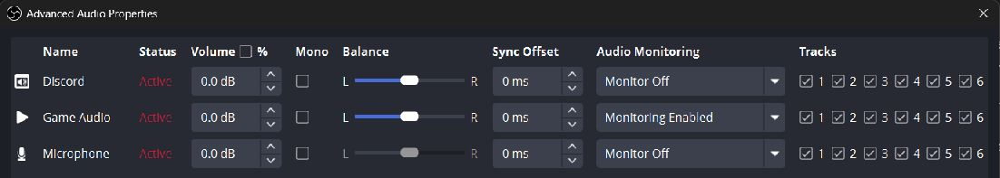
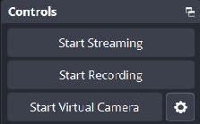
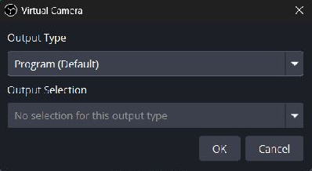
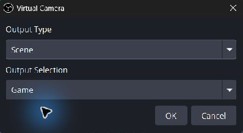
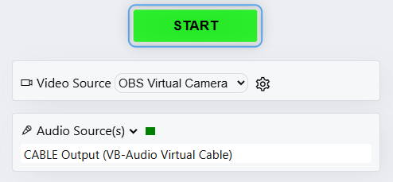
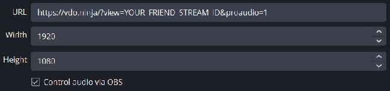
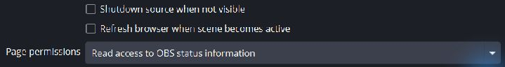
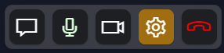
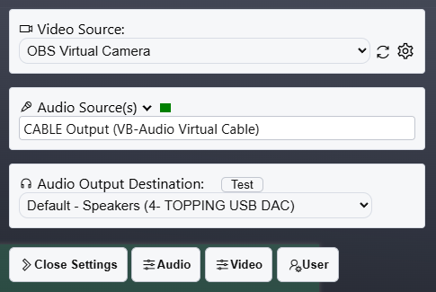

# Share OBS Virtual Camera and audio

OBS Virtual Camera sends the **picture**. A virtual audio cable sends the **sound**. Select both in VDO.Ninja to share an OBS scene with another person or another OBS instance, while continuing to use your existing OBS setup.

This guide uses **Windows, OBS Studio, Chrome, and VB-CABLE**. Screenshots show OBS **32.2.2**. If your video already works and only sound is missing, start with [Share audio from OBS to VDO.Ninja](share-obs-audio-with-vdo-ninja.md).

## 1. Prepare the sending OBS scene and audio

Use your existing game scene, or create one containing the game capture, camera, and graphics you want to share. Avoid capturing the VDO.Ninja preview itself, which can create a repeating picture.

Set up the sound using the [audio guide, steps 1–4](share-obs-audio-with-vdo-ninja.md#1-install-the-cable-and-keep-your-headphones-as-the-normal-output):

1. Install [VB-CABLE](https://vb-audio.com/Cable/) and restart as instructed.
2. Capture the game's sound in OBS using **Application Audio Capture (BETA)**, or enable **Capture Audio (BETA)** on a supported Game Capture source. Capture the game only once.
3. In **Settings → Audio → Advanced**, select **CABLE Input** as the **Monitoring Device**.
4. In **Advanced Audio Properties**, enable monitoring for Game Audio. Use **Monitoring Enabled** in OBS 32.2.2, or **Monitor and Output** in older versions.
5. Keep microphone, Discord, and other unwanted sources on **Monitor Off**.

<figure><figcaption><p>Choose which audio to share independently of your video scene. This example keeps voices out of the VDO.Ninja feed.</p></figcaption></figure>

Monitor Off excludes a source from the cable; it does not remove it from OBS's own stream or recording. This allows the sender to keep their normal voice mix in their own OBS output.

## 2. Choose what Virtual Camera shows

In OBS's **Controls** dock, click the **gear beside Start Virtual Camera**. This is separate from OBS's main Settings button.

<figure><figcaption><p>The small gear beside Start Virtual Camera chooses the video output.</p></figcaption></figure>

Set **Output Type** according to what you want to share:

| Output Type | What VDO.Ninja sees | How to change it |
| --- | --- | --- |
| **Program (Default)** | OBS's current Program picture | Switch OBS scenes; in Studio Mode, click Transition |
| **Preview** | OBS's preview picture | Select a different Preview scene in Studio Mode; guests can see edits before they go to Program |
| **Scene** | One scene selected in this dialog | Change Output Selection here, or edit that scene's contents |
| **Source** | One selected video source | Change Output Selection here, or change that source's properties |

### Follow your normal scene switches

Choose **Program (Default)** and click **OK**. This is the simplest choice when video and scene-specific audio should follow your normal OBS production.

<figure><figcaption><p>Program follows the picture currently sent to OBS's normal output.</p></figcaption></figure>

Outside Studio Mode, clicking a scene makes it the output. Inside Studio Mode, selecting a scene normally prepares Preview; use **Transition** to send it to Program.

### Keep one scene on the camera

Choose **Scene**, then choose the scene under **Output Selection**. For example, select **Game** to keep sharing the game picture while you work with other OBS scenes. Click **OK**.

<figure><figcaption><p>A fixed Scene selection does not follow later Program scene changes.</p></figcaption></figure>

To share only a single camera or capture without the rest of a scene, use **Source** and select that source instead.

**Audio remains separate.** Choosing Scene, Source, or Preview here does not select that item's audio for the cable. The cable still receives monitored, active sources. In the tested Windows setup, changing Program to a Break scene stopped Game Audio even though Virtual Camera remained fixed on the Game picture. For predictable audio-follow-video switching, start with Program mode. If you need an independent picture, explicitly manage which audio sources remain active and monitored, and check the receiver after each change.

Choose the output mode before the session. Changing some Virtual Camera modes while it is running requires a restart; OBS may warn you, and VDO.Ninja can briefly lose the camera picture.

## 3. Start Virtual Camera and select both devices in VDO.Ninja

1. Click **Start Virtual Camera** in OBS. You do not need to start OBS streaming or recording for this method.
2. Open the following publishing link, replacing `YOUR_UNIQUE_STREAM_ID` with your own unguessable ID:

```text
https://vdo.ninja/?push=YOUR_UNIQUE_STREAM_ID&webcam&proaudio=1
```

3. Allow the requested camera/microphone access. Under **Video Source**, choose **OBS Virtual Camera**.
4. Under **Audio Source(s)**, select **CABLE Output (VB-Audio Virtual Cable)**. For game audio only, make sure no microphone or other audio device is also selected.
5. Confirm the preview shows the intended OBS picture and the audio meter responds to the game. Click **START**.

<figure><figcaption><p>These are two separate device choices: OBS Virtual Camera for video and CABLE Output for audio.</p></figcaption></figure>

Leave OBS Virtual Camera running and the VDO.Ninja publishing tab open. If the preview looks mirrored, check the receiving feed before flipping anything; a local self-preview can differ from what the viewer receives.

Give your receiver this matching link:

```text
https://vdo.ninja/?view=YOUR_UNIQUE_STREAM_ID&proaudio=1
```

Use the same password on both links if you add one. `&proaudio=1` on both ends preserves stereo and avoids voice-oriented processing on game audio. Keep using headphones for conversation.

## 4. Add the feed to the receiving OBS

On the computer that will produce the final stream:

1. Create a scene named **Friend Game**.
2. Add a **Browser Source**, name it **Friend VDO**, and paste the view link.
3. Set Width and Height to your intended video canvas, such as **1920 × 1080**. These values size the browser canvas; they do not force the incoming stream's resolution.
4. Check **Control audio via OBS** so the feed has its own OBS mixer entry.

<figure><figcaption><p>Use the sender's view link and enable Control audio via OBS.</p></figcaption></figure>

5. Leave **Shutdown source when not visible** and **Refresh browser when scene becomes active** unchecked for fast switching. Leave **Page permissions** at the normal **Read access to OBS status information** setting.

<figure><figcaption><p>Keeping the page loaded avoids reconnecting the feed at every scene switch.</p></figcaption></figure>

6. Click **OK**, right-click the source in the preview, and use **Transform → Fit to Screen** if needed. Check the Friend VDO meter, its mute button, and its recording/streaming track assignments.

For local listening, set this receiving OBS's Monitoring Device to your headphones and enable monitoring for Friend VDO. Otherwise leave monitoring off: the audio can still go to your stream/recording. Do not also play a second copy of the view link into captured desktop audio.

## 5. Switch between your game and your friend's game

For the two-player setup, keep the voices separate from both games. Your friend sends game audio only through VDO.Ninja; you capture your own microphone and the Discord call locally.

Build two scenes in the **receiving OBS**:

| Source | My Game scene | Friend Game scene |
| --- | --- | --- |
| Your game capture and its application audio | Included | Not included |
| Friend VDO Browser Source with its game audio | Not included | Included |
| Your microphone | Included | Add the same existing source |
| Discord application audio capture | Included | Add the same existing source |

Use **Add Existing** for the microphone and Discord in the second scene; do not create a second capture of the same devices. Alternatively, put those two sources in a shared **Voices** scene and include it in both game scenes.

Disable global Desktop Audio after adding the separate application sources. Otherwise your own game or Discord can keep arriving through Desktop Audio when you switch scenes. Discord carries your friend's voice; capture your own microphone separately unless you deliberately configured another route for it.

Switch to **My Game** to send your game's picture and sound. Switch to **Friend Game** to send your friend's picture and sound. With the game sources confined to their respective scenes, OBS can switch their output audio with the scenes while the shared voice sources continue. In Studio Mode, use **Transition**. A fade may briefly mix both games; use **Cut** if you want a direct handover.

**Covering a source with another image is not the same as removing it from the active scene.** Its audio can continue. Keep the unwanted game source out of the active scene, including nested scenes. Keep the Browser Source loaded using the settings above; loading the page and including its audio in Program are separate concerns.

Make a short OBS recording: speak continuously, switch both directions, and listen back. Confirm only the selected game is audible and both voices remain. Test headphones separately if you also use monitoring; a game may still be audible locally because the game itself plays directly to your headphones.

## Change a camera or cable while publishing

Click VDO.Ninja's bottom **gear**, then use **Video Source** or **Audio Source(s)**. Changing a physical device can briefly interrupt that media; verify the receiver afterwards.

<figure><figcaption><p>Open the gear to change devices without creating a new stream link.</p></figcaption></figure>

<figure><figcaption><p>Audio Source(s) is what you send. Audio Output Destination is where you listen; it should normally remain your headphones or normal playback device.</p></figcaption></figure>

For a new OBS scene or game, keep VDO.Ninja set to **OBS Virtual Camera + CABLE Output**. Make that change in OBS instead. Reopening the Virtual Camera gear is only necessary when changing its fixed scene/source or output mode.

## Troubleshooting

| Problem | Check |
| --- | --- |
| Picture arrives but sound does not | Virtual Camera carries no audio. Check the separate cable route and source monitoring in the audio guide |
| Virtual Camera does not appear | Start it in OBS first, then refresh the browser's device list or reopen the publishing page |
| Camera is fixed on the wrong scene | Open the Virtual Camera gear; choose Program to follow scene switches or change the fixed Output Selection |
| Sound does not match the fixed camera picture | Virtual Camera mode does not choose audio; check active monitored sources and Program scene membership |
| Both games are audible | Check global Desktop Audio, duplicate captures, and game sources included through nested scenes |
| Voices disappear on a scene switch | Put the same microphone and Discord sources in both game scenes |
| Friend's voice is doubled | Exclude microphone and Discord from the friend's cable feed; receive that voice only through your Discord capture |
| Returning to the friend's scene reloads the video | Disable browser-source shutdown and refresh-on-activation; check that the sender's tab and camera stayed running |

## Related guides

* [Audio only and advanced OBS monitoring](share-obs-audio-with-vdo-ninja.md)
* [The longer OBS-to-OBS walkthrough](how-to-send-the-audio-video-output-of-one-obs-to-another-obs-using-vdo.ninja.md)
* [OBS's Virtual Camera reference](https://obsproject.com/kb/virtual-camera-guide)
* [Ninja OBS Plugin for direct publishing](using-ninja-obs-plugin-with-vdo.ninja.md)

The plugin is an alternative if you want OBS to publish directly. It uses OBS's normal streaming output slot; the Virtual Camera and cable method above leaves that slot available for an existing Twitch or YouTube stream.
