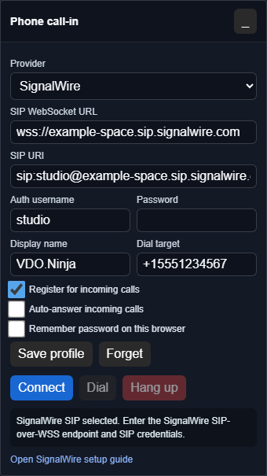

# SignalWire SIP call-in setup

SignalWire is currently the most direct bring-your-own provider option for VDO.Ninja's browser-side SIP call-in panel. It supports SIP over secure WebSockets, which lets the browser register as a SIP endpoint without running your own PBX.

Last reviewed: July 12, 2026.


This is experimental. Phone callers are mixed into the director/host audio and do not yet appear as normal guest tiles with full scene controls.


## What this creates

The call path is:

1. A phone caller dials your SignalWire number.
2. SignalWire routes the call to a SIP endpoint in your SignalWire Space.
3. The VDO.Ninja director page registers to that SIP endpoint over `wss://`.
4. VDO.Ninja answers the call in the browser.
5. VDO.Ninja mixes the caller into the room and sends a mix-minus return feed back to the caller.

<figure><figcaption><p>The SignalWire mode is the generic SIP-over-WSS panel with SignalWire-specific defaults and wording.</p></figcaption></figure>

## Cost notes

Check SignalWire's current pricing before buying numbers. At the time this guide was written, SignalWire's public voice pricing listed local numbers at a low monthly cost and usage priced per minute for PSTN, SIP, and WebRTC legs. Prices and country availability can change.

Useful references:

* [SignalWire voice pricing](https://signalwire.com/pricing/voice)
* [SignalWire SIP-over-WebSockets overview](https://signalwire.com/blogs/product/webrtc-using-sip-over-websockets)
* [SignalWire SIP trunking guide](https://signalwire.com/docs/platform/voice/sip/trunking)

## 1. Create a SignalWire Space

Create or open a SignalWire account, then create a Space. Your Space has a SIP domain similar to:

```text
your-space.sip.signalwire.com
```

The exact Space name and SIP domain are shown in the SignalWire dashboard.

This direct setup does not require FreePBX. SignalWire supplies the phone number, routing, and browser-compatible SIP endpoint. A PBX is optional if you want local extensions, queues, voicemail, or different billing/routing control.

## 2. Create a SIP endpoint

In the SignalWire dashboard, create a SIP credential or SIP endpoint for VDO.Ninja.

Use a dedicated credential for this purpose:

| Field | Example |
| --- | --- |
| Username | `vdo-callin` |
| Password | Use a strong generated password |
| Caller ID | Your show name or phone number |
| Encryption | Required, if offered |

Do not use your SignalWire project API token as the SIP password. The browser only needs the scoped SIP endpoint credential.

**Using FreePBX:** If VDO.Ninja connects to FreePBX instead of directly to SignalWire, use a dedicated WebRTC-enabled PJSIP extension. An ordinary SIP extension can work in MicroSIP while still failing in Chrome or Edge.

## 3. Buy or route a phone number

Buy a voice-capable number in SignalWire, or use an existing number that can route into SignalWire.

Route inbound calls from that number to the SIP endpoint you created. The exact dashboard wording can change, but the goal is:

```text
Inbound phone number -> SIP endpoint vdo-callin@your-space.sip.signalwire.com
```

If you are using a SignalWire XML/SWML/Call Flow style route, the route should dial the SIP endpoint. For example, a compatibility XML style route would be conceptually:

```xml
<Response>
  <Dial>
    <Sip>sip:vdo-callin@your-space.sip.signalwire.com</Sip>
  </Dial>
</Response>
```

Use the current SignalWire dashboard/docs for the exact routing UI.

### Optional path through FreePBX

The alternate route is:

    SignalWire number -> FreePBX SIP trunk -> WebRTC PJSIP extension -> VDO.Ninja

The VDO.Ninja extension must offer browser-compatible secure media. In FreePBX, enable the equivalent of:

* Media Encryption: **DTLS-SRTP**
* ICE Support: **Yes**
* AVPF: **Yes**
* RTCP Mux: **Yes**
* DTLS Setup: **Act/Pass**
* DTLS Verify: **Fingerprint**

The exact labels depend on the FreePBX/Asterisk version. A successful SIP-over-WSS registration only proves that signaling works. The call can still fail at Answer if the PBX's SDP offer does not include a DTLS fingerprint for secure browser audio.

## 4. Start VDO.Ninja

Open the director page with the experimental call-in panel:

```text
https://vdo.ninja/alpha/?director=YourRoomName&callin=signalwire
```

If the deployed version does not yet include the SignalWire label, use the generic SIP mode instead:

```text
https://vdo.ninja/alpha/?director=YourRoomName&callin=sip
```

In the panel, enter:

| VDO.Ninja field | SignalWire value |
| --- | --- |
| SIP WebSocket URL | `wss://your-space.sip.signalwire.com` |
| SIP URI | `sip:vdo-callin@your-space.sip.signalwire.com` |
| Auth username | The SIP endpoint username, such as `vdo-callin` |
| Password | The SIP endpoint password |
| Display name | Optional label, such as `VDO.Ninja` |

Leave **Register for incoming calls** enabled. Enable **Auto-answer incoming calls** only after testing.

Click **Connect**. The status should show that the SIP account registered.

### Field meanings

The **SIP WebSocket URL** is the secure WebSocket endpoint the browser connects to. It starts with `wss://`. It is not the same thing as the SIP address.

The **SIP URI** is the callable SIP address for the endpoint, usually formatted like `sip:username@your-space.sip.signalwire.com`.

The **Auth username** is the SIP credential username. In many setups it matches the `username` part of the SIP URI, but some providers let these differ.

The **Password** is the SIP endpoint password only. Do not enter a SignalWire project token or account-level API token here.

The **Dial target** is used only for outbound calls from the VDO.Ninja panel. For SignalWire, a normal phone number such as `+15551234567` is converted to a SIP target on the same domain.

## 5. Test before going live

1. Join the VDO.Ninja room as director/host.
2. Join as a normal guest from another browser or device.
3. Start the SignalWire call-in panel and confirm it registers.
4. Call the SignalWire number from a regular phone.
5. Answer the incoming call in the panel.
6. Confirm the VDO.Ninja guest hears the phone caller.
7. Confirm the phone caller hears the host and VDO.Ninja guest.
8. Confirm the phone caller does not hear a delayed copy of themselves.

## Useful parameters

### Incoming ringtone

Use the bell button in the call-in panel to choose the classic ring, bell, chime, a custom uploaded audio file, or silent mode. You can preview the selection and adjust its volume. These preferences stay in the current browser. The ringtone is local operator audio and is not mixed into the VDO.Ninja room or sent back to the caller. Auto-answered calls do not ring.

The upload button opens `fileuploads.vdo.ninja`. Sign in there and upload a short audio file. The file is hosted as public media; VDO.Ninja stores only the returned HTTPS URL and selection in this browser. The ringtone menu does not store the audio file itself.

When `&callinoutput=DeviceName` or `&sipoutput=DeviceName` is supported by the browser, the ringtone follows the same local output device as the caller monitor.

| Parameter | Purpose |
| --- | --- |
| `&callin=signalwire` | Opens the call-in panel in SignalWire/SIP mode. |
| `&callin=sip` | Opens the generic SIP/PBX panel. |
| `&sipwss=wss://your-space.sip.signalwire.com` | Pre-fills the SIP WebSocket URL. |
| `&sipuri=sip:vdo-callin@your-space.sip.signalwire.com` | Pre-fills the SIP URI. |
| `&sipuser=vdo-callin` | Pre-fills the auth username. |
| `&siptarget=+15551234567` | Pre-fills the outbound dial target. |
| `&callinoutput=DeviceName` or `&sipoutput=DeviceName` | Routes the local caller monitor to a named output device when the browser supports it. |
| `&sipauto=1` | Connects automatically when the page loads. |
| `&sipautoanswer=1` | Answers incoming calls automatically. |

Do not put the SIP password in the URL.

The panel can optionally remember the SIP profile in this browser. If you enable **Remember password on this browser**, the password is saved in this browser's local storage. That is a convenience feature for a trusted production machine, not a secure vault. Do not use it on shared computers.

## Troubleshooting

| Symptom | Likely cause |
| --- | --- |
| SIP registration fails | Wrong WSS URL, SIP URI, username, password, or SignalWire endpoint settings. |
| Browser says the WebSocket URL is invalid | The URL must start with `wss://`, not `sip:`, `http:`, or `ws:`. |
| Phone call never reaches VDO.Ninja | The SignalWire number is not routed to the SIP endpoint, or the VDO.Ninja page is not registered. |
| Chrome reports `ERR_CERT_AUTHORITY_INVALID` for the PBX WSS URL | Install a trusted certificate, or visit the PBX HTTPS/WSS host and explicitly trust its local certificate before connecting. This only fixes SIP signaling, not media encryption. |
| VDO.Ninja rings, but Answer immediately sends the caller to voicemail | Check the JsSIP log for `488 Not Acceptable Here` and `SDP without DTLS fingerprint`. Configure the FreePBX extension for WebRTC with DTLS-SRTP, ICE, AVPF, RTCP mux, and fingerprint verification. |
| MicroSIP works but VDO.Ninja does not | MicroSIP can accept conventional SIP/RTP. Chrome and Edge require a WebRTC-compatible secure-media SDP offer, so use a WebRTC PJSIP extension for VDO.Ninja. |
| Caller connects but no one hears them | Check browser microphone permissions, the VDO.Ninja outbound mix, and whether the caller audio track attached in the panel. |
| Caller hears echo | The return mix includes the phone caller audio. Hang up and check the routing before going live. |

When testing is done, release unused numbers or disable routing if you do not want ongoing charges.
