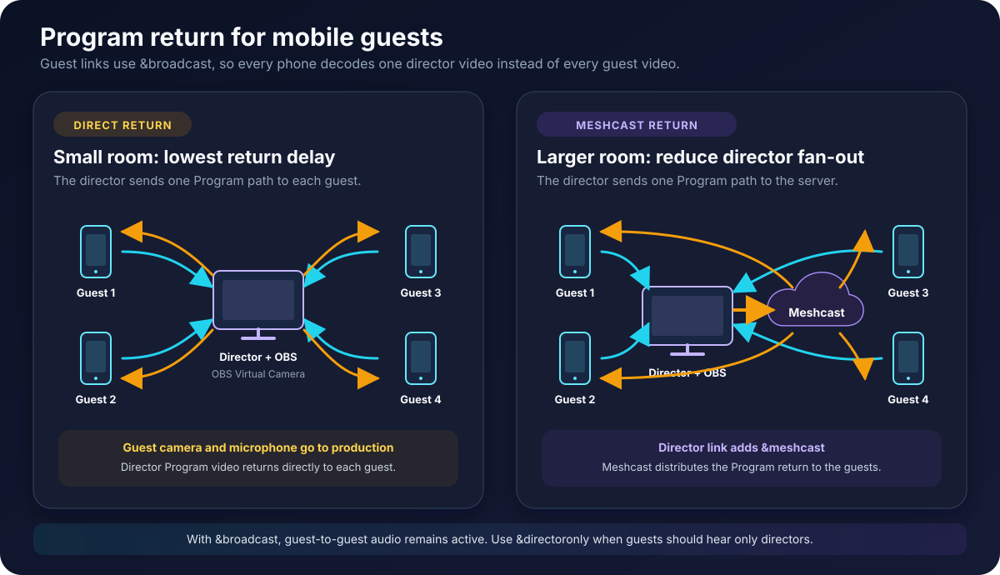
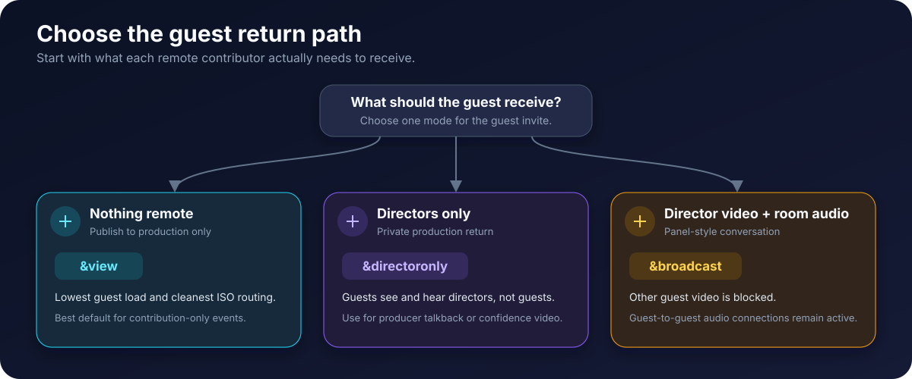
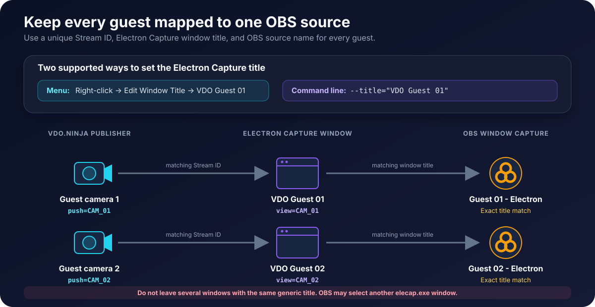

# Stable mobile guest production with OBS and Electron Capture

This guide is for a production that has several remote phone guests, one isolated source for each guest in OBS, and an OBS Program video sent back to the guests.

The recommended starting design is:

1. Each guest publishes one camera and microphone with a unique Push ID.
2. Each guest uses [`&broadcast`](../advanced-settings/view-parameters/broadcast.md), so the phone receives only the director's video instead of every guest's video.
3. The director publishes an OBS Virtual Camera return.
4. OBS or Electron Capture opens one fixed View link for each guest.
5. Every Electron Capture window has a unique title.
6. Conversation audio uses one deliberate path. Every speaker wears headphones.

This design reduces phone heat and makes the OBS sources predictable. If the director computer or its upload connection becomes overloaded, add [`&meshcast`](../newly-added-parameters/and-meshcast.md) to the director's link.

<figure><figcaption><p>Broadcast mode reduces the video received by each phone. Meshcast can also reduce the number of return copies sent by the director.</p></figcaption></figure>

## Terms used in this guide

| Term | Meaning |
| --- | --- |
| Guest link | The link opened on a remote phone or tablet |
| Director link | The VDO.Ninja control room opened by the producer |
| View link | A link that receives one guest using that guest's Stream ID |
| Program return | The OBS video sent back to guests so they can follow the show |
| Isolated feed or ISO | One guest's camera and microphone, separate from the other guests |
| Fan-out | One sender creating media paths for several viewers |

## Recommended setup

The examples below use `ROOM_NAME`, `CAM_01`, and `PROGRAM_RETURN`. Replace them with your own values. Stream IDs are case-sensitive. Keep the room password and other access options identical on every room link.

### 1. Give each guest a unique link

Example for the first guest:

```text
https://vdo.ninja/?room=ROOM_NAME&push=CAM_01&label=Guest%2001&broadcast&quality=1&maxframerate=30
```

Example for the second guest:

```text
https://vdo.ninja/?room=ROOM_NAME&push=CAM_02&label=Guest%2002&broadcast&quality=1&maxframerate=30
```

These options have separate jobs:

* `&push=CAM_01` gives the camera a permanent Stream ID.
* `&broadcast` allows only the director's video to play on the guest device. Other guests' audio remains available.
* `&quality=1` targets approximately 1280 x 720 capture.
* `&maxframerate=30` limits the requested frame rate but allows a lower fallback if the camera needs it.

Start without additional quality options if the phones are already stable. Add the 720p and 30-fps limits when a device becomes hot or cannot sustain its current settings. An emergency low-load test can use `&quality=2`, which targets approximately 640 x 360.

Do not give two active guests the same `&push` value. Do not copy a guest's address-bar URL after the guest has joined and give that modified URL to another guest.


Do not add [`&nopreview`](../source-settings/and-nopreview.md) to an iPhone or iPad publishing link. A local camera preview is required for reliable iOS publishing.


### 2. Publish the OBS return from the director

Open a director link with a stable return ID:

```text
https://vdo.ninja/?director=ROOM_NAME&push=PROGRAM_RETURN
```

In OBS:

1. Create a dedicated scene for the guest return, or use Program output.
2. Open the OBS Virtual Camera settings.
3. Select Program, Preview, a specific scene, or a specific source.
4. Start the OBS Virtual Camera.
5. In the director's VDO.Ninja device settings, select **OBS Virtual Camera** as the camera.

<figure><figcaption><p>A dedicated return scene can stay independent from changes to the public Program output.</p></figcaption></figure>

Keep the director or `PROGRAM_RETURN` source out of the OBS scene that feeds the Virtual Camera. If the return captures itself, it creates a repeating picture.

The room-creation page can add broadcast mode to the generated guest invitations:

<figure><figcaption><p>This room option adds broadcast behavior to the guest links.</p></figcaption></figure>

### 3. Open one isolated View link for each guest

The matching View links are:

```text
https://vdo.ninja/?view=CAM_01&solo&room=ROOM_NAME&forceviewerlandscape
https://vdo.ninja/?view=CAM_02&solo&room=ROOM_NAME&forceviewerlandscape
```

The important mapping is:

| Phone publisher | Production viewer | Electron Capture title | OBS source name |
| --- | --- | --- | --- |
| `push=CAM_01` | `view=CAM_01` | `VDO Guest 01` | `Guest 01 - Electron` |
| `push=CAM_02` | `view=CAM_02` | `VDO Guest 02` | `Guest 02 - Electron` |
| `push=CAM_03` | `view=CAM_03` | `VDO Guest 03` | `Guest 03 - Electron` |
| `push=CAM_04` | `view=CAM_04` | `VDO Guest 04` | `Guest 04 - Electron` |

Use the same mapping for every rehearsal and production. A guest can reconnect with the same Push ID and return to the same production input.

## Choose what each guest receives

Do not make every phone display a full room unless the guests need that view. Choose the smallest return path that supports the production.

<figure><figcaption><p>The guest invite controls the return path.</p></figcaption></figure>

| Mode | Guest link option | Video received | Audio received | Main trade-off |
| --- | --- | --- | --- | --- |
| Normal room | No special receive option | Other guests and directors | Other guests and directors | Familiar gallery, but highest phone load |
| Broadcast | `&broadcast` | Main director only | Director and other guests | Recommended for a panel with one Program return |
| Selected broadcast source | `&broadcast=PROGRAM_RETURN` | One named return source | Director and other guests | Keeps the return separate from the director |
| Directors only | `&directoronly` | Directors and co-directors | Directors and co-directors | Private producer return; guests cannot hear one another |
| Publish only | Bare `&view` with no value | Nothing remote | Nothing remote | Lowest phone load; no conversation or confidence return |

### Option A: Normal full room

```text
https://vdo.ninja/?room=ROOM_NAME&push=CAM_01
```

Use this only when every guest must see every other guest. Each additional video creates more decoding, rendering, network traffic, and publisher fan-out. Older phones may heat quickly.

### Option B: Broadcast mode

```text
https://vdo.ninja/?room=ROOM_NAME&push=CAM_01&broadcast
```

This is the recommended starting point for a panel that uses an OBS Program return. The phone receives one director video. Guests can still hear one another through the room.

Add `&broadcast` to guest links. Do not add it to the director or OBS View links.

### Option C: Director-only mode

```text
https://vdo.ninja/?room=ROOM_NAME&push=CAM_01&directoronly
```

Use this when the guest should receive only the production team. It removes guest-to-guest video and audio. It is useful for private talkback, auditions, or contribution-only events where guests must not communicate directly.

### Option D: Publish-only mode

```text
https://vdo.ninja/?room=ROOM_NAME&push=CAM_01&view
```

The final `&view` has no value. The guest publishes but receives no remote media. This is the lowest-load browser setup. It is appropriate when a separate phone call, intercom, or other system provides communication.

### Option E: Use a separate Program return publisher

Use this when the director needs a normal camera that is separate from the OBS return.

```text
Return publisher: https://vdo.ninja/?room=ROOM_NAME&push=PROGRAM_RETURN&novideo&noaudio
Guest:            https://vdo.ninja/?room=ROOM_NAME&push=CAM_01&broadcast=PROGRAM_RETURN
```

Open the return-publisher link on the production computer. Select OBS Virtual Camera. The `&novideo&noaudio` options stop that publisher page from receiving the room; they do not disable its outgoing camera and microphone.

## Add Meshcast when direct distribution is too demanding

Broadcast mode moves the return-video burden to the director. Without a server, the director normally sends a separate return path to each guest.

Add `&meshcast` to the director link when the director's CPU or upload connection cannot sustain those copies:

```text
https://vdo.ninja/?director=ROOM_NAME&push=PROGRAM_RETURN&meshcast
```

The guest links still use `&broadcast`:

```text
https://vdo.ninja/?room=ROOM_NAME&push=CAM_01&broadcast
```

Meshcast receives the director's outbound media and distributes it to the guests. It normally reduces return-feed encoding and upload fan-out on the production computer.

If each phone camera is being requested by several production pages, the guest links can also use `&meshcast`:

```text
https://vdo.ninja/?room=ROOM_NAME&push=CAM_01&broadcast&meshcast
```

Use [`&nomeshcast`](../advanced-settings/meshcast-parameters/and-nomeshcast.md) on a specific production View link when that viewer must request a direct peer-to-peer path from a Meshcast-enabled publisher.

Meshcast has trade-offs:

* It normally adds some latency.
* Media passes through a server instead of remaining entirely peer to peer.
* Quality and availability depend on the selected server and its current load.
* It reduces sender fan-out. It does not reduce the number of guest videos that OBS or the production computer must decode.

Add Meshcast only after the direct broadcast setup is working. Rehearse the exact server-assisted configuration before an event.

## Native mobile app option

The [VDO.Ninja native mobile app](../steves-helper-apps/native-mobile-app.md) is another option when Safari cannot provide stable capture or when the production needs native features such as local recording, USB audio, background operation, or additional camera controls.

<figure><figcaption><p>Use the same stable Stream ID and Room name planned for the browser guest link.</p></figcaption></figure>

For an isolated camera source:

1. Enter a unique **Stream ID**, such as `CAM_01`.
2. Enter the production **Room name** if the director must manage the source as a room participant.
3. Open the matching `&view=CAM_01` link in Electron Capture, OBS, or the Ninja OBS Plugin.
4. Use the app's Remote Audio Stream or another talkback method if the camera operator needs producer audio.

The native app is focused on capture and publishing. It is not an exact replacement for the full browser room, and it may not show every guest or the complete Program return in the same way as a browser guest using `&broadcast`.

The simpler interface and reduced playback can lower device load, but the app does not guarantee a cooler phone. High resolution, high frame rate, local recording, screen sharing, or dual-camera capture can still create substantial heat. Test the exact app mode and phone before production.

## iPhone and iPad heat, rotation, and disconnection

Video capture, video encoding, several incoming video decoders, a bright screen, Wi-Fi or cellular transmission, and battery charging all create heat. An older iPhone or iPad may lower its performance when it becomes hot. The visible result can include low frame rate, audio interruption, frozen video, or a disconnected media path.

Older iOS devices and older iOS releases have also shown sporadic orientation errors. Heat or resource pressure may make an orientation problem appear at the same time as stuttering, but a rotated picture does not prove that heat caused the failure. VDO.Ninja's orientation controls do not intentionally disconnect a guest.

### Reduce heat first

1. Use `&broadcast`, `&directoronly`, or publish-only mode instead of a full-room video gallery.
2. Start around 720p30 with `&quality=1&maxframerate=30`.
3. Use 360p as a diagnostic fallback with `&quality=2`.
4. Use a current iOS or iPadOS release and a current Safari version when possible.
5. Close unused VDO.Ninja tabs and other camera applications.
6. Remove a thick insulating case when safe.
7. Lower screen brightness and keep the device out of direct sunlight.
8. Start with a charged battery. Charging an already hot phone creates more heat.
9. Use a stable Wi-Fi or cellular signal. A weak radio connection can increase power use and packet loss.
10. Do not request the same phone camera from unnecessary director tabs, OBS sources, Electron Capture windows, Scene links, or test devices.

If a phone still becomes hot, optionally cap each outbound video path:

```text
&maxvideobitrate=1500
```

A lower limit can reduce quality. Very low limits such as 600 kbps can also trigger resolution scaling. Test the result on the actual phone.

### Keep an incoming video in landscape

Add [`&forceviewerlandscape`](../advanced-settings/mixer-scene-parameters/and-forceviewerlandscape.md) to the link that **receives** the phone video. For example, add it to the Electron Capture or OBS View link:

```text
https://vdo.ninja/?view=CAM_01&solo&room=ROOM_NAME&forceviewerlandscape
```

The default rotation is 270 degrees. If that is the wrong direction, test:

```text
&forceviewerlandscape=90
```

This option rotates an incoming video when its reported aspect ratio becomes portrait. It does not cool the phone, repair a network connection, or prevent a publishing disconnect.

The related sender-side option is [`&forcelandscape`](../advanced-settings/mobile-parameters/and-forcelandscape.md):

```text
https://vdo.ninja/?room=ROOM_NAME&push=CAM_01&broadcast&forcelandscape
```

`&forcelandscape` asks the phone's outgoing video to remain 16:9. `&forceviewerlandscape` is a receiver-side workaround. Test one change at a time so it is clear which option helped.

## Configure Electron Capture so OBS does not switch guests

Every Electron Capture window must have a different title. If several windows have the same title, OBS may match a Window Capture source to the wrong window after a reconnect, reload, application restart, or scene change.

<figure><figcaption><p>Keep the Stream ID, Electron Capture title, and OBS source name unique and consistent.</p></figcaption></figure>

### Set the title from the Electron Capture menu

1. Open the required guest View link in Electron Capture.
2. Right-click inside the Electron Capture window.
3. Select **Edit Window Title**.
4. Enter a unique title such as `VDO Guest 01`.
5. Repeat with a different number for every guest.
6. In OBS, select the matching window for that guest's Window Capture source.

The menu changes the current window. A command-line or batch-file launch is easier to reproduce after a restart.

### Set the title from the command line

The portable Windows build is named `elecap.exe`. On Windows, use an equals sign and quotation marks around the URL and title:

```text
elecap.exe --width=1280 --height=720 --url="https://vdo.ninja/?view=CAM_01&solo&room=ROOM_NAME&forceviewerlandscape" --title="VDO Guest 01"
```

The shorter aliases also work:

```text
elecap.exe -w=1280 -h=720 -u="https://vdo.ninja/?view=CAM_02&solo&room=ROOM_NAME&forceviewerlandscape" -t="VDO Guest 02"
```

Keep the complete VDO.Ninja URL inside quotation marks. Otherwise, Windows can treat each `&` as a command separator.

For a repeatable multi-window setup, use a batch file and pause briefly between launches:

```batch
start elecap.exe -w=1280 -h=720 -u="https://vdo.ninja/?view=CAM_01&solo&room=ROOM_NAME&forceviewerlandscape" -t="VDO Guest 01"
timeout /T 1 /NOBREAK
start elecap.exe -w=1280 -h=720 -u="https://vdo.ninja/?view=CAM_02&solo&room=ROOM_NAME&forceviewerlandscape" -t="VDO Guest 02"
timeout /T 1 /NOBREAK
start elecap.exe -w=1280 -h=720 -u="https://vdo.ninja/?view=CAM_03&solo&room=ROOM_NAME&forceviewerlandscape" -t="VDO Guest 03"
timeout /T 1 /NOBREAK
start elecap.exe -w=1280 -h=720 -u="https://vdo.ninja/?view=CAM_04&solo&room=ROOM_NAME&forceviewerlandscape" -t="VDO Guest 04"
```

Use `elecap.exe --help` to check the options supported by the installed Electron Capture version. See the [Electron Capture command-line reference](https://electroncapture.app/command-line.html) for the full list.

### Match each Electron Capture window in OBS

For every guest:

1. Add one **Window Capture** source in OBS.
2. Name the OBS source clearly, such as `Guest 01 - Electron`.
3. Select the Electron Capture window titled `VDO Guest 01`.
4. Choose the strictest title-matching option offered by the installed OBS version.
5. Avoid a fallback that can select any window from the same `elecap.exe` process.
6. Confirm the mapping before creating clones or adding the source to other scenes.

Do not rename an Electron Capture window while the production is live. A title change can break the OBS match.

### Reuse sources safely across OBS scenes

If the same guest appears in several OBS scenes, reuse one tested base source:

* Use **Add Existing** when adding an OBS source to another scene, or use a clone/reference tool that points to the same tested base capture.
* Do not open another Electron Capture window or browser page for every OBS scene.
* Confirm the base source's guest ID, window title, and audio before making clones.
* If every clone suddenly shows the wrong guest, fix the base Window Capture mapping first.

A clone can simplify OBS scene management. It cannot reduce phone load if several separate VDO.Ninja View pages are still requesting the same phone stream.

### Alternative capture methods

| Capture method | Advantage | Important caution |
| --- | --- | --- |
| One VDO.Ninja Scene in OBS | Fewest production inputs; simple mixed layout | Does not provide one independent source per guest |
| One OBS Browser Source per guest | Fixed URL; no external window-title matching | Reuse existing sources across scenes to avoid duplicate viewers |
| Electron Capture plus OBS Window Capture | Recent Chromium, flexible window and audio routing, survives OBS restarts | Requires unique titles and careful OBS window matching |
| [Ninja OBS Plugin](../steves-helper-apps/ninja-obs-plugin.md) | Purpose-built OBS integration without a normal Browser Source | Install and rehearse the plugin before replacing a working setup |

Changing capture methods may solve an OBS or Electron Capture problem. It will not fix a phone that has stopped publishing to every viewer.

## Prevent echo and duplicated audio

`&broadcast` blocks other guests' video, but it does not block their audio. This is intentional so a panel can continue speaking naturally.

The simplest audio setup is:

* Every speaker wears headphones.
* VDO.Ninja carries the live conversation audio.
* OBS Virtual Camera returns video only.
* Only one OBS or Electron Capture path supplies each guest's audio to the production mix.

OBS Virtual Camera does not carry the OBS audio mix. If guests must hear music, clips, or other Program sound, use a virtual audio device and build a controlled return. Do not send the complete OBS mix, including guest microphones, back to those same guests. They will hear delayed copies of themselves.

Check these common duplicate paths:

* The same guest audio is active in the director room and in an isolated capture.
* A Browser Source and an Electron Capture window both receive the same guest.
* A cloned source and its base source are both active in the same OBS mix.
* A shared webpage and VDO.Ninja both play the Program audio.
* OBS monitoring sends the production mix back into the same virtual audio device used as its input.

Make a private recording and listen to every audio channel before the event.

## Diagnose rotation, source switching, and disconnection separately

These symptoms can occur together, but they do not always have the same cause.

| Observation | Most useful next check |
| --- | --- |
| The correct guest remains visible in the VDO.Ninja director room, but OBS shows another guest | Check Electron Capture titles and OBS Window Capture matching |
| Electron Capture shows the correct guest, but OBS shows another window | Fix the OBS source mapping; do not change phone settings |
| The guest disappears from Electron Capture, OBS, and the director room | Check the phone, iOS version, heat, network, permissions, and WebRTC connection |
| Video rotates but audio and the connection remain stable | Test `&forceviewerlandscape` on the receiving View link |
| Rotation, low frame rate, audio stutter, and disconnection happen after the phone becomes hot | Reduce incoming video, capture resolution, frame rate, and unnecessary viewers |
| Audio stops after a call or notification on iOS | See [iOS audio stops during phone calls](../common-errors-and-known-issues/ios-audio-stops-during-phone-calls.md) |
| The director computer becomes overloaded only as more guests receive the Program return | Add Meshcast to the director return and retest |
| OBS CPU remains high after adding Meshcast | Meshcast does not remove the need to decode and render each isolated guest input |

### Isolation test

Change one item at a time:

1. Test two guests with no Source Clone or duplicated OBS scenes.
2. Add `&broadcast` to the guest links and confirm each phone displays only the director return.
3. Add the third and fourth guests one at a time.
4. Watch phone temperature, VDO.Ninja connection state, OBS CPU/GPU use, and production upload/download bandwidth.
5. If a source changes identity, compare the VDO.Ninja director view, Electron Capture window, and OBS source at the same moment.
6. If the director return causes production overload, add `&meshcast` only to the director link and repeat the test.
7. Add Source Clone or the remaining OBS scenes only after every base input remains stable.

If a video tile is present, `Ctrl + left-click` it on Windows or `Command + click` it on macOS to open connection statistics. Record packet loss, available bitrate, candidate type, and connection state near the failure.

## Rehearsal checklist

* [ ] Every guest has a unique Push ID.
* [ ] Every production View link requests the matching Stream ID.
* [ ] Every Electron Capture window has a unique title.
* [ ] Every OBS Window Capture uses strict title matching.
* [ ] Existing sources or tested clones are reused across scenes.
* [ ] No unnecessary browser, director, Scene, or Electron Capture page requests a duplicate feed.
* [ ] Each phone receives the intended return mode.
* [ ] The OBS return does not capture itself.
* [ ] Every speaker uses headphones.
* [ ] Each guest microphone enters OBS through one audio path only.
* [ ] No guest hears a delayed copy of their own voice.
* [ ] The complete guest count has been tested for at least 20 to 30 minutes.
* [ ] Phone temperature, production CPU/GPU load, and network headroom remain acceptable.
* [ ] Meshcast has been rehearsed if it will be used during the event.

## Information to collect when a problem remains

Remove passwords and private tokens before sharing logs or links.

Collect:

* The exact guest, director, and View link options
* Phone or tablet model
* iOS or Android version
* Browser or native-app version
* Electron Capture version
* OBS version and capture method
* The number of active guests and duplicate viewers
* Whether Wi-Fi or cellular data was used
* Whether the guest remained visible in the director room after OBS lost it
* The approximate failure time and time zone
* A short recording showing the phone, Electron Capture, and OBS when possible
* Connection statistics immediately before or after the failure

## Related guides

* [Large production rooms with isolated guest feeds](large-production-rooms-with-isolated-guest-feeds.md)
* [Send an OBS return feed to guests](send-an-obs-return-feed-to-guests.md)
* [Electron Capture](../steves-helper-apps/electron-capture.md)
* [Overheating](../common-errors-and-known-issues/overheating.md)
* [iOS-specific guidance](../platform-specific-issues/ios.md)
* [Guest appears but no video or audio connects](../common-errors-and-known-issues/appearing-then-disappearing-guest.md)
* [`&broadcast`](../advanced-settings/view-parameters/broadcast.md)
* [`&meshcast`](../newly-added-parameters/and-meshcast.md)
* [`&forceviewerlandscape`](../advanced-settings/mixer-scene-parameters/and-forceviewerlandscape.md)

## Search words

Multiple phone guests, iPhone overheating, iPhone video rotates, upside-down video, guest disconnects, Electron Capture title, Electron Capture switches windows, wrong guest in OBS, OBS Window Capture matching, Source Clone, Program return, broadcast mode, Meshcast, isolated guest feeds, audio feedback.
