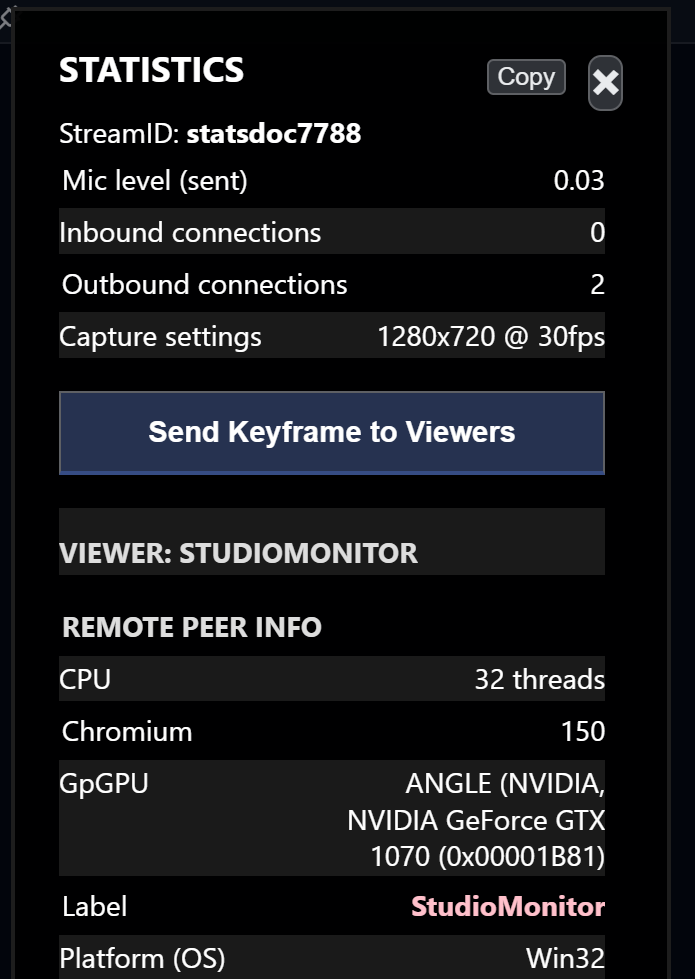
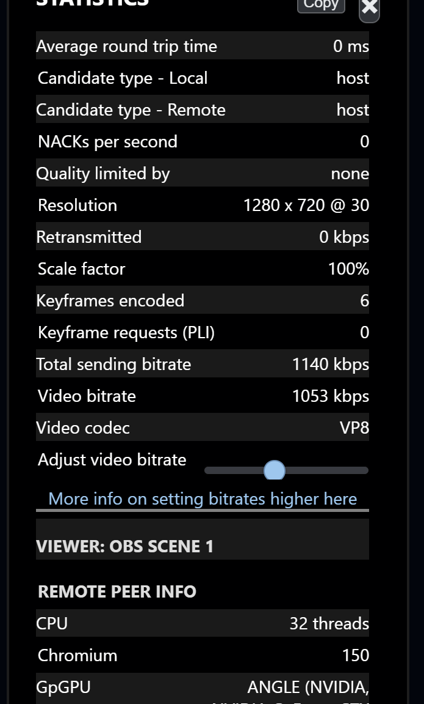
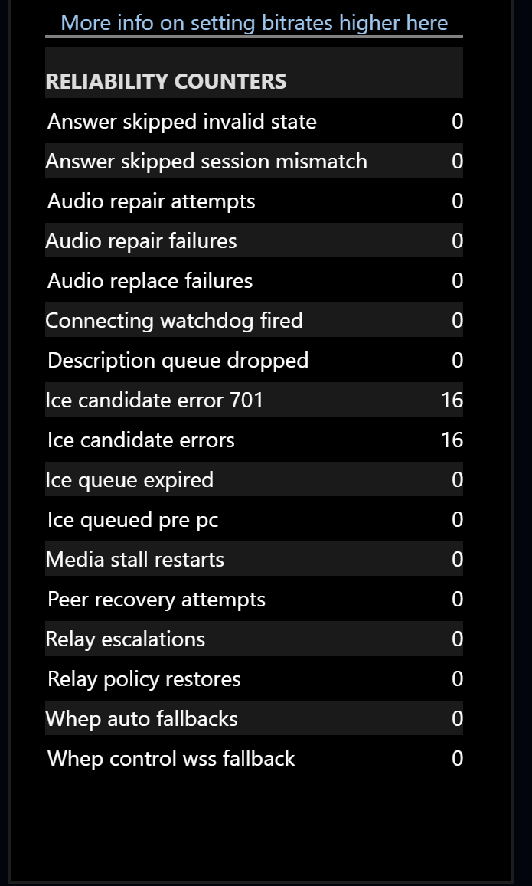

# Reading the publisher panel

This is the panel you get when you Ctrl + click **your own camera preview**, or click the connection readout in the page header. It describes what you are sending.

The key structural difference from the viewer panel: the publisher panel repeats a **whole block per connected viewer**. In ordinary peer-to-peer use, each viewer has a separate connection and can be limited differently.

## The top block

<figure><figcaption>
Session-wide information, then the first viewer's block.
</figcaption></figure>

| Field | Meaning |
| --- | --- |
| `StreamID` | Your own stream ID. Screen shares append `:s` |
| `Mic level (sent)` | The audio level actually reaching the encoder, 0 to 1. **If this stays at 0 while you speak, your viewers receive silence**, regardless of what your local meter shows |
| `Inbound connections` | How many streams you are receiving |
| `Outbound connections` | How many viewers are pulling from you |
| `Capture settings` | What your camera is actually producing, e.g. `1280x720 @ 30fps`. Compare this to the `Resolution` in each viewer block |

`Mic level (sent)` is measured after VDO.Ninja's audio pipeline, so it catches the whole class of problems where the meter in the UI looks fine but nothing is being transmitted — wrong device selected, a virtual cable with no input, or a gate closing.

**Send Keyframe to Viewers** forces a fresh keyframe to everyone. Useful when a viewer or OBS is showing a corrupted or frozen frame but the connection is otherwise healthy.

## One block per viewer

Each connected viewer gets a heading — their `&label` if they set one, otherwise a short identifier — followed by their machine details and then the stats for *your connection to them specifically*.

<figure><figcaption>
The per-viewer block, ending with the bitrate slider and the start of the next viewer's block.
</figcaption></figure>

### Remote Peer Info

The viewer's self-reported details: `CPU`, `GpGPU`, `Platform (OS)`, `User agent`, `VDO.Ninja Version`, and their `Label` highlighted in pink. These are useful context when a problem may be specific to one viewer, but they do not measure the viewer's current CPU or GPU load.

### Your connection to that viewer

| Field | Meaning | What to look for |
| --- | --- | --- |
| `Video bitrate` | What you are sending them for video | Compare to your intended target |
| `Audio bitrate` | What you are sending them for audio | A ⚠️ appears at 0. If it remains there while you speak, no audio data is reaching that viewer |
| `Total sending bitrate` | Everything on this connection including overhead and retransmissions | Should be a little above video + audio |
| `Available outgoing bitrate` | The congestion controller's estimate of what this path can currently carry | If this stays close to the actual bitrate while `Quality limited by` says `bandwidth`, the path is probably congestion-limited. It is an estimate, not a measured physical ceiling |
| `Quality limited by` | Why the browser is limiting resolution or frame rate | `none`, `bandwidth`, `cpu`, or `other` |
| `Resolution` | What you are actually encoding for this viewer, with fps | Often lower than your capture settings — that is `Scale factor` at work |
| `Scale factor` | How much the frame is being downscaled for this viewer | `100%` means full size |
| `Average round trip time` | Latency to that viewer | |
| `NACKs per second` | How often that viewer is asking you to resend lost packets | Sustained non-zero means loss on the path to them |
| `Retransmitted` | Bandwidth being spent resending lost packets | Large values mean you are paying twice for the same data |
| `Keyframes encoded` | Total keyframes produced | |
| `Keyframe requests (PLI)` | How many times that viewer asked for a fresh keyframe | Climbing means they keep losing sync |
| `Candidate type - Local` / `Remote` | How this connection was established | `relay` on either side means TURN is carrying it |
| `Audio codec`, `Video codec`, `Audio clock rate / channels` | What was negotiated | |

Because each viewer has their own block, you can compare paths. If one viewer shows `bandwidth` and heavy NACKs while three others are clean, the problem is specific to that viewer's end-to-end path; it does not prove which segment of that path is responsible.

If every viewer shows `bandwidth` at once, a shared sender-side constraint such as the publisher's uplink becomes more likely.

### Controls in each block

* **Trigger an ICE restart** renegotiates the network path for that one viewer. Worth trying when a connection has degraded but not dropped — for example after a network change.
* **Disconnect this viewer** appears only when you are running with access approval — [`&prompt`](../../advanced-settings/settings-parameters/and-prompt.md), `&validate` or `&approve`.
* **Adjust video bitrate** is a live slider for that viewer's target bitrate. It appears by default outside group rooms; `&slider` or `&showslider` also exposes it in rooms. Dragging it applies on release.

You may also see `max bandwidth target`, `init bitrate target` and `current bitrate target` when those have been set by URL parameters. Clicking `init bitrate target` prompts you for a new value.

## Reliability counters

<figure><figcaption>
Internal recovery counters, at the bottom of the panel.
</figcaption></figure>

The last section is internal telemetry about VDO.Ninja's own connection-recovery machinery. In normal operation almost all of it reads `0`, and you can ignore it.

It becomes useful in two situations: when you are chasing an intermittent fault, and when someone helping you asks for it.

| Counter | Meaning if it is climbing |
| --- | --- |
| `Peer recovery attempts` | Connections are being rebuilt repeatedly — the session is unstable |
| `Media stall restarts` | Media stopped flowing and had to be kicked back into life |
| `Relay escalations` | Direct connections failed and traffic was pushed onto TURN |
| `Connecting watchdog fired` | Connections are timing out during setup |
| `Ice candidate errors` | Some candidates failed to gather. A non-zero count here is common and harmless on its own |
| `Audio repair attempts` / `failures` | The audio track needed intervention to keep running |

A handful of `Ice candidate error 701` entries is normal and does not indicate a problem. Sustained growth in `Peer recovery attempts` or `Media stall restarts` during a session does.

## Next

* [Reading the viewer panel](viewer-stats.md) — the other end of the same connection
* [Diagnosing problems](troubleshooting.md) — symptom-first recipes
