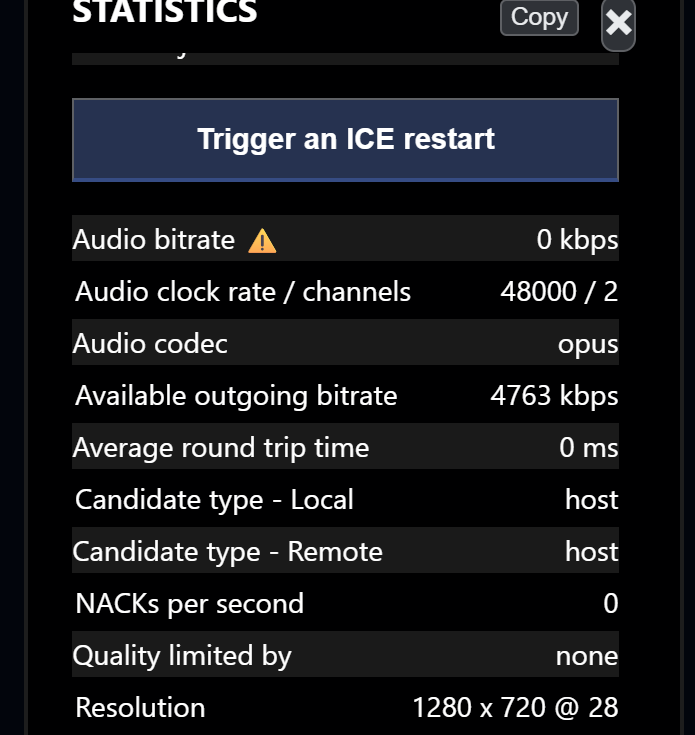

# Diagnosing problems with the stats panel

Each section below starts from something you can actually observe, tells you which numbers to read, and says what to change. Open the panel on **both** ends where you can — most wrong diagnoses come from looking at only one side.

## Video is blocky, soft, or keeps freezing

**Read, on the receiving side:** `Packet Loss`, `NACKs sent`, `Keyframes requested (PLI)`, `Jitter Buffer Delay`.

| Reading | Diagnosis | Action |
| --- | --- | --- |
| Current loss sample 0%, PLI climbing | The decoder keeps requesting refreshes. Earlier loss bursts, decoder resets or layer changes are possible | Have the sender press **Send Keyframe to Viewers** once, then watch whether PLI continues climbing |
| Loss under 1%, occasional NACKs | Retransmission is probably recovering isolated missing or reordered packets | Monitor it; investigate if the counters keep climbing alongside visible freezes |
| Loss 1–5%, PLIs climbing | The path is degraded and retransmission may not be keeping up | Lower the bitrate, add `&buffer=500`, or reduce resolution or frame rate |
| Loss above 5% | The path is dropping a substantial part of the stream | Drop to a much lower profile — see [stable IRL streaming](../irl-streaming-stability.md) |
| Current loss sample 0% but jitter buffer climbing | Packets are arriving unevenly even though this sample shows little or no loss | Check for an overloaded or wireless network; try a wired connection or add buffer |

The counter-intuitive one: **raising the bitrate when you have packet loss makes it worse.** More data on a path that is already dropping packets means more retransmissions, more keyframes, and more loss. If loss is high, go down, not up.

## The bitrate is far lower than I asked for

**Read, on the sending side:** `Available outgoing bitrate`, `Quality limited by`, `Scale factor`.

The order to check:

1. **`Quality limited by` says `bandwidth`** — compare `Video bitrate` to `Available outgoing bitrate`. If they remain close, the congestion controller currently believes that path is at its safe limit. A higher target is unlikely to help.
2. **`Quality limited by` says `cpu`** — see [CPU is the bottleneck on the sending side](#cpu-is-the-bottleneck-on-the-sending-side) below.
3. **`Quality limited by` says `none` but the bitrate is still low** — the browser is not currently limiting resolution or frame rate. Check your `&videobitrate` / `&maxvideobitrate` settings, the room's bitrate rules, and whether a static or low-detail scene simply needs fewer bits.
4. **`Scale factor` is below 100%** — the frame is being downscaled. In VDO.Ninja this is usually deliberate: the viewer requested a smaller size because the video is drawn small on their screen.

Then check the receiving side: if the viewer's `Requested resolution` is small, the sender is being asked for a small stream and is doing exactly what it was told. That is the bandwidth optimisation working, not a fault. Use `&scale` on the view link if you need to force it larger.

See [how to control bitrate/quality](../how-do-i-control-bitrate-quality.md) for the parameters themselves.

## Nobody can hear me, or a guest has no audio

This is where the panel saves the most time, because it splits one vague symptom into four distinct causes.

**On the sending side**, read `Mic level (sent)` and `Audio bitrate`:

| Reading | Cause |
| --- | --- |
| `Mic level (sent)` stays at 0 while speaking | The microphone pipeline is producing silence. Check the selected device, OS mute, gate, and any virtual cable input |
| `Mic level (sent)` is healthy, `Audio bitrate` stays at 0 ⚠️ | Audio is being captured but no audio data is reaching that viewer |
| Both healthy | You are sending audio correctly. The problem is on the receiving end |
| No `Audio bitrate` row at all for a viewer | No audio track was negotiated with them — check whether that viewer used `&noaudio` |

<figure><figcaption>
A ⚠️ next to a bitrate means the track exists but nothing is moving through it. Hover it for the explanation.
</figcaption></figure>

**On the receiving side**, look for the *Audio track* section:

* **No Audio track section at all** — nothing is arriving. Go back to the sender.
* **Section present, `Bitrate` healthy, `Audio Level` at 0** — the sender is transmitting silence.
* **Section present, `Audio Level` moving** — audio is arriving fine and the problem is local: output device, browser volume, or the stream being muted in your scene.

## The connection is using a relay

**Read:** `Candidate type - Local` and `Candidate type - Remote`, on either side.

`relay` (shown as `💸 relay server`) means the selected path is being carried through a TURN server. It can add latency, consume relay capacity and incur hosting cost. A relay is not automatically faulty, and it does not imply a particular fixed bitrate ceiling.

If you also see `⚠️ You're blocking` or `⚠️ They're blocking`, a browser or system setting at that end is actively preventing direct connections — often a VPN, a privacy extension, or a corporate network policy.

What to try, in order:

1. Disable VPNs and WebRTC-blocking browser extensions at both ends.
2. Get at least one end off a restrictive network (mobile hotspot is a quick test).
3. If relay is unavoidable and the stats show congestion, try a lower bitrate target; relays are shared infrastructure and can have capacity or policy limits.

`host` means a host/interface candidate and `srflx` means a public NAT mapping discovered through STUN. A host-host pair often indicates a LAN path, while a pair using `srflx` can connect directly across the internet without TURN.

## CPU is the bottleneck on the sending side

**Read:** `Quality limited by` = `cpu`, plus `CPU`, `GpGPU` and `Power level` in the sender's info.

The encoder cannot keep up. Raising the bitrate will not help. In rough order of effectiveness:

1. Lower the frame rate and/or resolution. Frame rate is often the first trade-off for motion-heavy video; resolution may matter more when fine detail is unnecessary.
2. Switch codec. H.264 usually has hardware encoding available where VP8/VP9 do not. See [hardware-accelerated video encoding](../hardware-accelerated-video-encoding.md).
3. Reduce the number of viewers pulling directly from that sender. Every viewer is a separate encode.
4. Close other applications, and check `Power level` — battery-saving or thermal modes may reduce performance.

For phone guests, also check `Plugged in`. A hot phone or one in low-power mode may throttle, but the battery percentage alone does not establish that it has.

## The connection keeps dropping and re-establishing

**Read:** `Time active` on the receiving side, and the `Reliability counters` on the sending side.

`Time active` resetting to zero repeatedly is the clearest signal that the connection is flapping rather than merely degraded. On the sending side, watch whether `Peer recovery attempts` and `Media stall restarts` climb during the session.

If they do, the network path is unstable rather than merely slow. `&autorecover` and a lower, more conservative bitrate profile will do more than any quality setting. See [handling guest disconnects](../handling-guest-disconnects-and-connection-recovery.md).

## Video is fine but badly out of sync with audio

**Read:** `Jitter Buffer Delay` on both tracks, and `Total Playout Delay` if you are using `&buffer`.

Audio and video have independent jitter buffers, and a large gap between the two is the usual cause of drift. [`&buffer`](../../advanced-settings/view-parameters/buffer.md) on the viewer sets a target playout delay for both tracks, which trades a little latency for sync. If audio specifically needs a different target, [`&bufferaudio`](../../advanced-settings/audio-parameters/and-bufferaudio.md) overrides it for the audio track alone.

Note that `Total Playout Delay` does **not** include Bluetooth headphone latency, monitor delay, or capture-card delay. If the numbers look right and it still sounds wrong, suspect the hardware after the browser.

## What to do when none of this helps

Use the **Copy** button and share the output. Capture both panels if you can: comparing sender and receiver often narrows the problem, even when it cannot identify the exact network segment at fault.

* [Asking an AI to read your stats](llm-prompt.md) — a prompt that gives an LLM the context to interpret the dump
* The [VDO.Ninja Discord](https://discord.vdo.ninja) — include both stats dumps and your full URLs, with any sensitive parts redacted
