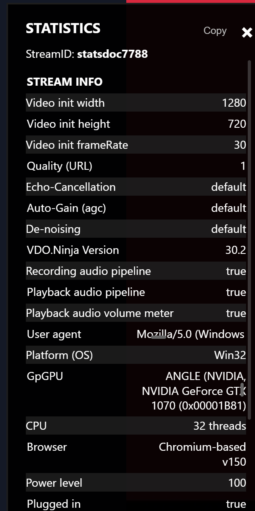
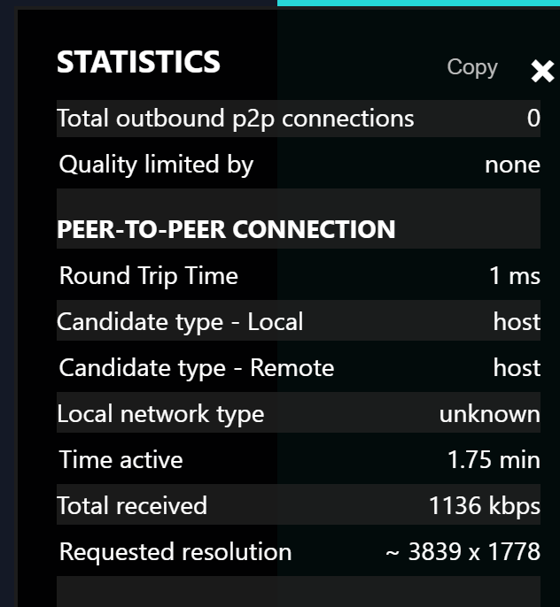
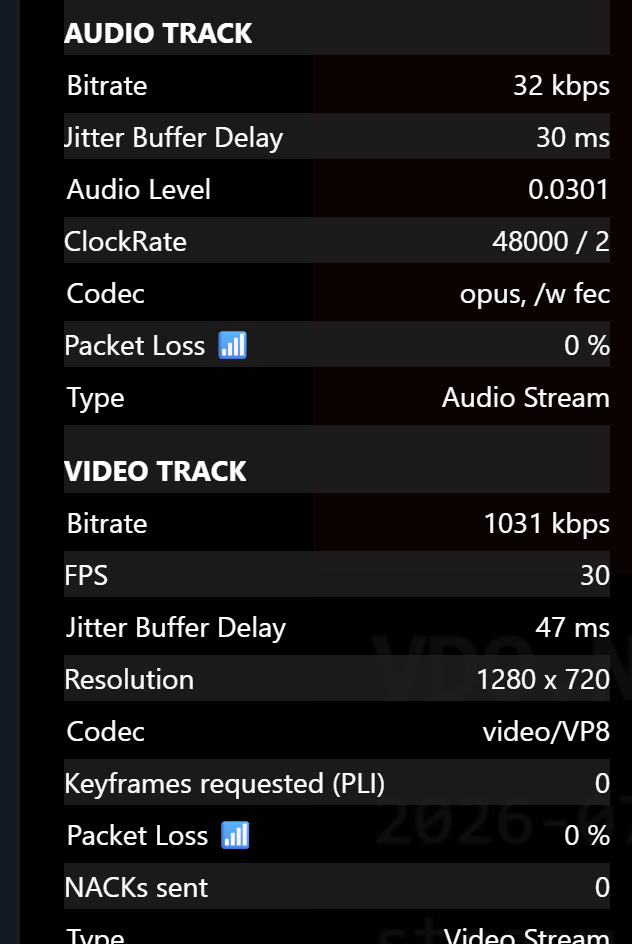

# Reading the viewer panel

This is the panel you get when you Ctrl + click a **remote** video — a guest in your room, or a stream you are viewing in OBS. It describes what is arriving at your machine.

The panel opens with `StreamID:` so you always know which stream you are looking at. That matters when several guests are on screen.

## Stream info

<figure><figcaption>
Stream info describes the <em>sender's</em> machine and settings, not yours.
</figcaption></figure>

Everything in this section is **self-reported by the person sending the video**. It is not measured by you. This is the single most misread part of the panel: `CPU`, `GpGPU`, `Platform (OS)` and `Power level` all belong to the guest, not to you.

| Field | Meaning |
| --- | --- |
| `Video init width` / `height` / `frameRate` | What the sender asked their camera for. Not necessarily what is being sent right now — compare against `Resolution` under Video track |
| `Quality (URL)` | The sender's `&quality` setting |
| `Echo-Cancellation`, `Auto-Gain (agc)`, `De-noising` | The sender's audio processing. `default` means they did not override it and the browser decides — which is not the same as "off" |
| `Pro-Audio (Stereo-mode)` | Only appears if the sender used `&stereo`. Higher-fidelity audio modes usually need headphones at both ends |
| `VDO.Ninja Version` | The sender's version. Mismatched versions are worth noting when something behaves oddly |
| `User agent`, `Platform (OS)`, `Browser` | The sender's browser and OS. Click the user agent to copy it |
| `GpGPU`, `CPU` | The sender's graphics adapter and core count. A weak GPU here explains encoder trouble |
| `Power level`, `Plugged in` | The sender's battery. **Very useful for phone guests** — a phone below ~20% or running hot will throttle its encoder and there is nothing you can do from your end |
| `Quality limited by` | Why the sender's encoder is holding back: `none`, `bandwidth`, `cpu`, or `resolution` |
| `Total outbound p2p connections` | How many viewers the sender currently has, updated within a few seconds of anyone joining or leaving. The same count can be shown as a 🔗 badge on the video itself with [`&showconnections`](../../advanced-settings/settings-parameters/and-showconnections.md) |

`Quality limited by` is the highest-value field in this section. If a guest looks soft and it says `cpu`, no amount of bitrate tuning on your side will fix it.

## Peer-to-peer connection

<figure><figcaption>
The transport between you and the sender.
</figcaption></figure>

This section describes the network path itself, measured by your machine.

| Field | Meaning | What to look for |
| --- | --- | --- |
| `Round Trip Time` | Network latency there and back | Stable is more important than low. A number that swings around indicates a congested path |
| `Candidate type - Local` | How **your** end connected | `host` = direct, same network. `srflx` = direct through NAT. `relay` = via a TURN server |
| `Candidate type - Remote` | How **their** end connected | Same values. If either side says `relay`, the whole connection is relayed |
| `Local network type` | Your interface type where the browser exposes it | Often `unknown`; Chrome hides this for privacy |
| `Time active` | How long this connection has been up | Resets on reconnect. A number that keeps resetting means the connection is flapping |
| `Total received` | Total inbound bitrate on this connection | Includes every track plus protocol overhead, so it reads slightly higher than the per-track bitrates added together |
| `Requested resolution` | The size your viewer has asked the sender to send | In **device pixels**, so on a HiDPI screen it will look larger than your window. `~` means the request was snapped to a nearby standard size |

`Requested resolution` surprises people. VDO.Ninja asks for the resolution that matches how large the video is actually drawn on your display, multiplied by your device pixel ratio. A small video in a grid genuinely does request a small resolution — that is the bandwidth optimisation working as intended. See [`&scale`](../../advanced-settings/view-parameters/scale.md) if you need to override it.

## Audio track and Video track

<figure><figcaption>
One section per incoming track. If a section is missing, that track is not being received at all.
</figcaption></figure>

Each incoming track gets its own section. **A missing section is itself a diagnosis**: if there is no *Audio track* section, no audio is arriving, and the problem is at the sender or in the negotiation — not in your speakers.

| Field | Applies to | Meaning |
| --- | --- | --- |
| `Bitrate` | both | Actual received bitrate for this track. A ⚠️ appears here if it drops to zero while the track still exists |
| `FPS` | video | Frames per second actually being decoded |
| `Resolution` | video | The size actually arriving. Compare to `Requested resolution` above and to the sender's `Video init width/height` |
| `Jitter Buffer Delay` | both | How much delay the receiver is adding to smooth out uneven arrival. Rising jitter buffer is an early warning of network trouble, before packet loss shows up |
| `Audio Level` | audio | Current loudness, 0 to 1. If this sits at exactly 0 while bitrate is healthy, the sender is transmitting silence |
| `ClockRate` | audio | Sample rate and channel count, e.g. `48000 / 2` |
| `Codec` | both | The negotiated codec. `opus, /w fec` means forward error correction is active on audio |
| `Packet Loss` | both | Percentage of packets that never arrived |
| `Keyframes requested (PLI)` | video | How many times your end has asked for a fresh keyframe. Climbing steadily means your decoder keeps losing sync |
| `NACKs sent` | video | How many times your end asked for a specific lost packet to be resent |
| `Type` | both | Which kind of track this is |

### How these interact

Packet loss, NACKs and PLIs are a chain, not three separate numbers:

1. Packets are lost.
2. Your end sends **NACKs** asking for them again.
3. If too much is lost to recover, your end gives up and requests a **keyframe (PLI)**.
4. The keyframe is large, which briefly spikes bandwidth and can cause more loss.

So a rising PLI count usually means the loss is bad enough that retransmission is not keeping up. Visually this is the classic "freeze, then snap back into focus" artefact.

## Extra rows you may see

These only appear in specific configurations:

| Field | When |
| --- | --- |
| `Added Buffer Delay`, `Total Playout Delay` | You are using [`&buffer`](../../advanced-settings/view-parameters/buffer.md) or [`&bufferaudio`](../../advanced-settings/audio-parameters/and-bufferaudio.md). `Total Playout Delay` is network latency plus jitter buffer plus any buffer you added — but it does not include Bluetooth, monitor or capture delay |
| `Video Buffer: Target / Current`, `Audio Buffer`, `Video Repairs: FEC / NACK` | The stream is in chunked mode. `(rebuffering)` in red means playback has stalled while it refills |
| `Candidate type` showing `💸 relay server` | A TURN relay is carrying the traffic. See [relay connections](troubleshooting.md#the-connection-is-using-a-relay) |
| `⚠️ You're blocking` / `⚠️ They're blocking` | A browser or system setting is preventing a direct peer-to-peer connection at that end |
| A map with coordinates | The sender is sharing location data |

## Next

* [Reading the publisher panel](publisher-stats.md) — the other end of the same connection
* [Diagnosing problems](troubleshooting.md) — what to actually do about these numbers
