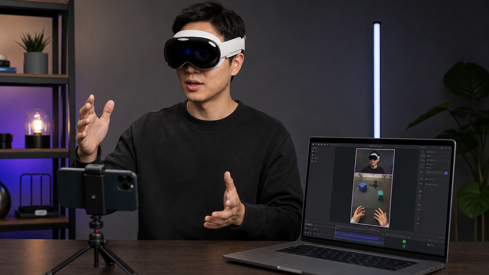
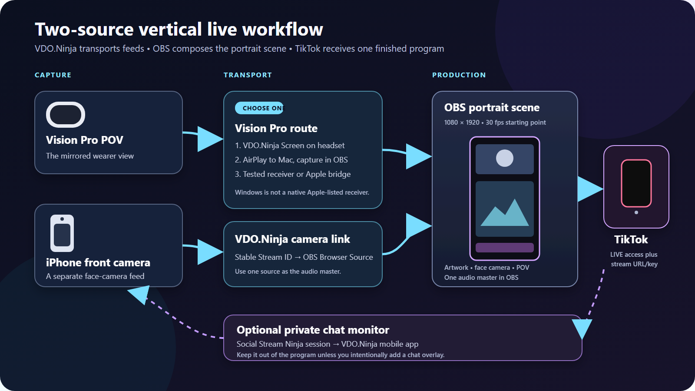

# Stream Apple Vision Pro POV and an iPhone camera to TikTok with OBS

This workflow combines two independent live pictures into one portrait program:

* The view mirrored from an Apple Vision Pro.
* A separate iPhone front camera.
* Optional TikTok chat monitored privately through Social Stream Ninja.
* A custom background or transparent overlay.
* OBS Studio as the compositor and TikTok publisher.

VDO.Ninja transports live feeds into OBS. OBS positions, crops, mixes, records, and encodes them. TikTok receives only the finished OBS program.

<figure><figcaption><p>Conceptual hardware layout. The generated interface shown on the laptop is illustrative, not an exact OBS screenshot.</p></figcaption></figure>


This guide uses OBS to publish directly when TikTok has provided the account with a stream server URL and stream key. TikTok controls LIVE access, and its requirements vary by account and region. If the account only has TikTok LIVE Studio access, the capture and layout principles still apply, but the final publishing handoff is different.


## How the pieces fit together

<figure><figcaption><p>Choose one Vision Pro route. The iPhone face camera remains a separate source. Social Stream Ninja can return chat privately without placing it in the public program.</p></figcaption></figure>

## What is confirmed, and what still needs a device test

The foundations of this workflow are documented by the platform owners:

* Apple supports mirroring the Vision Pro view to an iPhone, iPad, supported Mac, Apple TV 4K, or AirPlay-compatible television. Apple states that Video Mirroring can share the view at up to 1080p. [Apple Vision Pro mirroring instructions](https://support.apple.com/en-us/119944)
* The VDO.Ninja App Store listing includes Apple Vision compatibility and documents camera or ReplayKit-based screen publishing into a VDO.Ninja view link. [VDO.Ninja on the App Store](https://apps.apple.com/us/app/vdo-ninja/id1607609685)
* OBS Browser Source is available on Windows, macOS, and Linux and accepts a URL plus a defined viewport size and frame rate. [OBS Browser Source documentation](https://obsproject.com/kb/browser-source)
* TikTok LIVE Studio supports portrait scenes, multiple sources, preview, audio mixing, and performance monitoring. [TikTok LIVE Studio basics](https://www.tiktok.com/live/studio/help/article/Get-started-with-your-first-LIVE/Learn-the-basics-of-LIVE?lang=en)

The following still needs testing on the exact devices and OS versions used for the production:

* Direct ReplayKit screen publishing from the VDO.Ninja app running on Vision Pro. The App Store entry establishes install compatibility only; it does not establish reliable screen publishing on every visionOS release.
* Any third-party Windows AirPlay receiver. Windows is not included in Apple's official Vision Pro mirroring destination list.
* System audio from the mirrored or screen-shared content. Confirm it with the OBS audio meters and a recording; do not assume every app exposes its audio.
* End-to-end latency and thermal stability for the intended stream duration.

## What you need

* Apple Vision Pro.
* An iPhone for the separate front-camera shot.
* The [VDO.Ninja native mobile app](../steves-helper-apps/native-mobile-app.md) on each Apple device that will publish through VDO.Ninja.
* OBS Studio on a Mac, Windows PC, or Linux computer.
* A reliable local network. Ethernet from the production computer to the router is useful when available.
* TikTok LIVE access. Direct OBS publishing also requires a stream server URL and stream key supplied by TikTok.
* A portrait scene design, ideally exported at `1080x1920`.
* Headphones if any source audio will be monitored in the room.


Do not plan on one iPhone providing two independent VDO.Ninja streams at once. The documented native-app modes select a camera or the screen. The optional front-and-rear camera mix is one composited camera stream; it is not a separate Vision Pro screen feed plus face camera.


## Step 1: Choose the Vision Pro route

Only one of the following routes is needed.

### Route A: Publish the Vision Pro screen directly through VDO.Ninja

This route has the fewest hops when it works on the target Vision Pro and visionOS version.

1. Install the VDO.Ninja app on Vision Pro.
2. Choose **SCREEN**.
3. Set a stable, private Stream ID such as `VISIONPOV7F3K`. Stream IDs are case-sensitive; use only letters and numbers for the most predictable result.
4. Tap **Connect**.
5. Start the VDO.Ninja broadcast service when the system screen-broadcast picker appears.
6. Open the matching view link on the OBS computer and verify motion, orientation, and audio before continuing.

Example viewer link:

```text
https://vdo.ninja/?view=VISIONPOV7F3K&cleanoutput&noaudio&videobitrate=6000
```

Replace every example Stream ID in this guide with a unique value of your own.

[`&cleanoutput`](../advanced-settings/design-parameters/cleanoutput.md) hides production UI. [`&noaudio`](../advanced-settings/view-parameters/noaudio.md) makes this a video-only source when another microphone will be the audio master. [`&videobitrate=6000`](../advanced-settings/video-bitrate-parameters/bitrate.md) is a starting request from the viewer, not a guaranteed rate; lower it if the network or computer cannot sustain it.


Treat this route as conditional until it passes a full-length test on the exact Vision Pro. If screen publishing is unavailable, unstable, or does not show the intended wearer view, use Route B or C.


### Route B: Mirror Vision Pro directly to a Mac

This uses Apple's documented AirPlay path and does not require VDO.Ninja for the Vision Pro picture.

1. Connect the Vision Pro and Mac to the same network and enable Wi-Fi and Bluetooth.
2. On the Mac, open **System Settings** -> **General** -> **AirDrop & Handoff**, then enable **AirPlay Receiver**.
3. On Vision Pro, open Control Center, choose **Mirror My View**, and select the Mac.
4. In OBS, add **macOS Screen Capture** and select the display, window, or application area showing the mirrored view.
5. Crop away any receiver controls or unused borders.

Apple documents mirroring at up to 1080p. Protected movies, television programs, and similar protected video may appear black in the mirror. [Apple Vision Pro mirroring limitations](https://support.apple.com/en-us/119944)

### Route C: Use an Apple device as a bridge to a Windows computer (conditional)

Apple's supported destination list does not include Windows. A practical bridge is therefore:

```text
Vision Pro -> AirPlay to iPhone or iPad -> VDO.Ninja Screen -> OBS on Windows
```

1. On the bridge iPhone or iPad, configure the VDO.Ninja app's **SCREEN** mode and Stream ID.
2. Start the VDO.Ninja ReplayKit broadcast service.
3. Return to the Apple Vision Pro app, enable **AirPlay Receiver**, and leave that app in the foreground.
4. From Vision Pro, choose **Mirror My View** and select the bridge device.
5. Add the bridge device's VDO.Ninja view link to OBS as described below.

Test this exact chain before relying on it. ReplayKit controls which video and audio samples an iOS app receives. In the European Union, Apple says the Apple Vision Pro app must be open and in the foreground for the iPhone or iPad to appear as a mirroring destination in Vision Pro Control Center. If the bridge is the only iPhone available, use a different device or webcam for the face camera.

A third-party Windows AirPlay receiver is another possibility, but it is not an Apple-supported path. Validate its latency, picture quality, audio behavior, licensing, and stability before a live production.

## Step 2: Publish the iPhone front camera

1. Mount the iPhone securely. Use landscape orientation if the design uses a wide face-camera window.
2. Open the VDO.Ninja native app and choose **FRONT CAMERA**.
3. Set a different stable Stream ID, such as `PHONECAM8R2M`.
4. Select the microphone only if this phone will be the program's audio master.
5. Tap **Connect** and grant camera and microphone permissions when requested.
6. Keep the phone powered and run a thermal test for at least as long as the planned LIVE.

Example viewer link when the phone supplies program audio:

```text
https://vdo.ninja/?view=PHONECAM8R2M&cleanoutput&videobitrate=4000
```

If a USB microphone or another OBS source supplies program audio, add `&noaudio`:

```text
https://vdo.ninja/?view=PHONECAM8R2M&cleanoutput&noaudio&videobitrate=4000
```

Use private, difficult-to-guess Stream IDs and a matching password when appropriate. See [stream IDs](../getting-started/stream-ids.md) and [permanent links](how-to-get-permanent-links.md) for the security and reuse details.

## Step 3: Add the VDO.Ninja feeds to OBS

For each VDO.Ninja feed:

1. In OBS, select **Sources** -> **+** -> **Browser Source**.
2. Give the source a clear name, such as `iPhone Face Camera` or `Vision Pro POV`.
3. Paste the matching VDO.Ninja viewer link.
4. For a landscape source, start with a Browser Source viewport of `1280x720` and 30 fps. For a portrait phone source, use `720x1280`.
5. Leave **Shutdown source when not visible** disabled so hiding the source does not intentionally tear down its page.
6. Leave **Refresh browser when scene becomes active** disabled unless automatic reloads are specifically wanted.
7. Enable **Control audio via OBS** only for a Browser Source whose audio OBS should mix.

OBS renders a Browser Source at the width, height, and frame rate set in its properties. Those values are separate from the source's final size on the portrait canvas. [OBS Browser Source properties](https://obsproject.com/kb/browser-source)


If a VDO.Ninja link works in Chrome but not in OBS, use the [Enabling WebRTC Sources in OBS](enabling-webrtc-sources-in-obs.md) troubleshooting guide.


## Step 4: Build the portrait OBS scene

Open **Settings** -> **Video** and use:

| Setting | Normal starting point | Lower-load starting point |
| --- | --- | --- |
| Base (Canvas) Resolution | `1080x1920` | `1080x1920` |
| Output (Scaled) Resolution | `1080x1920` | `720x1280` |
| Common FPS Value | `30` | `30` |

The Base Canvas is the workspace in which the sources are positioned. The Output Resolution is the encoded stream size. OBS documents these as separate controls and notes that 60 fps requires substantially more resources than 30 fps. [OBS Studio video settings](https://obsproject.com/kb/obs-studio-overview#video)

### Use the correct source order

OBS draws sources from the bottom of the Sources list upward. A source higher in the list covers sources below it. [OBS Sources Guide](https://obsproject.com/kb/sources-guide)

For artwork with transparent video openings, use this order from top to bottom:

1. Labels or intentional public chat graphics.
2. Transparent overlay PNG.
3. iPhone face camera.
4. Vision Pro POV.
5. Background image or color.

For a flattened background with opaque black rectangles, use this order instead:

1. Labels.
2. iPhone face camera.
3. Vision Pro POV.
4. Flattened artwork or background.

A `.png` filename does not guarantee transparency. Transparent openings should show a checkerboard in an image editor. If the openings are solid black, the image must sit below the videos or be re-exported with an alpha channel.

### Crop; do not stretch

Scale each video proportionally until it fills its intended window, then crop the excess:

* Windows and Linux: hold `Alt` while dragging a source edge.
* macOS: hold `Option` while dragging a source edge.
* For precise values, right-click the source and open **Transform** -> **Edit Transform**.

Stretching a landscape feed into a non-matching frame distorts faces and the Vision Pro view. OBS recommends scaling and cropping rather than stretching. [OBS aspect-ratio and cropping guide](https://obsproject.com/kb/aspect-ratio-guide)

Designing both video openings at `16:9` avoids unnecessary cropping. If the artwork uses a wider or taller opening, decide in advance which part of the source may be lost.

## Step 5: Choose one program-audio master

The simplest reliable setup has one voice source:

* The iPhone microphone, or
* A microphone connected directly to the OBS computer.

Add `&noaudio` to every VDO.Ninja view link that should be video-only. This prevents duplicated room sound and simplifies troubleshooting. If the Vision Pro content also needs audio, enable it deliberately as a separate OBS mixer source and verify the result with headphones.

Use **Control audio via OBS** when individual Browser Source volume, filters, or routing are needed. OBS added this control so Browser Source audio can appear independently in its mixer. [OBS Browser Source audio control](https://obsproject.com/blog/progress-report-september-2019#browser-source-audio-can-now-go-through-obs)

Before going live, record at least five minutes locally and listen to the file. Check for:

* A single clean voice rather than two delayed copies.
* Hiss, clipping, or automatic gain pumping.
* Vision Pro content audio, if required.
* Lip sync during a hand clap or spoken count.

If noise appears only after opening TikTok on a capture iPhone, keep TikTok off that phone. Let OBS on the computer publish to TikTok and use the mobile app only for its assigned capture or monitoring role.

## Step 6: Optionally monitor TikTok chat privately

Social Stream Ninja can collect TikTok LIVE chat on the production computer and send it to the VDO.Ninja mobile app without placing it in the public OBS scene.

1. Install the current Social Stream Ninja browser extension or standalone app from the [official Social Stream Ninja repository](https://github.com/steveseguin/social_stream).
2. Open the TikTok LIVE page while signed in and keep its chat open. The extension version currently requires the TikTok chat to remain open and visible.
3. Enable chat streaming in Social Stream Ninja and note its Session ID.
4. In the VDO.Ninja mobile app, enable **Social Stream**, enter the same Session ID, and select the desired WebRTC or server connection mode.
5. Disable chat text-to-speech unless it is intentionally part of the audio design.

TikTok chat is a currently supported Social Stream Ninja source, and the current VDO.Ninja iOS app includes Social Stream Ninja integration. [Social Stream Ninja supported sources](https://github.com/steveseguin/social_stream#supported-sites)

Do not add a Social Stream featured or dock URL to the OBS scene unless viewers are meant to see chat publicly.

## Step 7: Send the OBS program to TikTok

If TikTok supplied a stream server URL and stream key:

1. Open **OBS Settings** -> **Stream**.
2. Select **Custom** as the service.
3. Enter the server URL supplied by TikTok.
4. Enter the stream key supplied by TikTok.
5. Keep the stream key secret. Do not include it in screenshots, scene collections, or support messages.
6. Use TikTok's current LIVE Center recommendations for bitrate, encoder, and keyframe interval rather than copying an old preset from another guide.
7. Start with a private or limited test if the account provides one, or record locally while previewing every source before the public LIVE.

OBS supports custom streaming servers and a separate stream-key field. [OBS Stream settings](https://obsproject.com/kb/obs-studio-overview#stream)

TikTok LIVE access requirements vary by region and can change without notice. [TikTok LIVE Studio access information](https://www.tiktok.com/live/studio/help/article/Before-you-go-LIVE/Apply-for-LIVE-access?lang=en)

## Performance and latency tuning

Every extra capture or transport hop can add delay. Compare the available Vision Pro routes rather than assuming the most complicated route is best.

For an older laptop or a system showing lag:

1. Use `720x1280` output at 30 fps.
2. Keep VDO.Ninja Browser Sources at `1280x720` rather than unnecessarily decoding 4K video.
3. Lower `&videobitrate` in steps, such as from `6000` to `4000` or `2500`.
4. Select a hardware encoder in OBS when the computer offers a supported one.
5. Remove unnecessary browser sources, animated overlays, filters, and duplicate previews.
6. Open **View** -> **Stats** and watch rendering lag, encoding lag, and network dropped frames during a recording or test stream.
7. Keep the production computer cool and connected to power.

OBS confirms that scene compositing requires GPU resources and recommends lowering output resolution or frame rate and simplifying scenes when encoding cannot keep up. [OBS encoding performance troubleshooting](https://obsproject.com/kb/encoding-performance-troubleshooting)

## Common problems

| Symptom | Likely cause | Fix |
| --- | --- | --- |
| Portrait artwork appears tiny with large black areas | OBS still has a landscape Base Canvas | Change Base Canvas to `1080x1920`, then realign the sources. |
| Video disappears behind the design | The artwork is opaque or the source order is wrong | Put flattened artwork below video, or export transparent cutouts and put the overlay above video. |
| Faces or POV look unnaturally wide or tall | The source was stretched | Restore its aspect ratio, scale it to fill, and crop the excess. |
| Only the Vision Pro feed or face camera is available | One iPhone is being asked to bridge the mirror and act as the independent camera | Publish directly from Vision Pro, AirPlay to a Mac, or add a second camera/bridge device. |
| Mirrored protected video is black | Apple blocks protected video from Vision Pro mirroring | Use content that permits mirroring; this is not an OBS or VDO.Ninja defect. |
| Feed is smooth in one browser but delayed in OBS | Browser Source settings, computer load, or a different network route | Match the Browser Source viewport to the source, reduce load, and compare OBS statistics. |
| Voice has echo or hiss | More than one audio path is active | Keep one audio master, add `&noaudio` to video-only links, and test a local recording. |
| TikTok chat stops updating | The source chat was closed, hidden, or the Session IDs differ | Keep TikTok chat visible when using the extension and confirm both Session IDs match. |

## Pre-LIVE checklist

* Both VDO.Ninja links reconnect after a deliberate refresh.
* The OBS Base Canvas is portrait and the output has no unintended side bars.
* Video is cropped without stretching.
* Exactly one intended voice path reaches the OBS program mix.
* A local test recording has been watched and heard from beginning to end.
* The Vision Pro route remains stable for the intended session length.
* OBS statistics do not accumulate rendering, encoding, or network frame loss.
* The iPhone and Vision Pro are powered, cool, and on the intended network.
* Notifications and private information are hidden from the mirrored Vision Pro view.
* The TikTok stream key is not visible anywhere in the scene or screenshots.

## Related guides

* [VDO.Ninja native mobile app guide](../steves-helper-apps/native-mobile-app.md)
* [How to screen share your iPhone or iPad](screen-share-your-iphone-ipad.md)
* [Video bitrate for push/view links](video-bitrate-for-push-view-links.md)
* [How to control bitrate and quality](how-do-i-control-bitrate-quality.md)
* [Enabling WebRTC Sources in OBS](enabling-webrtc-sources-in-obs.md)
* [Social Stream Ninja](../steves-helper-apps/social-stream-ninja/README.md)
