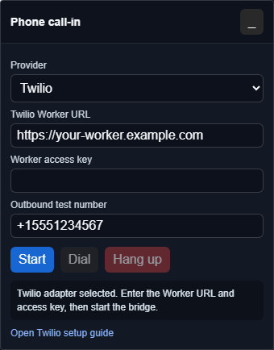

# Twilio phone call-in setup

This guide is for advanced users or operators testing the experimental Twilio call-in adapter. It assumes there is a compatible backend service, such as a Cloudflare Worker, that can mint Twilio Voice SDK tokens and answer Twilio webhooks.

Do not put Twilio account secrets in a VDO.Ninja URL, a public web page, or GitHub. Twilio Account Auth Tokens and API key secrets belong on the backend only.

Twilio is different from the generic SIP/PBX option. Twilio's browser path uses the Twilio Voice JavaScript SDK and short-lived Access Tokens generated by a backend. Twilio does not work as a simple `wss://` SIP-over-WebSockets account for the current VDO.Ninja SIP panel.

Last reviewed: July 9, 2026.

## What this creates

The call path is:

1. The VDO.Ninja director opens a URL with `&callin=twilio`.
2. The director panel asks the backend for a browser calling token and PIN.
3. Twilio registers the browser as a Voice SDK client.
4. A phone caller dials the Twilio number.
5. Twilio sends the call to the backend webhook.
6. The caller enters the PIN.
7. Twilio connects the phone call to the registered browser.
8. VDO.Ninja mixes the caller into the room and sends a return mix back to the caller.

<figure><figcaption><p>Twilio mode talks to a backend Worker. The browser never receives the Twilio API Key Secret or Auth Token.</p></figcaption></figure>

## Cost notes

Twilio charges for phone numbers and PSTN minutes. Check Twilio's current pricing before leaving a number active.

At the time this guide was tested, Twilio's account-specific pricing API reported these Canada rates for this account:

| Item | Example price |
| --- | --- |
| Canadian local number rental | 1.15 USD/month |
| Canadian local inbound voice | 0.0085 USD/minute |

Prices can change, and other countries or number types may cost more.

Useful Twilio references:

* [Available local number API](https://www.twilio.com/docs/phone-numbers/api/availablephonenumberlocal-resource)
* [Incoming phone number API](https://www.twilio.com/docs/phone-numbers/api/incomingphonenumber-resource)
* [Twilio Voice pricing](https://www.twilio.com/en-us/voice/pricing)

## 1. Create or find Twilio credentials

In the Twilio Console, collect these values:

| Value | Where it is used |
| --- | --- |
| Account SID | Backend token generation and Twilio REST API calls |
| Account Auth Token | Backend webhook signature validation |
| API Key SID | Backend token generation and optional Twilio REST API calls |
| API Key Secret | Backend token generation and optional Twilio REST API calls |

The Account SID and Auth Token are shown in the Twilio Console's Account Info area. API keys are managed in the API keys section of the Console.

Save the API Key Secret when Twilio shows it. Twilio will not show it again.

## 2. Create a TwiML App

In the Twilio Console:

1. Open **Voice**.
2. Open **TwiML Apps**.
3. Create a new TwiML App.
4. Set the Voice request URL to your backend route:

```
https://YOUR-CALLIN-BACKEND.example.com/twilio/incoming2
```

5. Set the method to `POST`.
6. Save the app.

Keep the TwiML App SID. It starts with `AP`.

## 3. Buy a phone number

In the Twilio Console:

1. Open **Phone Numbers**.
2. Choose **Buy a number**.
3. Select the country.
4. Filter for **Voice** capability.
5. For a local number, optionally filter by area code or locality.
6. Buy the number.
7. Open the number's configuration page.
8. Under voice handling, choose the TwiML App created above.
9. Save the number.

For Toronto-area testing, area codes such as `647` or `437` may have better availability than `416`.

## 4. Backend configuration

A compatible backend needs the following server-side configuration:

| Setting | Purpose |
| --- | --- |
| `TWILIO_ACCOUNT_SID` | Account SID |
| `TWILIO_AUTH_TOKEN` | Webhook signature validation |
| `TWILIO_API_KEY_SID` | Voice SDK token issuer |
| `TWILIO_API_KEY_SECRET` | Voice SDK token signing secret |
| `TWILIO_APP_SID` | TwiML App SID |
| `PUBLIC_DIAL_NUMBER` | Phone number shown to the VDO.Ninja director |
| `TOKEN_API_KEY` | Optional access key protecting the backend token endpoint |

The backend should validate `X-Twilio-Signature` on Twilio webhook routes. It should also keep PINs short-lived and rate-limit bad attempts.

For BYO Twilio, the safest model is still server-side token minting. A user can run their own compatible backend, or a hosted VDO.Ninja backend can accept credentials only if that flow is designed carefully. Pasting a Twilio API Key Secret into browser-side code is not recommended.

## 5. Start VDO.Ninja

Use a director link with the experimental Twilio adapter:

```
https://vdo.ninja/alpha/?director=YourRoomName&callin=twilio&callinapi=https://YOUR-CALLIN-BACKEND.example.com
```

If the backend requires a token endpoint access key, enter it in the panel. Do not place the access key in a shared guest URL.

Click **Start**. The panel should show a phone number and PIN:

```
Call +15551234567 and enter PIN 1234567.
```

Give that number and PIN to the caller.

If the backend advertises outbound dialing support, the **Outbound test number** field can place a test call. Use E.164 format, such as `+15551234567`. This should stay restricted by the backend; do not offer unrestricted outbound dialing from a public Worker.

If the backend does not advertise outbound support, the **Dial** button remains unavailable for Twilio mode. Inbound PIN calling can still work.

## REST API alternative

The same Twilio setup can be automated with the REST API. Use placeholders only; do not paste real secrets into public documentation.

Search for available Canadian local voice numbers:

```bash
curl -G "https://api.twilio.com/2010-04-01/Accounts/ACxxxxxxxxxxxxxxxxxxxxxxxxxxxxxxxx/AvailablePhoneNumbers/CA/Local.json" \
  -u "SKxxxxxxxxxxxxxxxxxxxxxxxxxxxxxxxx:API_KEY_SECRET" \
  --data-urlencode "AreaCode=647" \
  --data-urlencode "VoiceEnabled=true"
```

Update a TwiML App's voice URL:

```bash
curl -X POST "https://api.twilio.com/2010-04-01/Accounts/ACxxxxxxxxxxxxxxxxxxxxxxxxxxxxxxxx/Applications/APxxxxxxxxxxxxxxxxxxxxxxxxxxxxxxxx.json" \
  -u "SKxxxxxxxxxxxxxxxxxxxxxxxxxxxxxxxx:API_KEY_SECRET" \
  --data-urlencode "VoiceUrl=https://YOUR-CALLIN-BACKEND.example.com/twilio/incoming2" \
  --data-urlencode "VoiceMethod=POST"
```

Buy a specific number and attach it to the TwiML App:

```bash
curl -X POST "https://api.twilio.com/2010-04-01/Accounts/ACxxxxxxxxxxxxxxxxxxxxxxxxxxxxxxxx/IncomingPhoneNumbers.json" \
  -u "SKxxxxxxxxxxxxxxxxxxxxxxxxxxxxxxxx:API_KEY_SECRET" \
  --data-urlencode "PhoneNumber=+15551234567" \
  --data-urlencode "FriendlyName=VDO.Ninja call-in" \
  --data-urlencode "VoiceApplicationSid=APxxxxxxxxxxxxxxxxxxxxxxxxxxxxxxxx" \
  --data-urlencode "VoiceReceiveMode=voice"
```

## Test checklist

Before using this live:

1. Start the VDO.Ninja director page with `&callin=twilio`.
2. Confirm the panel shows a phone number and PIN.
3. Call the number from a regular phone.
4. Enter the PIN.
5. Confirm the browser rings or auto-answers.
6. Confirm the VDO.Ninja guest hears the phone caller.
7. Confirm the phone caller hears the host and VDO.Ninja guest.
8. Confirm the phone caller does not hear a delayed copy of themselves.
9. Hang up and confirm the panel cleans up the call state.

## Troubleshooting

| Symptom | Likely cause |
| --- | --- |
| VDO.Ninja says the token endpoint is not configured | Backend secrets are missing or the wrong backend URL was entered. |
| Twilio says the application URL failed | The TwiML App voice URL is wrong, unreachable, or not using HTTPS. |
| Calls never reach the browser | The number is not attached to the TwiML App, the PIN expired, or the browser token was not registered. |
| Webhook requests fail with 403 | The backend is rejecting Twilio signatures; check the Auth Token and public webhook URL. |
| Caller hears echo | The return mix includes the phone caller audio. Check the VDO.Ninja call-in mix or external mixer routing. |

When testing is finished, release unused Twilio numbers so monthly rental charges stop.
