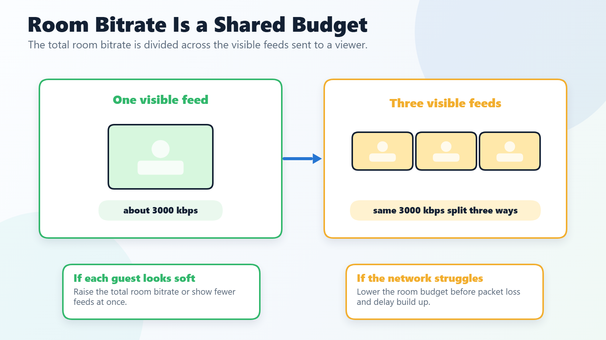

# Video bitrate in rooms

This guide will show you how to control and set up the bitrate in rooms as a director and as a guest.

## Default settings

In production-style rooms, every guest views the other room videos with a combined room bitrate of 500-kbps by default. This is a total budget, not a per-video value. If there is only one video stream, the guest will view that stream at about 500-kbps. With two visible video streams, each stream will be requested at about 250-kbps.

The room name itself does not permanently save this bitrate. To make a room start at a higher value each time, add a room bitrate parameter to the URL used to join the room.

For guest-only room calls, VDO.Ninja may use higher automatic room-only bitrate tiers. These tiers are designed for conferencing-style rooms where there is no director or scene viewer connected to the guest. The normal room-only tier is 2000-kbps and the lower mobile/protected tier is 1500-kbps. These automatic tiers do not apply when an explicit room bitrate is set or when a director or scene viewer is connected. See [room-only-mobile-bitrate-tiers.md](room-only-mobile-bitrate-tiers.md "mention") for details.

<figure><figcaption>
A total room bitrate is a shared room-viewing budget. More visible feeds means each feed gets a smaller share unless the total budget is raised.
</figcaption></figure>

## Which room bitrate option should I use?

| Goal | Parameter | Where to add it |
| --- | --- | --- |
| Raise the room's guest-to-guest viewing budget when a director is present | [`&totalroombitrate=4000`](../advanced-settings/video-bitrate-parameters/totalroombitrate.md) or `&trb=4000` | The main director/host link |
| Raise guest-to-guest viewing when no director is present | [`&totalroombitrate=4000`](../advanced-settings/video-bitrate-parameters/totalroombitrate.md) or `&trb=4000` | The guest room invite link; it affects that guest's own receive budget |
| Raise screen-share quality in a room | [`&screensharebitrate=4000`](../newly-added-parameters/and-screensharebitrate.md) or `&ssbitrate=4000` | Viewer, scene, director, or room links that receive the screen share |
| Cap how much other guests can pull from one guest | [`&roombitrate=1000`](../advanced-settings/video-bitrate-parameters/roombitrate.md) or `&rbr=1000` | That guest's link |
| Disable a guest's video to other guests, while keeping director or scene video available | `&roombitrate=0` | That guest's link |
| Let each guest adjust their own room receive budget | [`&controlroombitrate`](../advanced-settings/video-bitrate-parameters/and-controlroombitrate.md) or `&crb` | That guest's link |
| Force a minimum per visible room feed after the room total is split | `&minroombitrate=500` or `&mrb=500` | Room/director/guest link, used carefully |
| Tune guest-only automatic room tiers | `&roomtier2bitrate=2500` / `&roomtier1bitrate=1500` | Guest-only room links |
| Control OBS scene quality | [`&videobitrate`](../advanced-settings/video-bitrate-parameters/bitrate.md) or [`&totalscenebitrate`](../advanced-settings/video-bitrate-parameters/and-totalscenebitrate.md) | Scene, solo, or view link |

For most rooms where guests keep raising the room quality slider and a director/host is normally present, put `&trb=4000` on the director/host link.

## Priority order

1. If the main director is connected, the main director's current room bitrate is sent to guests and becomes their room bitrate.
2. If no main director is controlling the room bitrate, each guest uses their own URL setting, such as `&trb=4000`.
3. If a guest has no `&trb` / `&totalroombitrate`, `&videobitrate` can be used as that guest's total room bitrate target.
4. If no explicit room bitrate is set, VDO.Ninja uses the default room behavior. In guest-only rooms, automatic room-only tiers may raise the effective room budget.

This means a director link with `&trb=4000` is enough while the director is in the room. A guest link needs `&trb=4000` only if guests should have that higher room-viewing budget before a director joins, after the director leaves, or in rooms used without a director.

## Director

As a director of a room you can control the total room bitrate dynamically.

<figure><figcaption>
Open the room settings via this button as a director
</figcaption></figure>

<figure><figcaption>
The default is (as explained before) 500-kbps. You can increase it up to 4000-kbps by default (the slider max increases if a higher <code>&amp;totalroombitrate</code> is set).
</figcaption></figure>

You can control the total room bitrate also with a URL parameter: [`&totalroombitrate=6000`](../advanced-settings/video-bitrate-parameters/totalroombitrate.md). The short alias is `&trb=6000`.

<figure><figcaption>
Default is 6000-kbps now with <code>&#x26;totalroombitrate=6000</code>
</figcaption></figure>

When the director joins with `&totalroombitrate=6000` or `&trb=6000`, that value becomes the room bitrate for guests by proxy. You can decrease it dynamically if guests have problems.

The director's room settings slider changes the value live for the active room and late joiners should receive the current director value while that director remains connected. It is not a permanent saved setting on the room name. If several people might be the main director/host, each of their director links should include the desired value, such as `&trb=4000`.

## Guest

If you add [`&roombitrate=2000`](../advanced-settings/video-bitrate-parameters/roombitrate.md) to the guest's link all the other guests can view the video of the guest with a bitrate of 2000-kbps. So three other guests watching the video stream of the guest -> 6000-kbps outgoing bitrate. [`&roombitrate`](../advanced-settings/video-bitrate-parameters/roombitrate.md) limits any guest viewer in the group chat room from pulling the video stream at more than the specified bitrate value.

You can also use [`&totalroombitrate`](../advanced-settings/video-bitrate-parameters/totalroombitrate.md) on the guest's URL if you want to have different settings for each guest. So adding `&totalroombitrate=4000` to a guest's URL, the guest can view all video streams in the room with a combined bitrate of 4000-kbps.

If a main director is connected, the director's room bitrate setting can replace the guest's local `&totalroombitrate` value. If no director is connected, the guest's own URL controls that guest's room receive budget.

If `&totalroombitrate` is not set on a room link, `&videobitrate` will be used as the total room bitrate target for that guest.

If you use [`&controlroombitrate`](../advanced-settings/video-bitrate-parameters/and-controlroombitrate.md) on the guest's URL, the guest can change the total room bitrate dynamically via a slider. If you add `&controlroombitrate&totalroombitrate=4000` to the guest's URL the guest can change the bitrate between 0 and 4000-kbps (it cannot exceed the `&totalroombitrate` cap). It doesn't affect what other guests are viewing.

If a guest is screen sharing detailed content, [`&screensharebitrate`](../newly-added-parameters/and-screensharebitrate.md) can be useful in addition to `&totalroombitrate`, since screen-share bitrate has its own override.

.png>) (1) (1) (1) (2) (1).png>)

## Examples

[https://vdo.ninja/?director=TestRoomName\&push=directorStreamID\&broadcast\&totalroombitrate=5000](https://vdo.ninja/?director=TestRoomName\&push=directorStreamID\&broadcast\&totalroombitrate=5000)\
When adding `&broadcast&totalroombitrate=5000` to the director's URL the guests can only see the video of the director with a bitrate of 5000-kbps. So they get pretty good video quality. If you have three guests in the room the outgoing bitrate for the director is 15000-kbps, so it's pretty high.

If you want a guest to appear in scenes (for example in OBS) but you don't want other guests to see their video stream you can add `&roombitrate=0` to the guest's URL. [`&roombitrate`](../advanced-settings/video-bitrate-parameters/roombitrate.md) only affects the bitrate in the room, not in scenes.

Adding [`&maxbandwidth=80`](../advanced-settings/video-bitrate-parameters/and-maxbandwidth.md) to the guest's URL will allow to them to put 80 % of their available bandwidth into the video stream. This is useful for high quality gaming streams for example.

## Scenes

For scenes in OBS or other software ([`&scene`](../advanced-settings/view-parameters/scene.md) or [`&solo`](../advanced-settings/mixer-scene-parameters/and-solo.md)) use [`&videobitrate`](../advanced-settings/video-bitrate-parameters/bitrate.md) to specify the bitrate per video stream or [`&totalscenebitrate`](../advanced-settings/video-bitrate-parameters/and-totalscenebitrate.md) to get a combined bitrate for all videos in the scene.

3 guests in a scene -> `&videobitrate=3000`\
The bitrate of each guest will be 3000-kbps.

3 guests in a scene -> `&totalscenebitrate=3000`\
The bitrate of each guest will be 1000-kbps.

## Notes and caveats

- Screen shares are weighted differently in the room mixer; they can take a larger share of the total budget versus camera feeds.
- `&screensharebitrate` is a separate screen-share override and does not count against the total room bitrate budget.
- Hidden, muted, or disabled videos are not counted when the room bitrate is split across streams.
- `&minroombitrate` can enforce a per-stream floor when splitting a total room bitrate.
- Automatic room-only mobile tiers do not apply when a guest is connected to a director or scene viewer. In those production-style rooms, set `&totalroombitrate`, `&roombitrate`, `&videobitrate`, or `&totalscenebitrate` explicitly depending on whether you are tuning guest-to-guest room quality or scene quality.

## Meshcast

If you are using [`&meshcast`](../newly-added-parameters/and-meshcast.md) on the director's or guest's URL remember that you control the bitrate via [`&meshcastbitrate`](../meshcast-settings/and-meshcastbitrate.md) on the sender's side.

## More Parameters

There are more parameters to control the bitrate. You can find them here:


[video-bitrate-for-push-view-links.md](video-bitrate-for-push-view-links.md)



[video-bitrate-parameters](../advanced-settings/video-bitrate-parameters/)



[room-only-mobile-bitrate-tiers.md](room-only-mobile-bitrate-tiers.md)

