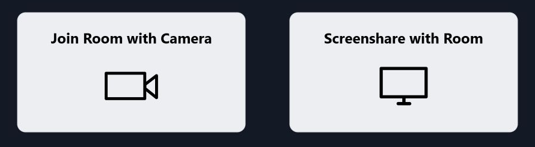
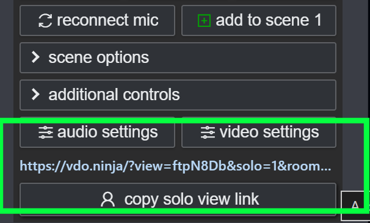
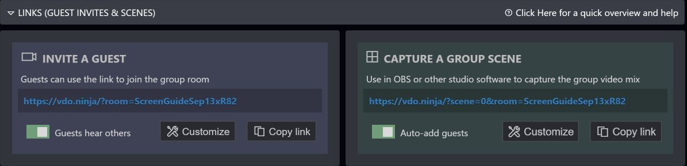
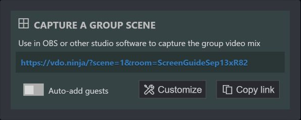

# View-only screen sharing on an iPad or computer

**For a room link, include `&solo` or `&scene` to make it view-only. Adding `&view=STREAMID` by itself to a room link does not skip the join screen.** Viewers do not need to publish a camera or microphone, and OBS is not required.

## Fix the room link you already have

If your link already includes `room` and `view`, append `&solo`:

**Still asks how to join:**

```text
https://vdo.ninja/?room=YOURROOM&view=YOURSCREENID
```

**Opens only the selected feed:**

```text
https://vdo.ninja/?room=YOURROOM&view=YOURSCREENID&solo
```

`&solo` needs no value after it. Keep the screen's stream ID after `&view=`. Alternatively, use `&scene&view=YOURSCREENID` with the room link to view that selected feed.

If you only have `?room=YOURROOM`, add `&scene=0` to watch the room's feeds, or use `&scene=1` and have the director add the screen to Scene 1. Scene 0 can show other feeds too; the solo example above selects just the screen.

Keep existing password/access parameters. Add query parameters before any `#` fragment in the URL. Reusability and viewer mode are separate: a reusable room invite still asks how to join unless the URL selects viewer mode.

<figure><figcaption><p>A room link with view=STREAMID but no solo or scene still presents join choices. The choices shown can vary with device and link options.</p></figcaption></figure>

## Already sharing in a room? Copy the solo view link

1. Return to the room's director/control page.
2. Find the control box for the screen share you want people to watch. If you also have a webcam feed, choose the screen-share feed.
3. Click **copy solo view link** beneath that feed.
4. Send that copied link to the viewer and open it in the iPad's or computer's browser.

<figure><figcaption><p>Look at the bottom of the screen-share feed's control box, below audio settings and video settings. Click copy solo view link in the green-highlighted area. The generated URL already includes solo=1, which selects solo viewer mode.</p></figcaption></figure>

Keep the full copied link, including any password or access parameters. The room's guest invitation and the director page address serve different purposes; neither is the screen's viewing link.

Solo links work in ordinary browsers even though the interface and documentation also describe using them in OBS. See [Rooms and solo links](../getting-started/rooms/README.md).

<figure><figcaption><p>The top-level Copy link buttons have different purposes. Capture a Group Scene provides a viewing link that also works in an ordinary browser.</p></figcaption></figure>

## Simplest reusable setup: two links, no room

For a single screen that others only need to watch, you can skip creating a room.

Choose your own hard-to-guess stream ID and replace `YOURSCREENID` in both examples with exactly the same value.

**Open this on the computer sharing its screen:**

```text
https://vdo.ninja/?push=YOURSCREENID&screenshare
```

Choose the screen, window, or browser tab to share and approve the browser's sharing prompt.

**Send this to the people watching:**

```text
https://vdo.ninja/?view=YOURSCREENID
```

Bookmark both links. Each time, open the publishing link on the sharing computer and start screen sharing again. Viewers reuse the viewing link. Only one device should publish with that ID at a time.

The viewer link can receive shared audio too, if the sender includes it. On an iPad or another browser, you may need to tap the page's play/unmute prompt to hear it. That playback action does not require joining with a microphone.

A reusable link does not keep the screen broadcasting after you close the publishing page or stop sharing. The browser still requires you to approve screen capture when starting a new session.

## Reusable viewing links within a room

For a dedicated screen publisher in a room, use matching room and stream IDs:

**Sharing computer:**

```text
https://vdo.ninja/?room=YOURROOM&push=YOURSCREENID&screenshare
```

**Viewer:**

```text
https://vdo.ninja/?room=YOURROOM&view=YOURSCREENID&solo
```

If the room uses a password, retain the same password/access settings in these links. A separate screen share added alongside a webcam can have a different stream ID; copy its actual solo view link rather than guessing from the webcam's ID.

Alternatively, give viewers a scene link:

```text
https://vdo.ninja/?room=YOURROOM&scene=1
```

In the director page, add the screen share to **Scene 1**. This lets you keep the same viewer URL while choosing which feed appears. Check scene membership when starting a new session. `&scene=0` automatically includes the room's video feeds, so use a selected scene or solo link when viewers should see only the screen.

To obtain that Scene 1 link from the interface, turn off **Auto-add guests** in the **Capture a Group Scene** panel, then click its **Copy link** button.

<figure><figcaption><p>With Auto-add guests off, the copied link uses Scene 1. Add the screen-share feed to that scene so viewers have something to watch.</p></figcaption></figure>

## Quick troubleshooting

| What you see | What to check |
| --- | --- |
| Camera / audio-only join choices | On a room link, include `&solo` with `&view=YOURSCREENID`, or use `&scene`. `&view` alone does not select viewer mode in a room. |
| A blank or waiting viewer | Confirm the sender is actively sharing and both links use the same stream ID, room, and password where applicable. |
| An empty Scene 1 | Add the screen-share feed to Scene 1 in the director page. |
| Webcam appears instead of the screen | Copy the screen share's own solo view link. |
| Video works but no sound | Tap play/unmute if prompted; check that the sender included audio in the browser's sharing dialog where supported. |

## Related guides

* [Permanent links, reusable invites, and stream IDs](how-to-get-permanent-links.md)
* [Screen-sharing options](../source-settings/screenshare.md)
* [View links](../advanced-settings/view-parameters/view.md)
* [Room scenes](../advanced-settings/view-parameters/scene.md)
