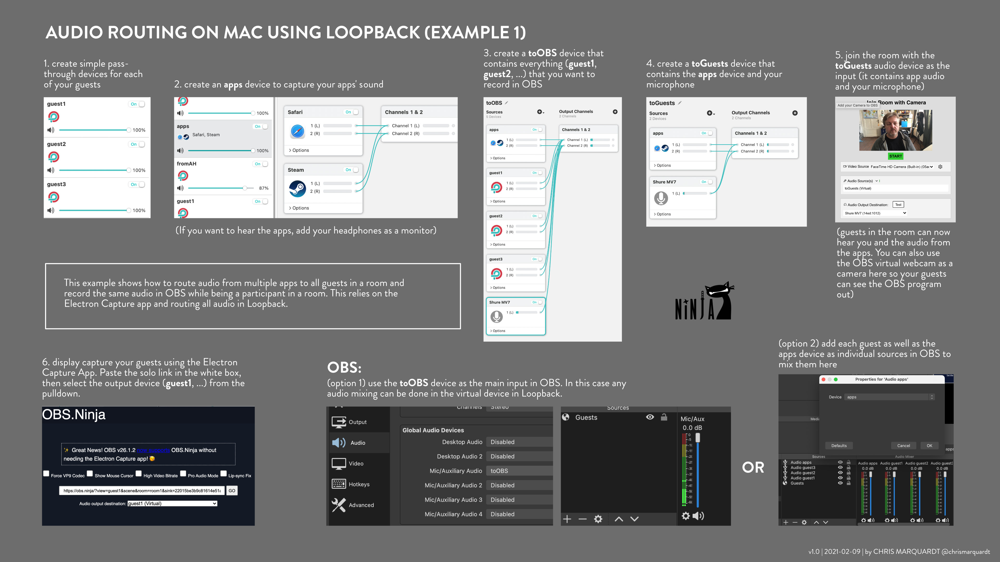

# OBS Ninja Cheat Sheets

## MAC: AUDIO ROUTING USING LOOPBACK (EXAMPLE 1)

Route audio from multiple apps to all guests in a room and record the same audio in OBS while simultaneously being a participant in the room.

   
(v1.0, 2021-02-09)

[download JPG](loopbackrouting1.jpg) |
[download PNG](loopbackrouting1.png) |
[download PDF](loopbackrouting1.pdf) (best for printing)
