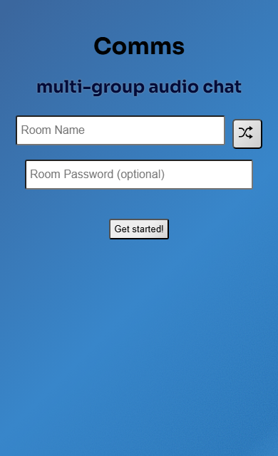
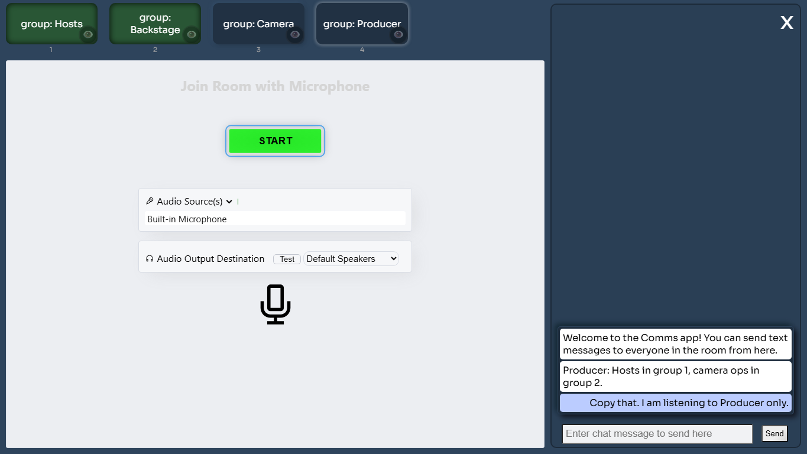
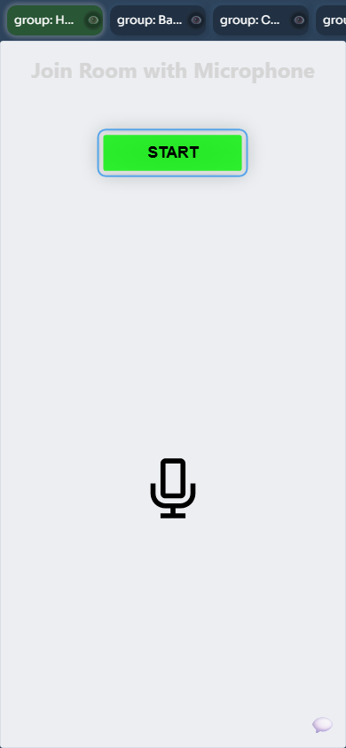

# Comms

Comms is a browser-based intercom app built on VDO.Ninja. Open [https://comms.cam/](https://comms.cam/) or [https://vdo.ninja/comms.html](https://vdo.ninja/comms.html), pick a room, allow your microphone, and then choose which group you want to talk with.

The simple version: it is like having several walkie-talkie channels in one web page. A producer, host, camera operator, remote guest, or family member helping with a stream can all be in the same Comms room, but only hear the group they are supposed to hear.

## When to use it

Use Comms when you need private production audio that is separate from the show audio.

Common uses:

* A producer talks to hosts without going live on the stream.
* Camera operators can hear direction from the producer.
* A guest can be placed in a waiting or backstage group before going on air.
* A parent, teacher, coach, or helper can coordinate people from a phone without installing an app.
* A small team can keep a private voice channel open while OBS, Zoom, YouTube, or another production tool handles the public show.

Comms is not meant to replace the normal VDO.Ninja guest room for the final video program. It is for coordination, talkback, and intercom-style audio.

## Quick start

1. Open [https://comms.cam/](https://comms.cam/).
2. Enter a unique room name.
3. Add a room password if the room should be private.
4. Select **Get started!**.
5. Allow microphone access when the browser asks.
6. Select **START** inside the VDO.Ninja audio panel.
7. Click or tap the group you want to talk with.

<figure><figcaption><p>Mobile start screen: enter a room name, optionally add a password, then tap Get started.</p></figcaption></figure>

Everyone who needs to talk together should use the same room name and password. For a simple setup, send everyone the same link and tell them which group to click when they join.

## How the groups work

The group buttons are the main point of the app.

| What you do | What it means |
| --- | --- |
| Click a group button | You join that group and talk/listen there |
| Click more than one group | You talk and listen in more than one group at the same time |
| Click the eye button on a group | You listen to that group without putting your microphone into it |
| Click the active group again | You leave that talk group |
| Use number keys on desktop | Quickly toggle the first group buttons by keyboard |

If you are busy and just need the plain-English rule: green group buttons are where your microphone is going. The eye icon is for listening without talking into that group.

<figure><figcaption><p>Desktop room view: group buttons are on top, the microphone setup is in the middle, and room chat is on the right.</p></figcaption></figure>

Comms uses VDO.Ninja group routing underneath. In this app, group routing is strict by default, so pick at least one talk group or listen-only group before relying on the room.

## A simple family-style example

Imagine you are running a school concert stream and you have two children performing, one person at the laptop, and one person holding a phone near the stage.

You could create these groups:

* `Producer` for the person running the show.
* `Stage` for the person near the performers.
* `Backstage` for helpers who should not interrupt the stage person.

The laptop user can join `Producer` and click the eye on `Stage`, so they can give instructions while still listening to the stage helper. The stage helper can join only `Stage`, so they hear the producer without hearing every side conversation.

## Mobile web use

Comms is designed to work from a mobile browser. The mobile layout keeps the group buttons at the top, makes them horizontally scrollable, and moves chat behind a small chat button so the microphone page still fits.

<figure><figcaption><p>Mobile room view: swipe the group buttons left or right, then tap START to enable the microphone.</p></figcaption></figure>

Mobile tips:

* Use headphones or earbuds to avoid echo.
* Keep the browser tab open while using Comms.
* Do not lock the phone if you need the microphone to stay active.
* On iPhone and iPad, Safari may limit background audio capture if the page is not active.
* On Android, Chrome is usually the safest browser choice.
* If the group buttons feel cramped, rotate the phone sideways or add `&mobile` to force the mobile layout.
* The chat bubble opens room text chat on mobile.

## Text chat

Comms includes a simple text chat for the room. Chat is useful for links, names, reminders, or instructions that people may miss over audio.

Chat is room-wide; it is not limited to the selected audio group.

To hide chat in a prepared link:

```text
https://comms.cam/?room=ShowComms&hidechat
```

## Prepared links

You can prepare links so users do not need to type the room name manually.

Basic room:

```text
https://comms.cam/?room=ShowComms
```

Room with password:

```text
https://comms.cam/?room=ShowComms&password=secret123
```

Room with named groups:

```text
https://comms.cam/?room=ShowComms&groups=Hosts,Backstage,Camera,Producer
```

Room with a listen-only group preselected:

```text
https://comms.cam/?room=ShowComms&groups=Hosts,Backstage,Camera,Producer&groupview=Producer
```

Same app hosted directly from VDO.Ninja:

```text
https://vdo.ninja/comms.html?room=ShowComms&groups=Hosts,Backstage,Camera,Producer
```

## Useful URL options

| Option | What it does |
| --- | --- |
| `&room=ShowComms` | Sets the Comms room name |
| `&password=secret123` | Adds a room password |
| `&groups=Hosts,Backstage,Camera` | Defines the group buttons shown in Comms |
| `&groupview=Producer` | Lets the user listen to a group without talking into it |
| `&label=Producer` | Sets the user's display label |
| `&push=producer-comms` | Sets a stable VDO.Ninja stream ID |
| `&hidechat` | Hides the Comms chat panel |
| `&mobile` | Forces the mobile layout |
| `&video` | Enables video mode instead of the default audio-only mode |
| `&api=ID` | Passes an API/OSC identifier into the embedded VDO.Ninja session |

Short aliases also exist for some options, such as `&r` for `&room`, `&pw` for `&password`, `&sid` for `&push`, and `&gv` for `&groupview`.

## Advanced group behavior

Comms uses these VDO.Ninja features behind the scenes:

* [`&group`](../general-settings/and-group.md) / `&groups` controls which group a user is in.
* [`&groupmode`](../advanced-settings/setup-parameters/and-groupmode.md) makes group routing strict, so users outside a group do not just hear everyone.
* [`&groupview`](../advanced-settings/setup-parameters/and-groupview.md) lets someone listen to a group without joining it with their microphone.

This makes Comms useful as an IFB/talkback control surface. One person can listen to several groups, talk into one group, or temporarily be present in multiple groups by selecting more than one button.

## Local room memory

Comms remembers the last room and group setup in the browser's local storage. That is why the page may show **Restore last room** when you come back later.

This memory is local to that browser on that device. It is not a cloud account, and it does not automatically configure other phones or computers.

## Security and privacy notes

Use a unique room name and a password for real productions. Anyone with the room name and password can attempt to join.

Do not publish your Comms link in a public chat unless it is meant to be public. For shows, treat the Comms link like a backstage pass.

## Troubleshooting

If nobody can hear you:

* Make sure you clicked **START** after joining.
* Confirm the browser has microphone permission.
* Select a group button; in Comms, the group is the talk channel.
* Check that your microphone is not muted in the VDO.Ninja controls.

If you hear the wrong people:

* Check which group buttons are green.
* Check whether the eye icon is active on extra groups.
* Ask everyone to use the same room name and password.

If mobile audio stops:

* Keep the Comms tab open and visible.
* Keep the phone awake.
* Try headphones.
* Try Chrome on Android or Safari on iOS.

## Related


[room.md](../general-settings/room.md)



[and-password.md](../advanced-settings/setup-parameters/and-password.md)



[and-group.md](../general-settings/and-group.md)



[and-groupview.md](../advanced-settings/setup-parameters/and-groupview.md)



[and-groupmode.md](../advanced-settings/setup-parameters/and-groupmode.md)



[push.md](../source-settings/push.md)



[label.md](../general-settings/label.md)



[updates-comms.md](../updates/updates-comms.md)

