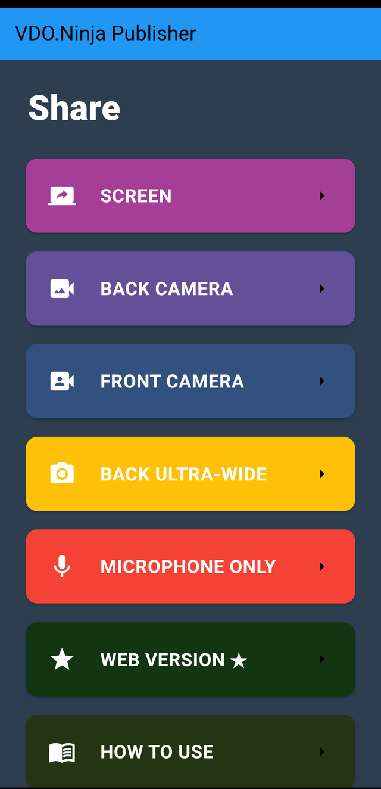
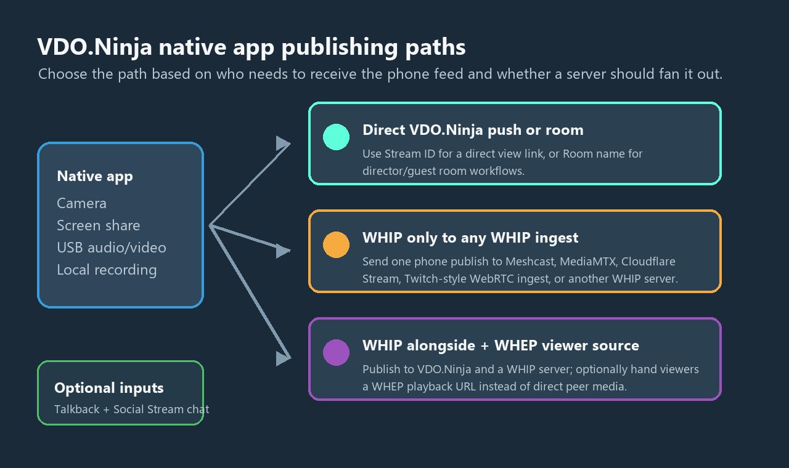
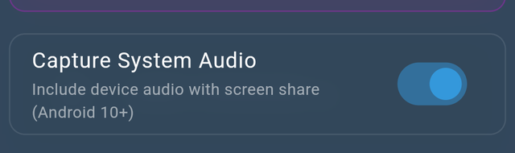
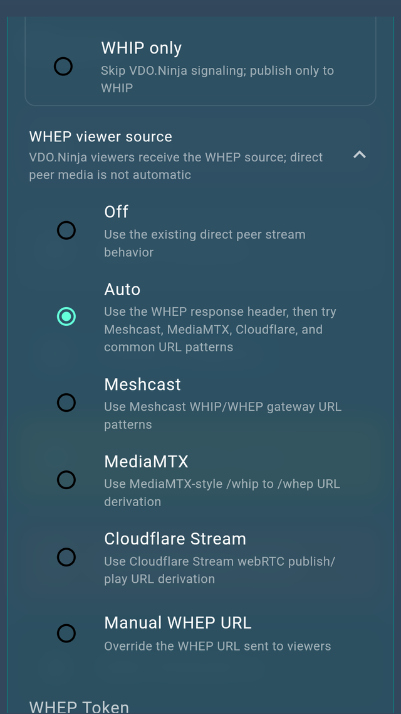
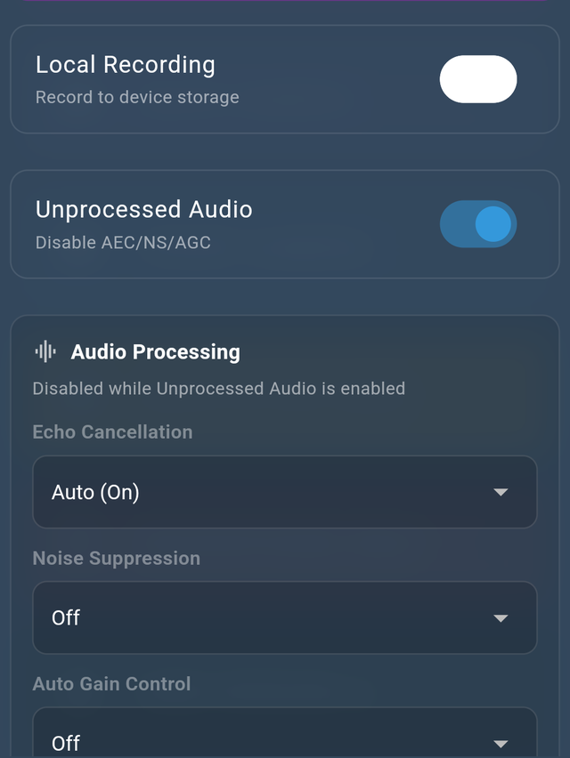
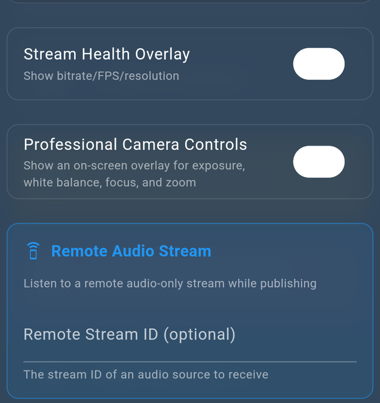
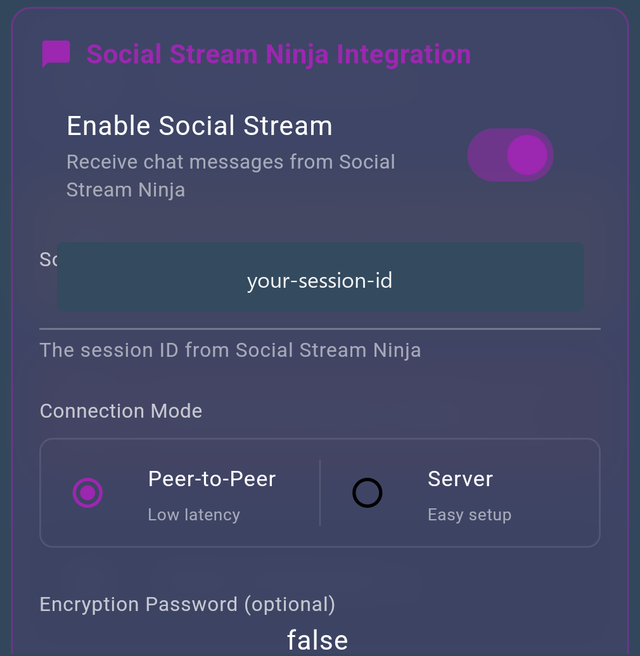

# VDO.Ninja native mobile app guide

The VDO.Ninja native mobile apps are focused capture tools for phones and tablets. They are useful when the browser cannot access a feature you need, such as Android USB camera capture, native mobile screen sharing, USB audio, local recording, WHIP publishing, or mobile-specific camera controls.


Android app



iOS app


<figure><figcaption><p>The available capture modes depend on the device, platform, connected cameras, and connected audio devices.</p></figcaption></figure>

<figure><figcaption><p>The native app can publish directly to VDO.Ninja, into a VDO.Ninja room, to a WHIP service, or to both VDO.Ninja and WHIP at the same time.</p></figcaption></figure>

## When to use the native app

Use the native app when you need one of these mobile-first workflows:

* A phone or tablet as a dedicated VDO.Ninja camera source.
* Android USB/UVC camera or HDMI capture adapter input.
* Android or iOS mobile screen sharing.
* USB, USB-C, or Lightning audio input.
* WHIP publishing to Meshcast, MediaMTX, Cloudflare Stream, Twitch-style WebRTC ingest, or another WHIP-compatible service.
* Local device recording.
* Producer talkback through Remote Audio Stream.
* Social Stream Ninja chat monitoring while filming.
* Professional camera controls such as exposure, focus, white balance, and zoom where the device supports them.

The web version at [https://vdo.ninja](https://vdo.ninja) remains the most flexible director, viewer, and control surface. The native app is best used as a reliable mobile capture app.

## Quick start

1. Open the native app and choose a capture mode, such as **BACK CAMERA**, **SCREEN**, **USB CAMERA**, or **MICROPHONE ONLY**.
2. Enter a **Stream ID** if you want a stable VDO.Ninja push/view link. Leave it blank if you want the app to generate one.
3. Enter a **Room name** if you want the app to join a VDO.Ninja room or director session.
4. Enter a **Password** if the room or stream is password protected.
5. Select the microphone. If you plug in USB audio after opening the screen, tap **Refresh Mics**.
6. Tap the connect button and confirm any camera, microphone, screen, USB, or recording permissions requested by Android or iOS.

<figure><figcaption><p>Publishing Settings is where you choose the VDO.Ninja stream, room, microphone, quality mode, and advanced options.</p></figcaption></figure>

### Stream ID only

Use a **Stream ID** without a room when you want a simple direct push/view workflow.

```text
Publisher: native app Stream ID = mycamera
Viewer:    https://vdo.ninja/?view=mycamera
```

This is the simplest way to use a phone as a camera source for OBS, vMix, a browser viewer, or another VDO.Ninja page.

### Room name

Use a **Room name** when you want the native app to join a VDO.Ninja room.

```text
Publisher: native app Room name = myroom
Director:  https://vdo.ninja/?director=myroom
```

Rooms are useful when you need a director to manage guests, scene links, layouts, recording, or other room-based workflows.

### Stream ID and room name together

Use both fields when you want the app to join a room while keeping a predictable source ID. This is useful for permanent camera positions, named microphones, and event templates.

```text
Publisher: native app Stream ID = widecam, Room name = myroom
Director:  https://vdo.ninja/?director=myroom
```

## Capture modes

### Screen

Use **SCREEN** to share the phone or tablet screen.

* Android can optionally capture system audio on Android 10+.
* Android 14+ may let you choose one app or the entire screen.
* iOS uses ReplayKit for screen sharing.
* For iOS screen share, 720p is usually safer than forcing 1080p for long sessions.
* Protected video apps, DRM content, and some system screens may appear black or may not include audio.

<figure><figcaption><p>Android screen sharing can capture system audio on supported Android versions when the source app allows it.</p></figcaption></figure>

### Back camera

Use **BACK CAMERA** for the main rear camera. This is the normal mode for using a phone as a mobile camera source.

### Front camera

Use **FRONT CAMERA** for selfie camera capture, talkback, or a presenter-facing view.

### Back ultra-wide and other lenses

Use **BACK ULTRA-WIDE** or other listed rear lenses when the device exposes them. Ultra-wide is useful for room views, event spaces, and wide desk shots.

### USB camera

Use **USB CAMERA** on Android when a UVC USB camera or compatible HDMI capture adapter is connected.

* Android-only in the native app.
* Requires a phone or tablet that supports USB host mode.
* A powered USB-C hub is recommended for webcams and HDMI capture dongles.
* If the USB device also exposes audio, it may appear in the microphone list.
* Grant Android USB permission when prompted.

The iOS native app does not expose USB camera capture. iOS can still use built-in cameras, screen sharing, and external USB/USB-C/Lightning audio devices supported by the OS.

<figure><figcaption><p>USB CAMERA appears on Android when the app detects a compatible external camera.</p></figcaption></figure>

<figure><figcaption><p>Android asks for permission before the app can use a connected USB camera.</p></figcaption></figure>

### Microphone only

Use **MICROPHONE ONLY** to publish audio without video. This is useful for talkback, commentary, remote audio feeds, and lightweight monitoring.

### Web version

Use **WEB VERSION** when you need the full browser VDO.Ninja feature set from the same device.

### How to use

Use **HOW TO USE** to open the built-in help page from the app.

### iOS front + rear mix

On supported iOS devices, the app may show a **FRONT + REAR MIX** mode. This uses iOS MultiCam support to mix front and rear cameras together. Availability depends on the iPhone or iPad model.

## WHIP publishing

The native app can publish to a WHIP endpoint in addition to, or instead of, normal VDO.Ninja signaling. This means the app can be used as a general-purpose mobile WHIP publisher, even when the destination is not VDO.Ninja.

Common WHIP targets include:

* Meshcast.
* MediaMTX.
* Cloudflare Stream WebRTC ingest.
* A self-hosted WHIP/WHEP service.
* Any compatible WHIP ingest endpoint that accepts the codec and auth method used by the app.

<figure><figcaption><p>Enable WHIP output, paste the publish endpoint, and choose whether to publish alongside VDO.Ninja or to WHIP only.</p></figcaption></figure>

### WHIP fields

* **Enable WHIP output**: Turns on WHIP publishing.
* **WHIP URL**: The full HTTPS WHIP publish endpoint.
* **Stream Key**: Optional bearer token. Leave this blank if the publish key is already part of the WHIP URL.
* **Alongside VDO.Ninja**: Publishes to VDO.Ninja and WHIP at the same time.
* **WHIP only**: Skips VDO.Ninja signaling and publishes only to the WHIP endpoint.

Use **WHIP only** when the phone should publish directly to a relay, CDN, SFU, or self-hosted WHIP server. Use **Alongside VDO.Ninja** when you want VDO.Ninja room/director features and a WHIP output at the same time.

### WHIP URL examples

Meshcast anonymous WHIP endpoint:

```text
https://app.meshcast.io/api/gateway/whip/YOUR_PUBLISH_KEY
```

MediaMTX-style endpoint:

```text
https://media.example.com/mystream/whip
```

VDO.Ninja WHIP ingest endpoint:

```text
https://whip.vdo.ninja/YOURTOKENHERE
```

If the provider gives you an authorization token separately from the URL, enter the URL in **WHIP URL** and the token in **Stream Key**. The app sends the stream key as a bearer token.

### WHEP viewer source

The native app can also tell VDO.Ninja viewers to use a WHEP playback source when WHIP/WHEP infrastructure is handling distribution.

<figure><figcaption><p>WHEP viewer source options help VDO.Ninja viewers pull from the WHIP/WHEP host instead of relying only on direct peer-to-peer delivery.</p></figcaption></figure>

Options include **Off**, **Auto**, **Meshcast**, **MediaMTX**, **Cloudflare Stream**, and **Manual WHEP URL**. Use **Auto** when the WHIP response includes a matching WHEP playback URL. Use **Manual WHEP URL** when your provider gives you a separate playback endpoint.

## Meshcast WHIP example

This workflow was tested with:

* Pixel 9a.
* VDO.Ninja Android native app.
* Logitech HD Pro Webcam C920 connected over USB.
* Meshcast anonymous WHIP/WHEP session.

The app exposed the C920 as **USB CAMERA**, requested Android USB permission, published audio and video into Meshcast via WHIP, and Meshcast playback showed the same USB camera feed.

For Meshcast, use the WHIP publish URL as the app's **WHIP URL**:

```text
https://app.meshcast.io/api/gateway/whip/YOUR_PUBLISH_KEY
```

If Meshcast gives you a server hint, keep it:

```text
https://app.meshcast.io/api/gateway/whip/YOUR_PUBLISH_KEY?server=ovh-use1
```

Leave the app's **Stream Key** field blank when the Meshcast key is already in the URL path.

To view the stream from Meshcast, open the matching watch, embed, or WHEP URL. Anonymous Meshcast sessions use the anonymous key as the view path:

```text
https://app.meshcast.io/embed/YOUR_STREAM_KEY?server=ovh-use1
```

<figure><figcaption><p>The live view shows the source preview, connection state, recording state, health overlay, and live controls.</p></figcaption></figure>

<figure><figcaption><p>Meshcast playback receiving the Android USB camera feed via WHIP/WHEP.</p></figcaption></figure>

## USB audio

The native app can use external audio devices when Android or iOS exposes them as input devices.

1. Connect the USB, USB-C, or Lightning audio device before opening Publishing Settings.
2. Open the microphone list.
3. Tap **Refresh Mics** if the device is not listed.
4. Select the external input.
5. Use headphones or echo cancellation if talkback or remote audio is active.

For music, mixers, and professional microphones, test both **Unprocessed Audio** and the **Audio Processing** controls. Unprocessed audio avoids automatic echo cancellation, noise suppression, and gain control, but it also requires cleaner monitoring and echo management.

<figure><figcaption><p>Recording and audio processing controls are available in Advanced Settings.</p></figcaption></figure>

## Recording

Enable **Local Recording** when you want the native app to save a local copy on the device. The live screen includes a recording indicator, and the overflow menu includes recording controls for recent files.

Use local recording when:

* You need a backup recording on the phone.
* You are using a high-quality mobile camera source.
* The network may be unreliable.
* You want to export or share a local file after the session.

Keep enough storage free, keep the phone powered, and test the full recording length before a paid or live event. Long captures can be limited by storage, thermals, battery saver behavior, and OS background restrictions.

For iOS screen sharing, ReplayKit controls what audio and video samples are made available. Protected apps may block video or audio.

## Talkback and remote audio

**Remote Audio Stream** lets the native app listen to a remote audio stream while publishing. This is useful for producer talkback, IFB-style monitoring, return program audio, or a private cue feed.

<figure><figcaption><p>Remote Audio Stream can bring a separate VDO.Ninja audio feed into the native app while the app is publishing.</p></figcaption></figure>

Recommended talkback setup:

1. Create or choose a VDO.Ninja audio-only stream for the producer or director.
2. Enable **Remote Audio Stream** in the native app.
3. Enter the remote stream ID if needed.
4. Use headphones whenever possible.
5. Enable echo cancellation if the phone speaker is being used.

Keep talkback separate from the main program feed unless you intentionally want the talkback audio to be heard by viewers.

## Social Stream Ninja

The native app can connect to Social Stream Ninja so the camera operator can see chat while filming.

<figure><figcaption><p>Enter the Social Stream Ninja session ID, then choose Peer-to-Peer or Server mode.</p></figcaption></figure>

Social Stream settings include:

* **Enable Social Stream**: Turns on chat integration.
* **Social Stream Session ID**: The session ID from Social Stream Ninja.
* **Peer-to-Peer**: Lower-latency chat connection.
* **Server**: Easier setup when peer-to-peer is blocked.
* **WebRTC Encryption Password**: Optional encryption password for peer-to-peer mode.

In the live view, the app can show chat controls, a text-to-speech toggle, and connection state so an operator can monitor comments without opening a separate device.

## Live controls

The live screen includes the controls operators usually need during a shoot:

* Mute or unmute microphone.
* Hide or show local video.
* Switch cameras.
* Open more actions such as torch, camera settings, audio settings, recording, and Android picture-in-picture.
* Copy or open a view link.
* Toggle Social Stream chat and text-to-speech when configured.
* Mute or unmute Remote Audio Stream when enabled.
* Watch recording and connection status.

When **Professional Camera Controls** is enabled, supported cameras can show controls for exposure, white balance, focus, and zoom. Built-in cameras also support tap-to-focus where the device exposes it. USB camera control support depends on the camera, Android device, and UVC feature support.

The **Stream Health Overlay** can show useful live stats such as bitrate, FPS, resolution, peer count, and connection state.

## Quality, bitrate, and codec FAQ

### How do I increase bitrate?

For direct VDO.Ninja viewers, bitrate is commonly requested from the viewer side:

```text
https://vdo.ninja/?view=mycamera&videobitrate=6000
```

You can also use:

```text
&bitrate=6000
```

On Android, the native app also exposes **Custom bitrate** in Advanced Settings. Enable it and enter a value in kbps. The app accepts 100 to 50000 kbps, with common defaults around 6000 kbps for 720p and 10000 kbps for 1080p. iOS currently relies on capture preset and WebRTC negotiation rather than this Android app-side bitrate control.

Higher bitrate is not always better. If the network has packet loss, weak WiFi, cellular jitter, or thermal throttling, a lower bitrate may look more stable.

### How do I change codec?

Codec selection is usually negotiated by the viewer, browser, device hardware, and target service.

Common VDO.Ninja viewer-side examples:

```text
&codec=h264
&codec=vp9
&codec=av1
```

H.264 is often the safest mobile choice because phones usually have hardware acceleration. VP9 can look better for some detailed or screen-share content at lower bitrates, but it can cost more CPU. AV1 requires newer device and browser support and may be heavier.

For WHIP publishing, the WHIP service may also restrict codecs, profiles, bitrate, resolution, or frame rate.

### Should I use 1080p?

Use **Prefer 1080p** when you have tested the device, power, thermals, and network. For long mobile sessions, start with 720p at 30 fps and raise quality only after the full setup has proven stable.

For iOS screen sharing, avoid forcing 1080p unless you have tested it. 720p is often more reliable for long ReplayKit sessions.

### Why does quality drop after a few minutes?

Common causes are:

* Phone thermal throttling.
* Battery saver or background restrictions.
* Weak WiFi or packet loss.
* Too much bitrate for the available uplink.
* Too many direct peer-to-peer viewers.
* A codec that is expensive for the device.

Use a cooling fan, remove the phone case, keep the device powered, prefer 5 GHz WiFi or Ethernet, and use WHIP/Meshcast/WHEP fanout when many viewers need the same feed.

## Event checklist

For events such as weddings, ceremonies, panels, lectures, IRL streams, or mobile broadcasts:

1. Test the exact phone, camera, USB adapter, audio device, and network before the event.
2. Keep the phone connected to power.
3. Use a powered hub for USB cameras and HDMI capture adapters.
4. Disable battery saver and avoid thermal throttling.
5. Start at 720p and 30 fps unless the full setup has already proven stable at 1080p.
6. Use **WHIP only** when Meshcast or another WHIP service should handle viewer fanout.
7. Keep a second watch device open so you can verify the remote feed.
8. Run a short local recording test if the recording matters.
9. Verify talkback audio with headphones before going live.

## Troubleshooting

### USB CAMERA does not appear

* Confirm the device is Android. USB camera capture is not available in the iOS native app.
* Reconnect the camera and restart the app.
* Use a powered hub if the camera or capture card needs more power.
* Check that the camera is UVC compatible.
* Grant Android USB permission when prompted.

### USB audio is missing

* Connect the audio device before opening Publishing Settings.
* Tap **Refresh Mics**.
* Try another USB-C adapter or powered hub.
* On iOS, USB/USB-C/Lightning audio support depends on the device, adapter, and iOS audio routing behavior.
* Reopen Publishing Settings after the OS finishes switching audio routes.

### Screen share is black or has no audio

* Protected apps may block capture.
* On Android 14+, try sharing the entire screen instead of a single app.
* On Android, enable **Capture System Audio** only for apps that allow system audio capture.
* On iOS, ReplayKit decides whether screen audio is available.
* Drop to 720p if iOS screen sharing stops after a few seconds.

### WHIP fails to connect

* Confirm the WHIP URL starts with `https://` and points to a WHIP publish endpoint, not a watch or WHEP URL.
* Leave **Stream Key** blank when the key is already in the URL.
* Use a fresh Meshcast anonymous session if the old one expired.
* Make sure only one publisher is using the same key.
* Check whether the WHIP service requires a specific codec, token, or URL format.

### Viewers see nothing

* Open the matching VDO.Ninja view link, room director link, Meshcast watch URL, embed URL, or WHEP URL.
* Do not open the WHIP publish URL as a viewer.
* Wait a few seconds after the phone connects.
* Keep the same server hint on publish and view URLs when a server hint is present.
* If using WHEP viewer source, confirm the WHEP URL is reachable from the viewer's network.

## Related pages


[native-mobile-app-versions.md](native-mobile-app-versions.md)



[improving-quality-of-the-native-app.md](../guides/improving-quality-of-the-native-app.md)



[how-do-i-control-bitrate-quality.md](../guides/how-do-i-control-bitrate-quality.md)



[bitrate.md](../advanced-settings/video-bitrate-parameters/bitrate.md)



[codec.md](../advanced-settings/view-parameters/codec.md)



[packet-loss.md](../common-errors-and-known-issues/packet-loss.md)



[whip-and-whep-tooling.md](whip-and-whep-tooling.md)



[meshcast.io.md](meshcast.io.md)



[options-to-record-streams.md](../guides/options-to-record-streams.md)



[README.md](social-stream-ninja/README.md)

