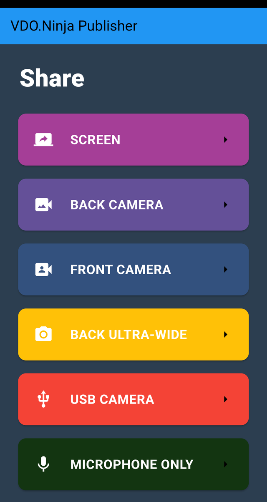
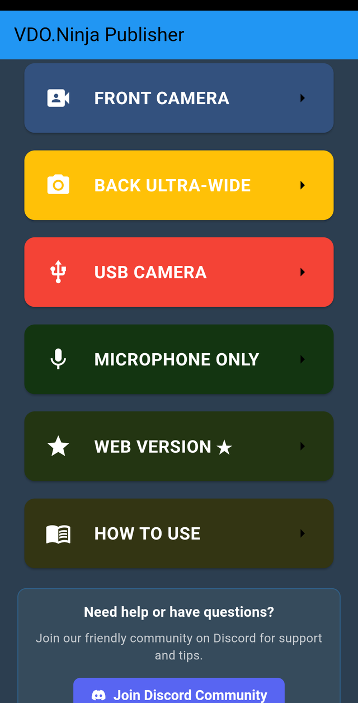
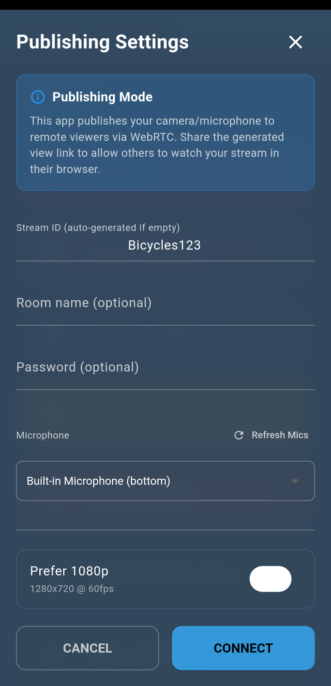
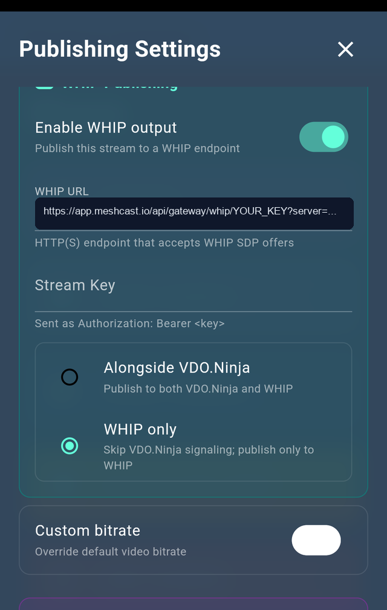
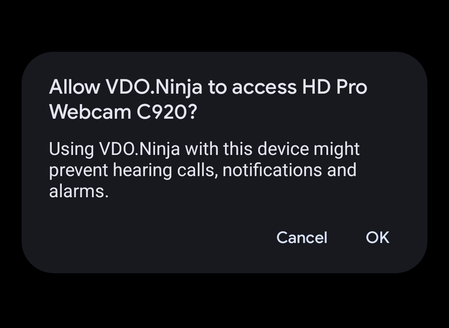
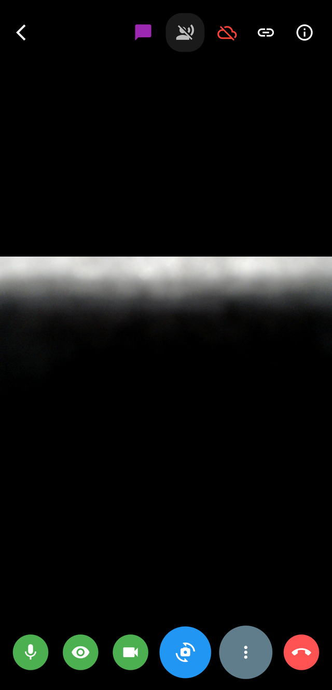
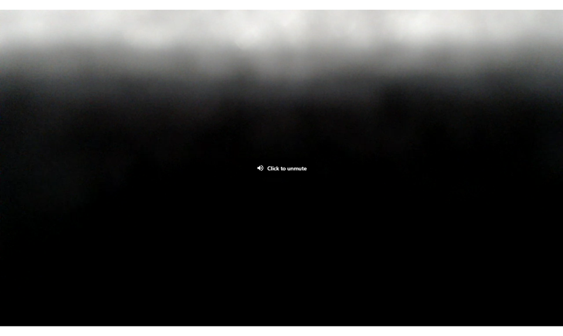

# VDO.Ninja native mobile app guide

The VDO.Ninja native mobile apps are focused capture tools for phones and tablets. They are useful when the browser cannot access a feature you need, such as Android USB camera capture, native mobile screen sharing, local device recording, or mobile-specific camera controls.


Android app



iOS app


## Main capture modes

The home screen shows the available capture modes for the current device. The list changes based on platform support, camera enumeration, and whether a USB camera is connected.



### Screen

Use **SCREEN** to share the phone or tablet screen.

* Android can optionally capture system audio on Android 10+.
* iOS uses ReplayKit for screen sharing.
* For iOS screen share, 720p is usually safer than forcing 1080p for long sessions.

### Back Camera

Use **BACK CAMERA** for the main rear camera. This is the normal mode for using a phone as a mobile camera source.

### Front Camera

Use **FRONT CAMERA** for selfie camera capture, talkback, or a presenter-facing view.

### Back Ultra-Wide

Use **BACK ULTRA-WIDE** when the device exposes an ultra-wide lens. This is useful for room views, event spaces, and wide desk shots.

### USB Camera

Use **USB CAMERA** on Android when a UVC USB camera or compatible HDMI capture adapter is connected.

* Android-only in the native app.
* Requires a phone/tablet that supports USB host mode.
* A powered USB-C hub is recommended for webcams and HDMI capture dongles.
* If the USB device also exposes audio, it may appear in the microphone list.

The iOS native app does not expose USB camera capture. iOS can still use built-in cameras, screen share, and external USB/USB-C audio devices supported by the OS.

### Microphone Only

Use **MICROPHONE ONLY** to publish audio without video. This is useful for talkback, commentary, remote audio feeds, and lightweight monitoring.

### Web Version

Use **WEB VERSION** when you need the full browser VDO.Ninja feature set. The native app is best for mobile capture workflows, while the web app remains the most flexible director/viewer experience.

### How To Use

Use **HOW TO USE** to open the built-in help page from the app.



### iOS front + rear mix

On supported iOS devices, the app may show a **FRONT + REAR MIX** mode. This uses iOS MultiCam support to mix front and rear cameras together. Availability depends on the iPhone or iPad model.

## Publishing settings

After selecting a capture mode, the app opens **Publishing Settings**.



### Basic fields

* **Stream ID**: The VDO.Ninja push ID. Leave empty for an auto-generated ID, or enter a stable ID if you want a reusable push/view link.
* **Room name**: Optional room name for joining a VDO.Ninja room.
* **Password**: Optional room or stream password.
* **Microphone**: Select the audio input. Use **Refresh Mics** after connecting a USB audio device.

### Quality and orientation

* **Prefer 1080p**: Requests a higher-resolution capture mode when the device supports it.
* **Force landscape**: Locks the phone into landscape orientation.
* **Custom bitrate**: Android-only. Overrides the default video bitrate when enabled.

For long mobile sessions, start with 720p at 30 fps and increase quality only after testing thermals, network stability, and encoder load.

### Advanced settings

Enable **Advanced Settings** to show extra controls:

* **Handshake server**: Custom VDO.Ninja WSS signaling server.
* **Custom Salt**: Custom encryption/signaling salt.
* **TURN server**: Custom TURN relay server.
* **WHIP Publishing**: Publish to a WHIP endpoint, such as Meshcast or another WebRTC ingest service.
* **Social Stream Ninja Integration**: Receive chat messages from Social Stream Ninja.
* **Local Recording**: Record to device storage.
* **Unprocessed Audio**: Disable AEC/NS/AGC processing.
* **Audio Processing**: Fine-tune echo cancellation, noise suppression, auto gain control, and microphone gain.
* **Stream Health Overlay**: Show bitrate, FPS, and resolution while streaming.
* **Professional Camera Controls**: Show exposure, white balance, focus, and zoom controls when available.
* **Remote Audio Stream**: Listen to a remote audio-only stream while publishing.

## WHIP publishing

The native app can publish to a WHIP endpoint in addition to, or instead of, normal VDO.Ninja signaling.



### WHIP fields

* **Enable WHIP output**: Turns on WHIP publishing.
* **WHIP URL**: The full HTTP(S) WHIP endpoint.
* **Stream Key**: Optional Bearer token. Leave this blank if the publish key is already part of the WHIP URL.
* **Alongside VDO.Ninja**: Publishes to VDO.Ninja and WHIP at the same time.
* **WHIP only**: Skips VDO.Ninja signaling and publishes only to the WHIP endpoint.

Use **WHIP only** when you want the phone to make one publishing connection to a relay such as Meshcast, instead of making peer-to-peer connections to each viewer.

## Meshcast WHIP example

This workflow was tested with:

* Pixel 9a
* VDO.Ninja Android native app
* Logitech HD Pro Webcam C920 connected over USB
* Meshcast anonymous WHIP/WHEP session

The app exposed the C920 as **USB CAMERA**, requested Android USB permission, published audio and video into Meshcast via WHIP, and Meshcast playback showed the same USB camera feed.

### Meshcast URL format

For Meshcast, use the WHIP publish URL as the app's **WHIP URL**:

```text
https://app.meshcast.io/api/gateway/whip/YOUR_PUBLISH_KEY
```

If Meshcast gives you a server hint, keep it:

```text
https://app.meshcast.io/api/gateway/whip/YOUR_PUBLISH_KEY?server=ovh-use1
```

Leave the app's **Stream Key** field blank when the Meshcast key is already in the URL path.

To view the stream from Meshcast, open the matching watch, embed, or WHEP URL. Anonymous Meshcast sessions use the anonymous key as the view path:

```text
https://app.meshcast.io/embed/YOUR_STREAM_KEY?server=ovh-use1
```







## Event checklist

For events such as weddings, ceremonies, panels, or mobile broadcasts:

1. Test the exact phone, camera, USB adapter, audio device, and network before the event.
2. Keep the phone connected to power.
3. Use a powered hub for USB cameras and HDMI capture adapters.
4. Disable battery saver and avoid thermal throttling.
5. Start at 720p and 30 fps unless the full setup has already proven stable at 1080p.
6. Use **WHIP only** when Meshcast or another WHIP service should handle viewer fanout.
7. Keep a second watch device open so you can verify the remote feed.

## Troubleshooting

### USB CAMERA does not appear

* Confirm the device is Android. USB camera capture is not available in the iOS native app.
* Reconnect the camera and restart the app.
* Use a powered hub if the camera or capture card needs more power.
* Check that the camera is UVC compatible.
* Grant Android USB permission when prompted.

### USB audio is missing

* Connect the audio device before opening Publishing Settings.
* Tap **Refresh Mics**.
* Try another USB-C adapter or powered hub.
* On iOS, USB/USB-C audio support depends on the device, adapter, and iOS audio routing behavior.

### WHIP fails to connect

* Confirm the WHIP URL starts with `https://` and points to a WHIP publish endpoint, not a watch or WHEP URL.
* Leave **Stream Key** blank when the key is already in the URL.
* Use a fresh Meshcast anonymous session if the old one expired.
* Make sure only one publisher is using the same key.

### Viewers see nothing

* Open the matching Meshcast watch/embed/WHEP URL, not the WHIP publish URL.
* Wait a few seconds after the phone connects.
* Keep the same server hint on publish and view URLs when a server hint is present.

## Related pages


[native-mobile-app-versions.md](native-mobile-app-versions.md)



[improving-quality-of-the-native-app.md](../guides/improving-quality-of-the-native-app.md)



[meshcast.io.md](meshcast.io.md)

