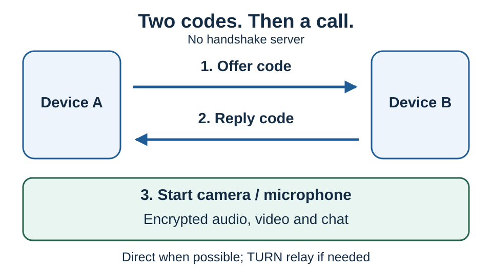

# QR Connect

**Exchange connection codes. Then talk, share video, or chat. No handshake server introduces the two browsers.**

Try it at [vdo.ninja/qr](https://vdo.ninja/qr).

## Connect in three steps

1. **A:** Press **Start connection**. Let B scan your QR or send B the text code.
2. **B:** Open the QR link, or choose **Scan or paste a code**. Send the reply back. **A scans or pastes it into the original waiting tab.**
3. Either person can now start their **camera and microphone separately**, or just chat. Scanning does not start broadcasting.

Keep both pages open. Each offer connects one pair; it is not a permanent room link.

## Trickle mode (LoRa / mesh compatible)

For messaging apps with small text limits, enable **Trickle mode (LoRa / mesh compatible)** before starting, or open [vdo.ninja/qr?lora](https://vdo.ninja/qr?lora). Older copies of the page call this **LoRa / MeshCore mode**.

This splits connection details into small messages and sends additional network routes as they become available. It works with other text transports too. Each message uses only ASCII letters and digits, so one character equals one byte. Smaller messages do not necessarily mean less text overall.

1. Set **Maximum characters per message** to fit your messaging app. The default and maximum are **140**; you can lower it to **40**. The replying page adopts the offer's limit.
2. Press **Start connection**. Copy each outgoing message separately into your messaging app and send it to the other person.
3. They open QR Connect, choose **Scan or paste a code**, and paste each received message. The page recognizes the format automatically.
4. Exchange all available outgoing messages in both directions until connected. This can take more than one message each way. Keep both pages open.

**MeshCore and Meshtastic have different limits.** Meshtastic's [Android composer](https://github.com/meshtastic/meshtastic/blob/master/docs/software/android/user/messages-and-channels.md#message-limits) allows 200 bytes. MeshCore's [channel message handling](https://github.com/meshcore-dev/MeshCore/blob/main/src/helpers/BaseChatMesh.cpp) counts the sender-name prefix against its text allowance, so some channels need a setting below 140. Use the limit supported by your app and message type, allowing space for any added prefixes.

The page does not send messages through a radio automatically. Radio messages carry only the connection setup; **chat, audio and video still need an IP connection** between the browsers, directly or through TURN. Camera and microphone remain off until enabled.

## What “serverless” means

The code contains the connection details themselves. **No server looks up the code or exchanges the offer and reply for you.** You scan or copy them across. If you use a messaging app, that app carries your copy.

Servers can still have other jobs:

| Job | What happens |
| --- | --- |
| Load the app | A web server supplies the page; supported browsers cache an offline copy. |
| Find a network route | STUN helps discover the browser's internet-facing address. |
| Cross restrictive networks | TURN can relay encrypted traffic, including on cellular connections. |

**No handshake server** does not mean **no internet services**. Direct connections are preferred; TURN-only connections work too.

## How the code gets so small

**Connect a tiny data channel first; add audio/video afterward.** Long lists of media settings never need to fit in the QR.

The browser then packs the remaining details:

- Replace repeated text with a small template identifier.
- Pack addresses, credentials, and the certificate fingerprint into binary; reuse values and trim network routes.
- Encode the bytes using 30,000 letters and numbers: almost 15 bits per character.

In ordinary QR mode, the text is capped at **118 characters**, plus the page address when shared as a link. Unfamiliar browser formats have fallbacks, including DEFLATE compression. If essential data cannot fit, the app reports an error. Trickle mode uses the separate per-message limit described above.

This compresses **connection instructions**, not picture quality. Later settings travel automatically over the peer connection—no extra QR needed.

## What is used or saved?

| Item | Where it goes |
| --- | --- |
| Connection code | Network routes, temporary credentials, and a certificate fingerprint. No camera frames or private encryption key. |
| Audio/video and chat | Encrypted WebRTC traffic; no automatic recording or server-side chat history. Chat lives in the open pages. |
| Local storage | Cached app files and temporary tab-handoff records, sometimes containing a reply code. Records use a 20-minute cleanup age; closing the browser can delay cleanup. |
| Other copies/settings | Browser permissions and VDO.Ninja preferences may persist. Clipboard copies, screenshots, and shared messages can remain in other apps. |

Exchange codes privately: someone else could answer your offer first. Compression is not encryption. If the connection is fully lost, exchange fresh codes.

For the implementation details, see [Serverless connections](../guides/serverless-connections.md).
