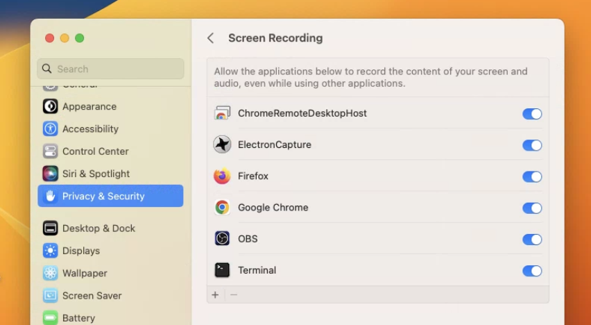

# Updates - Social Stream & Chat Overlay

[social-stream.md](../steves-helper-apps/social-stream.md "mention")\
[chat-overlay.md](../steves-helper-apps/chat-overlay.md "mention")

#### **September 10**

* Using `&beep` or the bell icon will trigger audio 'beeps' when new messages appear in the Socialstream dock. Requires user-interaction with the page in chrome for the audio to work.\
  
* Support for @mention added to Mixcloud for Socialstream+touch, by means of providing the username that scripts can respond to (by user request).
* `&alignbottom` added to the Socialstream dock; this aligns the message stream to the bottom by default, rather than top.

#### **September 2**

* Socialstream bug fixes, along with donation support added to Mixcloud.

#### **August 31**

* New MIDI control feature for Social Stream: - the option to select a file containing text-strings for use with the MIDI-command option is available - sample file is included in the extension folder; edit it and select it from the extension menu (JSON format) - you shouldn't have to reload the file each time you open the browser; just when you reload the extension or when you want to update the commands with a newer file.\
   (1).png>)
* Social Stream has had it's pop-out menu UI updated, courtesy of the one and only [@jcalado](https://github.com/jcalado) (there's dark-mode support now, also) #pretty\
   (1) (1).png>)
* Added workplace.com support to Social Stream
* The queue-order of messages now is visible with little numbers on the left-side of the message. Changes to the queue are synced across docks when using `&sync`
* slido.com support added to chat.overlay.ninja

#### August 26

* New features for SocialStream.ninja, by requests - option to sync multiple docks has been added. Add `&sync` to the docks that you want to share state between, and if enabled, when one dock selects a message, the other dock then treats that message locally as if it was already pressed, so they know what the other dock selected. (syncing queues I'll try to add later on)
* Added option to strip HTML from the dock as a URL parameter (rather than at the point of capture in the extension). Applies to donations, messages, and usernames.
* Option to save the last message received to a specified file added. It will over-write on each new message. It can be used either from the dock or without any dock (from the extension directly) You can use this to with apps that monitor files for changes, creating your own custom overlays. Stores the data as JSON, but I welcome feedback as to a better option.

#### August 23

* Added the option to send featured-chat messages from SocialStream's dock to the overlay page via a websocket server, in case the viewing destination doesn't support webrtc. (by request)
* You can push from server-side chat sources or via web-sockets to the dock page now, too. I created a sample source script to reference if you want to give it a go `sample_wss_source.html` \
  

#### August 22

* Updated socialstream.ninja to support `&password`. You need to set the password via the extension settings page, which is a bit hidden.

#### August 17

* Added theta.tv support to socialstream.ninja (via its pop out chat).
* Added support for LinkedIn "live" to socialstream.ninja (already had support for linkedin events).

#### August 9

* Minnit and livepush are social chat sources that have been added to socialstream.ninja (by request).
* chat.overlay has had an issue with messages auto-clearing after a minute fixed.

#### July 27

* Fixed some style issues with socialstream; mainly related to donos from twitch.
* Added a new option called `&autoshowdonos`, which when used with `&autoshow`, will auto feature highly donation messages.
* Added a new "send test message" to socialstream's extension menu (at the bottom) -- it lets you emulate an inbound social message for quick testing/setup.

#### July 25

* Added an option to align messages near center. `&split` (socialstream feature)
* Added some polish to the Facebook integration and dock layout as well; tweaking issues here and there
* Added support for FFZ twitch extension to socialstream

#### July 22

* Added google cloud premium text to speech support to socialstream.ninja. You need to bring your own API key though; I'm not including that part. details on GitHub: [https://github.com/steveseguin/social\_stream#premium-tts-voice-options](https://github.com/steveseguin/social\_stream#premium-tts-voice-options)

#### July 19

* More polish for socialstream.ninja, including more ruggedness added for Telegram (webK and webZ) and Discord.

#### July 15

* Fixed some issues with discord integration on socialstream
* Improved mac support for text-to-speech feature in socialstream
* Added `&chroma=0f0` as a URL option for socialstream; lets you set the background colors for the pages. Defaults to green for chroma keying

#### July 10

* vimm.tv and odysee support added to socialstream.ninja, plus some other minor tweaks

#### July 3

* socialstream.ninja was updated to support horizontal scrolling for the dock page (`&horizontal`) and extra-large emojis (`&emoji`)\
  .png>)

#### June 28

* Socialstream and chat.overlay have been updated to support YouTube gift sponsorships

#### June 25

* Added support for dlive.tv, mobcrush, and picarto.tv live chat to the socialstream.ninja extension
* Fixed support for Facebook with socialstream.ninja; also optimized the code to reduce CPU load a bit

#### June 16

* Socialstream.Ninja was updated to support more languages when using text-to-speech. As in, it no longer says "says" when reading out messages in anything but English, since 'says' wasn't being translated correctly. This patch should auto-update.

#### May 22

* Added badge support to Social Stream (so far Twitch, YouTube, Facebook supported)
* Added per-user colorized names (opt-in option; Twitch/YouTube supported)

#### May 9

* Added the option to show only first-names with social stream's dock; creates more room for messages. Use via menu toggle or use `&firstnames`\
  ``

#### May 5

* Accurate YouTube + Twitch channels icons can show now with socialstream.ninja. Add `&branded` to the the dock/index page to trigger.\
  
* Introduced another performance optimizations to the way YouTube avatars are handled, which I hope will reduce the load caused by heavy YouTube chat streams.
* Toggle for Text to Speech added to the dock. Turning it off cancels any current read-out.

#### May 4

* Fixed an issue with doubling of some messages when using socialstream.ninja on Facebook.

#### May 2

* socialstream.ninja supports text-to-speech with the docking page also now; this auto reads out-loud most inbound messages automatically, including donations. This feature is useful when you can't read the chat, such as when playing a VR game, but still want to follow what's going on. Not advised to actually have the speech output to the stream, since trolls are gonna troll.
* You can also specify names in the socialstream settings, which prevent messages from those accounts from being read out loud. You can include your own name or/and a bot name, for example.

#### April 28

* Text-to-speech added to social stream, ie: `index.html?session=XXXXXX&speech=en-US`; it has a couple limitations, mainly being the audio can only play out via the default system speakers, so you'll need a virtual audio cable if you wish to integrate it into OBS. Still, its functional if you need it.

#### April 27

* trovo support added to socialstream.ninja (pop out trovo chat window to use)

#### April 21

* Twitch avatar logic updated for socialstream.ninja and chat.overlay.ninja.
* `&noavatar` added as an option for both the dock page and the featured chat page; this hides avatar images. (socialstream)
* Added a toggle to socialstream's pop up menu that prevents YouTube avatars from loading, reducing CPU usage.

#### April 17

* rumble.com support added to socialstream.ninja and several fixes for tiktok/vimeo.
* `&rounded=10` can be added to index.html of socialstream to round the edges.
* `&noavatar` can be added also, to hide avatar images from appear in message overlays. (on GitHub)

#### April 4

* Facebook producer-page support fixed on socialstream.ninja

#### April 1

* Stylized the dock a bit on socialstream a bit; more contrast to background color

#### March 29

* Hold `CTRL` when selecting a message in the dock to add it to a queue. You can then press the "next queued" button in the dock to highlight messages from the queue. (socialstream)
* Hold `ALT` when selecting message in the dock to "Pin" it to the top of the dock. You can hold `ALT` and click it to unpin and remove the message. (socialstream)
* Slack chat support added via @olivier jacques's code contribution; thank you very kindly and very well done. (socialstream)

#### March 25

* Appending `&save` to dock.html with socialstream.ninja will auto-save incoming chat messages to disk.
* You can now customize the colors of the socialstream.ninja featured chat overlay via the menu (applies to new messages).\
  
* Made the background of the control bar opaque; easier to see now, I hope.

#### March 16

* Added a "bad karma" filter to socialstream.ninja. It uses machine learning to filter out messages that are considered "negative". Lets say \~80% accurate.
* Chrome web store version of chat.overlay.ninja updated to newest; should auto update if you installed that version.

#### March 10

* Fixed TikTok support on socialstream. (broke)

#### March 9

* Updated socialstream.ninja to pass-thru the donation/membership colors to the overlay, to act as the message background, instead of the default grey.

#### March 4

* Added amazon.com/live chat support to socialstream.ninja

#### February 26

* Added restream.io support to socialstream.ninja

#### February 25

* Added simple Telegram support to socialstream.ninja

#### February 15

* Added LinkedIn events comments and Cisco Webex live chat support to socialstream.ninja

#### February 14

*   Added support for VDO.Ninja's pop out chat to socialstream.ninja.

    
